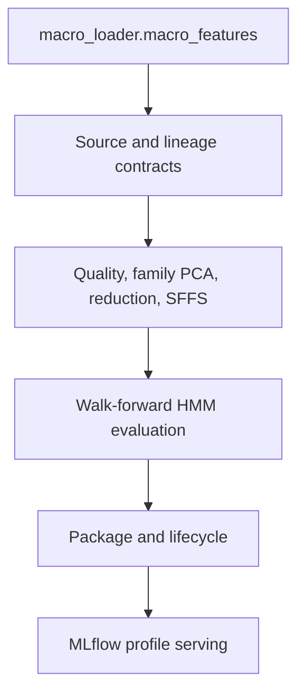

<!-- owner: architecture -->
# Regime Engine Architecture

## Canonical identity

Repository `SergejSchweizer/regime-engine` ships Python distribution `market-regime-engine`, import package `market_regime_engine`, MLflow app entry point `regime-engine`, public profile `xetra` config version `4`, registered model `regime-xetra`, and production alias `champion`.

## Ownership boundary

```text
macro-loader
  -> immutable Gold
  -> external feature PostgreSQL 10.10.1.3:54321
  -> regime-engine
  -> MLflow tracking/registry/artifacts + regime profile API
  -> portfell / future consumers
```

The engine is statistical only. ETF/portfolio returns, weights, Sharpe, Sortino, Calmar, drawdown, Expected Shortfall, transaction costs, trading labels, and profitability never influence feature discovery or statistical champion ranking.

Input lineage has `data_time_semantics=current_vintage_observation_day`. Walk-forward evaluation is causal and split-leak-free with respect to that current-vintage observation sequence; it does not claim historical provider-release-time/vintage safety.

After feature selection is frozen, an HMM observation exists only when every selected feature is finite and non-null. Missing timestamps remain gap evidence. One HMM transition is taken per retained observation, never per elapsed calendar day. This same complete-case observation clock is used by evaluation, final refit, latest, and replay.

## Production serving topology



Production exposes exactly one MLflow 3.15.1 HTTP service on `10.10.1.3:5000`:

- standard MLflow UI/tracking/registry/artifact routes;
- `POST /regime-engine/v1/profiles/{profile_id}/invocations`;
- `GET /regime-engine/v1/profiles/{profile_id}/oos-builds/{build_id}`;
- `GET /regime-engine/v1/health`.

There is no standalone FastAPI/Uvicorn service, `mlflow models serve`, reverse proxy, or Prometheus exporter. MLflow custom apps are Flask/WSGI and are hosted by the existing external MLflow service.

Feature PostgreSQL is external and uses a dedicated read-only trusted-LAN
`"macro-loader"` role with explicit plaintext `sslmode=disable`. MLflow
tracking, registry, artifacts, and the profile API are provided by the existing
service at `http://10.10.1.3:5000`. This repository owns no MLflow or PostgreSQL
Compose services and no application image.

## Statistical lifecycle

The Xetra profile discovers the complete PostgreSQL feature schema from first-fold TRAIN data, evaluates the exact 12-candidate v4 grid in expanding walk-forward folds, and chooses a statistical champion using the deterministic ranking in `EVALUATION.md`.

No walk-forward fold model is registered. After selection, a mandatory fresh final production refit uses the frozen deployment selection and all eligible source observations through the deployment cutoff, canonicalizes state IDs within the new model version, and persists the inference origin, trained-through timestamp, and terminal filtered probabilities. Only this final-refit artifact can become a `regime-xetra` model version and be assigned `challenger`/`champion`.

Latest and fixed-model replay are causal forward-filter operations. Replay start is never a new HMM initial condition. Walk-forward OOS prediction builds remain immutable and are retrieved by explicit build ID; fixed-model replay is never substituted for OOS evidence.

## Security and capacity


The MVP is trusted-private-LAN only. Port 5000 must not be Internet exposed. Host/CORS configuration is explicit and non-wildcard. The canonical feature PostgreSQL endpoint does not offer TLS, so feature transport uses explicit `sslmode=disable`; secrets/credential-bearing DSNs/raw feature vectors/model binaries are excluded from logs and API errors.

Each Gunicorn worker owns a process-local model cache and psycopg pool. With production defaults: 4 workers x 4 threads, pool max 4, feature-PG connection budget 16, and one admitted replay per worker. Replay uses bounded synchronous request-thread work with cooperative deadlines; there is no hidden unbounded executor.

## Contract ownership

- `BACKLOG.md`: PR scope/dependencies/API/deployment/operations plan
- `CONTRIBUTING.md`: Git and weak-agent rules
- `OPERATIONS.md`: source PostgreSQL/lineage/time/missing-value semantics and runbooks
- `EVALUATION.md`: feature selection/HMM/walk-forward/alignment/ranking/final refit
- `CONTRIBUTING.md`: developer setup, tests, and Git/CI policy

Implementation must fail closed rather than inventing a fallback when these contracts cannot be met.
