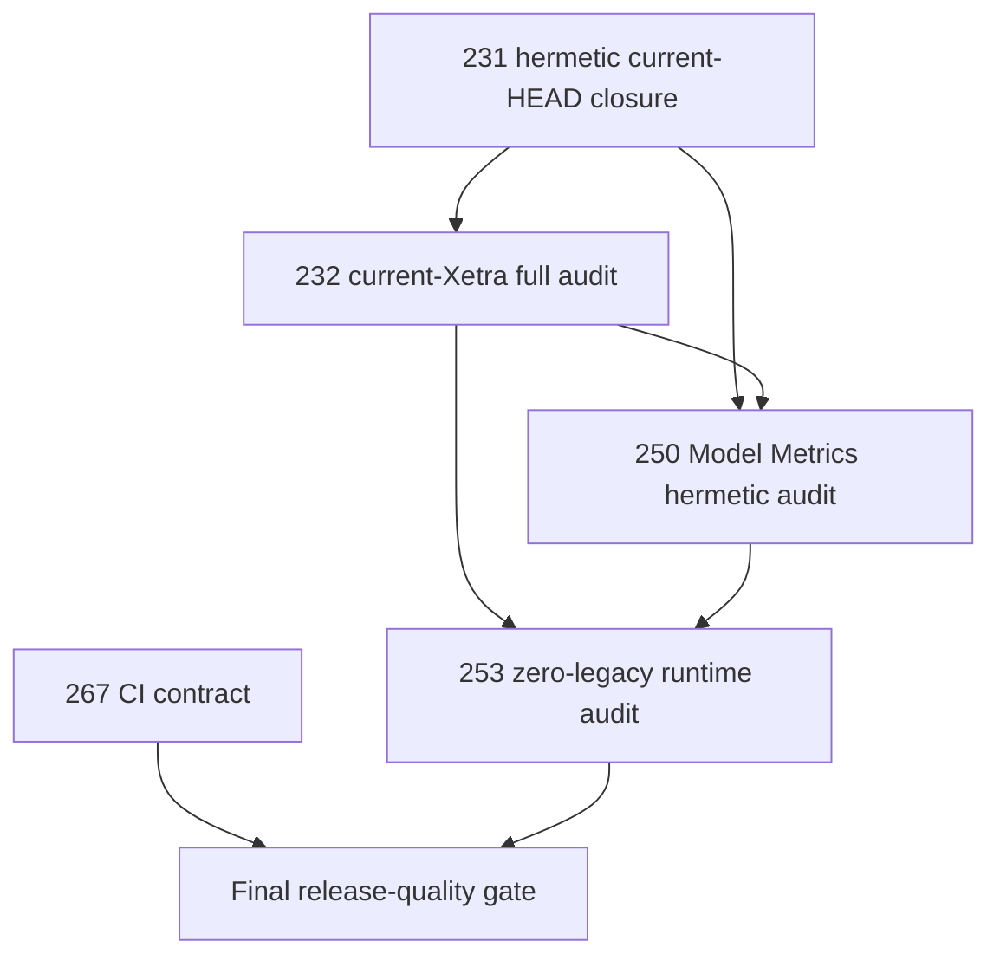

# Regime Engine — Current Backlog

Status date: 2026-09-12

Repository: `SergejSchweizer/regime-engine`
Reference branch: `main`
Reference HEAD at reconciliation: `b7d3cd948576dc7db3f94ffa0e98be67bcd2eb2d`

This file is the execution backlog, not the historical design archive. Detailed mathematical and operational contracts remain authoritative in `EVALUATION.md`, `EVALUATION_EXECUTION.md`, `MLFLOW_MODEL_METRICS.md`, `ARCHITECTURE.md`, `DATA_SOURCE.md`, `DOCUMENTATION_SIDECAR_POLICY.md`, and `LEGACY_REMOVAL.md`. Git history is the archive for already completed PR acceptance text.

The reconciliation rule used here is strict:

- **remaining** means at least one material acceptance condition still requires code, a fresh full-computation proof, an external production proof, or a permanent gate;
- **implemented** means the planned behavior exists on `main` with corresponding tests/contracts, even if a later external audit still depends on it;
- implementation status is determined from current `main`, not from stale branch/worktree text in the previous backlog;
- planning IDs are retained for traceability even when later commits used overlapping `PR-*` labels for follow-up work.

---

# 1. Remaining PRs — execute these first

## PR-231 — Hermetic full-computation proof: verification closure

**State:** implementation substantially complete; current-HEAD proof closure remains.

Current implementation already contains the 52-feature hermetic fixture, real HMM computation, a fixed golden snapshot hash, independent Spearman/clustering/silhouette/feature-score/soft-NMI calculations, MLflow tracking/plot-manifest generation, and independent Gaussian/GMM-HMM/Student-t likelihood parity support.

Remaining acceptance:

- [ ] Execute the complete hermetic full-computation test from current `main` and record command, wall clock, exit code and resulting golden/evidence hashes.
- [ ] Execute a second independent-process rerun from the same pinned synthetic snapshot and prove canonical result/evidence bytes are identical.
- [ ] Strengthen the future-mutation proof so modified future input is actually recomputed and earlier fold bytes/results are proven unchanged.
- [ ] Recompute with randomized semantic/display labels and prove statistical output is unchanged.
- [ ] Record the proof in a durable QA sidecar; no new statistical behavior may be introduced while closing this PR.

Dependency for closure: none beyond current `main`.

---

## PR-232 — Full current-Xetra computation and independent external math audit

**State:** open; this is the primary statistical acceptance gate.

The repository has the schema-wide source reader, immutable Arrow snapshot/run identity, resumable execution, independent verifier, full evaluation script, and external PostgreSQL/MLflow connectivity support. The previous live run is not acceptable statistical evidence because it completed with zero valid folds and therefore made no production-eligibility claim.

Remaining acceptance:

- [ ] Capture one immutable current PostgreSQL schema-wide feature snapshot with exact source/catalog/materialization identity.
- [ ] Run the complete expanding outer evaluation with no feature/search downsampling or debug early-stop.
- [ ] Execute every required M cut, prefix L, K, and final Gaussian/GMM-HMM/Student-t candidate on the pinned snapshot.
- [ ] Require the v4 policy gates: valid-fold rate `>= 0.80`, at least 3 valid outer folds, and a valid latest complete outer fold.
- [ ] Independently recompute first, deterministic middle, and last valid-fold distance/silhouette/feature-score/prefix-NMI/selected-family likelihood evidence with `scripts/verify_xetra_v4_math.py`.
- [ ] Report exact source build, data hash, catalog hash, materialization hash, profile hash, repository SHA, evaluation run key and evidence root hash.
- [ ] Record per-fold N, M*, L*, selected feature tuple, model family/K, outer teacher-vs-final soft NMI and fold-local non-poolable OOS PLL.
- [ ] Record wall clock, CPU topology/worker budget and peak-memory observation.
- [ ] Do not proceed to production activation if the policy is not production eligible; a failed scientific result is a valid audit outcome and must remain visible.

Depends on: PR-231 verification closure.

---

## PR-250 — Full MLflow Model Metrics completeness and resume audit

**State:** implementation foundation complete; end-to-end completeness proof remains.

The metric catalog, LoggedModel projection, fit-quality metrics, state diagnostics, predictive metrics, optional labeled-state metrics, causal backtest metrics, nine-plot integration, model-metric verifier, resumable evaluation ledger and MLflow cleanup primitives are present on `main`.

Remaining acceptance:

- [ ] Begin from a verified clean `regime-engine-evaluation` namespace or deterministic zero-change cleanup manifest.
- [ ] Run the complete hermetic v4 evaluation with tracking enabled against stock MLflow 3.15.1 behavior.
- [ ] Verify every expected logical LoggedModel exists exactly once.
- [ ] Verify every finite catalogued metric/history point exists exactly once at its canonical step/value.
- [ ] Require zero unknown metric keys, zero missing points, zero duplicate points and zero conflicting `(metric_key, step)` values.
- [ ] Regenerate supported comparison plot-data solely from Model Metrics/catalog/artifacts without evaluation recomputation.
- [ ] Interrupt the tracked run after a partial metric batch, resume it, and prove exact metric-history parity with uninterrupted execution.
- [ ] Run the same completeness verifier against the accepted PR-232 current-Xetra evaluation.
- [ ] Persist machine-readable model count, metric-key count, point counts, comparison-domain violations and resumed-vs-uninterrupted diff counts.

Depends on: PR-231 closure and finished PR-232 execution for the production-data half of the proof.

---

## PR-253 — Repository/runtime zero-legacy final audit

**State:** repository-side implementation exists; combined runtime acceptance remains.

`verify_zero_legacy.py`, the zero-legacy E2E test, v4-only profile/config surface, v4-only package/serving contracts, and cleanup support are present. The remaining work is the final combined proof after the current-Xetra and Model Metrics audits.

Remaining acceptance:

- [ ] Run the permanent zero-legacy repository audit on the exact accepted commit and require zero active legacy source/config/test/script/import matches.
- [ ] Prove only the v4 Xetra evaluation/profile path is startable from the CLI.
- [ ] Query production MLflow after PR-250/activation work and prove zero legacy regime-engine evaluation runs, LoggedModels, registered model versions and aliases.
- [ ] Prove only v4 production packages are servable and rollback is v4-to-v4 only.
- [ ] Execute the accepted hermetic proof, PR-232 verifier, PR-250 completeness verifier, resumability proof, production-package round-trip and v4-to-v4 alias rollback under one recorded repository SHA.
- [ ] Persist the exact command transcript and final zero-legacy evidence.

Depends on: PR-232 and PR-250. Registered-model cleanup is conditional on the deterministic inventory; an empty inventory is a valid zero-change proof.

---

## PR-267 — Make CI enforce the repository's stated quality contract

**State:** new reconciliation PR created from current repository review.

`pyproject.toml` declares branch coverage `fail_under = 90`, while both `merge-gate.yml` and `push-gate.yml` currently enforce only `--fail-under=80`. The normal gates also exclude tests marked `integration`, even though the current architecture relies heavily on process execution, resumability, MLflow/file-store integration and cross-module orchestration.

Acceptance:

- [ ] Change merge and push coverage enforcement to exactly 90% so CI and `pyproject.toml` cannot disagree.
- [ ] Add a hermetic integration lane to the merge gate; external-service tests remain opt-in and must not run in ordinary CI.
- [ ] Keep lint, strict mypy, unit and integration lanes independently parallelizable and fail the aggregate gate if any required lane fails.
- [ ] Combine coverage deterministically across required lanes and enforce 90% on the combined data.
- [ ] Keep the long PR-231 full-computation proof outside ordinary push latency if necessary, but provide an explicit manual/scheduled workflow and make PR-231/232/250 closure reference its immutable run artifact.
- [ ] Add a regression test or workflow assertion preventing future divergence between the configured coverage threshold and gate threshold.

Depends on: none. This can be implemented in parallel with PR-231/232/250 verification work.

---

# 2. Execution order



PR-267 is independent and should be merged early. PR-232 is the scientific gate: if the current data produces no production-eligible policy, retain the failed audit evidence rather than weaken thresholds or change the model after seeing OOS results.

---

# 3. Current canonical implementation map

```text
external regime_loader PostgreSQL
  -> schema-wide immutable feature snapshot
  -> Outer-TRAIN-only quality / global Spearman / clustering
  -> provisional causal teacher
  -> all-feature regime-information scoring
  -> cluster winners
  -> nested prefix L search by soft regime NMI
  -> exact 12-family final candidate grid
  -> expanding 1260 / 63 / 63 outer walk-forward
  -> causal TRAIN-to-OOS continuation filtering
  -> policy-level statistical selection
  -> full-history deployment selection
  -> fresh final production refit
  -> MLflow LoggedModel Model Metrics + artifacts
  -> challenger registration
  -> explicit champion activation / v4-to-v4 rollback
  -> latest, replay and immutable OOS serving
```

Current Xetra v4 constants remain in `configs/profiles/xetra_v4.yaml`; `EVALUATION.md` is authoritative for mathematical formulas, tie-breaking and comparison domains. This backlog must not duplicate those formulas unless a PR changes the contract.

---

# 4. Implemented PRs — condensed history

These items are removed from the active execution queue because their implementation is already present on `main`. Any remaining external proof that depends on them is carried by PR-231/232/250/253 above.

| Planning PR | Condensed implementation now present on `main` |
|---|---|
| PR-210 | Canonical v4 statistical/lifecycle contracts. |
| PR-211 | Xetra v4 profile/config contract. |
| PR-212 | Dynamic feature-catalog contracts. |
| PR-213 | PostgreSQL dynamic catalog/source read foundation. |
| PR-214 | Outer-TRAIN feature quality filter. |
| PR-215 | Pairwise-complete absolute-Spearman distance. |
| PR-216 | Deterministic average-linkage hierarchy and M* selection. |
| PR-217 | Temporary prototype selection. |
| PR-218 | Complete-case model-clock preflight. |
| PR-219 | Generic/v4 walk-forward candidate protocol. |
| PR-220 | Same-feature candidate ranking. |
| PR-221 | Provisional Gaussian teacher selection. |
| PR-222 | Causal teacher reference and frozen-teacher refit. |
| PR-223 | State-information-ratio + eta-squared feature scoring. |
| PR-224 | Cluster winner selection and deterministic global ranking. |
| PR-225 | Soft regime NMI agreement. |
| PR-226 | Prefix feature-count search without cross-dimension PLL. |
| PR-227 | Exact final 12-candidate Gaussian/GMM-HMM/Student-t grid. |
| PR-228 | Complete adaptive outer policy orchestration. |
| PR-229 | Immutable v4 evidence/statistics contracts and rendering. |
| PR-230 | MLflow hierarchy, tracking and diagnostic plotting foundation. |
| PR-233 | Explicit full-history deployment-selection implementation and drift checks; operational use remains gated by PR-232. |
| PR-234 | Current v4 production artifact/package implementation. |
| PR-235 | Frozen deployment-selection final refit. |
| PR-236 | Public v4 profile/model resolver and exact-version cache behavior. |
| PR-237 | V4 lifecycle/model-cycle command path and challenger registration support. |
| PR-238 | Explicit lifecycle/CAS alias activation and rollback support. |
| PR-239 | Legacy Xetra evaluation configs/entry points retired from active tree. |
| PR-240 | Semantic/legacy implementation code removed from active source. |
| PR-241 | Active architecture/documentation converted to v4-only. |
| PR-242 | Immutable dataset snapshots and durable evaluation-run storage. |
| PR-243 | Deterministic resumable evaluation DAG/store semantics. |
| PR-244 | Seed-level resumable HMM multistart support. |
| PR-245 | CPU/process-parallel evaluation foundation and runtime performance controls. |
| PR-246 | Deterministic scoped MLflow evaluation cleanup implementation; external execution belongs to PR-250 evidence. |
| PR-247 | Versioned metric catalog and generic metric extraction. |
| PR-248 | LoggedModel-first Model Metrics projection. |
| PR-249 | Resume-safe metric/tracking and generic plot-data infrastructure. |
| PR-252 | Deterministic retired registered-model/alias cleanup support with v4-champion safety checks; may be a no-op when inventory is empty. |
| PR-254 | PostgreSQL schema-wide automatic feature discovery, materialization digest, immutable snapshots and v4 source entrypoint. |
| PR-255 | Fit-quality and information-criterion Model Metrics. |
| PR-256 | Aligned posterior/state/transition/emission diagnostics. |
| PR-257 | Leak-free predictive/forecast metric contract. |
| PR-258 | Optional labeled-state quality metrics. |
| PR-259 | Causal backtest/performance evidence kept outside statistical selection. |
| PR-260 | Nine-plot Model Metrics integration matrix and plot-data support. |
| PR-261 | Default outer evaluation moved to process workers. |
| PR-263 | Fine-grained candidate/outer-TEST stage checkpointing/resume. |
| PR-264 | Nested/global CPU worker-budget propagation. |
| PR-265 | Process-parallel diagnostic rendering. |
| PR-266 | Independent Gaussian/GMM-HMM/Student-t TRAIN and causal-OOS likelihood parity proof. |

Historical planning IDs absent from this table are not automatically active. Draft IDs superseded before implementation stay historical unless explicitly reintroduced in section 1.

---

# 5. Definition of done

The current program is done only when all items in section 1 are closed on one identified commit: the hermetic computation is reproducible, the current-Xetra audit is complete and independently verified, Model Metrics are complete/idempotent/resumable, the runtime/repository is zero-legacy, and CI enforces the same 90% quality contract declared by the project.

A statistically non-production-eligible PR-232 result does not justify post-hoc model/threshold changes. It closes the computation audit as a scientifically valid negative result and creates a separate, explicitly new research backlog if model redesign is desired.
