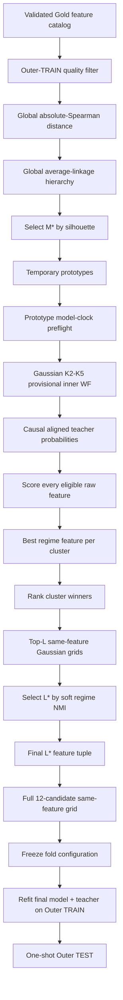
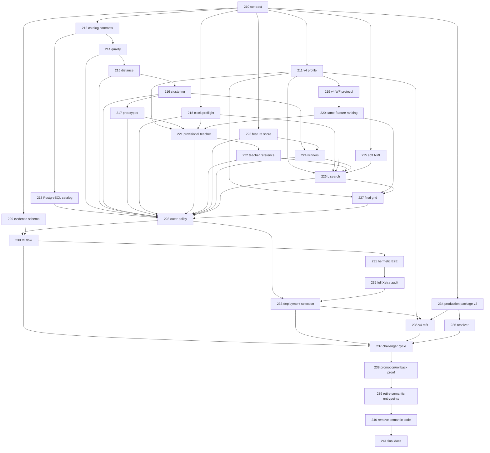

# Regime Engine — Global Regime Discovery Implementation Backlog

Status date: 2026-09-09

This is the single implementation backlog for the global, non-semantic regime-feature discovery architecture defined by `EVALUATION.md`.

The active target is **Xetra profile configuration version 4**. The semantic-medoid v1-v3 evaluation path is compatibility-only until its explicit retirement near the end of this backlog. It must not receive new statistical behavior.

> **PR-ID namespace:** `PR-210`, `PR-211`, ... below are repository planning IDs used in branch/commit names. They are not required to equal GitHub's numeric pull-request number. The branch name is the canonical implementation identity.

The previous draft planning IDs `PR-186`–`PR-206` are superseded by this audited backlog. No implementation branch for those draft IDs exists; agents must not implement them.

---

# 1. Canonical v4 identity

```text
profile_id=xetra
profile_config_version=4
feature_discovery_policy=xetra_global_regime_v4
evaluation_id=global_regime_v4
registered_model=regime-xetra
production_alias=champion
challenger_alias=challenger
```

The v4 statistical path has **no semantic groups**. All structurally valid Gold feature columns enter one global candidate universe. Optional economic labels are display metadata only and may not affect quality filtering, correlation, clustering, cluster count, prototype choice, regime score, feature rank, final feature count, model family, state count, or champion selection.



Canonical quantities are distinct:

```text
N  = eligible raw feature count in one TRAIN sample
M* = selected global redundancy-cluster count
L* = selected final regime-feature count
K* = selected hidden-state count of the final HMM candidate
```

---

# 2. Canonical statistical and mathematical contract

PR-210 makes this section authoritative in `EVALUATION.md`. Later agents may not invent alternative constants, formulas, fallbacks, or tie rules.

## 2.1 Source/quality constants

| Setting | Canonical v4 value |
|---|---|
| feature-universe mode | all non-`timestamp_m1` columns in the validated Gold feature table; every such column must be PostgreSQL `DOUBLE PRECISION` |
| feature ordering | PostgreSQL ordinal position |
| minimum Outer-TRAIN feature coverage | `0.90` |
| population variance convention | `ddof=0` |
| minimum population variance | strictly `> 1.0e-12` |
| non-null NaN/Inf | source-contract failure; never silently converted into a feature-level rejection |
| fill/interpolate/carry | forbidden |
| minimum eligible feature count | `3` |
| minimum pairwise complete observations | `504` |

The dynamic catalog is structurally validated. Source `schema_version` and `feature_version` remain mandatory lineage and are never hidden, but v4 discovery does not use a hand-maintained feature-name allowlist. A same-name semantic redefinition upstream cannot be inferred from SQL type metadata; this remains an explicit current-vintage upstream limitation and must be documented rather than silently claimed solved.

## 2.2 Redundancy distance

For features `i,j`, Spearman correlation is Pearson correlation of pairwise-complete average ranks:

```text
rho_ij = corr(rank_average(x_i), rank_average(x_j))
d_ij   = 1 - abs(rho_ij)
```

Rules:

- pairwise support is TRAIN-only and at least `504`;
- undefined/non-finite `rho_ij` invalidates the distance result;
- values of `rho` outside `[-1,1]` by at most `1e-12` are clipped to the boundary; a larger violation fails;
- diagonal distance is written as exact `0.0`;
- final distances must be finite in `[0,1]`.

## 2.3 Global clustering and the mathematically bounded M search

Clustering is one deterministic agglomerative **average-linkage** hierarchy over the precomputed distance matrix in canonical feature order. The implementation uses the repository-pinned `scikit-learn==1.9.0` behavior and stores the full merge tree. Candidate cuts are derived from that one tree; a separate independently fitted hierarchy per `M` is forbidden.

Candidate cluster counts are:

```text
M = 2, 3, ..., min(12, N - 1)
```

The upper bound `12` is not arbitrary. For a full-covariance Gaussian HMM with `K` states and dimension `d`, the free-parameter count used for the safety proof is:

```text
p_G(K,d) = (K-1) + K(K-1) + Kd + K*d(d+1)/2
```

At the smallest permitted model TRAIN size `504`:

```text
p_G(5,12) = 474 <= 504
p_G(5,13) = 544 > 504
```

Therefore all provisional `K=2..5` Gaussian candidates remain on the safe side of the simple `p <= n_min` engineering bound only through `d=12`. This is a safety bound, not a guarantee of a well-conditioned fit; covariance, occupancy and convergence gates still apply.

For each candidate `M`:

- cut exactly `M` clusters from the stored hierarchy;
- compute `silhouette_samples(..., metric="precomputed")` from the same distance matrix;
- singleton sample silhouette is exactly `0.0`;
- mean silhouette is the arithmetic mean over all `N` samples;
- choose the globally best silhouette anchor;
- candidates within anchored absolute `1e-12` are tied; smaller `M` wins;
- best silhouette must be strictly greater than `0.0`.

Cluster IDs are fold-local and canonicalized by the smallest **canonical feature ordinal**, not lexical name. The first cluster becomes `cluster_000`, then `cluster_001`, etc.

## 2.4 Temporary prototype

For each selected cluster, the temporary prototype is the actual feature with minimum mean distance to the *other* members of that cluster. Singleton prototype is the singleton itself. Anchored `1e-12` ties use canonical feature ordinal.

A prototype is initialization-only. It has no bonus in final regime-feature selection.

## 2.5 Inner model-clock contract

Inner walk-forward is expanding:

```text
minimum TRAIN source rows = 756
TEST source rows          = 63
step source rows          = 63
partial final TEST        = false
minimum model TRAIN rows  = 504
minimum model TEST rows   = 42
```

Before any HMM is fitted to a feature tuple, the tuple must pass a pure complete-case model-clock preflight:

- first inner TRAIN has at least `504` complete rows;
- every feature has population variance `>1e-12` on that first complete-case TRAIN matrix;
- every planned fold records complete TRAIN/TEST counts;
- structurally valid fold rate is at least `0.80`.

Preflight never chooses K and never inspects HMM output. Selected `M*` is not silently replaced by a lower-silhouette `M` if prototype preflight or HMM fitting fails; the enclosing outer fold fails explicitly.

## 2.6 Provisional teacher

Teacher family is Gaussian full-covariance only, with `K in {2,3,4,5}` and the existing eight-seed multistart/gates.

Because every K sees the same prototype vector, K selection uses the canonical same-feature statistical ranking: common valid-fold OOS predictive log likelihood, OOS dispersion, worst fold, BIC, AIC, then exact deterministic complexity/ID tie breaks.

Teacher probabilities are the **aligned causal filtered probabilities** on valid inner TEST timestamps. Smoothed probabilities and full-sample Viterbi states are forbidden as teacher weights.

## 2.7 Distribution-sensitive feature regime score

The previous draft's `eta_squared`-only selection is rejected because it detects conditional-mean separation but can miss a feature whose regime information is predominantly variance/tail/distributional. V4 therefore uses a bounded, distribution-sensitive **state information ratio** as the primary feature score and retains posterior `eta_squared` as a diagnostic/tie-break only.

For feature `j`, use only teacher timestamps where `x_tj` is finite. Require support coverage `>=0.90` of teacher timestamps and at least `126` observations.

On that support:

1. Compute average ranks `r_t` of the feature values.
2. Use exactly `B=10` deterministic rank bins:

```text
bin_t = min(9, floor(10 * (r_t - 1) / n))
```

3. With teacher probabilities `gamma_tk`, define:

```text
p_bk = (1/n) * sum_t 1[bin_t=b] * gamma_tk
p_b  = sum_k p_bk
p_k  = sum_b p_bk
I    = sum_{b,k:p_bk>0} p_bk * ln(p_bk/(p_b*p_k))
H_S  = -sum_{k:p_k>0} p_k * ln(p_k)
state_information_ratio = I / H_S
```

`H_S <= 1e-12` is invalid. A valid score must be finite in `[0,1]` within `1e-12`.

On the same feature-specific support also compute diagnostic posterior `eta_squared`:

```text
pi_k      = mean_t gamma_tk
mu_jk     = sum_t gamma_tk*x_tj / sum_t gamma_tk
mu_j      = mean_t x_tj
B_j       = sum_k pi_k * (mu_jk-mu_j)^2
W_j       = sum_k pi_k * sigma_jk^2
eta_sq_j  = B_j / (B_j + W_j)
```

All weights, means and variances are recomputed on the same feature support. No HMM is fitted per raw feature.

## 2.8 Cluster winner and global rank

Within each cluster and then globally across cluster winners, use:

1. higher `state_information_ratio` with anchored `1e-12` tiers;
2. higher `eta_squared` with anchored `1e-12` tiers;
3. higher score coverage;
4. higher score observation count;
5. smaller canonical feature ordinal.

Exactly one eligible winner is required per selected cluster. If a selected cluster has no eligible scored member, the outer fold is invalid.

## 2.9 Final feature-count bound and soft regime NMI

The final candidate feature count is bounded by the most parameter-rich required final family, GMM-HMM with `K=5`, `M=2`, full covariance. Its free-parameter safety count is:

```text
p_GMM(K,M,d) = (K-1) + K(K-1) + K(M-1) + KMd + KM*d(d+1)/2
```

At `n_min=504`:

```text
p_GMM(5,2,8) = 469 <= 504
p_GMM(5,2,9) = 569 > 504
```

Therefore final prefix lengths are exactly:

```text
L = 2, 3, ..., min(M*, 8)
```

If `M* < 2`, the fold is already invalid upstream.

For each prefix `L`:

- run Gaussian K2-K5 on the same prefix vector and same inner plan;
- first choose that prefix's K winner using the canonical **same-feature predictive ranking**; teacher agreement must not choose K;
- compare only that prefix winner to the teacher on exact shared timestamps.

Teacher/candidate agreement uses **soft regime NMI**, not hard argmax labels. For teacher probabilities `P_tk` and candidate probabilities `Q_tl` on `T` shared timestamps:

```text
p_kl = (1/T) * sum_t P_tk * Q_tl
p_k  = sum_l p_kl
q_l  = sum_k p_kl
I    = sum_{k,l:p_kl>0} p_kl * ln(p_k*q_l))
H_P  = -sum_k p_k ln(p_k)
H_Q  = -sum_l q_l ln(q_l)
soft_regime_nmi = 2I / (H_P + H_Q)
```

Denominator `<=1e-12` is invalid. Valid NMI is finite in `[0,1]` within `1e-12` and is invariant to either model's state-label permutation.

Prefix shared support must cover at least `0.90` of teacher timestamps. Across different `L`:

1. maximize soft regime NMI using anchored `1e-12` ties;
2. maximize shared timestamp count;
3. choose smaller `L`.

Raw PLL/BIC/AIC are **forbidden** across different `L`. They remain valid only inside one prefix because K candidates there model exactly the same observed vector.

## 2.10 Final model grid

The selected `L*` feature vector is evaluated with exactly 12 candidates:

```text
gaussian_hmm_k2_full
gaussian_hmm_k3_full
gaussian_hmm_k4_full
gaussian_hmm_k5_full
gmm_hmm_k2_m2_full
gmm_hmm_k3_m2_full
gmm_hmm_k4_m2_full
gmm_hmm_k5_m2_full
student_t_hmm_k2_full
student_t_hmm_k3_full
student_t_hmm_k4_full
student_t_hmm_k5_full
```

All 12 see the same feature vector and inner folds, so the existing same-feature statistical ranking applies.

## 2.11 Outer evaluation semantics

Outer walk-forward remains expanding `1260/63/63`, no partial final TEST.

Inside each outer TRAIN, the **entire** selection procedure reruns. The selected configuration is frozen before Outer TEST access.

For valid outer evaluation:

- refit the selected final model on all complete Outer-TRAIN observations;
- independently refit the frozen provisional teacher K on all complete prototype Outer-TRAIN observations;
- continue both exactly once into Outer TEST;
- compute soft regime NMI on their exact shared TEST timestamps, requiring at least `42` shared observations;
- retain final-model OOS PLL as a fold-local diagnostic only.

Because feature vectors and dimensions may change across outer folds, raw PLL/BIC/AIC must never be pooled or ranked across outer folds. Policy-level comparable evidence is:

- outer valid-fold rate;
- soft regime NMI mean/population-std/worst over valid outer folds;
- selection/cluster stability diagnostics;
- per-fold fold-local likelihood/diagnostic evidence.

Production eligibility requires outer valid-fold rate `>=0.80`, at least `3` valid outer folds, and a valid latest complete outer fold. No automatic promotion threshold is attached to outer NMI; the first v4 result is challenger-only.

State IDs are `outer_fold_local` during adaptive evaluation.

## 2.12 Deployment selection after OOS validation

Outer evaluation validates the **policy**, not one permanent fold configuration. Therefore the production configuration is not taken from the last outer fold.

After the outer evaluation has passed its gates, rerun the exact same v4 TRAIN-only selection function once on **all rows in the same source snapshot through `source.max_timestamp`**. This is the deployment-selection run. It may use observations that were previously outer TEST because no OOS claim is made for the deployment refit.

Persist separately:

```text
validation_evaluation_cutoff = final complete outer TEST end
deployment_selection_cutoff  = source.max_timestamp
```

If the source build changes between validation and initial audited cutover, the audit must be rerun. Recurring later model cycles evaluate their own new source build normally.

## 2.13 Production state identity

Dynamic features and dynamic K make cross-model one-to-one state identity mathematically impossible in general. V4 therefore pins production state IDs as **model-version-local**.

Within one production artifact, state order is deterministic and fixed. The same `state_0` string in two different model versions must not be interpreted as the same economic regime unless a future versioned cross-model alignment contract establishes that relation. Every response already carries exact model version and profile version; downstream consumers must key state semantics by model version.

---

# 3. Weak-agent execution and QA rules

Every implementation PR is atomic and fail-closed.

1. Start from clean current `main`; every listed dependency must already be merged.
2. Branch exactly `pr/PR-<planning-id>-<slug>`.
3. Edit only **Allowed** files. If scope is insufficient, stop and report the backlog defect.
4. Never edit `BACKLOG.md` from an implementation PR.
5. Never invent statistical constants/fallbacks.
6. Never add semantic-group decisions, economic/portfolio targets, Optuna subset search, smoothed-state scoring, or Outer-TEST feedback into selection.
7. Reuse existing HMM adapters, multistart, causal filter, likelihood parity, diagnostics and model ranking. Duplicate HMM/filter/ranking implementations are forbidden except explicitly independent QA reference code.
8. New randomized production behavior is forbidden. Test random generators require fixed explicit seeds.
9. Canonical ordering must be independent of mapping iteration, thread completion, filesystem order and MLflow run ID.
10. Numerical full-computation QA runs with `OMP_NUM_THREADS=1`, `OPENBLAS_NUM_THREADS=1`, `MKL_NUM_THREADS=1`.

## Universal QA

All PRs run:

```text
QA-0  git status --short
      git branch --show-current

QA-1  uv sync --frozen --python 3.14.7

QA-2  uv run ruff check .
      uv run ruff format --check .
      uv run mypy

QA-3  PR-specific targeted tests

QA-4  PR-specific affected-path end-to-end/full-computation test when executable behavior changed

QA-5  uv run pytest -m "not external" --cov=market_regime_engine \
          --cov-report=term-missing --cov-fail-under=90

QA-6  deterministic rerun of the canonical statistical payload/artifacts

QA-7  git status --short
      git branch --show-current
```

Additional proof class:

- **Numerical PR:** independent reference implementation from primitive formulas; it must not import the production function under audit.
- **I/O/config/serialization PR:** independent contract/provenance fixture proving exact schema, ordering, failure behavior and hash/round-trip semantics.
- **Tracking/docs PR:** render/link/schema consistency proof; do not fabricate a meaningless numerical oracle.

MLflow run IDs, wall-clock timestamps and temporary paths are operational metadata and are excluded from byte-equality. The canonical statistical JSON, hashes, source-data tables used for plots, and deterministic plot files must be equal on rerun.

Every PR body records commands, exit codes and proof test/artifact names.

---

# 4. Active atomic implementation PRs

## Wave A — contract, profile, source and pure kernels

### PR-210 — Pin the complete v4 statistical/lifecycle contract

- **Branch:** `pr/PR-210-pin-global-regime-v4-contract`
- **Depends on:** none
- **Allowed:** `EVALUATION.md`, `src/market_regime_engine/feature_discovery/__init__.py`, `src/market_regime_engine/feature_discovery/contracts.py`, `tests/unit/feature_discovery/test_contracts.py`
- **Status:** complete; GitHub PR #193 merged to `main`.

Acceptance:

- [x] Encode every section-2 quantity/formula/tolerance and its semantic role.
- [x] Immutable contracts cover catalog identity, quality, distance, cluster solution, prototypes, model-clock feasibility, teacher, feature scores, winners, prefix search, final config, outer fold result, adaptive evaluation result and deployment selection.
- [x] Primary feature score is `state_information_ratio`; posterior `eta_squared` is diagnostic/secondary only.
- [x] Soft regime NMI formula and cross-dimension likelihood prohibition are explicit.
- [x] Parameter-count safety bounds `M<=12`, `L<=8` are exact.
- [x] Outer PLL non-pooling, outer validity gates, deployment-selection cutoff and model-version-local state identity are explicit.
- [x] Hashes are canonical JSON/SHA-256, finite-only, with explicit ordered tuples.
- [x] No MLflow/PostgreSQL/HMM backend import.

QA:

- [x] Independent Python/reference arithmetic proves `p_G(5,12)=474`, `p_G(5,13)=544`, `p_GMM(5,2,8)=469`, `p_GMM(5,2,9)=569`.
- [x] Contract mutation matrix rejects invalid N/M/L/K, nonfinite values, duplicate features, invalid prefixes and illegal cross-dimension PLL ranking payloads.
- [x] Complete synthetic outer-result + deployment-selection round trip is lossless and deterministic.

### PR-211 — Add a dedicated v4 profile schema/config

- **Branch:** `pr/PR-211-xetra-v4-profile`
- **Depends on:** PR-210
- **Allowed:** `configs/profiles/xetra_v4.yaml`, `src/market_regime_engine/profiles/config.py`, `src/market_regime_engine/profiles/resolution.py`, `tests/unit/profiles/test_xetra_v4_profile.py`, `tests/unit/profiles/test_resolution.py`
- **Status:** complete; GitHub PR #194 and hash-preservation follow-up #195 merged to `main`.

Acceptance:

- [x] Introduce a dedicated `FeatureDiscoveryConfig`; do not stuff v4 into legacy `FeatureSelectionConfig` semantic fields.
- [x] `ModelProfile` permits exactly legacy selection for v1-v3 or global discovery for v4, never both.
- [x] v4 config explicitly pins every source/quality/clustering/inner/score/prefix/outer constant; no hidden defaults.
- [x] Add v4 discovery candidate/result contracts that do not require fixed universe cardinality, eight medoids or semantic blocks.
- [x] Exact final candidate order is the 12 IDs in section 2.10.
- [x] v1-v3 loading/resolution remains behavior-identical until retirement.
- [x] Unknown/missing v4 fields, semantic-selection fields in v4, changed model order or changed pinned constants fail closed.

QA:

- [x] Golden config asserts every v4 field and exact hashes.
- [x] One-field mutation matrix proves hash/validation sensitivity.
- [x] Load v1-v4 together and prove no shared mutable or semantic state leaks into v4.

### PR-212 — Add dynamic feature-catalog port contracts

- **Branch:** `pr/PR-212-feature-catalog-contracts`
- **Depends on:** PR-210
- **Allowed:** `src/market_regime_engine/features/ports.py`, `tests/unit/features/test_feature_catalog_contracts.py`
- **Status:** complete; GitHub PR #196 merged to `main`.

Acceptance:

- [x] Add immutable catalog entry/snapshot contracts carrying name, ordinal, PostgreSQL type, lineage and catalog hash.
- [x] Catalog requires exact `timestamp_m1` identity separately from feature entries.
- [x] V4 feature entries are ordered by ordinal, unique, safe SQL identifiers and exactly `DOUBLE PRECISION`.
- [x] Catalog hash includes source build/version identity and exact ordered name/type/ordinal triples.
- [x] Existing `FeatureSource.read(FeatureRequest)` contract remains compatible.

QA:

- [x] Independent canonical-JSON/hash fixture.
- [x] Reordered physical mapping with unchanged declared ordinals yields identical result; changed ordinal/type/name changes hash.

### PR-213 — Implement one-snapshot PostgreSQL dynamic catalog + row read

- **Branch:** `pr/PR-213-postgres-dynamic-feature-catalog`
- **Depends on:** PR-212
- **Allowed:** `DATA_SOURCE.md`, `src/market_regime_engine/features/postgres_source.py`, `tests/unit/features/test_feature_catalog.py`, `tests/integration/features/test_postgres_feature_catalog.py`
- **Status:** complete; GitHub PR #197 merged to `main`.

Acceptance:

- [x] In one `REPEATABLE READ READ ONLY` transaction read sync-state, table catalog and requested discovery rows; close transaction before model work.
- [x] `timestamp_m1` must be PostgreSQL timestamp-with-time-zone and every other Gold table column must be `DOUBLE PRECISION`; unexpected non-feature columns fail closed.
- [x] V4 discovery does not require constructor `registered_feature_names`; legacy resolved-model/legacy-profile behavior stays exact.
- [x] Dynamic SELECT uses only catalog-validated `sql.Identifier` objects in ordinal order.
- [x] Source versions are recorded as lineage; v4 structural compatibility and same-name-semantic-change limitation are documented explicitly.
- [x] Any non-null NaN/Inf remains a source failure, matching `DATA_SOURCE.md`.
- [x] A newly added `DOUBLE PRECISION` Gold column appears automatically on the next source build without engine feature config edits.
- [x] No DB mutation or long-lived transaction.

QA:

- [x] Hermetic PG-shaped fixture proves automatic added-column discovery, ordinal order and exact row shape.
- [x] Unsupported type, wrong timestamp type, duplicate/unsafe identifier, lineage/catalog mismatch and concurrent post-snapshot schema change all fail or remain snapshot-consistent as specified.

### PR-214 — Implement pure Outer-TRAIN quality filtering

- **Branch:** `pr/PR-214-global-feature-quality`
- **Depends on:** PR-210, PR-212
- **Allowed:** `src/market_regime_engine/feature_discovery/quality.py`, `tests/unit/feature_discovery/test_quality.py`
- **Status:** complete; GitHub PR #198 merged to `main`.

Acceptance:

- [x] Coverage denominator is exact Outer-TRAIN source-row count; `>=0.90` passes.
- [x] Variance is finite population variance `ddof=0`, strictly `>1e-12`.
- [x] NULLs count against coverage; no fill.
- [x] Any nonfinite supplied value invalidates the invocation, not merely that feature, matching source contract.
- [x] Output order is catalog order and records exact counts/coverage/variance/reason.
- [x] Require at least three eligible features.
- [x] Rows outside supplied TRAIN bounds are impossible through the API and mutation after TRAIN has no effect.

QA:

- [x] Primitive-sum variance reference, 0.90 boundary, near-threshold variance and 50-feature mixed fixture.

### PR-215 — Implement global absolute-Spearman distance

- **Branch:** `pr/PR-215-global-spearman-distance`
- **Depends on:** PR-214
- **Allowed:** `src/market_regime_engine/feature_discovery/distance.py`, `tests/unit/feature_discovery/test_distance.py`
- **Status:** complete; GitHub PR #200 merged to `main`.

Acceptance:

- [x] Exact pairwise-complete support and `>=504` gate for every pair.
- [x] Average ranks for ties; Spearman is Pearson of those ranks.
- [x] Exact clipping/failure semantics from section 2.2.
- [x] Symmetric matrix, exact zero diagonal, finite `[0,1]`, canonical feature order.
- [x] Persist full support-count matrix and deterministic hash.
- [x] Perfect positive and negative monotonic pairs both have zero distance.

QA:

- [x] Independent slow implementation recomputes every pair of a >=50-feature fixture.
- [x] Tied-rank hand calculation and row-permutation invariance proof.

### PR-216 — Build one deterministic hierarchy and select M*

- **Branch:** `pr/PR-216-global-clustering-mstar`
- **Depends on:** PR-215
- **Allowed:** `src/market_regime_engine/feature_discovery/clustering.py`, `tests/unit/feature_discovery/test_clustering.py`
- **Status:** complete; GitHub PR #202 merged to `main`; contract-domain follow-up merged as GitHub PR #203.

Acceptance:

- [x] Build exactly one full average-linkage hierarchy from precomputed distance using pinned sklearn behavior.
- [x] Derive exact cuts `M=2..min(12,N-1)` from that one merge tree.
- [x] Store merge tree, complete silhouette curve and every candidate membership.
- [x] Silhouette singleton=0; best-anchor/anchored-tie/smaller-M semantics exact.
- [x] Selected best silhouette must be >0.
- [x] Cluster IDs use minimum canonical feature ordinal.
- [x] Internal container/iteration order cannot alter bytes while declared canonical feature order is unchanged.

QA:

- [x] Independent silhouette-by-sample oracle for explicit matrix.
- [x] Equal-distance/tie merge fixture pins deterministic hierarchy under sklearn 1.9.0.
- [x] Full candidate-M run reruns byte-identically.

### PR-217 — Select temporary prototypes

- **Branch:** `pr/PR-217-temporary-prototypes`
- **Depends on:** PR-216
- **Allowed:** `src/market_regime_engine/feature_discovery/prototypes.py`, `tests/unit/feature_discovery/test_prototypes.py`

Acceptance:

- [ ] Mean distance excludes self; singleton is itself.
- [ ] Anchored `1e-12` ties use canonical ordinal.
- [ ] Output is cluster order and stores every candidate mean/tie tier.
- [ ] No HMM/score/semantic/economic influence.
- [ ] Prototype contract explicitly says initialization-only.

QA:

- [ ] Independent arithmetic medoid oracle and adversarial fixture where prototype later loses cluster regime selection.

### PR-218 — Add reusable complete-case model-clock preflight

- **Branch:** `pr/PR-218-model-clock-preflight`
- **Depends on:** PR-210
- **Allowed:** `src/market_regime_engine/evaluation/model_clock.py`, `tests/unit/evaluation/test_model_clock.py`

Acceptance:

- [ ] Pure function accepts source rows, exact feature tuple, walk-forward plan and model-row thresholds.
- [ ] Records every fold's TRAIN/TEST complete-case counts without fitting/scaling an HMM.
- [ ] First TRAIN requires >=504 complete rows and per-feature population variance >1e-12 on that common matrix.
- [ ] Structural valid-fold rate >=0.80.
- [ ] No feature dropping, fill or K-dependent support.
- [ ] Prototype failure invalidates outer selection; prefix failure marks only that prefix ineligible; caller behavior is explicit.

QA:

- [ ] Hand complete-case masks/counts and variance reference; adversarial missingness fixture demonstrates why individual 90% coverage does not imply multivariate clock feasibility.

### PR-219 — Make the proven walk-forward runner v4-capable without semantic coupling

- **Branch:** `pr/PR-219-v4-walk-forward-candidate-protocol`
- **Depends on:** PR-211
- **Allowed:** `src/market_regime_engine/evaluation/walk_forward.py`, `tests/unit/evaluation/test_walk_forward.py`, `tests/unit/evaluation/test_walk_forward_validation.py`

Acceptance:

- [ ] Accept profile v4 structural candidate protocol while preserving v1-v3 behavior.
- [ ] V4 candidate requires exact feature order/dimension, source build and generic feature-selection definition/execution hashes; no medoid/universe cardinality assumptions.
- [ ] Same scaler, multistart, causal filter, TRAIN likelihood parity, gates, within-vector state alignment and diagnostics are reused.
- [ ] No adaptive feature selection is moved into the runner.
- [ ] Unsupported version/family/dimension fails before fit.

QA:

- [ ] Legacy golden fixtures unchanged.
- [ ] V4 structural candidate with same numerical input as legacy candidate produces identical HMM/filter evidence apart from version/lineage fields.

### PR-220 — Extract reusable same-feature candidate ranking

- **Branch:** `pr/PR-220-same-feature-candidate-ranking`
- **Depends on:** PR-219
- **Allowed:** `src/market_regime_engine/evaluation/selection.py`, `src/market_regime_engine/training/candidate_grid.py`, `tests/unit/evaluation/test_selection.py`, `tests/unit/training/test_candidate_grid.py`
- **Status:** complete; GitHub PR #208 merged to `main`.

Acceptance:

- [x] Extract one generic same-feature ranking kernel over supplied candidate evaluations/aggregates.
- [x] Enforce identical feature vector, source, plan and selection hashes before ranking.
- [x] Hard gates, common-valid-fold support, anchored numeric tiers and ranking stages remain exact.
- [x] Existing `select_statistical_champion` delegates to the kernel and returns behavior-identical legacy results.
- [x] Supports exact Gaussian K2-K5 subsets and full 12-candidate v4 sets without duplicating ranking logic.

QA:

- [x] Legacy ranking golden evidence unchanged.
- [x] Adversarial invalid-hard-fold case proves common-support fairness.
- [x] Input permutation does not change ranked IDs.

### PR-221 — Select provisional Gaussian K*

- **Branch:** `pr/PR-221-provisional-gaussian-teacher`
- **Depends on:** PR-211, PR-217, PR-218, PR-219, PR-220
- **Allowed:** `src/market_regime_engine/evaluations/provisional_teacher.py`, `tests/unit/evaluations/test_provisional_teacher.py`, `tests/integration/evaluations/test_provisional_teacher_compute.py`
- **Status:** complete; GitHub PR #210 merged to `main`.

Acceptance:

- [x] Exact inner `756/63/63`, no partial final TEST.
- [x] Run prototype preflight before any HMM.
- [x] Evaluate Gaussian K2-K5 only using existing adapters/multistart/runner.
- [x] Same prototype order/folds for every K.
- [x] Select K with PR-220 same-feature predictive ranking.
- [x] Persist all invalid/valid folds, common support and selection chain.
- [x] No fallback M, GMM, Student-t, Outer TEST, registration or alias action.

QA:

- [x] Independent forward-likelihood calculation on small explicit HMM.
- [x] Real four-K synthetic compute with no mocked HMM math.

### PR-222 — Build causal teacher reference and frozen-teacher refit helper

- **Branch:** `pr/PR-222-causal-teacher-reference`
- **Depends on:** PR-221
- **Allowed:** `src/market_regime_engine/evaluations/teacher_reference.py`, `tests/unit/evaluations/test_teacher_reference.py`
- **Status:** complete; GitHub PR #212 merged to `main`.

Acceptance:

- [x] Collect selected K's aligned causal filtered probabilities only from valid inner TEST rows, ordered and unique.
- [x] Every probability row finite/nonnegative/normalized within 1e-10.
- [x] Persist teacher K, prototypes, inner folds, source/plan hashes and teacher hash.
- [x] Add reusable helper to refit the already-frozen teacher K/prototype tuple on a supplied TRAIN and continue once into supplied TEST; helper never reselects M/K.
- [x] No smoothed/Viterbi teacher weights.

QA:

- [x] Independent forward recursion reproduces every probability in a two-state fixture.
- [x] Frozen-teacher refit helper proves no reselection call and future mutation invariance.

### PR-223 — Score all raw features with state information ratio + eta² diagnostic

- **Branch:** `pr/PR-223-all-feature-regime-information`
- **Depends on:** PR-210
- **Allowed:** `src/market_regime_engine/feature_discovery/scoring.py`, `tests/unit/feature_discovery/test_scoring.py`
- **Status:** complete; GitHub PR #214 merged to `main`.

Acceptance:

- [x] Exact feature-specific support, >=0.90 coverage and >=126 rows.
- [x] Exact average-rank decile bins and section-2.7 joint-probability formula.
- [x] Primary state information ratio finite `[0,1]`; entropy-degenerate cases fail.
- [x] Compute eta² on identical support as diagnostic/secondary value.
- [x] Persist primitive bin/state joint masses, state masses, entropies, MI, eta inputs and counts sufficient for independent recomputation.
- [x] State-label permutation and monotonic feature transform leave primary score unchanged within tolerance.
- [x] No HMM fit.

QA:

- [x] Independent primitive MI and eta implementation; explicit variance-only/tail-separation fixture must receive non-zero information score while eta² is near zero.
- [x] 100-feature full scoring fixture.

### PR-224 — Select one regime winner per cluster and rank globally

- **Branch:** `pr/PR-224-cluster-regime-winners`
- **Depends on:** PR-216, PR-223
- **Allowed:** `src/market_regime_engine/feature_discovery/winners.py`, `tests/unit/feature_discovery/test_winners.py`
- **Status:** complete; GitHub PR #216 merged to `main`.

Acceptance:

- [x] Exactly section-2.8 tier order; globally anchored tolerance tiers, never pairwise chaining.
- [x] Every selected cluster requires >=1 eligible score.
- [x] Exactly M* unique winners; prototype has no privilege.
- [x] Persist every candidate/tier/tie decision and canonical winner order.

QA:

- [x] Prototype-loses adversarial case; `0/0.75e-12/1.5e-12` transitivity case; full cluster table compute.

### PR-225 — Implement pure soft-regime-NMI agreement

- **Branch:** `pr/PR-225-soft-regime-nmi`
- **Depends on:** PR-210
- **Allowed:** `src/market_regime_engine/evaluations/agreement_v4.py`, `tests/unit/evaluations/test_agreement_v4.py`
- **Status:** complete; GitHub PR #218 merged to `main`.

Acceptance:

- [x] Exact section-2.9 soft joint formula from two probability matrices on exact shared timestamps.
- [x] Supports unequal K without state mapping.
- [x] Label permutations on either matrix leave score unchanged.
- [x] Probability validation finite/nonnegative/normalized within 1e-10.
- [x] Degenerate entropy or zero shared support fails with explicit reason.
- [x] Persist joint matrix, marginals, entropies, MI, shared timestamps/count and hash.

QA:

- [x] Independent primitive implementation; one-hot perfect relabeling=1; independent sequences≈0 on exact constructed table; uncertain soft example checked by hand/reference.

## Wave B — feature-count/model selection and outer policy

### PR-226 — Select L* from nested prefixes without cross-dimension PLL

- **Branch:** `pr/PR-226-prefix-feature-count-search`
- **Depends on:** PR-211, PR-218, PR-220, PR-222, PR-224, PR-225
- **Allowed:** `src/market_regime_engine/feature_discovery/prefix_search.py`, `tests/unit/feature_discovery/test_prefix_search.py`, `tests/integration/feature_discovery/test_prefix_search_compute.py`
- **Status:** complete; GitHub PR #220 merged to `main`.

Acceptance:

- [x] Evaluate exactly `L=2..min(M*,8)` ranked prefixes; no arbitrary subsets.
- [x] Each prefix runs model-clock preflight then Gaussian K2-K5 on same inner plan.
- [x] Within prefix choose K using PR-220 predictive ranking **before** teacher agreement.
- [x] Compute soft regime NMI only for that prefix's statistical K winner against teacher.
- [x] Shared teacher support >=0.90.
- [x] Across L use NMI, shared count, smaller L only; no PLL/BIC/AIC crosses dimensions.
- [x] Infeasible prefix is explicit; if no eligible prefix, outer fold fails.
- [x] Final feature tuple is exact first L* ranked winners.

QA:

- [x] Adversarial case where raw PLL would prefer a different L but NMI rule wins correctly.
- [x] All prefixes/K values run with real HMM math on deterministic synthetic data.

### PR-227 — Run the exact final 12-candidate grid on L*

- **Branch:** `pr/PR-227-final-v4-model-grid`
- **Depends on:** PR-211, PR-220, PR-226
- **Allowed:** `src/market_regime_engine/evaluations/final_v4_grid.py`, `src/market_regime_engine/training/candidate_grid.py`, `tests/unit/evaluations/test_final_v4_grid.py`, `tests/integration/evaluations/test_final_v4_grid_compute.py`
- **Status:** complete; GitHub PR #222 merged to `main`.

Acceptance:

- [x] Exact 12 IDs/order; same L* features, source, inner plan and hashes.
- [x] V4 candidate-grid contracts contain no semantic medoid cardinality requirement.
- [x] Existing adapter factory, runner and PR-220 ranking only; no duplicate family dispatch/ranking.
- [x] OOS PLL/BIC/AIC ranking is permitted because vector is identical.
- [x] Return exactly one statistical champion or explicit no-champion failure.
- [x] Teacher/provisional K has no tie preference.

QA:

- [x] Exact IDs, missing/reordered/extra fail; real Gaussian/GMM/Student-t full compute; independent common-support aggregate check.

### PR-228 — Orchestrate the complete adaptive outer policy

- **Branch:** `pr/PR-228-global-v4-outer-policy`
- **Depends on:** PR-213, PR-214, PR-215, PR-216, PR-217, PR-218, PR-221, PR-222, PR-223, PR-224, PR-226, PR-227
- **Allowed:** `src/market_regime_engine/evaluations/global_regime_v4.py`, `tests/unit/evaluations/test_global_regime_v4.py`, `tests/integration/evaluations/test_global_regime_v4_compute.py`

Acceptance:

- [ ] Outer plan exact `1260/63/63`, no partial TEST.
- [ ] Expose one reusable `select_v4_configuration(TRAIN_only, ...)` function containing catalog-bound quality -> clustering -> teacher -> score -> winners -> L* -> final grid; deployment code must later call this exact function.
- [ ] Each outer fold invokes that function on TRAIN only and freezes its result before TEST access.
- [ ] Refit final model and frozen teacher configuration independently on complete Outer TRAIN; no reselection.
- [ ] Continue both once into Outer TEST and compute soft regime NMI on exact shared TEST timestamps, minimum 42.
- [ ] Final-model OOS PLL remains fold-local diagnostic; no cross-fold PLL/BIC/AIC pooling.
- [ ] Feature tuples/K may vary; state IDs are outer-fold-local.
- [ ] Record feature eligibility frequency, M*, L*, winner frequency and adjacent-fold clustering stability diagnostics on common eligible features, but none feed selection.
- [ ] Policy result calculates valid-fold rate and NMI mean/pstdev/worst; production-eligibility flags require >=0.80 valid rate, >=3 valid folds and valid latest fold.
- [ ] Failure never reuses prior fold configuration.

QA:

- [ ] Dependency spy proves TEST rows cannot reach selection.
- [ ] Future mutation leaves earlier fold bytes identical.
- [ ] At least three real-HMM outer folds execute end to end.

### PR-229 — Extend immutable local statistics for full v4 evidence

- **Branch:** `pr/PR-229-global-v4-evidence-schema`
- **Depends on:** PR-210
- **Allowed:** `src/market_regime_engine/evaluation_statistics/contracts.py`, `src/market_regime_engine/evaluation_statistics/writer.py`, `src/market_regime_engine/evaluation_statistics/render.py`, `tests/unit/evaluation_statistics/test_global_v4_statistics.py`

Acceptance:

- [ ] Versioned global-v4 schema covers all section-2 evidence, including merge tree, M curve, teacher, state-information score primitives, eta diagnostics, prefix winners/NMI, outer teacher/final agreement, validity/stability and deployment-selection lineage.
- [ ] No raw source rows, secrets, DSNs or model binaries.
- [ ] Failed fold/run keeps evidence accumulated before failure.
- [ ] Deterministic finite-only JSON, exact-byte hash, immutable finalize.
- [ ] Markdown renders enough primitives/formulas for external recomputation.

QA:

- [ ] Full synthetic v4 dossier round trip; forbidden payload tests; exact hash recomputation from final bytes.

### PR-230 — Add v4 MLflow hierarchy, plots and stability diagnostics

- **Branch:** `pr/PR-230-global-v4-mlflow-tracking`
- **Depends on:** PR-228, PR-229
- **Allowed:** `src/market_regime_engine/mlflow_support/evaluation_tracking.py`, `src/market_regime_engine/evaluations/plots.py`, `PLOT_STYLE.md`, `tests/unit/mlflow_support/test_global_v4_tracking.py`, `tests/unit/evaluations/test_global_v4_plots.py`

Acceptance:

- [ ] Parent -> outer-fold hierarchy exposes quality, distance/clustering, prototypes, teacher, feature information scores, prefix search, final grid, teacher/final Outer TEST agreement and failure evidence.
- [ ] Exact local statistics JSON logged back with byte/hash parity.
- [ ] Plots include quality, silhouette M curve, cluster size, state-information rank with eta diagnostic/prototype/winner markers, prefix soft-NMI-vs-L, final 12-model same-vector comparison, outer soft-NMI history, M*/L* history, feature-selection frequency and adjacent-fold cluster stability.
- [ ] No cross-L or cross-outer-fold raw PLL plot/rank.
- [ ] Operational MLflow IDs/timestamps do not enter canonical statistical hashes.
- [ ] Tracking/plot failure fails evaluation; no best-effort success.

QA:

- [ ] File-backed MLflow hierarchy/artifact parity; plot source hash determinism; full PR-228 synthetic run tracked.

### PR-231 — Hermetic full-computation and independent mathematical proof

- **Branch:** `pr/PR-231-global-v4-hermetic-e2e-proof`
- **Depends on:** PR-230
- **Allowed:** `tests/e2e/test_global_regime_v4_full_compute.py`, `tests/fixtures/global_regime_v4/*`

Acceptance:

- [ ] >=3 complete outer folds and >=50 features including redundant positive/negative pairs, ties, missingness, variance-only regime signal, singleton candidate, prototype-not-winner and one infeasible prefix.
- [ ] No mock of correlation, clustering, HMM fit/filter, scoring, agreement, prefix/final grid or Outer TEST math.
- [ ] Assert complete golden N/M*/memberships/prototypes/K/teacher/scores/winners/L*/candidate/outer NMI/validity/stability/hashes.
- [ ] Rerun canonical evidence byte-identically.
- [ ] Future mutation and semantic-label randomization leave prior statistical results unchanged.

Independent proof must separately recompute from primitives:

- [ ] every first-fold Spearman distance;
- [ ] complete merge/cut/silhouette evidence;
- [ ] every state-information-ratio and eta² score;
- [ ] every prefix soft NMI;
- [ ] selected Gaussian/GMM/Student-t TRAIN/OOS likelihood parity;
- [ ] outer final-vs-teacher soft NMI.

### PR-232 — Full current-Xetra computation and external math audit

- **Branch:** `pr/PR-232-xetra-v4-full-compute-audit`
- **Depends on:** PR-231
- **Allowed:** `scripts/run_xetra_v4_full_evaluation.py`, `scripts/verify_xetra_v4_math.py`, `docs/qa/xetra_v4_full_compute.md`, `tests/external/test_xetra_v4_audit_contract.py`

Acceptance:

- [ ] One validated current PostgreSQL source snapshot, complete dynamic catalog, all source rows and every complete outer fold; no data/search downsampling or debug early-stop.
- [ ] Execute all candidate M, all permitted prefixes, all K and final 12-family grids.
- [ ] Persist source build/data/catalog/profile/repo/runtime hashes, evidence root and MLflow parent run.
- [ ] Audit script is independent code and may not import production distance, clustering/silhouette, scoring, agreement or likelihood helpers being checked.
- [ ] Before audit reads live source, assert source build/data hash unchanged; otherwise fail and rerun the full evaluation.
- [ ] Independently recompute full first-fold distance/silhouette/all-feature scores/all-prefix NMI and selected-model likelihoods; repeat the complete lightweight math audit on deterministic middle and last valid outer folds.
- [ ] Verify all other outer-fold evidence hashes/counts and outer NMI.
- [ ] Require policy production-eligibility gates from PR-228 before this PR can be accepted.
- [ ] Report per-fold N, M*, L*, final features/model/K, outer soft NMI and fold-local PLL clearly labelled non-poolable.
- [ ] External execution remains opt-in, not required CI.

Final PR evidence:

- [ ] full command transcript and exit codes;
- [ ] exact source/build/catalog/profile/repo IDs;
- [ ] final evidence SHA-256;
- [ ] independent audit max absolute error by formula family;
- [ ] wall-clock and peak-memory observation;
- [ ] explicit confirmation of full source/search bounds;
- [ ] green merge gate after evidence is attached.

## Wave C — deployment, artifact compatibility and safe serving transition

### PR-233 — Add explicit full-history deployment selection

- **Branch:** `pr/PR-233-v4-deployment-selection`
- **Depends on:** PR-228, PR-232
- **Allowed:** `src/market_regime_engine/evaluations/deployment_selection.py`, `tests/unit/evaluations/test_deployment_selection.py`, `tests/integration/evaluations/test_deployment_selection_compute.py`

Acceptance:

- [ ] Require a production-eligible completed v4 outer-policy result and the same source build for the initial audited cutover.
- [ ] Call PR-228's exact `select_v4_configuration` once on all source rows through `source.max_timestamp`; no duplicate selection implementation.
- [ ] Do not copy the last outer fold's configuration.
- [ ] Persist validation cutoff, deployment-selection cutoff, complete discovery/config hash and relation to source lineage.
- [ ] No OOS claim for post-validation training rows.
- [ ] No final model fit, package, registry or alias operation here.

QA:

- [ ] Spy proves exact shared selection function used.
- [ ] Same TRAIN input through outer helper vs deployment wrapper yields identical configuration hash.
- [ ] Real full synthetic selection through latest source row.

### PR-234 — Version production artifact/package for v4 while preserving legacy loads

- **Branch:** `pr/PR-234-production-package-v2`
- **Depends on:** PR-210
- **Allowed:** `src/market_regime_engine/models/production_artifact.py`, `src/market_regime_engine/mlflow_support/model_package.py`, `src/market_regime_engine/contracts/core.py`, `tests/unit/models/test_production_artifact.py`, `tests/unit/mlflow_support/test_model_package.py`, directly corresponding contract tests

Acceptance:

- [ ] Production artifact supports legacy production versions plus v4; v3 is not silently declared production-supported unless an existing package proves otherwise.
- [ ] Add explicit `validation_evaluation_cutoff`, `deployment_selection_cutoff`, `validation_evidence_hash`, `source_catalog_hash`, and `state_identity_scope` for v4.
- [ ] V4 requires `state_identity_scope=model_version_local`.
- [ ] Allow `trained_through_timestamp > validation_evaluation_cutoff` but never after deployment-selection/source cutoff.
- [ ] Introduce `RegimeEngineProductionModel.v2` package payload containing new fields.
- [ ] Loader remains backward compatible with existing v1 package bytes and never rewrites them.
- [ ] Existing generic feature-selection definition/execution hash fields may carry v4 feature-discovery definition/execution hashes; docs call them generic selection lineage, not semantic-medoid lineage.
- [ ] Package round trip is lossless for all three emission families.

QA:

- [ ] Golden legacy v1 package loads unchanged.
- [ ] Golden v4 v2 package exact-byte round trip.
- [ ] Unknown/missing/cross-version fields fail closed.

### PR-235 — Implement v4 production refit from deployment selection

- **Branch:** `pr/PR-235-v4-final-refit`
- **Depends on:** PR-211, PR-233, PR-234
- **Allowed:** `src/market_regime_engine/training/final_refit.py`, `tests/unit/training/test_final_refit.py`, `tests/integration/training/test_v4_final_refit_compute.py`

Acceptance:

- [ ] Consume only frozen deployment-selected final features/candidate; never rerun discovery/ranking.
- [ ] Fit scaler + eight-seed selected model on all complete rows through deployment-selection cutoff/source max.
- [ ] Reapply covariance/occupancy/convergence/likelihood-parity gates.
- [ ] Do not align to a prior outer fold or prior production model with a different feature/K space.
- [ ] Canonicalize state ordering deterministically within this model version using first-fit signature ordering, then reorder artifact and terminal probabilities consistently.
- [ ] Build PR-234 v2 artifact with exact validation/deployment/source/discovery hashes and model-version-local state scope.
- [ ] Legacy final-refit behavior remains available only for legacy code until retirement.

QA:

- [ ] Real Gaussian/GMM/Student-t refit fixtures; state permutation/canonicalization proof; artifact package round trip.

### PR-236 — Make public profile resolution safe across champion version changes

- **Branch:** `pr/PR-236-version-flexible-profile-resolver`
- **Depends on:** PR-234
- **Allowed:** `src/market_regime_engine/serving/profile_registry.py`, `src/market_regime_engine/serving/model_resolver.py`, `src/market_regime_engine/serving/model_cache.py`, `tests/unit/serving/test_profile_registry.py`, `tests/unit/serving/test_model_resolver.py`, `tests/unit/serving/test_model_cache.py`

Acceptance:

- [ ] Public `xetra` routing binds model name/alias, not one hard-coded champion profile-config version.
- [ ] Alias resolution pins exact model version first, then loads artifact and validates supported artifact profile version.
- [ ] Optional caller `profile_config_version` is a post-load compatibility assertion, not a route that breaks another champion version.
- [ ] Existing v1/v2 champion serves before v4 promotion; v4 serves after alias switch through same public route.
- [ ] Explicit old model version remains loadable after v4 promotion.
- [ ] Cache remains keyed by exact model version; failed new alias target cannot masquerade as old/current.
- [ ] No alias mutation in this PR.

QA:

- [ ] Simulate alias v1 -> v4 -> v1 with exact package loaders and prove each request receives matching artifact version without restart.
- [ ] Concurrency/single-flight/cache tests remain green.

### PR-237 — Wire recurring v4 model cycle to challenger-only registration

- **Branch:** `pr/PR-237-v4-challenger-cycle`
- **Depends on:** PR-230, PR-233, PR-235, PR-236
- **Allowed:** `src/market_regime_engine/cli.py`, `src/market_regime_engine/commands/*`, `src/market_regime_engine/mlflow_support/registry.py`, `scripts/model_cycle.sh`, `tests/unit/commands/*`, `tests/unit/mlflow_support/test_registry.py`, script contract tests

Acceptance:

- [ ] `evaluate xetra` uses v4 outer policy; after valid evaluation run deployment selection -> v4 final refit -> package/register.
- [ ] New model may CAS-update only `challenger`; `champion` is never changed automatically.
- [ ] Initial cutover proof uses the PR-232 audited source build; later scheduled cycles evaluate their own changed source build normally.
- [ ] If source build changes during one cycle between snapshot-dependent stages, fail and register nothing.
- [ ] Unchanged source build is deterministic no-op according to lifecycle policy.
- [ ] Output distinguishes validation evidence hash, deployment selection hash, registered challenger version and current champion version.
- [ ] Failure before complete challenger registration leaves both aliases consistent and champion untouched.

QA:

- [ ] File-backed MLflow lifecycle with existing champion and new v4 challenger; full real-HMM fixture.

### PR-238 — Prove explicit v4 promotion and legacy rollback are serving-safe

- **Branch:** `pr/PR-238-v4-promotion-rollback-proof`
- **Depends on:** PR-237
- **Allowed:** `src/market_regime_engine/commands/lifecycle.py`, `tests/integration/serving/test_v4_promotion_rollback.py`, `tests/unit/commands/test_lifecycle.py`

Acceptance:

- [ ] Promotion remains explicit CAS with expected-current-version and non-empty reason.
- [ ] Promote legacy champion -> v4 challenger and immediately resolve/latest/replay v4 through normal public route.
- [ ] Roll back v4 -> prior legacy version with CAS and immediately resolve/latest/replay legacy artifact.
- [ ] Failed CAS performs no alias mutation.
- [ ] State IDs are checked as model-version-local and response always identifies exact model version/config version.
- [ ] No automatic promotion path is introduced.

QA:

- [ ] End-to-end alias flip/rollback with file-backed registry, production-package v1/v2 and serving handlers.

## Wave D — remove semantic architecture and close documentation

### PR-239 — Retire legacy semantic evaluation/profile entry points

- **Branch:** `pr/PR-239-retire-semantic-entrypoints`
- **Depends on:** PR-238
- **Allowed:** `configs/profiles/xetra_v1.yaml`, `configs/profiles/xetra_v2.yaml`, `configs/profiles/xetra_v3.yaml`, `configs/feature_selection/xetra_semantic_medoid_v1.yaml`, `configs/feature_selection/xetra_semantic_medoid_v2.yaml`, `configs/feature_selection/xetra_semantic_medoid_v3.yaml`, `src/market_regime_engine/profiles/config.py`, `src/market_regime_engine/profiles/resolution.py`, `src/market_regime_engine/cli.py`, `src/market_regime_engine/commands/*`, corresponding profile/CLI tests and profile docs

Acceptance:

- [ ] New evaluation/model-cycle commands can resolve only active v4 Xetra configuration.
- [ ] Delete active semantic-medoid YAMLs and v1-v3 evaluation configs; historical reproducibility remains in Git history, not active config.
- [ ] Existing registered legacy package serving/explicit-version rollback remains functional through PR-234/236 compatibility and does not require these configs.
- [ ] No command can start a new semantic-medoid evaluation.
- [ ] V4 full computation bytes unchanged.

QA:

- [ ] CLI/profile negative tests for v1-v3 evaluation; explicit legacy package serving still passes.

### PR-240 — Remove semantic selector/evaluation implementation from active source

- **Branch:** `pr/PR-240-remove-semantic-selection-code`
- **Depends on:** PR-239
- **Allowed:** `src/market_regime_engine/feature_selection/*`, `src/market_regime_engine/evaluations/medoid_multivariate.py`, `src/market_regime_engine/evaluations/medoid_univariate.py`, `src/market_regime_engine/evaluations/delta1_univariate.py`, `src/market_regime_engine/evaluations/univariate_grid.py`, `src/market_regime_engine/evaluations/__init__.py`, corresponding unit tests, `.gitignore` only if stale semantic evidence path removal requires it

Acceptance:

- [ ] Delete code used only for semantic block/medoid Stage-1/Stage-2 or superseded medoid/delta evaluation orchestration.
- [ ] Preserve only code proven reachable by v4 or immutable legacy package serving; move generic reusable code before deletion rather than retaining a semantic-named dependency.
- [ ] `rg "semantic_medoid|preliminary_medoid|medoid_univariate|delta1_univariate" src configs` returns no active statistical path.
- [ ] Legacy package loading/latest/replay and v4 full evaluation both remain green.
- [ ] PR-231 golden v4 statistical evidence remains byte-identical.

QA:

- [ ] Import/dead-code graph proof plus full repository gate and fixed-model serving integration.

### PR-241 — Final v4 documentation and release-quality closure

- **Branch:** `pr/PR-241-global-v4-final-documentation`
- **Depends on:** PR-240
- **Allowed:** `README.md`, `ARCHITECTURE.md`, `DATA_SOURCE.md`, `EVALUATION.md`, `PLOT_STYLE.md`, `OPERATIONS.md`, `API.md`, `docs/regime_evaluations.md`, `docs/qa/xetra_v4_full_compute.md`, directly linked documentation only

Acceptance:

- [ ] One coherent active architecture: catalog -> quality -> global clustering/M* -> prototype teacher -> state-information score -> cluster winners -> L* soft-NMI compression -> final 12 grid -> outer policy -> deployment selection -> final refit.
- [ ] No active docs instruct semantic groups/medoids as final selection.
- [ ] Document parameter-count M/L bounds and exact formulas.
- [ ] Document state-information score, eta diagnostic, soft NMI, cross-dimension PLL prohibition and cross-outer PLL non-pooling.
- [ ] Document validation cutoff vs deployment-selection/trained-through cutoff.
- [ ] Document model-version-local state identity and downstream obligation to key regimes by model version.
- [ ] Document structural current-vintage source compatibility limitation.
- [ ] Document audited full-source commands/evidence and recurring challenger-only lifecycle.
- [ ] Mermaid/link/command checks pass and match code.

QA:

- [ ] Documentation smoke and link checks.
- [ ] PR-231 hermetic full computation unchanged.
- [ ] Re-run PR-232 independent verifier if the audited source build still matches; otherwise record that a new full-source audit is required rather than verifying against mismatched data.
- [ ] Full repository gate.

---

# 5. Parallel execution graph



High-value parallel work immediately after PR-210:

```text
A: PR-211 -> PR-219 -> PR-220
B: PR-212 -> PR-213
C: PR-212 -> PR-214 -> PR-215 -> PR-216 -> PR-217
D: PR-218
E: PR-223
F: PR-225
G: PR-229
H: PR-234 -> PR-236
```

No pure numerical kernel should wait for MLflow work.

---

# 6. Program-level definition of done

V4 is complete only when:

- new valid Gold `DOUBLE PRECISION` features enter discovery without semantic config edits;
- source/version/structural limitations are explicit rather than hidden;
- all eligible features cluster globally;
- `M*` is learned within the mathematically pinned Gaussian teacher dimension bound;
- prototypes are temporary only;
- multivariate model-clock feasibility is checked before HMM work;
- the teacher is causal and selected only by same-feature predictive evidence;
- every eligible feature gets a distribution-sensitive information score plus auditable eta² diagnostic;
- exactly one non-redundant regime winner is selected per cluster;
- `L*` is selected within the GMM parameter-count bound using soft regime agreement, never cross-dimension raw likelihood;
- the final 12-model grid compares exactly one fixed feature vector;
- adaptive outer OOS evaluation never pools incomparable likelihoods and exposes a common soft-NMI fidelity metric;
- outer production-eligibility gates pass on hermetic and current full-source runs;
- final production selection reruns on the full current source after policy validation rather than copying the last outer fold;
- production artifacts distinguish validation cutoff from deployment/training cutoff;
- old production package versions remain loadable through v4 transition;
- public alias resolution survives legacy -> v4 promotion and rollback without changing route or restarting service;
- v4 cycles register challenger only;
- semantic evaluation/config/code paths are removed only after compatibility proof;
- independent formula oracles and full computation prove every numerical kernel;
- required hermetic coverage remains >=90%.

---

# 7. Superseded/historical planning

Detailed historical implementation remains in Git/merged PR history and is not repeated here.

| IDs | Purpose/status |
|---|---|
| `PR-001`–`PR-168` | historical foundation/corrections/v3 work; reuse model/filter/runtime correctness where still active |
| `PR-039`–`PR-044`, `PR-051`–`PR-055` | retired IDs; never reuse |
| draft `PR-186`–`PR-206` | superseded 2026-09-09 v4 planning draft; **do not implement** |
| `PR-207`–`PR-209` | reserved for planning/audit namespace; do not implement |
| `PR-210` onward | active audited v4 implementation backlog |

The semantic v1-v3 evaluation architecture is historical. Immutable legacy production packages remain supported through explicit compatibility code until their model versions are no longer operationally required.
