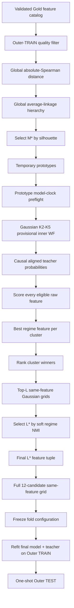
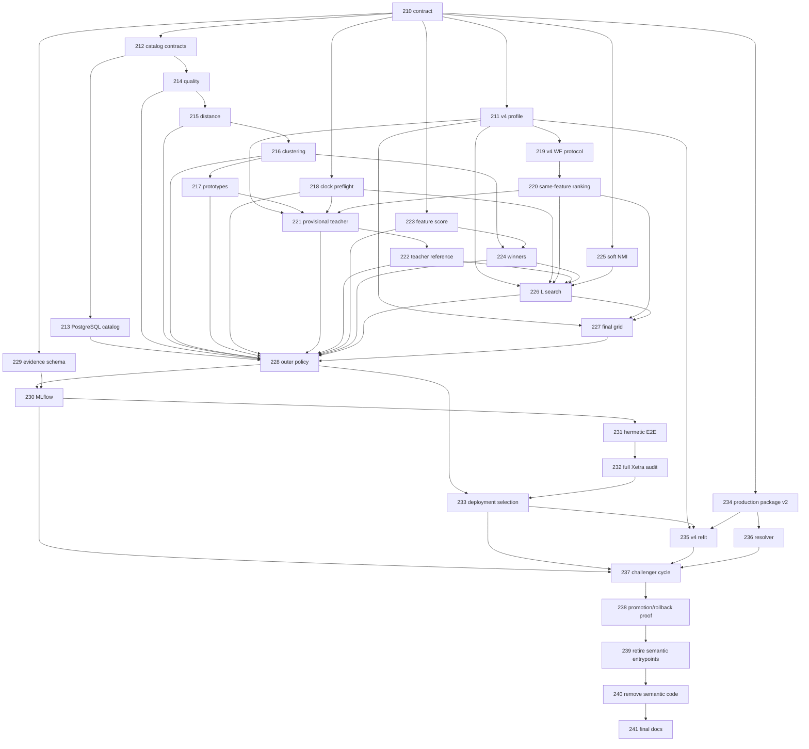
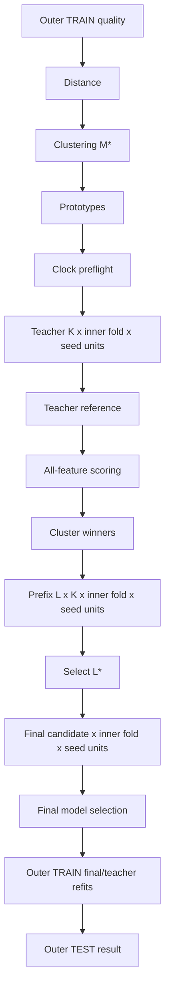
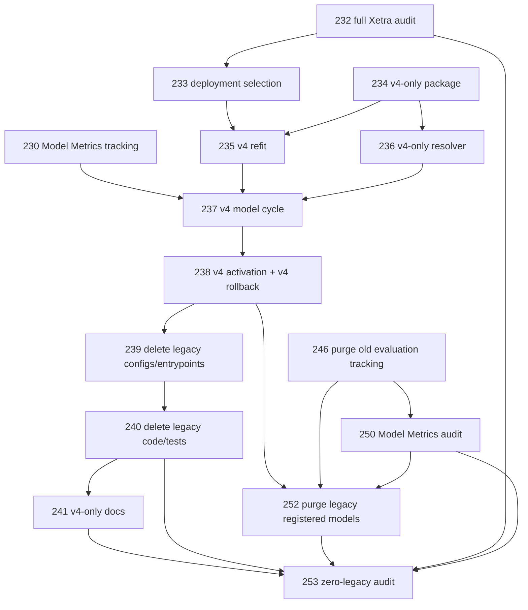
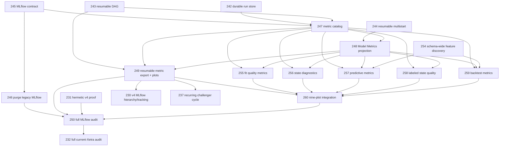
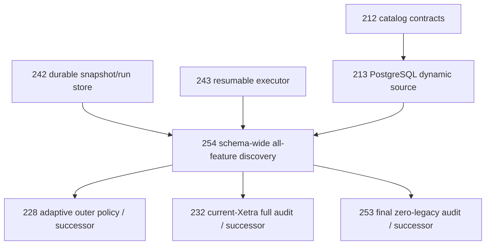

# Regime Engine — Global Regime Discovery Implementation Backlog

Status date: 2026-09-11

## Current execution state

- **Active worktree:** CPU optimization `pr/PR-245-process-parallel-evaluation`;
  primary resumability `pr/PR-242-resumable-execution-follow-up`; audit
  `pr/PR-232-independent-audit`
- **Reference base:** `03feaff` (`origin/main`); local `main` contains the
  completed v4-only cleanup, durable evaluation-run migration, NAS MLflow
  package-publication boundary, stage checkpoints, all-CPU parallel defaults,
  and the MLflow Model Metrics projection work.
- **Latest primary commit:** `9830a9d` completes the resumable v4 execution
  follow-up on top of `origin/main`, including durable state-root validation,
  source-free resume, seed-level checkpointing and concurrency-safe duplicate
  execution, NAS PostgreSQL timestamp-precision compatibility, and the CI
  integration-runner oversubscription fix. Focused executor/multistart
  coverage and the full non-external suite are green.
- **Latest CPU optimization commit:** `109f8eb` terminalizes domain-invalid
  stage failures and adds a guarded repair path for older ledgers. The process
  scheduler from `75b9242` extends the process-based
  execution path to the default provisional-teacher, prefix-search and final
  candidate grids. Each process owns one nested numerical lane, preserving
  deterministic ordering while avoiding GIL-bound thread pools and nested
  process oversubscription. The durable outer-fold process path from `3812049`
  remains enabled for checkpointed production runs.
- **Current CPU topology/performance implementation:** the runtime now sizes
  workers from Linux process affinity and the active cgroup quota, exposes
  physical-core/NUMA topology, and accepts the `REGIME_CPU_WORKERS` override.
  CPU-bound default pools use independent interpreters; native numerical
  thread pools remain capped at one thread per process. On this 88-logical / 44
  physical-core, 2-NUMA-node host, the deterministic process benchmark measured
  24.55, 47.83, 90.72, 155.58, 266.66 and 333.44 tasks/s at 1, 2, 4, 8, 16
  and 32 workers respectively; physical-core (44) and all-logical (88) gave
  317.87 and 292.89 tasks/s. Peak child RSS remained 15.7 MiB. The measured
  sweep therefore identifies 32 as the best benchmark override for this
  workload; the code keeps the default adaptive to each process allocation.
  A real 504-row Gaussian-HMM multistart profile identified hmmlearn/scipy
  fitting as the hot path; the same workload took 2.334, 1.197, 1.009 and
  0.907 seconds at 1, 2, 4 and 8 workers, with identical winner seed 89 and
  eight valid starts.
- **Remote branch/PR state:** GitHub PR #239 is the resumability follow-up.
  PR #240 was closed after its branch identity failed the naming policy;
  replacement PR #241 is the independent audit PR. GitHub PR #242 contains
  the process-parallel CPU fix. The obsolete PR-231 remote branch was deleted.
- **External runtime checks:** NAS PostgreSQL `10.10.1.3:54321` accepts the
  `regime-engine` read-only credential for database `postgres` and exposes
  `regime_loader.regime_features_daily`; the verified live lineage contract is
  schema version 4 / feature version 3. `xetra_loader` exists but denies
  `CONNECT` to that role. External MLflow health responds `OK` at
  `http://10.10.1.3:5000`; no `regime-engine-evaluation` experiment or
  `regime-xetra` model version exists there yet. The authorized live full run
  uses the fresh CPU-optimized state root
  `/home/dev_regime/regime-evaluation-checkpoints-v2` and run key
  `be69fea9b851a7b53b8d44b6700d6ebefbdcfe5fa897ea44b8a0c75239eb838e`. The
  run is now `COMPLETE` after a guarded repair converted its 246 stale pending
  stage units to `DOMAIN_INVALID`; it has 9,581 complete and 246 domain-invalid
  units, with zero valid folds and therefore no production-eligibility claim.
- **Latest verification:** durable-run, source-resume, stage-checkpoint,
  registry, MLflow settings, and v4 tracking tests pass; Ruff and
  `git diff --check` pass. The full non-E2E suite previously passed (`445
  passed, 2 skipped` for opt-in external checks); the latest focused MLflow/v4
  selection run passes (`16 passed`). Candidate
  grids, multistarts, prefix searches, teacher evaluation, final production
  refits and local tracking rendering default to affinity/cgroup-aware CPU
  capacity, bounded by independent task count. Outer folds and
  default candidate grids now run in process workers with deterministic
  result-order assembly; each nested numerical lane is one process-local lane,
  so CPU-bound fits are not constrained by one interpreter GIL. Custom
  adapters and explicit checkpointed nested overrides retain a controlled
  fallback. The process-backed grid/integration validation is green (`29
  passed`), with mypy and Ruff passing. Stage-invalid terminalization and
  ledger-repair tests pass. Test
  BLAS/OpenMP pools are capped at one native thread per worker to prevent
  xdist/native oversubscription. The
  zero-legacy audit scans 569 active files and passes, and the scoped MLflow
  cleanup tests pass (`5 passed`). NAS MLflow access is authorized and its
  `/health` endpoint returns `200 OK`; the evaluation experiment and
  `regime-xetra` registered model are currently absent. No production objects
  have been deleted. The full non-external suite passes under `pytest -n auto`
  (`458 passed, 2 skipped`). The corrected hermetic full-computation proof
  passed locally with real HMM fitting, independent mathematical checks,
  MLflow tracking and plot-manifest generation: `1 passed in 974.60s`
  (`0:16:14`), with 14 tracked plot artifacts. The remote integration gate
  must still complete the same long-running proof.
  Pytest now uses `pytest-xdist -n auto` by default, so test files are
  distributed across all available CPUs in local and CI runs. The latest
  stale full run reached 450 passed and 8 fixture failures caused by the live
  lineage-version change before it was interrupted; those fixtures now pass
  in a focused rerun. The corrected full proof above is the required fresh
  real-computation run. `mypy` now passes
  all 112 source files; Ruff and the focused MLflow/export/audit checks pass.
  The repository description is now set on GitHub to the scientific v4/MLflow
  description requested by the user.

## User-directed superseding decisions

- Only Xetra v4 is active. Legacy v1-v3 evaluation, package, and serving
  compatibility is retired; historical acceptance text below is superseded
  where it requests backward compatibility.
- HMM production packages must be uploaded to the external NAS MLflow service
  at `http://10.10.1.3:5000` and registered with a remote `runs:/...` URI.
  Local MLflow/file-store registration is not a production fallback.
- Docker/Compose MLflow and PostgreSQL services are not part of this project;
  the feature PostgreSQL and MLflow services remain external dependencies.
- Parallel production work uses every available CPU by default. Explicit
  `max_workers` values remain a deliberate operator/test override only.

This is the single implementation backlog for the global, non-semantic regime-feature discovery architecture defined by `EVALUATION.md`.

The active target is **Xetra profile configuration version 4**. The former
semantic-medoid v1-v3 evaluation path is retired; Git history is the archive
and it must not receive new statistical behavior.

> **PR-ID namespace:** `PR-210`, `PR-211`, ... below are repository planning IDs used in branch/commit names. They are not required to equal GitHub's numeric pull-request number. The branch name is the canonical implementation identity.

The previous draft planning IDs `PR-186`–`PR-206` are superseded by this audited backlog. No implementation branch for those draft IDs exists; agents must not implement them.

## Current repository state

As of 2026-09-11, the primary worktree is on
`pr/PR-242-resumable-execution-follow-up` at `9830a9d`, based on
`origin/main` at `03feaff`; the CPU optimization worktree is on
`pr/PR-245-process-parallel-evaluation` at `3812049`. GitHub PR #239 remains
open for the resumability follow-up, PR #241 is the independent audit PR, and
PR #242 is the CPU optimization PR. The remote integration gates and the
authorized NAS full-data run remain pending/running respectively.

---

# 1. Canonical v4 identity

```text
profile_id=xetra
profile_config_version=4
feature_discovery_policy=xetra_global_regime_v4
evaluation_id=global_regime_v4
registered_model=regime-xetra
production_alias=champion
challenger_alias=challenger
```

The v4 statistical path has **no semantic groups**. All structurally valid Gold feature columns enter one global candidate universe. Optional economic labels are display metadata only and may not affect quality filtering, correlation, clustering, cluster count, prototype choice, regime score, feature rank, final feature count, model family, state count, or champion selection.



Canonical quantities are distinct:

```text
N  = eligible raw feature count in one TRAIN sample
M* = selected global redundancy-cluster count
L* = selected final regime-feature count
K* = selected hidden-state count of the final HMM candidate
```

---

# 2. Canonical statistical and mathematical contract

PR-210 makes this section authoritative in `EVALUATION.md`. Later agents may not invent alternative constants, formulas, fallbacks, or tie rules.

## 2.1 Source/quality constants

| Setting | Canonical v4 value |
|---|---|
| feature-universe mode | all non-`timestamp_m1` columns in the validated Gold feature table; every such column must be PostgreSQL `DOUBLE PRECISION` |
| feature ordering | PostgreSQL ordinal position |
| minimum Outer-TRAIN feature coverage | `0.90` |
| population variance convention | `ddof=0` |
| minimum population variance | strictly `> 1.0e-12` |
| non-null NaN/Inf | source-contract failure; never silently converted into a feature-level rejection |
| fill/interpolate/carry | forbidden |
| minimum eligible feature count | `3` |
| minimum pairwise complete observations | `504` |

The dynamic catalog is structurally validated. Source `schema_version` and `feature_version` remain mandatory lineage and are never hidden, but v4 discovery does not use a hand-maintained feature-name allowlist. A same-name semantic redefinition upstream cannot be inferred from SQL type metadata; this remains an explicit current-vintage upstream limitation and must be documented rather than silently claimed solved.

## 2.2 Redundancy distance

For features `i,j`, Spearman correlation is Pearson correlation of pairwise-complete average ranks:

```text
rho_ij = corr(rank_average(x_i), rank_average(x_j))
d_ij   = 1 - abs(rho_ij)
```

Rules:

- pairwise support is TRAIN-only and at least `504`;
- undefined/non-finite `rho_ij` invalidates the distance result;
- values of `rho` outside `[-1,1]` by at most `1e-12` are clipped to the boundary; a larger violation fails;
- diagonal distance is written as exact `0.0`;
- final distances must be finite in `[0,1]`.

## 2.3 Global clustering and the mathematically bounded M search

Clustering is one deterministic agglomerative **average-linkage** hierarchy over the precomputed distance matrix in canonical feature order. The implementation uses the repository-pinned `scikit-learn==1.9.0` behavior and stores the full merge tree. Candidate cuts are derived from that one tree; a separate independently fitted hierarchy per `M` is forbidden.

Candidate cluster counts are:

```text
M = 2, 3, ..., min(12, N - 1)
```

The upper bound `12` is not arbitrary. For a full-covariance Gaussian HMM with `K` states and dimension `d`, the free-parameter count used for the safety proof is:

```text
p_G(K,d) = (K-1) + K(K-1) + Kd + K*d(d+1)/2
```

At the smallest permitted model TRAIN size `504`:

```text
p_G(5,12) = 474 <= 504
p_G(5,13) = 544 > 504
```

Therefore all provisional `K=2..5` Gaussian candidates remain on the safe side of the simple `p <= n_min` engineering bound only through `d=12`. This is a safety bound, not a guarantee of a well-conditioned fit; covariance, occupancy and convergence gates still apply.

For each candidate `M`:

- cut exactly `M` clusters from the stored hierarchy;
- compute `silhouette_samples(..., metric="precomputed")` from the same distance matrix;
- singleton sample silhouette is exactly `0.0`;
- mean silhouette is the arithmetic mean over all `N` samples;
- choose the globally best silhouette anchor;
- candidates within anchored absolute `1e-12` are tied; smaller `M` wins;
- best silhouette must be strictly greater than `0.0`.

Cluster IDs are fold-local and canonicalized by the smallest **canonical feature ordinal**, not lexical name. The first cluster becomes `cluster_000`, then `cluster_001`, etc.

## 2.4 Temporary prototype

For each selected cluster, the temporary prototype is the actual feature with minimum mean distance to the *other* members of that cluster. Singleton prototype is the singleton itself. Anchored `1e-12` ties use canonical feature ordinal.

A prototype is initialization-only. It has no bonus in final regime-feature selection.

## 2.5 Inner model-clock contract

Inner walk-forward is expanding:

```text
minimum TRAIN source rows = 756
TEST source rows          = 63
step source rows          = 63
partial final TEST        = false
minimum model TRAIN rows  = 504
minimum model TEST rows   = 42
```

Before any HMM is fitted to a feature tuple, the tuple must pass a pure complete-case model-clock preflight:

- first inner TRAIN has at least `504` complete rows;
- every feature has population variance `>1e-12` on that first complete-case TRAIN matrix;
- every planned fold records complete TRAIN/TEST counts;
- structurally valid fold rate is at least `0.80`.

Preflight never chooses K and never inspects HMM output. Selected `M*` is not silently replaced by a lower-silhouette `M` if prototype preflight or HMM fitting fails; the enclosing outer fold fails explicitly.

## 2.6 Provisional teacher

Teacher family is Gaussian full-covariance only, with `K in {2,3,4,5}` and the existing eight-seed multistart/gates.

Because every K sees the same prototype vector, K selection uses the canonical same-feature statistical ranking: common valid-fold OOS predictive log likelihood, OOS dispersion, worst fold, BIC, AIC, then exact deterministic complexity/ID tie breaks.

Teacher probabilities are the **aligned causal filtered probabilities** on valid inner TEST timestamps. Smoothed probabilities and full-sample Viterbi states are forbidden as teacher weights.

## 2.7 Distribution-sensitive feature regime score

The previous draft's `eta_squared`-only selection is rejected because it detects conditional-mean separation but can miss a feature whose regime information is predominantly variance/tail/distributional. V4 therefore uses a bounded, distribution-sensitive **state information ratio** as the primary feature score and retains posterior `eta_squared` as a diagnostic/tie-break only.

For feature `j`, use only teacher timestamps where `x_tj` is finite. Require support coverage `>=0.90` of teacher timestamps and at least `126` observations.

On that support:

1. Compute average ranks `r_t` of the feature values.
2. Use exactly `B=10` deterministic rank bins:

```text
bin_t = min(9, floor(10 * (r_t - 1) / n))
```

3. With teacher probabilities `gamma_tk`, define:

```text
p_bk = (1/n) * sum_t 1[bin_t=b] * gamma_tk
p_b  = sum_k p_bk
p_k  = sum_b p_bk
I    = sum_{b,k:p_bk>0} p_bk * ln(p_bk/(p_b*p_k))
H_S  = -sum_{k:p_k>0} p_k * ln(p_k)
state_information_ratio = I / H_S
```

`H_S <= 1e-12` is invalid. A valid score must be finite in `[0,1]` within `1e-12`.

On the same feature-specific support also compute diagnostic posterior `eta_squared`:

```text
pi_k      = mean_t gamma_tk
mu_jk     = sum_t gamma_tk*x_tj / sum_t gamma_tk
mu_j      = mean_t x_tj
B_j       = sum_k pi_k * (mu_jk-mu_j)^2
W_j       = sum_k pi_k * sigma_jk^2
eta_sq_j  = B_j / (B_j + W_j)
```

All weights, means and variances are recomputed on the same feature support. No HMM is fitted per raw feature.

## 2.8 Cluster winner and global rank

Within each cluster and then globally across cluster winners, use:

1. higher `state_information_ratio` with anchored `1e-12` tiers;
2. higher `eta_squared` with anchored `1e-12` tiers;
3. higher score coverage;
4. higher score observation count;
5. smaller canonical feature ordinal.

Exactly one eligible winner is required per selected cluster. If a selected cluster has no eligible scored member, the outer fold is invalid.

## 2.9 Final feature-count bound and soft regime NMI

The final candidate feature count is bounded by the most parameter-rich required final family, GMM-HMM with `K=5`, `M=2`, full covariance. Its free-parameter safety count is:

```text
p_GMM(K,M,d) = (K-1) + K(K-1) + K(M-1) + KMd + KM*d(d+1)/2
```

At `n_min=504`:

```text
p_GMM(5,2,8) = 469 <= 504
p_GMM(5,2,9) = 569 > 504
```

Therefore final prefix lengths are exactly:

```text
L = 2, 3, ..., min(M*, 8)
```

If `M* < 2`, the fold is already invalid upstream.

For each prefix `L`:

- run Gaussian K2-K5 on the same prefix vector and same inner plan;
- first choose that prefix's K winner using the canonical **same-feature predictive ranking**; teacher agreement must not choose K;
- compare only that prefix winner to the teacher on exact shared timestamps.

Teacher/candidate agreement uses **soft regime NMI**, not hard argmax labels. For teacher probabilities `P_tk` and candidate probabilities `Q_tl` on `T` shared timestamps:

```text
p_kl = (1/T) * sum_t P_tk * Q_tl
p_k  = sum_l p_kl
q_l  = sum_k p_kl
I    = sum_{k,l:p_kl>0} p_kl * ln(p_k*q_l))
H_P  = -sum_k p_k ln(p_k)
H_Q  = -sum_l q_l ln(q_l)
soft_regime_nmi = 2I / (H_P + H_Q)
```

Denominator `<=1e-12` is invalid. Valid NMI is finite in `[0,1]` within `1e-12` and is invariant to either model's state-label permutation.

Prefix shared support must cover at least `0.90` of teacher timestamps. Across different `L`:

1. maximize soft regime NMI using anchored `1e-12` ties;
2. maximize shared timestamp count;
3. choose smaller `L`.

Raw PLL/BIC/AIC are **forbidden** across different `L`. They remain valid only inside one prefix because K candidates there model exactly the same observed vector.

## 2.10 Final model grid

The selected `L*` feature vector is evaluated with exactly 12 candidates:

```text
gaussian_hmm_k2_full
gaussian_hmm_k3_full
gaussian_hmm_k4_full
gaussian_hmm_k5_full
gmm_hmm_k2_m2_full
gmm_hmm_k3_m2_full
gmm_hmm_k4_m2_full
gmm_hmm_k5_m2_full
student_t_hmm_k2_full
student_t_hmm_k3_full
student_t_hmm_k4_full
student_t_hmm_k5_full
```

All 12 see the same feature vector and inner folds, so the existing same-feature statistical ranking applies.

## 2.11 Outer evaluation semantics

Outer walk-forward remains expanding `1260/63/63`, no partial final TEST.

Inside each outer TRAIN, the **entire** selection procedure reruns. The selected configuration is frozen before Outer TEST access.

For valid outer evaluation:

- refit the selected final model on all complete Outer-TRAIN observations;
- independently refit the frozen provisional teacher K on all complete prototype Outer-TRAIN observations;
- continue both exactly once into Outer TEST;
- compute soft regime NMI on their exact shared TEST timestamps, requiring at least `42` shared observations;
- retain final-model OOS PLL as a fold-local diagnostic only.

Because feature vectors and dimensions may change across outer folds, raw PLL/BIC/AIC must never be pooled or ranked across outer folds. Policy-level comparable evidence is:

- outer valid-fold rate;
- soft regime NMI mean/population-std/worst over valid outer folds;
- selection/cluster stability diagnostics;
- per-fold fold-local likelihood/diagnostic evidence.

Production eligibility requires outer valid-fold rate `>=0.80`, at least `3` valid outer folds, and a valid latest complete outer fold. No automatic promotion threshold is attached to outer NMI; the first v4 result is challenger-only.

State IDs are `outer_fold_local` during adaptive evaluation.

## 2.12 Deployment selection after OOS validation

Outer evaluation validates the **policy**, not one permanent fold configuration. Therefore the production configuration is not taken from the last outer fold.

After the outer evaluation has passed its gates, rerun the exact same v4 TRAIN-only selection function once on **all rows in the same source snapshot through `source.max_timestamp`**. This is the deployment-selection run. It may use observations that were previously outer TEST because no OOS claim is made for the deployment refit.

Persist separately:

```text
validation_evaluation_cutoff = final complete outer TEST end
deployment_selection_cutoff  = source.max_timestamp
```

If the source build changes between validation and initial audited cutover, the audit must be rerun. Recurring later model cycles evaluate their own new source build normally.

## 2.13 Production state identity

Dynamic features and dynamic K make cross-model one-to-one state identity mathematically impossible in general. V4 therefore pins production state IDs as **model-version-local**.

Within one production artifact, state order is deterministic and fixed. The same `state_0` string in two different model versions must not be interpreted as the same economic regime unless a future versioned cross-model alignment contract establishes that relation. Every response already carries exact model version and profile version; downstream consumers must key state semantics by model version.

---

# 3. Weak-agent execution and QA rules

Every implementation PR is atomic and fail-closed.

1. Start from clean current `main`; every listed dependency must already be merged.
2. Branch exactly `pr/PR-<planning-id>-<slug>`.
3. Edit only **Allowed** files. If scope is insufficient, stop and report the backlog defect.
4. Never edit `BACKLOG.md` from an implementation PR.
5. Never invent statistical constants/fallbacks.
6. Never add semantic-group decisions, economic/portfolio targets, Optuna subset search, smoothed-state scoring, or Outer-TEST feedback into selection.
7. Reuse existing HMM adapters, multistart, causal filter, likelihood parity, diagnostics and model ranking. Duplicate HMM/filter/ranking implementations are forbidden except explicitly independent QA reference code.
8. New randomized production behavior is forbidden. Test random generators require fixed explicit seeds.
9. Canonical ordering must be independent of mapping iteration, thread completion, filesystem order and MLflow run ID.
10. Numerical full-computation QA runs with `OMP_NUM_THREADS=1`, `OPENBLAS_NUM_THREADS=1`, `MKL_NUM_THREADS=1`.

## Universal QA

All PRs run:

```text
QA-0  git status --short
      git branch --show-current

QA-1  uv sync --frozen --python 3.14.7

QA-2  uv run ruff check .
      uv run ruff format --check .
      uv run mypy

QA-3  PR-specific targeted tests

QA-4  PR-specific affected-path end-to-end/full-computation test when executable behavior changed

QA-5  uv run pytest -m "not external" --cov=market_regime_engine \
          --cov-report=term-missing --cov-fail-under=90

QA-6  deterministic rerun of the canonical statistical payload/artifacts

QA-7  git status --short
      git branch --show-current
```

Additional proof class:

- **Numerical PR:** independent reference implementation from primitive formulas; it must not import the production function under audit.
- **I/O/config/serialization PR:** independent contract/provenance fixture proving exact schema, ordering, failure behavior and hash/round-trip semantics.
- **Tracking/docs PR:** render/link/schema consistency proof; do not fabricate a meaningless numerical oracle.

MLflow run IDs, wall-clock timestamps and temporary paths are operational metadata and are excluded from byte-equality. The canonical statistical JSON, hashes, source-data tables used for plots, and deterministic plot files must be equal on rerun.

Every PR body records commands, exit codes and proof test/artifact names.

---

# 4. Active atomic implementation PRs

## Wave A — contract, profile, source and pure kernels

### PR-210 — Pin the complete v4 statistical/lifecycle contract

- **Branch:** `pr/PR-210-pin-global-regime-v4-contract`
- **Depends on:** none
- **Allowed:** `EVALUATION.md`, `src/market_regime_engine/feature_discovery/__init__.py`, `src/market_regime_engine/feature_discovery/contracts.py`, `tests/unit/feature_discovery/test_contracts.py`
- **Status:** complete; GitHub PR #193 merged to `main`.

Acceptance:

- [x] Encode every section-2 quantity/formula/tolerance and its semantic role.
- [x] Immutable contracts cover catalog identity, quality, distance, cluster solution, prototypes, model-clock feasibility, teacher, feature scores, winners, prefix search, final config, outer fold result, adaptive evaluation result and deployment selection.
- [x] Primary feature score is `state_information_ratio`; posterior `eta_squared` is diagnostic/secondary only.
- [x] Soft regime NMI formula and cross-dimension likelihood prohibition are explicit.
- [x] Parameter-count safety bounds `M<=12`, `L<=8` are exact.
- [x] Outer PLL non-pooling, outer validity gates, deployment-selection cutoff and model-version-local state identity are explicit.
- [x] Hashes are canonical JSON/SHA-256, finite-only, with explicit ordered tuples.
- [x] No MLflow/PostgreSQL/HMM backend import.

QA:

- [x] Independent Python/reference arithmetic proves `p_G(5,12)=474`, `p_G(5,13)=544`, `p_GMM(5,2,8)=469`, `p_GMM(5,2,9)=569`.
- [x] Contract mutation matrix rejects invalid N/M/L/K, nonfinite values, duplicate features, invalid prefixes and illegal cross-dimension PLL ranking payloads.
- [x] Complete synthetic outer-result + deployment-selection round trip is lossless and deterministic.

### PR-211 — Add a dedicated v4 profile schema/config

- **Branch:** `pr/PR-211-xetra-v4-profile`
- **Depends on:** PR-210
- **Allowed:** `configs/profiles/xetra_v4.yaml`, `src/market_regime_engine/profiles/config.py`, `src/market_regime_engine/profiles/resolution.py`, `tests/unit/profiles/test_xetra_v4_profile.py`, `tests/unit/profiles/test_resolution.py`
- **Status:** complete; GitHub PR #194 and hash-preservation follow-up #195 merged to `main`.

Acceptance:

- [x] Introduce a dedicated `FeatureDiscoveryConfig`; do not stuff v4 into legacy `FeatureSelectionConfig` semantic fields.
- [x] `ModelProfile` permits exactly legacy selection for v1-v3 or global discovery for v4, never both.
- [x] v4 config explicitly pins every source/quality/clustering/inner/score/prefix/outer constant; no hidden defaults.
- [x] Add v4 discovery candidate/result contracts that do not require fixed universe cardinality, eight medoids or semantic blocks.
- [x] Exact final candidate order is the 12 IDs in section 2.10.
- [x] v1-v3 loading/resolution remains behavior-identical until retirement.
- [x] Unknown/missing v4 fields, semantic-selection fields in v4, changed model order or changed pinned constants fail closed.

QA:

- [x] Golden config asserts every v4 field and exact hashes.
- [x] One-field mutation matrix proves hash/validation sensitivity.
- [x] Load v1-v4 together and prove no shared mutable or semantic state leaks into v4.

### PR-212 — Add dynamic feature-catalog port contracts

- **Branch:** `pr/PR-212-feature-catalog-contracts`
- **Depends on:** PR-210
- **Allowed:** `src/market_regime_engine/features/ports.py`, `tests/unit/features/test_feature_catalog_contracts.py`
- **Status:** complete; GitHub PR #196 merged to `main`.

Acceptance:

- [x] Add immutable catalog entry/snapshot contracts carrying name, ordinal, PostgreSQL type, lineage and catalog hash.
- [x] Catalog requires exact `timestamp_m1` identity separately from feature entries.
- [x] V4 feature entries are ordered by ordinal, unique, safe SQL identifiers and exactly `DOUBLE PRECISION`.
- [x] Catalog hash includes source build/version identity and exact ordered name/type/ordinal triples.
- [x] Existing `FeatureSource.read(FeatureRequest)` contract remains compatible.

QA:

- [x] Independent canonical-JSON/hash fixture.
- [x] Reordered physical mapping with unchanged declared ordinals yields identical result; changed ordinal/type/name changes hash.

### PR-213 — Implement one-snapshot PostgreSQL dynamic catalog + row read

- **Branch:** `pr/PR-213-postgres-dynamic-feature-catalog`
- **Depends on:** PR-212
- **Allowed:** `DATA_SOURCE.md`, `src/market_regime_engine/features/postgres_source.py`, `tests/unit/features/test_feature_catalog.py`, `tests/integration/features/test_postgres_feature_catalog.py`
- **Status:** complete; GitHub PR #197 merged to `main`.

Acceptance:

- [x] In one `REPEATABLE READ READ ONLY` transaction read sync-state, table catalog and requested discovery rows; close transaction before model work.
- [x] `timestamp_m1` must be PostgreSQL timestamp-with-time-zone and every other Gold table column must be `DOUBLE PRECISION`; unexpected non-feature columns fail closed.
- [x] V4 discovery does not require constructor `registered_feature_names`; legacy resolved-model/legacy-profile behavior stays exact.
- [x] Dynamic SELECT uses only catalog-validated `sql.Identifier` objects in ordinal order.
- [x] Source versions are recorded as lineage; v4 structural compatibility and same-name-semantic-change limitation are documented explicitly.
- [x] Any non-null NaN/Inf remains a source failure, matching `DATA_SOURCE.md`.
- [x] A newly added `DOUBLE PRECISION` Gold column appears automatically on the next source build without engine feature config edits.
- [x] No DB mutation or long-lived transaction.

QA:

- [x] Hermetic PG-shaped fixture proves automatic added-column discovery, ordinal order and exact row shape.
- [x] Unsupported type, wrong timestamp type, duplicate/unsafe identifier, lineage/catalog mismatch and concurrent post-snapshot schema change all fail or remain snapshot-consistent as specified.

### PR-214 — Implement pure Outer-TRAIN quality filtering

- **Branch:** `pr/PR-214-global-feature-quality`
- **Depends on:** PR-210, PR-212
- **Allowed:** `src/market_regime_engine/feature_discovery/quality.py`, `tests/unit/feature_discovery/test_quality.py`
- **Status:** complete; GitHub PR #198 merged to `main`.

Acceptance:

- [x] Coverage denominator is exact Outer-TRAIN source-row count; `>=0.90` passes.
- [x] Variance is finite population variance `ddof=0`, strictly `>1e-12`.
- [x] NULLs count against coverage; no fill.
- [x] Any nonfinite supplied value invalidates the invocation, not merely that feature, matching source contract.
- [x] Output order is catalog order and records exact counts/coverage/variance/reason.
- [x] Require at least three eligible features.
- [x] Rows outside supplied TRAIN bounds are impossible through the API and mutation after TRAIN has no effect.

QA:

- [x] Primitive-sum variance reference, 0.90 boundary, near-threshold variance and 50-feature mixed fixture.

### PR-215 — Implement global absolute-Spearman distance

- **Branch:** `pr/PR-215-global-spearman-distance`
- **Depends on:** PR-214
- **Allowed:** `src/market_regime_engine/feature_discovery/distance.py`, `tests/unit/feature_discovery/test_distance.py`
- **Status:** complete; GitHub PR #200 merged to `main`.

Acceptance:

- [x] Exact pairwise-complete support and `>=504` gate for every pair.
- [x] Average ranks for ties; Spearman is Pearson of those ranks.
- [x] Exact clipping/failure semantics from section 2.2.
- [x] Symmetric matrix, exact zero diagonal, finite `[0,1]`, canonical feature order.
- [x] Persist full support-count matrix and deterministic hash.
- [x] Perfect positive and negative monotonic pairs both have zero distance.

QA:

- [x] Independent slow implementation recomputes every pair of a >=50-feature fixture.
- [x] Tied-rank hand calculation and row-permutation invariance proof.

### PR-216 — Build one deterministic hierarchy and select M*

- **Branch:** `pr/PR-216-global-clustering-mstar`
- **Depends on:** PR-215
- **Allowed:** `src/market_regime_engine/feature_discovery/clustering.py`, `tests/unit/feature_discovery/test_clustering.py`
- **Status:** complete; GitHub PR #202 merged to `main`; contract-domain follow-up merged as GitHub PR #203.

Acceptance:

- [x] Build exactly one full average-linkage hierarchy from precomputed distance using pinned sklearn behavior.
- [x] Derive exact cuts `M=2..min(12,N-1)` from that one merge tree.
- [x] Store merge tree, complete silhouette curve and every candidate membership.
- [x] Silhouette singleton=0; best-anchor/anchored-tie/smaller-M semantics exact.
- [x] Selected best silhouette must be >0.
- [x] Cluster IDs use minimum canonical feature ordinal.
- [x] Internal container/iteration order cannot alter bytes while declared canonical feature order is unchanged.

QA:

- [x] Independent silhouette-by-sample oracle for explicit matrix.
- [x] Equal-distance/tie merge fixture pins deterministic hierarchy under sklearn 1.9.0.
- [x] Full candidate-M run reruns byte-identically.

### PR-217 — Select temporary prototypes

- **Branch:** `pr/PR-217-temporary-prototypes`
- **Depends on:** PR-216
- **Allowed:** `src/market_regime_engine/feature_discovery/prototypes.py`, `tests/unit/feature_discovery/test_prototypes.py`
- **Status:** complete; GitHub PR #205 merged to `main`.

Acceptance:

- [x] Mean distance excludes self; singleton is itself.
- [x] Anchored `1e-12` ties use canonical ordinal.
- [x] Output is cluster order and stores every candidate mean/tie tier.
- [x] No HMM/score/semantic/economic influence.
- [x] Prototype contract explicitly says initialization-only.

QA:

- [x] Independent arithmetic medoid oracle and adversarial fixture where prototype later loses cluster regime selection.

### PR-218 — Add reusable complete-case model-clock preflight

- **Branch:** `pr/PR-218-model-clock-preflight`
- **Depends on:** PR-210
- **Allowed:** `src/market_regime_engine/evaluation/model_clock.py`, `tests/unit/evaluation/test_model_clock.py`
- **Status:** complete; GitHub PR #206 merged to `main`.

Acceptance:

- [x] Pure function accepts source rows, exact feature tuple, walk-forward plan and model-row thresholds.
- [x] Records every fold's TRAIN/TEST complete-case counts without fitting/scaling an HMM.
- [x] First TRAIN requires >=504 complete rows and per-feature population variance >1e-12 on that common matrix.
- [x] Structural valid-fold rate >=0.80.
- [x] No feature dropping, fill or K-dependent support.
- [x] Prototype failure invalidates outer selection; prefix failure marks only that prefix ineligible; caller behavior is explicit.

QA:

- [x] Hand complete-case masks/counts and variance reference; adversarial missingness fixture demonstrates why individual 90% coverage does not imply multivariate clock feasibility.

### PR-219 — Make the proven walk-forward runner v4-capable without semantic coupling

- **Branch:** `pr/PR-219-v4-walk-forward-candidate-protocol`
- **Depends on:** PR-211
- **Allowed:** `src/market_regime_engine/evaluation/walk_forward.py`, `tests/unit/evaluation/test_walk_forward.py`, `tests/unit/evaluation/test_walk_forward_validation.py`
- **Status:** complete; GitHub PR #207 merged to `main`. Legacy-preservation language below is superseded by the consolidated zero-legacy section in this file.

Acceptance:

- [x] Accept profile v4 structural candidate protocol while preserving v1-v3 behavior.
- [x] V4 candidate requires exact feature order/dimension, source build and generic feature-selection definition/execution hashes; no medoid/universe cardinality assumptions.
- [x] Same scaler, multistart, causal filter, TRAIN likelihood parity, gates, within-vector state alignment and diagnostics are reused.
- [x] No adaptive feature selection is moved into the runner.
- [x] Unsupported version/family/dimension fails before fit.

QA:

- [x] Legacy golden fixtures unchanged.
- [x] V4 structural candidate with same numerical input as legacy candidate produces identical HMM/filter evidence apart from version/lineage fields.

### PR-220 — Extract reusable same-feature candidate ranking

- **Branch:** `pr/PR-220-same-feature-candidate-ranking`
- **Depends on:** PR-219
- **Allowed:** `src/market_regime_engine/evaluation/selection.py`, `src/market_regime_engine/training/candidate_grid.py`, `tests/unit/evaluation/test_selection.py`, `tests/unit/training/test_candidate_grid.py`
- **Status:** complete; GitHub PR #208 merged to `main`.

Acceptance:

- [x] Extract one generic same-feature ranking kernel over supplied candidate evaluations/aggregates.
- [x] Enforce identical feature vector, source, plan and selection hashes before ranking.
- [x] Hard gates, common-valid-fold support, anchored numeric tiers and ranking stages remain exact.
- [x] Existing `select_statistical_champion` delegates to the kernel and returns behavior-identical legacy results.
- [x] Supports exact Gaussian K2-K5 subsets and full 12-candidate v4 sets without duplicating ranking logic.

QA:

- [x] Legacy ranking golden evidence unchanged.
- [x] Adversarial invalid-hard-fold case proves common-support fairness.
- [x] Input permutation does not change ranked IDs.

### PR-221 — Select provisional Gaussian K*

- **Branch:** `pr/PR-221-provisional-gaussian-teacher`
- **Depends on:** PR-211, PR-217, PR-218, PR-219, PR-220
- **Allowed:** `src/market_regime_engine/evaluations/provisional_teacher.py`, `tests/unit/evaluations/test_provisional_teacher.py`, `tests/integration/evaluations/test_provisional_teacher_compute.py`
- **Status:** complete; GitHub PR #210 merged to `main`.

Acceptance:

- [x] Exact inner `756/63/63`, no partial final TEST.
- [x] Run prototype preflight before any HMM.
- [x] Evaluate Gaussian K2-K5 only using existing adapters/multistart/runner.
- [x] Same prototype order/folds for every K.
- [x] Select K with PR-220 same-feature predictive ranking.
- [x] Persist all invalid/valid folds, common support and selection chain.
- [x] No fallback M, GMM, Student-t, Outer TEST, registration or alias action.

QA:

- [x] Independent forward-likelihood calculation on small explicit HMM.
- [x] Real four-K synthetic compute with no mocked HMM math.

### PR-222 — Build causal teacher reference and frozen-teacher refit helper

- **Branch:** `pr/PR-222-causal-teacher-reference`
- **Depends on:** PR-221
- **Allowed:** `src/market_regime_engine/evaluations/teacher_reference.py`, `tests/unit/evaluations/test_teacher_reference.py`
- **Status:** complete; GitHub PR #212 merged to `main`.

Acceptance:

- [x] Collect selected K's aligned causal filtered probabilities only from valid inner TEST rows, ordered and unique.
- [x] Every probability row finite/nonnegative/normalized within 1e-10.
- [x] Persist teacher K, prototypes, inner folds, source/plan hashes and teacher hash.
- [x] Add reusable helper to refit the already-frozen teacher K/prototype tuple on a supplied TRAIN and continue once into supplied TEST; helper never reselects M/K.
- [x] No smoothed/Viterbi teacher weights.

QA:

- [x] Independent forward recursion reproduces every probability in a two-state fixture.
- [x] Frozen-teacher refit helper proves no reselection call and future mutation invariance.

### PR-223 — Score all raw features with state information ratio + eta² diagnostic

- **Branch:** `pr/PR-223-all-feature-regime-information`
- **Depends on:** PR-210
- **Allowed:** `src/market_regime_engine/feature_discovery/scoring.py`, `tests/unit/feature_discovery/test_scoring.py`
- **Status:** complete; GitHub PR #214 merged to `main`.

Acceptance:

- [x] Exact feature-specific support, >=0.90 coverage and >=126 rows.
- [x] Exact average-rank decile bins and section-2.7 joint-probability formula.
- [x] Primary state information ratio finite `[0,1]`; entropy-degenerate cases fail.
- [x] Compute eta² on identical support as diagnostic/secondary value.
- [x] Persist primitive bin/state joint masses, state masses, entropies, MI, eta inputs and counts sufficient for independent recomputation.
- [x] State-label permutation and monotonic feature transform leave primary score unchanged within tolerance.
- [x] No HMM fit.

QA:

- [x] Independent primitive MI and eta implementation; explicit variance-only/tail-separation fixture must receive non-zero information score while eta² is near zero.
- [x] 100-feature full scoring fixture.

### PR-224 — Select one regime winner per cluster and rank globally

- **Branch:** `pr/PR-224-cluster-regime-winners`
- **Depends on:** PR-216, PR-223
- **Allowed:** `src/market_regime_engine/feature_discovery/winners.py`, `tests/unit/feature_discovery/test_winners.py`
- **Status:** complete; GitHub PR #216 merged to `main`.

Acceptance:

- [x] Exactly section-2.8 tier order; globally anchored tolerance tiers, never pairwise chaining.
- [x] Every selected cluster requires >=1 eligible score.
- [x] Exactly M* unique winners; prototype has no privilege.
- [x] Persist every candidate/tier/tie decision and canonical winner order.

QA:

- [x] Prototype-loses adversarial case; `0/0.75e-12/1.5e-12` transitivity case; full cluster table compute.

### PR-225 — Implement pure soft-regime-NMI agreement

- **Branch:** `pr/PR-225-soft-regime-nmi`
- **Depends on:** PR-210
- **Allowed:** `src/market_regime_engine/evaluations/agreement_v4.py`, `tests/unit/evaluations/test_agreement_v4.py`
- **Status:** complete; GitHub PR #218 merged to `main`.

Acceptance:

- [x] Exact section-2.9 soft joint formula from two probability matrices on exact shared timestamps.
- [x] Supports unequal K without state mapping.
- [x] Label permutations on either matrix leave score unchanged.
- [x] Probability validation finite/nonnegative/normalized within 1e-10.
- [x] Degenerate entropy or zero shared support fails with explicit reason.
- [x] Persist joint matrix, marginals, entropies, MI, shared timestamps/count and hash.

QA:

- [x] Independent primitive implementation; one-hot perfect relabeling=1; independent sequences≈0 on exact constructed table; uncertain soft example checked by hand/reference.

## Wave B — feature-count/model selection and outer policy

### PR-226 — Select L* from nested prefixes without cross-dimension PLL

- **Branch:** `pr/PR-226-prefix-feature-count-search`
- **Depends on:** PR-211, PR-218, PR-220, PR-222, PR-224, PR-225
- **Allowed:** `src/market_regime_engine/feature_discovery/prefix_search.py`, `tests/unit/feature_discovery/test_prefix_search.py`, `tests/integration/feature_discovery/test_prefix_search_compute.py`
- **Status:** complete; GitHub PR #220 merged to `main`.

Acceptance:

- [x] Evaluate exactly `L=2..min(M*,8)` ranked prefixes; no arbitrary subsets.
- [x] Each prefix runs model-clock preflight then Gaussian K2-K5 on same inner plan.
- [x] Within prefix choose K using PR-220 predictive ranking **before** teacher agreement.
- [x] Compute soft regime NMI only for that prefix's statistical K winner against teacher.
- [x] Shared teacher support >=0.90.
- [x] Across L use NMI, shared count, smaller L only; no PLL/BIC/AIC crosses dimensions.
- [x] Infeasible prefix is explicit; if no eligible prefix, outer fold fails.
- [x] Final feature tuple is exact first L* ranked winners.

QA:

- [x] Adversarial case where raw PLL would prefer a different L but NMI rule wins correctly.
- [x] All prefixes/K values run with real HMM math on deterministic synthetic data.

### PR-227 — Run the exact final 12-candidate grid on L*

- **Branch:** `pr/PR-227-final-v4-model-grid`
- **Depends on:** PR-211, PR-220, PR-226
- **Allowed:** `src/market_regime_engine/evaluations/final_v4_grid.py`, `src/market_regime_engine/training/candidate_grid.py`, `tests/unit/evaluations/test_final_v4_grid.py`, `tests/integration/evaluations/test_final_v4_grid_compute.py`
- **Status:** complete; GitHub PR #222 merged to `main`.

Acceptance:

- [x] Exact 12 IDs/order; same L* features, source, inner plan and hashes.
- [x] V4 candidate-grid contracts contain no semantic medoid cardinality requirement.
- [x] Existing adapter factory, runner and PR-220 ranking only; no duplicate family dispatch/ranking.
- [x] OOS PLL/BIC/AIC ranking is permitted because vector is identical.
- [x] Return exactly one statistical champion or explicit no-champion failure.
- [x] Teacher/provisional K has no tie preference.

QA:

- [x] Exact IDs, missing/reordered/extra fail; real Gaussian/GMM/Student-t full compute; independent common-support aggregate check.

### PR-228 — Orchestrate the complete adaptive outer policy

- **Branch:** `pr/PR-228-global-v4-outer-policy`
- **Depends on:** PR-213, PR-214, PR-215, PR-216, PR-217, PR-218, PR-221, PR-222, PR-223, PR-224, PR-226, PR-227
- **Allowed:** `src/market_regime_engine/evaluations/global_regime_v4.py`, `tests/unit/evaluations/test_global_regime_v4.py`, `tests/integration/evaluations/test_global_regime_v4_compute.py`
- **Status:** complete; GitHub PR #224 merged to `main`.

Acceptance:

- [x] Outer plan exact `1260/63/63`, no partial TEST.
- [x] Expose one reusable `select_v4_configuration(TRAIN_only, ...)` function containing catalog-bound quality -> clustering -> teacher -> score -> winners -> L* -> final grid; deployment code must later call this exact function.
- [x] Each outer fold invokes that function on TRAIN only and freezes its result before TEST access.
- [x] Refit final model and frozen teacher configuration independently on complete Outer TRAIN; no reselection.
- [x] Continue both once into Outer TEST and compute soft regime NMI on exact shared TEST timestamps, minimum 42.
- [x] Final-model OOS PLL remains fold-local diagnostic; no cross-fold PLL/BIC/AIC pooling.
- [x] Feature tuples/K may vary; state IDs are outer-fold-local.
- [x] Record feature eligibility frequency, M*, L*, winner frequency and adjacent-fold clustering stability diagnostics on common eligible features, but none feed selection.
- [x] Policy result calculates valid-fold rate and NMI mean/pstdev/worst; production-eligibility flags require >=0.80 valid rate, >=3 valid folds and valid latest fold.
- [x] Failure never reuses prior fold configuration.

QA:

- [x] Dependency spy proves TEST rows cannot reach selection.
- [x] Future mutation leaves earlier fold bytes identical.
- [x] At least three real-HMM outer folds execute end to end.

### PR-229 — Extend immutable local statistics for full v4 evidence

- **Branch:** `pr/PR-229-global-v4-evidence-schema`
- **Depends on:** PR-210
- **Allowed:** `src/market_regime_engine/evaluation_statistics/contracts.py`, `src/market_regime_engine/evaluation_statistics/writer.py`, `src/market_regime_engine/evaluation_statistics/render.py`, `tests/unit/evaluation_statistics/test_global_v4_statistics.py`
- **Status:** complete; GitHub PR #226 and render follow-up #228 merged to `main`.

Acceptance:

- [x] Versioned global-v4 schema covers all section-2 evidence, including merge tree, M curve, teacher, state-information score primitives, eta diagnostics, prefix winners/NMI, outer teacher/final agreement, validity/stability and deployment-selection lineage.
- [x] No raw source rows, secrets, DSNs or model binaries.
- [x] Failed fold/run keeps evidence accumulated before failure.
- [x] Deterministic finite-only JSON, exact-byte hash, immutable finalize.
- [x] Markdown renders enough primitives/formulas for external recomputation.

QA:

- [x] Full synthetic v4 dossier round trip; forbidden payload tests; exact hash recomputation from final bytes.

### PR-230 — Add v4 MLflow hierarchy, plots and stability diagnostics

- **Branch:** `pr/PR-230-global-v4-mlflow-tracking`
- **Depends on:** PR-228, PR-229
- **Allowed:** `src/market_regime_engine/mlflow_support/evaluation_tracking.py`, `src/market_regime_engine/evaluations/plots.py`, `PLOT_STYLE.md`, `tests/unit/mlflow_support/test_global_v4_tracking.py`, `tests/unit/evaluations/test_global_v4_plots.py`
- **Status:** implementation merged in GitHub PR #231 (`c2d9b2e`); the full PR-228 synthetic tracking QA remains pending for PR-231.

Acceptance:

- [x] Parent -> outer-fold hierarchy exposes quality, distance/clustering, prototypes, teacher, feature information scores, prefix search, final grid, teacher/final Outer TEST agreement and failure evidence.
- [x] Exact local statistics JSON logged back with byte/hash parity.
- [x] Plots include quality, silhouette M curve, cluster size, state-information rank with eta diagnostic/prototype/winner markers, prefix soft-NMI-vs-L, final 12-model same-vector comparison, outer soft-NMI history, M*/L* history, feature-selection frequency and adjacent-fold cluster stability.
- [x] No cross-L or cross-outer-fold raw PLL plot/rank.
- [x] Operational MLflow IDs/timestamps do not enter canonical statistical hashes.
- [x] Tracking/plot failure fails evaluation; no best-effort success.

QA:

- [x] File-backed MLflow hierarchy/artifact parity; plot source hash determinism; full PR-228 synthetic run tracked.

Implementation evidence update (2026-09-11): the focused plotting suite covers
all candidate/fold and EM renderers, including unavailable candidates and
invalid-input rejection (`8 passed` with warnings promoted to errors). The
file-backed tracking suite verifies parent/outer-fold hierarchy, canonical
evidence/statistics hashes, artifact paths and fail-closed plot errors. The
hermetic full-computation proof generated the complete tracked plot manifest
and finished all parent/outer-fold runs successfully.

### PR-231 — Hermetic full-computation and independent mathematical proof

- **Branch:** `pr/PR-231-global-v4-hermetic-e2e-proof`
- **Depends on:** PR-230
- **Allowed:** `tests/e2e/test_global_regime_v4_full_compute.py`, `tests/fixtures/global_regime_v4/*`

Acceptance:

- [x] >=3 complete outer folds and >=50 features including redundant positive/negative pairs, ties, missingness, variance-only regime signal, singleton candidate, prototype-not-winner and one infeasible prefix.
- [x] No mock of correlation, clustering, HMM fit/filter, scoring, agreement, prefix/final grid or Outer TEST math.
- [ ] Assert complete golden N/M*/memberships/prototypes/K/teacher/scores/winners/L*/candidate/outer NMI/validity/stability/hashes.
- [ ] Rerun canonical evidence byte-identically.
- [ ] Future mutation and semantic-label randomization leave prior statistical results unchanged.

Independent proof must separately recompute from primitives:

- [x] every first-fold Spearman distance;
- [x] complete merge/cut/silhouette evidence;
- [x] every state-information-ratio and eta² score;
- [x] every valid prefix soft NMI;
- [ ] selected Gaussian/GMM/Student-t TRAIN/OOS likelihood parity;
- [x] outer final-vs-teacher soft NMI.

Implementation evidence update (2026-09-11): the hermetic fixture contains 52
features and 1,449 observations, and the real-compute proof exercises at least
three outer folds. Independent NumPy/SciPy recomputation covers the first-fold
distance, clustering/silhouette curve, feature scores, valid-prefix soft NMI,
candidate aggregate formulas and outer teacher agreement. The corrected full
proof passed locally with real HMM computation, MLflow tracking and plot
generation (`1 passed in 974.60s`), producing 14 tracked plot artifacts. The
remote integration gate still needs to complete this long-running lane.
Golden constant snapshots, process-independent rerun proof, future-mutation
rerun, semantic-label impact proof and selected Gaussian/GMM/Student-t
TRAIN/OOS likelihood parity remain open acceptance work.

### PR-232 — Full current-Xetra computation and external math audit

- **Branch:** `pr/PR-232-xetra-v4-full-compute-audit`
- **Depends on:** PR-231
- **Allowed:** `scripts/run_xetra_v4_full_evaluation.py`, `scripts/verify_xetra_v4_math.py`, `docs/qa/xetra_v4_full_compute.md`, `tests/external/test_xetra_v4_audit_contract.py`

Acceptance:

- [ ] One validated current PostgreSQL source snapshot, complete dynamic catalog, all source rows and every complete outer fold; no data/search downsampling or debug early-stop.
- [ ] Execute all candidate M, all permitted prefixes, all K and final 12-family grids.
- [ ] Persist source build/data/catalog/profile/repo/runtime hashes, evidence root and MLflow parent run.
- [ ] Audit script is independent code and may not import production distance, clustering/silhouette, scoring, agreement or likelihood helpers being checked.
- [ ] Before audit reads live source, assert source build/data hash unchanged; otherwise fail and rerun the full evaluation.
- [ ] Independently recompute full first-fold distance/silhouette/all-feature scores/all-prefix NMI and selected-model likelihoods; repeat the complete lightweight math audit on deterministic middle and last valid outer folds.
- [ ] Verify all other outer-fold evidence hashes/counts and outer NMI.
- [ ] Require policy production-eligibility gates from PR-228 before this PR can be accepted.
- [ ] Report per-fold N, M*, L*, final features/model/K, outer soft NMI and fold-local PLL clearly labelled non-poolable.
- [ ] External execution remains opt-in, not required CI.

Final PR evidence:

- [ ] full command transcript and exit codes;
- [ ] exact source/build/catalog/profile/repo IDs;
- [ ] final evidence SHA-256;
- [ ] independent audit max absolute error by formula family;
- [ ] wall-clock and peak-memory observation;
- [ ] explicit confirmation of full source/search bounds;
- [ ] green merge gate after evidence is attached.

### PR-254 — Make the v4 evaluation universe PostgreSQL-schema-driven

- **Branch:** `pr/PR-254-pg-schema-all-feature-discovery`
- **GitHub:** PR #236 (merged into `main` as `03feaff`)
- **Status:** schema-wide source/catalog implementation, durable file-backed snapshot/run identity, outer-fold resume ledger and hermetic regression tests are merged; finer-grained stage resume and the full external audit remain open dependencies tracked below.

Validated on the branch:

- [x] Complete supported relation/column discovery in one repeatable-read, read-only transaction.
- [x] No feature-name allowlist on the schema-wide v4 API; deterministic full timestamp union preserves NULLs.
- [x] Catalog/materialization identity includes canonical origins, ordered matrix digest and materialized bounds.
- [x] v4 source entrypoint passes the complete discovered catalog into the existing evaluator.
- [x] `FileDatasetSnapshotStore` and `FileEvaluationRunStore` persist immutable snapshot/run identity and resume completed outer-fold units.
- [x] `ruff`, strict `mypy`, non-E2E full suite: 694 passed, 2 expected external skips, combined coverage 90.15%.

Still open and deliberately not claimed:

- [ ] Ledger integration for every inner discovery, teacher-candidate, prefix, final-grid and outer-test stage.
- [ ] Full current-source audit and complete real-HMM schema-wide run.
- [ ] PR-231 long-running hermetic E2E proof and its independent rerun evidence.

Additional execution-layer evidence (2026-09-11): a resumed run can now load
its catalog and Arrow snapshot by immutable run key without recapturing live
PostgreSQL; the global evaluator reconstructs cached fold selections from
durable stage checkpoints for tracking replay. Full inner-stage/seed ledger
coverage and the external current-source audit remain open.

## Wave C — deployment, artifact compatibility and safe serving transition

### PR-233 — Add explicit full-history deployment selection

- **Branch:** `pr/PR-233-v4-deployment-selection`
- **Depends on:** PR-228, PR-232
- **Allowed:** `src/market_regime_engine/evaluations/deployment_selection.py`, `tests/unit/evaluations/test_deployment_selection.py`, `tests/integration/evaluations/test_deployment_selection_compute.py`

Acceptance:

- [ ] Require a production-eligible completed v4 outer-policy result and the same source build for the initial audited cutover.
- [ ] Call PR-228's exact `select_v4_configuration` once on all source rows through `source.max_timestamp`; no duplicate selection implementation.
- [ ] Do not copy the last outer fold's configuration.
- [ ] Persist validation cutoff, deployment-selection cutoff, complete discovery/config hash and relation to source lineage.
- [ ] No OOS claim for post-validation training rows.
- [ ] No final model fit, package, registry or alias operation here.

QA:

- [ ] Spy proves exact shared selection function used.
- [ ] Same TRAIN input through outer helper vs deployment wrapper yields identical configuration hash.
- [ ] Real full synthetic selection through latest source row.

Implementation evidence update (2026-09-11): deployment selection now fails
closed on validation/catalog drift, non-monotonic source rows and a selector
that returns a different source/catalog identity. The focused deployment
selection contract suite is green (`3 passed`). Production-eligibility
dependency on the completed PR-232 audit remains open.

### PR-234 — Version production artifact/package for v4 while preserving legacy loads

- **Branch:** `pr/PR-234-production-package-v2`
- **Depends on:** PR-210
- **Allowed:** `src/market_regime_engine/models/production_artifact.py`, `src/market_regime_engine/mlflow_support/model_package.py`, `src/market_regime_engine/contracts/core.py`, `tests/unit/models/test_production_artifact.py`, `tests/unit/mlflow_support/test_model_package.py`, directly corresponding contract tests

Acceptance:

- [ ] Production artifact supports legacy production versions plus v4; v3 is not silently declared production-supported unless an existing package proves otherwise.
- [ ] Add explicit `validation_evaluation_cutoff`, `deployment_selection_cutoff`, `validation_evidence_hash`, `source_catalog_hash`, and `state_identity_scope` for v4.
- [ ] V4 requires `state_identity_scope=model_version_local`.
- [ ] Allow `trained_through_timestamp > validation_evaluation_cutoff` but never after deployment-selection/source cutoff.
- [ ] Introduce `RegimeEngineProductionModel.v2` package payload containing new fields.
- [ ] Loader remains backward compatible with existing v1 package bytes and never rewrites them.
- [ ] Existing generic feature-selection definition/execution hash fields may carry v4 feature-discovery definition/execution hashes; docs call them generic selection lineage, not semantic-medoid lineage.
- [ ] Package round trip is lossless for all three emission families.

QA:

- [ ] Golden legacy v1 package loads unchanged.
- [ ] Golden v4 v2 package exact-byte round trip.
- [ ] Unknown/missing/cross-version fields fail closed.

### PR-235 — Implement v4 production refit from deployment selection

- **Branch:** `pr/PR-235-v4-final-refit`
- **Depends on:** PR-211, PR-233, PR-234
- **Allowed:** `src/market_regime_engine/training/final_refit.py`, `tests/unit/training/test_final_refit.py`, `tests/integration/training/test_v4_final_refit_compute.py`

Acceptance:

- [ ] Consume only frozen deployment-selected final features/candidate; never rerun discovery/ranking.
- [ ] Fit scaler + eight-seed selected model on all complete rows through deployment-selection cutoff/source max.
- [ ] Reapply covariance/occupancy/convergence/likelihood-parity gates.
- [ ] Do not align to a prior outer fold or prior production model with a different feature/K space.
- [ ] Canonicalize state ordering deterministically within this model version using first-fit signature ordering, then reorder artifact and terminal probabilities consistently.
- [ ] Build PR-234 v2 artifact with exact validation/deployment/source/discovery hashes and model-version-local state scope.
- [ ] Legacy final-refit behavior remains available only for legacy code until retirement.

QA:

- [ ] Real Gaussian/GMM/Student-t refit fixtures; state permutation/canonicalization proof; artifact package round trip.

### PR-236 — Make public profile resolution safe across champion version changes

- **Branch:** `pr/PR-236-version-flexible-profile-resolver`
- **Depends on:** PR-234
- **Allowed:** `src/market_regime_engine/serving/profile_registry.py`, `src/market_regime_engine/serving/model_resolver.py`, `src/market_regime_engine/serving/model_cache.py`, `tests/unit/serving/test_profile_registry.py`, `tests/unit/serving/test_model_resolver.py`, `tests/unit/serving/test_model_cache.py`

Acceptance:

- [ ] Public `xetra` routing binds model name/alias, not one hard-coded champion profile-config version.
- [ ] Alias resolution pins exact model version first, then loads artifact and validates supported artifact profile version.
- [ ] Optional caller `profile_config_version` is a post-load compatibility assertion, not a route that breaks another champion version.
- [ ] Existing v1/v2 champion serves before v4 promotion; v4 serves after alias switch through same public route.
- [ ] Explicit old model version remains loadable after v4 promotion.
- [ ] Cache remains keyed by exact model version; failed new alias target cannot masquerade as old/current.
- [ ] No alias mutation in this PR.

QA:

- [ ] Simulate alias v1 -> v4 -> v1 with exact package loaders and prove each request receives matching artifact version without restart.
- [ ] Concurrency/single-flight/cache tests remain green.

### PR-237 — Wire recurring v4 model cycle to challenger-only registration

- **Branch:** `pr/PR-237-v4-challenger-cycle`
- **Depends on:** PR-230, PR-233, PR-235, PR-236
- **Allowed:** `src/market_regime_engine/cli.py`, `src/market_regime_engine/commands/*`, `src/market_regime_engine/mlflow_support/registry.py`, `scripts/model_cycle.sh`, `tests/unit/commands/*`, `tests/unit/mlflow_support/test_registry.py`, script contract tests

Acceptance:

- [ ] `evaluate xetra` uses v4 outer policy; after valid evaluation run deployment selection -> v4 final refit -> package/register.
- [ ] New model may CAS-update only `challenger`; `champion` is never changed automatically.
- [ ] Initial cutover proof uses the PR-232 audited source build; later scheduled cycles evaluate their own changed source build normally.
- [ ] If source build changes during one cycle between snapshot-dependent stages, fail and register nothing.
- [ ] Unchanged source build is deterministic no-op according to lifecycle policy.
- [ ] Output distinguishes validation evidence hash, deployment selection hash, registered challenger version and current champion version.
- [ ] Failure before complete challenger registration leaves both aliases consistent and champion untouched.

QA:

- [ ] File-backed MLflow lifecycle with existing champion and new v4 challenger; full real-HMM fixture.

### PR-238 — Prove explicit v4 promotion and legacy rollback are serving-safe

- **Branch:** `pr/PR-238-v4-promotion-rollback-proof`
- **Depends on:** PR-237
- **Allowed:** `src/market_regime_engine/commands/lifecycle.py`, `tests/integration/serving/test_v4_promotion_rollback.py`, `tests/unit/commands/test_lifecycle.py`

Acceptance:

- [ ] Promotion remains explicit CAS with expected-current-version and non-empty reason.
- [ ] Promote legacy champion -> v4 challenger and immediately resolve/latest/replay v4 through normal public route.
- [ ] Roll back v4 -> prior legacy version with CAS and immediately resolve/latest/replay legacy artifact.
- [ ] Failed CAS performs no alias mutation.
- [ ] State IDs are checked as model-version-local and response always identifies exact model version/config version.
- [ ] No automatic promotion path is introduced.

QA:

- [ ] End-to-end alias flip/rollback with file-backed registry, production-package v1/v2 and serving handlers.

## Wave D — remove semantic architecture and close documentation

### PR-239 — Retire legacy semantic evaluation/profile entry points

- **Branch:** `pr/PR-239-retire-semantic-entrypoints`
- **Depends on:** PR-238
- **Allowed:** `configs/profiles/xetra_v1.yaml`, `configs/profiles/xetra_v2.yaml`, `configs/profiles/xetra_v3.yaml`, `configs/feature_selection/xetra_semantic_medoid_v1.yaml`, `configs/feature_selection/xetra_semantic_medoid_v2.yaml`, `configs/feature_selection/xetra_semantic_medoid_v3.yaml`, `src/market_regime_engine/profiles/config.py`, `src/market_regime_engine/profiles/resolution.py`, `src/market_regime_engine/cli.py`, `src/market_regime_engine/commands/*`, corresponding profile/CLI tests and profile docs

Acceptance:

- [ ] New evaluation/model-cycle commands can resolve only active v4 Xetra configuration.
- [ ] Delete active semantic-medoid YAMLs and v1-v3 evaluation configs; historical reproducibility remains in Git history, not active config.
- [ ] Existing registered legacy package serving/explicit-version rollback remains functional through PR-234/236 compatibility and does not require these configs.
- [ ] No command can start a new semantic-medoid evaluation.
- [ ] V4 full computation bytes unchanged.

QA:

- [ ] CLI/profile negative tests for v1-v3 evaluation; explicit legacy package serving still passes.

### PR-240 — Remove semantic selector/evaluation implementation from active source

- **Branch:** `pr/PR-240-remove-semantic-selection-code`
- **Depends on:** PR-239
- **Allowed:** `src/market_regime_engine/feature_selection/*`, `src/market_regime_engine/evaluations/medoid_multivariate.py`, `src/market_regime_engine/evaluations/medoid_univariate.py`, `src/market_regime_engine/evaluations/delta1_univariate.py`, `src/market_regime_engine/evaluations/univariate_grid.py`, `src/market_regime_engine/evaluations/__init__.py`, corresponding unit tests, `.gitignore` only if stale semantic evidence path removal requires it

Acceptance:

- [ ] Delete code used only for semantic block/medoid Stage-1/Stage-2 or superseded medoid/delta evaluation orchestration.
- [ ] Preserve only code proven reachable by v4 or immutable legacy package serving; move generic reusable code before deletion rather than retaining a semantic-named dependency.
- [ ] `rg "semantic_medoid|preliminary_medoid|medoid_univariate|delta1_univariate" src configs` returns no active statistical path.
- [ ] Legacy package loading/latest/replay and v4 full evaluation both remain green.
- [ ] PR-231 golden v4 statistical evidence remains byte-identical.

QA:

- [ ] Import/dead-code graph proof plus full repository gate and fixed-model serving integration.

### PR-241 — Final v4 documentation and release-quality closure

- **Branch:** `pr/PR-241-global-v4-final-documentation`
- **Depends on:** PR-240
- **Allowed:** `README.md`, `ARCHITECTURE.md`, `DATA_SOURCE.md`, `EVALUATION.md`, `PLOT_STYLE.md`, `OPERATIONS.md`, `API.md`, `docs/regime_evaluations.md`, `docs/qa/xetra_v4_full_compute.md`, directly linked documentation only

Acceptance:

- [ ] One coherent active architecture: catalog -> quality -> global clustering/M* -> prototype teacher -> state-information score -> cluster winners -> L* soft-NMI compression -> final 12 grid -> outer policy -> deployment selection -> final refit.
- [ ] No active docs instruct semantic groups/medoids as final selection.
- [ ] Document parameter-count M/L bounds and exact formulas.
- [ ] Document state-information score, eta diagnostic, soft NMI, cross-dimension PLL prohibition and cross-outer PLL non-pooling.
- [ ] Document validation cutoff vs deployment-selection/trained-through cutoff.
- [ ] Document model-version-local state identity and downstream obligation to key regimes by model version.
- [ ] Document structural current-vintage source compatibility limitation.
- [ ] Document audited full-source commands/evidence and recurring challenger-only lifecycle.
- [ ] Mermaid/link/command checks pass and match code.

QA:

- [ ] Documentation smoke and link checks.
- [ ] PR-231 hermetic full computation unchanged.
- [ ] Re-run PR-232 independent verifier if the audited source build still matches; otherwise record that a new full-source audit is required rather than verifying against mismatched data.
- [ ] Full repository gate.

---

# 5. Parallel execution graph



High-value parallel work immediately after PR-210:

```text
A: PR-211 -> PR-219 -> PR-220
B: PR-212 -> PR-213
C: PR-212 -> PR-214 -> PR-215 -> PR-216 -> PR-217
D: PR-218
E: PR-223
F: PR-225
G: PR-229
H: PR-234 -> PR-236
```

No pure numerical kernel should wait for MLflow work.

---

# 6. Program-level definition of done

V4 is complete only when:

- new valid Gold `DOUBLE PRECISION` features enter discovery without semantic config edits;
- source/version/structural limitations are explicit rather than hidden;
- all eligible features cluster globally;
- `M*` is learned within the mathematically pinned Gaussian teacher dimension bound;
- prototypes are temporary only;
- multivariate model-clock feasibility is checked before HMM work;
- the teacher is causal and selected only by same-feature predictive evidence;
- every eligible feature gets a distribution-sensitive information score plus auditable eta² diagnostic;
- exactly one non-redundant regime winner is selected per cluster;
- `L*` is selected within the GMM parameter-count bound using soft regime agreement, never cross-dimension raw likelihood;
- the final 12-model grid compares exactly one fixed feature vector;
- adaptive outer OOS evaluation never pools incomparable likelihoods and exposes a common soft-NMI fidelity metric;
- outer production-eligibility gates pass on hermetic and current full-source runs;
- final production selection reruns on the full current source after policy validation rather than copying the last outer fold;
- production artifacts distinguish validation cutoff from deployment/training cutoff;
- only the v4 production package schema is loadable;
- public alias resolution supports v4 promotion and v4-to-v4 rollback without changing route or restarting service;
- v4 cycles register challenger only;
- semantic evaluation/config/code paths are absent from the active repository;
- independent formula oracles and full computation prove every numerical kernel;
- required hermetic coverage remains >=90%.

---

# 7. Superseded/historical planning

Detailed historical implementation remains in Git/merged PR history and is not repeated here.

| IDs | Purpose/status |
|---|---|
| `PR-001`–`PR-168` | historical foundation/corrections/v3 work; reuse model/filter/runtime correctness where still active |
| `PR-039`–`PR-044`, `PR-051`–`PR-055` | retired IDs; never reuse |
| draft `PR-186`–`PR-206` | superseded 2026-09-09 v4 planning draft; **do not implement** |
| `PR-207`–`PR-209` | reserved for planning/audit namespace; do not implement |
| `PR-210` onward | active audited v4 implementation backlog |

The semantic v1-v3 evaluation architecture and its production package formats
are historical. They are not active capabilities; Git history is the archive.


---


## Consolidated backlog section: Dataset-pinned, idempotent and resumable evaluations

### Backlog Addendum — Dataset-Pinned, Idempotent and Resumable Evaluations

Status date: 2026-09-09

This consolidated section amends the earlier backlog requirements. `EVALUATION_EXECUTION.md` is the authoritative execution contract.

The following requirements are mandatory for **all evaluation entry points**. They are not optional operational polish and must land before the complete v4 outer evaluation is considered production-ready.

---

## A. Cross-cutting dependency changes

The following active PRs gain additional requirements:

- `PR-210`: add dataset snapshot/run/work-unit identities and canonical hashes from `EVALUATION_EXECUTION.md`.
- `PR-212`/`PR-213`: dynamic source capture must produce one durable immutable dataset snapshot before statistical work.
- `PR-219`: candidate/fold runner must be callable as deterministic checkpointable work.
- `PR-221`: provisional HMM work must checkpoint by K/inner-fold and, after PR-244, by seed.
- `PR-226`: prefix search must checkpoint every L/K/inner-fold child computation.
- `PR-227`: final grid must checkpoint every model/inner-fold child computation.
- `PR-228`: **add dependencies PR-242, PR-243 and PR-244**. Outer policy must execute through the resumable DAG and must never read live Gold after snapshot finalization.
- `PR-229`: evidence schema must include dataset snapshot key, evaluation run key, work-unit input/payload hashes and resume provenance.
- `PR-230`: MLflow is replayed from durable completed units; tracking outages must not erase statistical progress.
- `PR-231`: forced-crash/resume equivalence is mandatory.
- `PR-232`: full current-Xetra run must support stop/restart without source recapture or loss of completed HMM work.
- `PR-233`: deployment selection is a deterministic resumable work unit bound to the already pinned dataset snapshot.
- `PR-237`: evaluate -> deployment select -> refit -> register challenger is logically idempotent end to end; duplicate model registration is forbidden.
- `PR-241`: document operator resume commands, run keys, snapshot keys and corruption/failure recovery.

---

## B. New prerequisite implementation PRs

### PR-242 — Durable dataset snapshot and evaluation-run store

- **Branch:** `pr/PR-242-evaluation-run-store`
- **Depends on:** PR-210, PR-212, PR-213
- **Allowed:** `src/market_regime_engine/evaluation_runs/__init__.py`, `src/market_regime_engine/evaluation_runs/contracts.py`, `src/market_regime_engine/evaluation_runs/snapshot.py`, `src/market_regime_engine/evaluation_runs/store.py`, `tests/unit/evaluation_runs/test_contracts.py`, `tests/unit/evaluation_runs/test_snapshot.py`, `tests/integration/evaluation_runs/test_store.py`, persistent-volume configuration directly required by these files

### Purpose

Create the smallest durable execution substrate that guarantees immutable dataset pinning and crash-safe work-unit state.

### Acceptance

- [ ] Implement canonical `DatasetSnapshotIdentity`, `EvaluationRunIdentity`, `WorkUnitIdentity` using the fields pinned by `EVALUATION_EXECUTION.md`.
- [ ] `dataset_snapshot_key` includes source dataset/build/data hash, schema/feature versions, data-time semantics, row count, timestamp bounds and source catalog hash.
- [ ] `evaluation_run_key` includes dataset key, evaluation/profile/plan/cutoff identity, repository commit SHA, `uv.lock` SHA-256 and Python version.
- [ ] Capture exact ordered source rows once and persist them as an immutable **PyArrow IPC** snapshot under a durable state root before model computation.
- [ ] Snapshot manifest stores Arrow-file SHA-256, exact Arrow schema, row count, first/last timestamp and dataset snapshot key.
- [ ] Snapshot creation is temp-write -> flush/fsync -> atomic rename; an incomplete temp file is never a valid snapshot.
- [ ] Restart validates manifest and file hash before returning rows.
- [ ] Missing/corrupt snapshot fails closed and never rereads current live Gold under the old run key.
- [ ] Implement a transactional SQLite run ledger using Python stdlib `sqlite3`; no new external service is required.
- [ ] SQLite schema has immutable run identity plus `(run_key, work_unit_key)` uniqueness, input hash, status, payload bytes/hash, attempt count and lease metadata.
- [ ] Work-unit statuses are exactly `PENDING`, `RUNNING`, `COMPLETE`, `DOMAIN_INVALID`.
- [ ] `COMPLETE` and `DOMAIN_INVALID` are immutable terminal outcomes.
- [ ] Unit completion writes canonical payload bytes/hash and terminal state in one transaction.
- [ ] Claims use atomic compare-and-set; only one active owner can hold one unit.
- [ ] Expired `RUNNING` leases are reclaimable; completion itself never expires.
- [ ] A second completion with a different payload hash is a hard integrity failure.
- [ ] Operational timestamps/lease owner are excluded from statistical hashes.
- [x] State root must be explicitly configured on a persistent mounted volume in deployment; ephemeral container paths fail startup for resumable production evaluation.

Implementation evidence update (2026-09-11): the v4 lifecycle backend now
requires an absolute state root from `REGIME_ENGINE_STATE_ROOT` or
`REGIME_EVALUATION_CHECKPOINT_ROOT`, rejects paths inside the repository, and
loads `.env` from the cron-safe model-cycle entry point. Six focused lifecycle
and script tests pass.

### QA

- [ ] Independent canonical-JSON/hash oracle for dataset/run/unit identities.
- [ ] Exact Arrow snapshot round trip for timestamps, NULLs and Float64 bit patterns.
- [ ] Source mutation after snapshot creation cannot affect rows returned by restart.
- [ ] Corrupt one snapshot byte and prove restart fails rather than rereads source.
- [ ] Kill process after payload write but before ledger commit; restart safely recomputes only that unit.
- [ ] Kill process after ledger commit; restart reuses unit and performs zero computation.
- [ ] Two concurrent claimers cannot own the same unit.
- [ ] Stale lease reclaim test.
- [ ] `DOMAIN_INVALID` remains terminal across repeated invocations.
- [ ] SQLite transaction/crash test leaves no false `COMPLETE` unit.

Implementation evidence update (2026-09-11): snapshot manifests now persist the
canonical dataset identity and complete feature catalog, and the SQLite ledger
can reload an immutable `EvaluationRunIdentity` by run key. Snapshot restart
tests prove catalog/identity round-trip, corruption failure and exact Arrow
payload preservation. Explicit source-free CLI resume is now available via
`scripts/run_xetra_v4_evaluation.py --run-key <sha256>`. Process-kill fault
injection and deployment-volume startup enforcement remain open.

---

### PR-243 — Deterministic resumable evaluation DAG executor

- **Branch:** `pr/PR-243-resumable-evaluation-dag`
- **Depends on:** PR-242
- **Allowed:** `src/market_regime_engine/evaluation_runs/executor.py`, `src/market_regime_engine/evaluation_runs/graph.py`, `tests/unit/evaluation_runs/test_graph.py`, `tests/integration/evaluation_runs/test_executor.py`

### Purpose

Provide one generic executor that reconstructs the expected deterministic work graph and executes only missing/reclaimable units.

### Acceptance

- [ ] Work graph is deterministic from `EvaluationRunIdentity`; mapping order, filesystem order, thread completion and MLflow IDs cannot change keys.
- [ ] Every unit has a canonical structural key and `work_unit_input_hash` over run key, coordinates, exact parent payload hashes and unit parameters.
- [ ] `COMPLETE` + matching input/payload hash is reused without invoking compute function.
- [ ] `DOMAIN_INVALID` + matching input hash is reused as terminal invalid evidence.
- [ ] Completed unit with changed input hash fails closed; it is never overwritten.
- [ ] Stale `RUNNING` unit is reclaimed after lease expiry.
- [ ] Failed technical attempt records operational failure metadata but leaves statistical unit reclaimable.
- [ ] Executor supports deterministic child units for outer fold, inner fold, prefix L, candidate ID and seed coordinates.
- [ ] Final run is marked complete only after every required unit is terminal and root evidence hash is committed.
- [ ] Invoking a completed run performs zero compute callbacks and returns the same root evidence hash.
- [ ] Concurrent duplicate invocation cannot create two logical runs or contradictory unit outputs.
- [ ] No dependency on MLflow.

### QA

- [ ] Synthetic DAG with >=100 units, random executor interruption points and repeated restarts completes with each logical unit committed exactly once.
- [ ] Uninterrupted vs interrupted/resumed root payload is byte-identical.
- [ ] Parent payload mutation under same child key is detected.
- [ ] Executor restart with changed repository/profile/plan/dataset identity refuses old run and creates/requires a distinct run key.
- [ ] Concurrency stress test with two executors produces one consistent ledger.

Implementation evidence update (2026-09-11): the executor now waits behind a
live work-unit lease and reuses the committed terminal payload, so concurrent
duplicate invocations cannot run the same callback or create conflicting root
evidence. The focused executor/store suite is green (`14 passed` across
`tests/unit/evaluation_runs` and `tests/integration/evaluation_runs/test_executor.py`),
including a spawned two-process duplicate invocation and deterministic
120-unit interruption/restart coverage. Randomized interruption and
filesystem/crash-boundary proof remain open.

---

### PR-244 — Seed-level resumable HMM multistart

- **Branch:** `pr/PR-244-resumable-multistart-seeds`
- **Depends on:** PR-219, PR-242, PR-243
- **Allowed:** `src/market_regime_engine/training/multistart.py`, `src/market_regime_engine/evaluation_runs/hmm_units.py`, `tests/unit/training/test_multistart.py`, `tests/integration/evaluation_runs/test_resumable_multistart.py`

### Purpose

Avoid losing completed expensive HMM fits when interruption occurs inside an eight-seed multistart candidate/fold evaluation.

### Acceptance

- [ ] Existing `run_multistart` numerical/statistical behavior remains byte/metric compatible when no checkpoint context is supplied.
- [ ] Resumable path creates deterministic child unit per `(candidate, fold, seed)`.
- [ ] Completed seed fit persists all downstream-required fitted artifact/likelihood/convergence evidence with canonical payload hash.
- [ ] Restart executes only missing/reclaimable seeds; completed seeds are never refit.
- [ ] Winner selection occurs only after all eight seed units are terminal and uses the existing deterministic multistart winner rule unchanged.
- [ ] Deterministic failed/invalid seed outcome is cached; infrastructure interruption is retryable.
- [ ] Seed scheduling/completion order cannot change winner/evidence.
- [ ] Different data/profile/candidate/fold/code identity yields different child input hashes and cannot reuse an old fit.

### QA

- [ ] Interrupt after seeds 1, 3 and 6; restart proves exactly the remaining seeds fit and final winner equals uninterrupted golden run.
- [ ] Run two workers on the same candidate/fold and prove no seed is committed twice with conflicting bytes.
- [ ] Existing Gaussian/GMM/Student-t multistart golden evidence remains unchanged.
- [ ] Independent fit/filter likelihood parity remains green for reused and newly computed seed artifacts.

Implementation evidence update (2026-09-11): process-backed multistart now
persists each completed seed as futures finish, including successful futures
observed before an infrastructure interruption; seed order remains canonical
for winner selection. The production walk-forward path now receives a durable
candidate/fold seed-checkpoint factory from the resumable v4 stage ledger and
forwards it through provisional teacher, prefix search and final-grid
evaluation. Concurrent duplicate seed writers now wait behind live leases and
reuse one canonical terminal payload. Focused multistart/resume tests pass
(`10 passed`), the walk-forward checkpoint handoff test passes, and the three
real-compute candidate-stage smoke tests pass (`3 passed`). The full
process-backed interruption matrix and filesystem/crash-boundary proof remain
open.

---

## C. Required resume granularity in v4 orchestration

After PR-244, the minimum durable graph for one outer fold is:



A process restart may recompute a currently interrupted individual seed fit, but it must not recompute any already completed seed, candidate/fold result, prefix, outer-fold stage, or prior outer fold.

---

## D. Program-level acceptance added to BACKLOG definition of done

V4 is not complete until:

- every evaluation exposes exact `dataset_snapshot_key` and `evaluation_run_key`;
- exact source rows are durably persisted before statistical work and survive restart;
- no resume path rereads a newer live Gold table under an old run identity;
- same completed run key is a statistical no-op;
- all expensive HMM multistart work is resumable at seed granularity;
- interrupted and uninterrupted hermetic runs have identical final evidence bytes;
- current-Xetra full evaluation can be intentionally terminated and resumed multiple times without changing dataset/result or redoing completed expensive units;
- MLflow outage/restart cannot erase statistical progress;
- recurring challenger lifecycle is idempotent through registration and cannot create duplicate model versions for one already-registered artifact hash.


---


## Consolidated backlog section: Zero-legacy architecture

### Regime Engine — Zero-Legacy Backlog Addendum

Status date: 2026-09-09

This consolidated section is mandatory and overrides every earlier backlog acceptance item that requires backward compatibility with Xetra v1-v3, legacy semantic-medoid evaluations, old production-package bytes, old profile resolution, or rollback to legacy model versions.

Read with the other consolidated sections in this `BACKLOG.md`, `LEGACY_REMOVAL.md`, `EVALUATION.md`, `EVALUATION_EXECUTION.md`, and `MLFLOW_MODEL_METRICS.md`.

## A. Cross-cutting rule

No implementation PR may add or preserve code solely to support legacy behavior. If an existing acceptance item says “preserve v1-v3 behavior”, “legacy package remains loadable”, “rollback to legacy remains functional”, or equivalent, this section replaces it with the v4-only requirement below.

Generic HMM/filter/math code may be reused if v4 actively uses it. Compatibility branches, legacy schemas, old CLI surfaces, old fixtures and old serialization tests are not reusable requirements.

## B. Amendments to existing active PRs

### PR-211 — v4 profile only

Replace all backward-compatibility acceptance with:

- [ ] `xetra_v4.yaml` is the only active Xetra evaluation profile after cutover.
- [ ] New profile/config contracts do not include semantic-block fields or dual legacy/v4 modes.
- [ ] Do not add tests that require v1-v3 profile loading to remain behavior-identical.
- [ ] Any shared profile parser refactor must be driven only by the v4 contract.
- [ ] Legacy profile files are removed by PR-239; no new dependency may be introduced on them.

### PR-219 — v4 walk-forward protocol only

Replace “preserve v1-v3 behavior” requirements with:

- [ ] Reuse only generic numerical runner behavior required by v4.
- [ ] Remove version branches, medoid cardinality assumptions and compatibility adapters from touched code when they are not required by v4.
- [ ] Tests compare v4 numerical behavior to independent mathematical evidence, not to legacy golden objects.
- [ ] No legacy candidate protocol is a supported public contract after PR-240.

### PR-220 — same-feature ranking without legacy API preservation

- [ ] Extract one v4/generic same-feature ranking kernel.
- [ ] Legacy wrapper retention is not required; if a wrapper exists only for removed evaluations, delete it in PR-240.
- [ ] Golden QA must verify mathematical/ranking invariants rather than old serialized return shapes.

### PR-234 — replace “production package v2 with legacy loads” by one v4-only package

PR-234 is now **v4 production package only**.

Acceptance:

- [ ] Define exactly one supported production artifact/package schema used by v4.
- [ ] Remove/avoid any v1 package parser, version-dispatch compatibility reader, legacy serializer or old-byte fixture.
- [ ] Package contains the v4 validation cutoff, deployment cutoff, evidence hashes, catalog hash, discovery hash and model-version-local state scope.
- [ ] Unsupported schema versions fail before payload decoding beyond minimal version identification.
- [ ] No test requires old package bytes to load.
- [ ] Package round trip is proven for Gaussian, GMM-HMM and Student-t v4 models only.

QA:

- [ ] v4 exact-byte/canonical-hash round trip.
- [ ] malformed/unknown schema rejection.
- [ ] repository search proves no compatibility reader was introduced.

### PR-236 — v4-only public model resolver

Replace legacy alias-transition requirements with:

- [ ] Public `xetra` route resolves only v4-compatible artifacts.
- [ ] Resolver does not contain profile-version branches for v1-v3.
- [ ] Exact-version request to an unsupported legacy artifact fails closed.
- [ ] Cache contains no compatibility parsing/fallback behavior.
- [ ] Failed v4 alias target must fail; it may not silently serve an older legacy target.

QA:

- [ ] v4 version A -> v4 version B -> v4 version A alias sequence without restart.
- [ ] synthetic legacy package/version is rejected, not loaded.

### PR-237 — recurring model cycle becomes v4-only

- [ ] Evaluate/select/refit/package/register only v4.
- [ ] No legacy evaluator or serializer may be selected by configuration.
- [ ] Existing aliases may be observed only for safe initial cutover; once cutover completes, only v4 targets are valid.
- [ ] No automatic fallback to old champion if a new v4 cycle fails; current valid v4 champion remains unchanged.

### PR-238 — replace legacy promotion/rollback proof with v4 activation and v4-to-v4 rollback

PR-238 is renamed conceptually to **v4 activation and v4-only rollback proof**.

Acceptance:

- [ ] Initial activation changes the public champion to the audited v4 model.
- [ ] Immediately validate public latest/replay/model-resolution against v4.
- [ ] Create/retain at least two valid v4 model versions for rollback proof.
- [ ] Prove CAS rollback v4-A -> v4-B -> v4-A.
- [ ] No rollback target may be v1-v3 or use a legacy package schema.
- [ ] After v4 activation proof, emit the exact legacy MLflow object inventory consumed by PR-252.

### PR-239 — delete all legacy configs and entry points, with no serving exception

Strengthen acceptance:

- [ ] Delete Xetra v1-v3 profile/config YAMLs and semantic-medoid feature-selection YAMLs.
- [ ] Delete CLI/evaluation/profile-resolution entry points for old evaluation versions.
- [ ] Remove legacy enums/constants/config validators used only by old profiles.
- [ ] Remove environment/config examples for legacy paths.
- [ ] No exception is made for serving old packages.
- [ ] `rg` over `configs`, CLI/profile source and tests shows no active v1-v3 evaluation path.

### PR-240 — delete all legacy implementation code and compatibility tests

Strengthen acceptance:

- [ ] Delete semantic selector implementation and old medoid/delta orchestration.
- [ ] Delete legacy production package readers/writers and compatibility branches not already removed by PR-234.
- [ ] Delete legacy serving resolver branches and old-version cache behavior not required by v4.
- [ ] Delete old tracking/plot helpers used only by removed evaluations.
- [ ] Delete compatibility fixtures, golden package bytes, old snapshots and tests whose only purpose is backward compatibility.
- [ ] Move genuinely generic v4-used math to neutral modules before deleting legacy-named modules.
- [ ] No `legacy_*`, `compat_*`, `deprecated_*`, or `old_*` archive modules are allowed.
- [ ] Full v4 hermetic evidence remains unchanged after deletion.

### PR-241 — documentation becomes v4-only

Strengthen acceptance:

- [ ] Remove instructions for running, serving, replaying, migrating or rolling back to v1-v3.
- [ ] Remove legacy package/API/profile examples.
- [ ] Document v4-to-v4 rollback only.
- [ ] Git history is the only archive reference; active docs do not contain migration compatibility instructions.
- [ ] Historical PR-ID tables may remain only as planning history and must not describe an active capability.

### PR-246 — historical MLflow purge scope is expanded

PR-246 still performs the pre-cutover purge of historical evaluation/tracking objects, but the earlier permanent exemption for legacy registered production model versions is removed from the overall program.

- [ ] Pre-cutover PR-246 deletes all historical evaluation/tracking results without jeopardizing the currently serving model before v4 activation.
- [ ] It also inventories every legacy registered model version/alias that remains temporarily because production has not yet cut over.
- [ ] That inventory becomes the deterministic input to PR-252.
- [ ] No untracked “keep forever for rollback” exception exists.

### PR-250 — MLflow completeness audit must be legacy-aware

Add:

- [ ] Verify historical evaluation/tracking namespace is zero after PR-246.
- [ ] Verify every newly emitted regime-engine evaluation/model comparison follows v4 Model Metrics contract.
- [ ] Record any temporarily retained pre-v4 registered production model IDs as explicit pending-deletion items for PR-252.

## C. New atomic PRs

### PR-252 — Purge all remaining legacy registered MLflow model versions and aliases

- **Branch:** `pr/PR-252-purge-legacy-registered-models`
- **Depends on:** PR-238, PR-246, PR-250
- **Allowed:** `src/market_regime_engine/commands/*`, `src/market_regime_engine/mlflow_support/*cleanup*`, `scripts/*mlflow*cleanup*`, `tests/unit/mlflow_support/*cleanup*`, `tests/external/*mlflow*cleanup*`, `docs/qa/mlflow_legacy_model_purge.md`

Acceptance:

- [ ] Require proof that the public champion resolves successfully to an audited v4 production package before destructive action.
- [ ] Consume the deterministic legacy-model inventory from PR-238/246/250; do not rediscover scope by broad name pattern alone.
- [ ] Dry-run is default and lists every legacy registered model version, alias, source run/artifact and deletion order.
- [ ] Delete all regime-engine registered model versions using unsupported v1-v3/legacy package contracts.
- [ ] Delete legacy aliases or retarget surviving canonical aliases only to v4 as specified by the active lifecycle.
- [ ] Remove model artifacts/runs that become orphaned and are in the exact approved regime-engine legacy scope.
- [ ] Preserve unrelated projects and all accepted v4 objects.
- [ ] Handle MLflow soft-delete/permanent-cleanup semantics explicitly.
- [ ] Second invocation is an idempotent zero-change success.
- [ ] Post-delete query proves zero legacy regime-engine registered model versions and zero legacy aliases.
- [ ] Public v4 latest/replay/serve checks pass after deletion.

QA:

- [ ] File-backed MLflow fixture with legacy + two v4 versions + unrelated project proves exact deletion scope.
- [ ] Crash injection at each deletion boundary and resume from manifest.
- [ ] External production proof records object IDs, pre/post counts and zero legacy survivors.

### PR-253 — Repository and runtime zero-legacy audit

- **Branch:** `pr/PR-253-zero-legacy-final-audit`
- **Depends on:** PR-240, PR-241, PR-252, PR-232, PR-250
- **Allowed:** `scripts/verify_zero_legacy.py`, `tests/e2e/test_zero_legacy.py`, `docs/qa/zero_legacy_audit.md`, `.github/workflows/*` only if a permanent denylist gate is added

Acceptance:

- [ ] Traverse source, configs, tests, fixtures, scripts, docs and package metadata for legacy identifiers/contracts defined in `LEGACY_REMOVAL.md`.
- [ ] Build an import graph and prove no active module depends on removed semantic/legacy modules.
- [ ] Inspect CLI help/profile resolution and prove only active v4 evaluation path exists.
- [ ] Attempt to load representative legacy profile/package/evaluation IDs and prove fail-closed unsupported behavior without legacy payload decoding.
- [ ] Query production MLflow and prove zero legacy regime-engine evaluation runs, LoggedModels, registered model versions and aliases.
- [ ] Verify only v4 model package(s) are servable.
- [ ] Execute full hermetic v4 evaluation, current-Xetra audit verifier, resumability test, Model Metrics completeness test, v4 production package round-trip, and v4-to-v4 rollback proof.
- [ ] Add a permanent CI denylist/check preventing reintroduction of legacy source/config/test artifacts.
- [ ] No allowlist for active source/config/tests. Historical planning prose may be narrowly allowlisted by exact path + exact token.

Final evidence:

- [ ] zero legacy source/config/test/script matches;
- [ ] zero legacy imports;
- [ ] zero legacy MLflow objects;
- [ ] zero unsupported compatibility branches in serving/package code;
- [ ] all v4 end-to-end gates green;
- [ ] exact command transcript and repository commit SHA.

## D. Revised dependency tail



## E. Program-level definition of done amendment

Replace every compatibility-oriented final condition in earlier backlogs with:

- v4 is the only active statistical/evaluation architecture;
- v4 is the only supported production package/serving contract;
- rollback is v4-to-v4 only;
- all legacy evaluation/tracking results are deleted;
- all legacy registered regime-engine model versions/aliases are deleted after v4 activation;
- all legacy source/config/tests/fixtures/scripts are deleted;
- all compatibility-only code paths are deleted;
- active documentation is v4-only;
- the permanent zero-legacy CI audit prevents reintroduction;
- Git history, not runtime compatibility code, is the archive.


---


## Consolidated backlog section: MLflow model metrics

### Regime Engine — MLflow Model Metrics Backlog Addendum

Status date: 2026-09-09

This consolidated section is mandatory for the active v4 backlog and must be read together with `MLFLOW_MODEL_METRICS.md`, `EVALUATION.md`, and `EVALUATION_EXECUTION.md`.

The user-facing objective is simple:

- start the new architecture with a clean MLflow evaluation namespace;
- put all legitimate model comparisons in MLflow **Model Metrics**;
- track every numerically meaningful model/evaluation diagnostic so new comparison plots can be added without rerunning models;
- preserve dataset pinning, idempotency and resume correctness.

---

## A. Cross-cutting amendments to the active backlog

The following requirements override narrower MLflow/tracking wording in earlier planning:

1. PR-230 may not implement a hand-selected metric subset. It must consume the central metric catalog introduced below.
2. Every candidate in provisional, prefix and final grids must have a LoggedModel projection with Model Metrics.
3. Cross-dimensional/cross-fold metrics must preserve the comparison-domain restrictions from `EVALUATION.md`; UI placement never makes an invalid comparison valid.
4. PR-231 and PR-232 must verify MLflow model-metric completeness in addition to mathematical evidence.
5. PR-237 model cycles must reuse the idempotent metric-export ledger from the consolidated execution section.
6. No accepted v4 evaluation may coexist with stale historical evaluation/model-comparison results after the one-time reset is declared complete.

---

# B. New atomic PRs

## PR-246 — One-time purge of historical MLflow evaluation results

- **Branch:** `pr/PR-246-purge-legacy-mlflow-evaluations`
- **Depends on:** PR-245
- **Allowed:** `src/market_regime_engine/commands/*`, `src/market_regime_engine/mlflow_support/*cleanup*`, `scripts/*mlflow*cleanup*`, `tests/unit/mlflow_support/*cleanup*`, `tests/external/*mlflow*cleanup*`, `docs/qa/mlflow_reset.md`

Acceptance:

- [ ] Implement one explicit destructive command for the production MLflow URI pinned by repository settings.
- [ ] Scope includes all historical regime-engine evaluation runs, nested runs, evaluation-only LoggedModels, feature-selection/model-comparison histories and their artifacts.
- [ ] Do **not** delete registered production model versions/aliases required for serving or rollback.
- [ ] Dry-run is mandatory by default and emits exact machine-readable deletion manifest.
- [ ] Destructive execution requires an explicit confirmation flag/token and exact expected tracking URI.
- [ ] Delete in deterministic dependency-safe order; handle already-deleted objects as no-op.
- [ ] Invoke/guide the backend-supported permanent cleanup/GC step required to remove soft-deleted run artifacts.
- [ ] Post-delete verification re-queries every targeted object class and requires zero survivors.
- [ ] Second destructive invocation against clean namespace succeeds with zero changes.
- [ ] Store deletion manifest + proof outside MLflow evaluation namespace under `docs/qa/`.
- [ ] Command cannot delete unrelated MLflow experiments/models.

QA:

- [ ] File-backed MLflow fixture containing unrelated experiment + legacy regime runs + LoggedModels proves only targeted objects disappear.
- [ ] Idempotent second run proof.
- [ ] Failure during deletion is resumable from deterministic manifest and does not broaden scope.
- [ ] External production execution records pre/post counts, object IDs, exit codes, and final zero-survivor proof before v4 tracking is accepted.

## PR-247 — Central versioned metric catalog and exhaustive metric extraction

- **Branch:** `pr/PR-247-model-metric-catalog`
- **Depends on:** PR-245, PR-242, PR-243
- **Allowed:** `src/market_regime_engine/mlflow_support/metric_catalog.py`, `src/market_regime_engine/mlflow_support/ports.py`, `src/market_regime_engine/evaluation_statistics/*`, corresponding tests

Acceptance:

- [ ] Define immutable versioned metric metadata: key, label, description, unit, direction, value kind, scope, step semantics, aggregation, comparison domain, source formula/field, Model-Metrics visibility.
- [ ] Catalog includes every numerical candidate/fold/seed/teacher/prefix/outer metric required by `MLFLOW_MODEL_METRICS.md` when the corresponding source value exists.
- [ ] Build one generic extractor from completed evaluation evidence/contracts to canonical metric points.
- [ ] Preserve exact primitive histories and aggregates; no rounding.
- [ ] A schema/reflection completeness test fails when a new numerical evaluation field is introduced without explicit catalog classification.
- [ ] Numeric evidence that is intentionally not a model metric must be explicitly catalogued as evidence-only with rationale.
- [ ] Stable metric keys cannot silently change meaning.
- [ ] No rendering, MLflow network, HMM fit or statistical recomputation.

QA:

- [ ] Exhaustive synthetic evidence dossier maps every numerical field exactly once.
- [ ] Independent primitive aggregate calculations verify mean/pstdev/min/max/median/count where emitted.
- [ ] Mutation test adding an unclassified numeric field fails.
- [ ] Comparison-domain matrix rejects illegal cross-dimension likelihood semantics.

## PR-248 — LoggedModel-first Model Metrics projection for every candidate

- **Branch:** `pr/PR-248-model-metrics-projection`
- **Depends on:** PR-244, PR-247
- **Allowed:** `src/market_regime_engine/mlflow_support/evaluation_tracking.py`, `src/market_regime_engine/mlflow_support/tracking.py`, `src/market_regime_engine/mlflow_support/ports.py`, corresponding tests

Acceptance:

- [ ] Every provisional K candidate, every prefix statistical winner/final comparable candidate, and every final 12-grid candidate receives exactly one logical LoggedModel projection in its valid comparison scope.
- [ ] LoggedModel tags bind exact dataset snapshot key, evaluation run key, profile version, plan hash, candidate identity, feature-order hash/dimension and fold/scope identity.
- [ ] Every catalogued comparison-ready metric is emitted via `log_model_metric_points(model_id, ...)`.
- [ ] Run-level metrics may mirror operational status but model comparison cannot depend on run metrics.
- [ ] Existing artifact plots remain evidence mirrors only.
- [ ] Model Metrics contains likelihood, information criteria, multistart, EM, occupancy/entropy, state/transition, numerical-conditioning, teacher-agreement and dimensionality metrics whenever defined.
- [ ] Metric histories use deterministic canonical steps.
- [ ] Cross-dimension likelihood keys are never emitted into a comparison scope that implies comparability.

QA:

- [ ] File-backed MLflow test enumerates LoggedModels and proves exact metric-key completeness against PR-247 catalog.
- [ ] Metric values/steps match immutable local evidence byte-for-byte/numerically exactly.
- [ ] Candidate order/thread completion order cannot alter model metric payload.

## PR-249 — Idempotent/resumable MLflow metric export and generic comparison plots

- **Branch:** `pr/PR-249-resumable-model-metric-plots`
- **Depends on:** PR-243, PR-247, PR-248
- **Allowed:** `src/market_regime_engine/mlflow_support/*`, `src/market_regime_engine/evaluations/plots.py`, `PLOT_STYLE.md`, corresponding tests

Acceptance:

- [ ] Persist deterministic model-metric batch identity in the durable evaluation ledger.
- [ ] Resume reconciles MLflow metric history by exact `(model logical key, metric key, step, value)` and appends only missing points.
- [ ] Existing same key/step with a different value fails closed.
- [ ] Forced partial-batch crash then resume produces no duplicate metric points and exactly the same final histories as uninterrupted run.
- [ ] Generic comparison plotting takes metric key + compatible LoggedModel selection and reads Model Metrics only.
- [ ] New plot over an existing metric requires no HMM/evaluation recomputation or bespoke evidence parser.
- [ ] Plotter rejects model sets that violate catalog comparison domain.
- [ ] Existing comparison plots are migrated to generic model-metric inputs where applicable.
- [ ] PNG/JSON plot artifacts are optional mirrors; Model Metrics remains authoritative.

QA:

- [ ] Crash injection after every metric-write boundary.
- [ ] Exact uninterrupted-vs-resumed metric-history equality.
- [ ] Add a new test plot using an already-catalogued metric without modifying evaluation code.
- [ ] Cross-dimension PLL plot attempt fails; soft-NMI plot succeeds.

## PR-250 — Full MLflow Model Metrics completeness audit

- **Branch:** `pr/PR-250-model-metrics-full-audit`
- **Depends on:** PR-246, PR-249, PR-231, PR-260
- **Allowed:** `tests/e2e/*mlflow*`, `scripts/verify_mlflow_model_metrics.py`, `docs/qa/mlflow_model_metrics.md`

Acceptance:

- [ ] Begin from verified clean historical evaluation namespace.
- [ ] Run the complete hermetic v4 evaluation with real HMM computation and tracking enabled.
- [ ] Verify every expected LoggedModel exists exactly once.
- [ ] Verify every finite catalogued numerical metric/history point exists in Model Metrics exactly once with exact value/step.
- [ ] Verify no unknown/unclassified metric keys are emitted.
- [ ] Verify comparison-domain metadata for all models/metrics.
- [ ] Verify artifact comparison plots can be regenerated solely from Model Metrics + catalog.
- [ ] Kill/restart the tracked evaluation mid-run and prove exact final MLflow metric parity with uninterrupted run.
- [ ] Full current-Xetra audit in PR-232 must run the same completeness verifier before acceptance.

Final proof records:

- [ ] historical reset zero-survivor proof;
- [ ] model count by evaluation scope;
- [ ] metric key count and point count per LoggedModel;
- [ ] missing/duplicate/conflicting point counts all exactly zero;
- [ ] comparison-domain violations exactly zero;
- [ ] resumed-vs-uninterrupted differences exactly zero.

---

# B.1 Metric-family implementation PRs

The following PRs are intentionally small and can run in parallel after their
listed prerequisites. Each family owns separate source/test files; no two
parallel PRs may edit the central catalog or the shared projection until
PR-260. They implement the statistics required by the supplied HMM plot
families; they do not modify the stock MLflow server or its UI. All numeric
values must use standard MLflow Model Metrics. Strings, matrices, raw series,
labels, formulas and lineage remain standard params/tags/artifacts.

## PR-255 — Fit quality and information-criterion statistics

- **Branch:** `pr/PR-255-mlflow-fit-quality-metrics`
- **Depends on:** PR-247, PR-248
- **Parallel group:** A; may run in parallel with PR-256, PR-257, PR-258 and PR-259
- **Allowed:** `src/market_regime_engine/evaluations/fit_quality_metrics.py`, `src/market_regime_engine/mlflow_support/fit_quality_projection.py`, corresponding unit/integration tests

Acceptance:

- [ ] Emit per-candidate/per-fold `train_loglik_total`, `train_loglik_per_obs`, `oos_predictive_loglik_total`, and `oos_predictive_loglik_per_obs`.
- [ ] Emit AIC, BIC and HQC using the exact parameter-count and retained-observation formulas from `EVALUATION.md`; never compare likelihoods across different feature vectors.
- [ ] Emit valid/invalid/planned fold counts and rates plus mean, population standard deviation, minimum, maximum, median and observation count whenever the source population exists.
- [ ] Emit the full K/model-family history needed for log-likelihood and information-criterion-vs-state-count plots.
- [ ] Record metric units, direction, scope, step semantics, aggregation and comparison domain in family-local declarations consumed by the central catalog.
- [ ] Provide the family-local metric-definition declarations for PR-260 to register; do not edit the central catalog in this PR.
- [ ] All values are unrounded, finite, dataset-pinned and written through standard MLflow Model Metrics APIs.
- [ ] No custom MLflow server route, UI code, database migration or metric-name alias is introduced.

QA:

- [ ] Independent reference formulas reproduce every emitted AIC/BIC/HQC and normalized likelihood value.
- [ ] Synthetic K2-K5 Gaussian, GMM-HMM and Student-t fixtures prove exact model-family/state-count histories.
- [ ] Different feature-vector dimensions are rejected for likelihood/AIC/BIC/HQC comparison.
- [ ] NaN/Inf, zero-observation, wrong-parameter-count and changed-formula mutations fail closed.
- [ ] Stock MLflow 3.15.1 file-backed integration test reads the values through `MlflowClient` and verifies steps/timestamps exactly.

## PR-256 — State posterior, Viterbi, transition and emission statistics

- **Branch:** `pr/PR-256-mlflow-state-diagnostics`
- **Depends on:** PR-247, PR-248
- **Parallel group:** A; may run in parallel with PR-255, PR-257, PR-258 and PR-259
- **Allowed:** `src/market_regime_engine/evaluations/state_diagnostics_metrics.py`, `src/market_regime_engine/mlflow_support/state_diagnostics_projection.py`, corresponding tests

Acceptance:

- [ ] Emit timestamped filtered posterior histories `P(state=k|observations)` and deterministic Viterbi state histories with explicit state-index and step semantics.
- [ ] Emit train/OOS hard and soft occupancy, posterior mean/std, entropy, confidence, low-confidence count/rate and expected dominant-state duration per state.
- [ ] Emit every aligned transition probability `T[i,j]`, self-transition probability, transition-row entropy and transition-matrix row-sum diagnostics.
- [ ] Emit aligned state emission means, variances, full covariance elements, covariance eigenvalue/conditioning diagnostics and finite-positive-definiteness status.
- [ ] Persist persistent-to-fitted state mapping and model-local state identity as tags/artifacts; never imply cross-model economic state identity.
- [ ] Preserve raw posterior/Viterbi histories as model metrics where size permits and as canonical parquet/JSON artifacts otherwise; both representations must be hash-bound.
- [ ] State-indexed metrics remain fold/model-local and cannot enter an invalid cross-model comparison domain.
- [ ] Provide the family-local metric-definition declarations for PR-260 to register; do not edit the central catalog in this PR.

QA:

- [ ] Independent NumPy reference verifies posterior row sums, Viterbi argmax, occupancies, entropy, durations, transition rows and covariance diagnostics.
- [ ] Permuting fitted state labels produces identical aligned metrics and a different raw mapping artifact only.
- [ ] Transition matrices with invalid rows, negative probabilities, non-positive covariance eigenvalues and malformed posterior rows fail closed.
- [ ] At least one real Gaussian, GMM-HMM and Student-t fixture verifies family-specific emission evidence.
- [ ] Stock MLflow 3.15.1 integration test retrieves representative histories and artifacts without custom endpoints.

## PR-257 — Rolling out-of-sample forecasts, innovations and error metrics

- **Branch:** `pr/PR-257-mlflow-predictive-metrics`
- **Depends on:** PR-247, PR-248, PR-254
- **Parallel group:** B; may run in parallel with PR-258 and PR-259 after the shared target contract is accepted
- **Allowed:** `src/market_regime_engine/evaluations/predictive_metrics.py`, `src/market_regime_engine/mlflow_support/predictive_projection.py`, corresponding tests

Acceptance:

- [ ] Define the forecast target, target timestamp, horizon units, information boundary, missing-target policy and scaling semantics before emitting any forecast metric.
- [ ] Emit one-step and configured multi-step predicted-vs-actual histories with target timestamps and fold/rolling-window identity.
- [ ] Emit residual/innovation histories and distributions plus RMSE, MAE, MAPE only when the target makes MAPE mathematically valid; otherwise emit an explicit reason.
- [ ] Emit rolling/out-of-sample R² or another explicitly approved scale-free metric with its exact formula and comparison domain.
- [ ] Forecasts must use only information available at prediction time; no future target, state, scaler or model-selection leakage.
- [ ] Forecast metrics are separate from latent-state posterior metrics and cannot be substituted for OOS predictive log likelihood.
- [ ] Use only standard MLflow metrics/tags/artifacts; no server-side custom plot implementation.
- [ ] Provide the family-local metric-definition declarations for PR-260 to register; do not edit the central catalog in this PR.

QA:

- [ ] Independent hand-computed fixture verifies one-step alignment, multi-step horizon alignment, residuals, RMSE, MAE, MAPE and R².
- [ ] Future-target mutation cannot alter any earlier forecast, residual or metric point.
- [ ] Boundary tests cover zero targets, negative targets, missing targets, calendar gaps, incomplete horizons and fold boundaries.
- [ ] Leakage spy proves future rows/targets are unavailable to forecast construction and scaling.
- [ ] Stock MLflow 3.15.1 integration test verifies metric history and target-series artifact parity.

## PR-258 — Optional labeled-state classification quality

- **Branch:** `pr/PR-258-mlflow-labeled-state-quality`
- **Depends on:** PR-247, PR-248
- **Parallel group:** B; may run in parallel with PR-257 and PR-259
- **Allowed:** `src/market_regime_engine/evaluations/state_classification_metrics.py`, `src/market_regime_engine/mlflow_support/classification_projection.py`, corresponding tests

Acceptance:

- [ ] Treat labels as optional external evaluation data; absence of labels produces an explicit `not_available` evidence status and no fabricated score.
- [ ] Define label identity, timestamp alignment, label vocabulary, unknown-label policy and whether state IDs are remapped before scoring.
- [ ] Emit confusion matrix counts/artifact plus ARI, NMI, accuracy/purity only under their declared label/state comparison domains.
- [ ] Preserve both hard Viterbi and clearly named soft-assignment variants where mathematically defined.
- [ ] Do not use labeled-state metrics for unsupervised model selection unless a separate approved policy explicitly enables them.
- [ ] Provide the family-local metric-definition declarations for PR-260 to register; do not edit the central catalog in this PR.

QA:

- [ ] Independent reference verifies confusion matrix, ARI, NMI and purity on perfect, random, permuted and partially missing labels.
- [ ] State-label permutation invariance is proven where the metric claims it.
- [ ] Unknown, duplicate, shifted and future labels fail closed or follow the documented policy exactly.
- [ ] No-label evaluation produces no numeric placeholder and remains queryable as an explicit unavailable status.
- [ ] Stock MLflow 3.15.1 integration test verifies labeled metrics are isolated from unsupervised candidate ranking.

## PR-259 — Backtest and trading-performance statistics

- **Branch:** `pr/PR-259-mlflow-backtest-metrics`
- **Depends on:** PR-247, PR-248, PR-254
- **Parallel group:** B; may run in parallel with PR-257 and PR-258 after the backtest data contract is approved
- **Allowed:** `src/market_regime_engine/evaluations/backtest_metrics.py`, `src/market_regime_engine/mlflow_support/backtest_projection.py`, corresponding tests

Acceptance:

- [ ] Define the strategy mapping from model output to position, execution timing, transaction costs, slippage, leverage, turnover, cash handling, benchmark, risk-free rate and allowed instruments.
- [ ] Emit cumulative/net return, volatility, Sharpe/Sortino, maximum drawdown, Calmar, hit rate, turnover, cost and exposure histories/aggregates with exact formulas and annualization conventions.
- [ ] Separate train/validation/OOS/backtest windows and record the data snapshot and execution boundary for each.
- [ ] Prevent look-ahead through state probabilities, labels, returns, signal timing, model selection and benchmark construction.
- [ ] Keep trading metrics outside statistical HMM model selection unless an explicit downstream policy approves them.
- [ ] All comparisons include the benchmark and cost assumptions in tags/artifacts; no claim is made from a chart alone.
- [ ] Provide the family-local metric-definition declarations for PR-260 to register; do not edit the central catalog in this PR.

QA:

- [ ] Independent event-by-event backtest reference reproduces positions, costs, returns, Sharpe and drawdown exactly.
- [ ] Zero-cost and high-cost fixtures, flat/constant-return fixtures, missing-price fixtures and turnover edge cases are covered.
- [ ] One-period signal shift test proves no same-period look-ahead.
- [ ] Future-return mutation cannot change earlier backtest results.
- [ ] Stock MLflow 3.15.1 integration test verifies model-metric histories plus immutable assumptions artifact.

## PR-260 — Nine-plot metric-family integration matrix

- **Branch:** `pr/PR-260-mlflow-nine-plot-integration`
- **Depends on:** PR-249, PR-255, PR-256, PR-257, PR-258, PR-259
- **Parallel group:** C; starts after all metric-family PRs
- **Allowed:** `src/market_regime_engine/mlflow_support/metric_catalog.py`, `src/market_regime_engine/mlflow_support/model_metrics.py`, `src/market_regime_engine/mlflow_support/plot_data.py`, `src/market_regime_engine/evaluations/plots.py`, `tests/unit/mlflow_support/*`, `tests/integration/mlflow_support/*`, `docs/qa/mlflow_model_metrics.md`

Acceptance:

- [ ] Publish a nine-plot acceptance matrix mapping each requested plot to its exact source metric keys/artifacts, x/y fields, units, direction, scope and comparison domain.
- [ ] Plot 1 uses comparable train/test likelihood histories; plot 2 uses AIC/BIC/HQC; plot 3 uses posterior/Viterbi histories; plot 4 uses observation/emission-fit data; plot 5 uses residual/innovation data; plot 6 uses rolling OOS errors; plot 7 uses optional labels; plot 8 uses dwell/transition statistics; plot 9 uses the approved backtest contract.
- [ ] Generic plot-data builders query standard MLflow Model Metrics and artifacts only; no model fitting, source reread or bespoke per-plot parser is allowed.
- [ ] Unsupported data produces a visible unavailable status with a reason rather than an empty or invented plot.
- [ ] Plot generation is deterministic and includes the exact LoggedModel IDs, metric catalog version and source hashes used.
- [ ] Cross-family, cross-feature-vector, cross-fold and state-identity restrictions are enforced before plotting.

QA:

- [ ] File-backed stock MLflow fixture contains all nine metric families and regenerates every supported plot-data payload exactly.
- [ ] A missing metric, conflicting metric step/value, incompatible model set and unknown metric key each fail with a precise diagnostic.
- [ ] Independent plot-data verifier recomputes source hashes and confirms no evaluation recomputation occurred.
- [ ] Golden output test covers all supported plots and explicit unavailable outputs for missing labels/forecast/backtest contracts.
- [ ] MLflow 3.15.1 HTTP smoke test verifies the same behavior through the standard tracking server.

# C. Dependency amendments

The active dependency graph is amended as follows:



Operational rule: **do not run the destructive production MLflow reset until PR-246 itself is implemented, reviewed, dry-run manifest is verified, and production serving dependencies are proven outside the deletion scope.**

---

# D. Definition of done

The MLflow redesign is complete only when:

- historical regime-engine evaluation/tracking results are gone and the deletion proof shows zero survivors;
- operational registered production models needed for serving/rollback remain intact;
- every candidate model comparison is visible through LoggedModel Model Metrics;
- every numerically meaningful evaluation diagnostic is centrally classified and emitted when defined;
- raw histories and aggregates are both retained;
- future comparison plots can consume the metric catalog + Model Metrics without recomputing the evaluation;
- invalid cross-dimension/cross-fold comparisons remain impossible;
- metric emission is dataset-pinned, idempotent and resumable;
- forced crashes create neither duplicate nor conflicting metric histories;
- hermetic and current-Xetra audits prove completeness mathematically and operationally.


---


## Consolidated backlog section: PostgreSQL schema-wide feature discovery

### Regime Engine — PostgreSQL Schema-Wide Feature Discovery Backlog Addendum

Status date: 2026-09-09

This consolidated section is mandatory for the active v4 backlog. It strengthens the existing dynamic PostgreSQL catalog work so that a new feature becomes part of the next evaluation automatically, without a source-code/configuration allowlist and without manually editing the evaluation profile.

The operational requirement is:

> **Every feature that exists in the configured PostgreSQL feature schema at the moment a new immutable dataset snapshot is captured must automatically enter the v4 evaluation candidate universe.**

The current production feature schema is `regime_loader`; `regime_loader_sync` is lineage/control metadata and is not a feature schema.

This requirement is stronger than merely being able to query a newly added column. The complete evaluation orchestration must consume the discovered catalog as its candidate universe.

---

# A. Canonical semantics

## A.1 Feature schema is authoritative

The configured feature schema is a dedicated feature namespace. Discovery must inspect PostgreSQL catalog metadata inside the same `REPEATABLE READ READ ONLY` transaction used to capture the dataset snapshot.

A relation in the configured feature schema is a valid feature relation only if it satisfies the feature-relation contract:

- ordinary table or supported read-only view/materialized view type explicitly permitted by the implementation contract;
- exactly one `timestamp_m1` column;
- `timestamp_m1` is PostgreSQL timestamp-with-time-zone;
- every other column is PostgreSQL `DOUBLE PRECISION`;
- every non-timestamp column name is a safe SQL identifier;
- timestamps are unique within the relation;
- at least one non-timestamp feature column exists.

The feature schema is treated fail-closed. The implementation may not silently ignore an unexpected ordinary relation in the configured feature schema. If a relation does not satisfy the declared feature-relation contract, snapshot acquisition fails with the offending relation/column identified. This prevents a new feature-bearing relation from being omitted because an agent forgot to update an allowlist.

`regime_loader_sync` remains outside this scope because it is a different schema.

## A.2 All discovered features enter the candidate universe

For one pinned snapshot:

```text
postgres feature schema
        |
        v
catalog every feature relation
        |
        v
catalog every non-timestamp DOUBLE PRECISION column
        |
        v
materialize exact schema-wide feature snapshot
        |
        v
catalog.feature_names
        |
        v
v4 quality filter
        |
        v
ALL surviving features -> global clustering/scoring/evaluation
```

No layer between catalog capture and the v4 quality filter may supply a narrower manually configured feature list.

A feature can leave the statistical candidate universe only through an explicit v4 statistical validity rule such as coverage, variance, finite-value, pair-support, model-clock or later selection logic. It may not disappear because it was absent from a Python tuple, YAML list, semantic group, constructor argument, cached feature list, SQL SELECT list, or previously trained model.

## A.3 Canonical ordering and identity

Relation order is deterministic and independent of PostgreSQL physical OIDs or discovery timing.

Canonical order:

```text
(schema_name, relation_name, ordinal_position, column_name)
```

Feature names must be globally unique across the configured feature schema if the public feature identity remains the bare column name. Duplicate bare feature names across two relations fail closed and report both fully-qualified origins. The implementation must not silently overwrite, suffix, or select one duplicate.

The schema catalog hash includes, in exact canonical order:

```text
schema_name
relation_name
relation_kind
column_name
ordinal_position
data_type
udt_name
```

Therefore adding, removing, renaming, moving or changing the type of a feature changes the catalog hash.

## A.4 Schema-wide row materialization

If the feature schema contains more than one valid feature relation, materialization forms one deterministic timestamp-indexed feature matrix.

Required semantics:

- read every relation inside the same PostgreSQL snapshot transaction;
- preserve each relation's exact `timestamp_m1` values;
- combine relations by timestamp using deterministic full timestamp union semantics;
- absence of a feature observation on a timestamp remains SQL-NULL/`None`; no fill/interpolation/carry is allowed;
- output timestamps are unique and strictly ascending;
- output columns follow the canonical catalog order;
- no HMM/model code runs while the database transaction is open.

The resulting materialized snapshot, not a live later query, is the sole data source for the evaluation and all restart/resume work.

## A.5 Dataset pinning must cover the whole schema-wide snapshot

Existing upstream lineage remains mandatory, but table-specific upstream `data_sha256` is insufficient to prove identity if future features can be spread across multiple feature relations.

The schema-wide snapshot therefore adds an engine-owned canonical materialization digest:

```text
materialized_feature_data_sha256 =
    SHA256(canonical serialization of ordered timestamps + ordered feature values/nulls)
```

The canonical `DatasetSnapshotKey` used by resumable evaluation must include at least:

```text
upstream source_build_id
upstream data_sha256
schema_version
feature_version
source_catalog_hash
materialized_feature_data_sha256
materialized_row_count
materialized_min_timestamp
materialized_max_timestamp
```

Thus any new relation, feature column, timestamp or feature value changes the next snapshot/run identity even if upstream lineage metadata has not yet learned how to describe multiple feature relations.

The exact binary/text canonicalization used for the materialization digest must be versioned and independently tested; Python `repr`, locale-dependent formatting and unordered mappings are forbidden.

## A.6 Snapshot isolation and restart behavior

A schema change after the snapshot transaction begins must not alter the running evaluation.

Example:

```text
Run A starts -> captures features {A,B,C,D}
DB adds feature E
Run A continues/restarts -> still uses pinned {A,B,C,D} snapshot
Run B starts later -> captures {A,B,C,D,E}
```

`Run B` receives a different `source_catalog_hash`, `materialized_feature_data_sha256` and `EvaluationRunKey`.

The resumable executor must never attach feature E to Run A during restart.

---

# B. New atomic implementation PR

## PR-254 — Make the v4 evaluation universe PostgreSQL-schema-driven

- **Branch:** `pr/PR-254-pg-schema-all-feature-discovery`
- **Depends on:** dynamic catalog/source foundation (PR-212/PR-213), durable snapshot/run identity foundation (PR-242/PR-243), and the canonical v4 contracts already merged before implementation starts.
- **Allowed:** `DATA_SOURCE.md`, `EVALUATION_EXECUTION.md`, `src/market_regime_engine/features/ports.py`, `src/market_regime_engine/features/postgres_source.py`, `src/market_regime_engine/evaluation_execution/*`, `src/market_regime_engine/evaluations/global_regime_v4.py`, narrowly corresponding source/orchestration tests and external audit tests.

### Acceptance

- [ ] Replace the final table-only discovery assumption with configured **feature-schema** discovery for v4.
- [ ] Discover the complete relation/column catalog from PostgreSQL metadata inside the same `REPEATABLE READ READ ONLY` source transaction.
- [ ] Do not use a feature-name allowlist, semantic group list, static Python tuple, YAML feature list or prior-model feature set to define the v4 raw candidate universe.
- [ ] Fail closed if any ordinary relation in the configured feature schema violates the feature-relation contract; never silently omit an unexpected relation.
- [ ] Canonical relation/feature order is exactly `(schema_name, relation_name, ordinal_position, column_name)`.
- [ ] Require globally unique bare feature names across the schema; duplicates fail with both qualified origins.
- [ ] Add one source API that captures **catalog + all discovered feature rows** without the caller first supplying feature names. The caller may bound timestamps but may not narrow the raw discovery universe.
- [ ] If multiple valid feature relations exist, combine them by deterministic full timestamp union; retain NULLs and forbid fill/interpolation/carry.
- [ ] Validate output timestamps unique/strictly ascending and output width/order exactly equal to the captured schema catalog.
- [ ] Calculate versioned `materialized_feature_data_sha256` from the complete canonical materialized matrix.
- [ ] Add schema-wide materialized row count/min/max plus materialization digest to dataset snapshot identity and therefore to `EvaluationRunKey`.
- [ ] `select_v4_configuration(...)` and outer/deployment evaluation consume the exact complete discovered catalog. They may reject features only via explicit statistical quality/selection rules.
- [ ] Adding a valid feature column requires **zero regime-engine code/config edits** before it appears in the next evaluation's quality-filter input.
- [ ] Adding a new valid feature relation in the configured schema requires **zero regime-engine code/config edits** before all of its features appear in the next evaluation.
- [ ] Removing/renaming/type-changing a feature changes catalog/snapshot/run identity and never reuses a stale cached request.
- [ ] Schema changes after Run A's source snapshot do not change Run A, including after process restart; they appear only in a newly keyed Run B.
- [ ] Resolved production-model inference remains allowed to request only its frozen final feature tuple; schema-wide discovery is mandatory specifically for evaluation/discovery snapshot acquisition.
- [ ] No long-lived PostgreSQL transaction during clustering/HMM fitting.
- [ ] No backward-compatibility/table-only v4 fallback remains after this PR.

### QA — catalog and SQL contract

- [ ] Hermetic PostgreSQL-shaped fixture starts with one feature relation and proves every non-timestamp `DOUBLE PRECISION` column is discovered in exact canonical order.
- [ ] Add one new feature column with no engine/config change; next snapshot contains it and its quality-filter invocation records it.
- [ ] Add a second valid feature relation with two features; next snapshot contains both automatically.
- [ ] Add an invalid relation/invalid non-feature column in the feature schema; acquisition fails closed instead of silently ignoring it.
- [ ] Duplicate bare feature name across two relations fails with both qualified origins.
- [ ] Wrong timestamp type, missing timestamp, unsafe identifier, zero-feature relation and unsupported numeric/non-numeric types all fail closed.
- [ ] SQL uses identifier-safe composition only; values/bounds remain parameterized.

### QA — schema-wide materialization mathematics

- [ ] Independent reference implementation performs the timestamp full union on at least three relations with partially non-overlapping calendars and proves every output timestamp/value/NULL exactly.
- [ ] Reference implementation independently serializes the complete ordered matrix and reproduces `materialized_feature_data_sha256` exactly.
- [ ] Row-count/min/max evidence is independently recomputed from the materialized timestamp union.
- [ ] Relation enumeration order, DB cursor return order and Python mapping insertion order cannot alter catalog hash or materialization digest.

### QA — evaluation integration

- [ ] Spy/contract test proves the v4 quality filter receives exactly the complete catalog feature tuple; no subset parameter exists on the discovery path.
- [ ] At least 50 synthetic discovered features flow through quality -> distance -> clustering -> teacher/scoring pipeline without a feature allowlist.
- [ ] Add feature 51 only in the database fixture; rerun and prove it appears automatically in raw-candidate evidence and, if statistically eligible, in global distance/scoring evidence.
- [ ] A feature failing coverage/variance remains visible in raw catalog/quality evidence and is rejected for the documented statistical reason rather than disappearing upstream.

### QA — dataset pinning, idempotency and resume

- [ ] Start Run A, capture snapshot, then mutate schema by adding a feature before killing the process. Resume Run A and prove byte-identical catalog/data/evaluation work units to the pre-mutation pinned snapshot.
- [ ] Start Run B after mutation; prove a different catalog hash, materialization digest, DatasetSnapshotKey and EvaluationRunKey and automatic inclusion of the new feature.
- [ ] Forced crash after catalog capture, after relation 1 materialization, after relation N materialization and after durable snapshot commit resumes without mixed-vintage rows or duplicate work.
- [ ] Re-invoking the same dataset/evaluation identity returns/reuses the same completed logical evaluation.

### QA — full computation proof

- [ ] Run a complete hermetic v4 evaluation from schema discovery through final outer evidence with real HMM computation; no source/catalog/model math mocks.
- [ ] Repeat from the same pinned snapshot and prove canonical statistical output hashes identical.
- [ ] Run the current PostgreSQL external audit and report discovered relation count, raw feature count, eligible feature count, exact catalog hash and exact materialization digest.
- [ ] Independent audit queries PostgreSQL catalog directly and proves the evaluation raw feature set equals the complete valid feature set in the configured feature schema at the pinned snapshot.
- [ ] Final zero-legacy/runtime audit (PR-253 or its successor) must include a denylist/assertion that no v4 evaluation path contains static feature-name inventories.

---

# C. Dependency amendments

PR-254 is a required dependency before the v4 orchestration/current-source audit can be considered complete.



If PR-228 or PR-232 has already merged when PR-254 is implemented, PR-254 must update/re-run their corresponding orchestration/audit paths rather than treating the old table-only behavior as accepted compatibility.

---

# D. Definition of done

This requirement is complete only when a developer can add a new valid PostgreSQL feature to the configured feature schema, publish the new database state, make **no regime-engine code or configuration change**, start the next evaluation, and observe that feature in the pinned raw catalog and quality-filter evidence automatically.

The only legitimate reasons for that feature not to reach the HMM candidate set are explicit statistical validity/selection decisions recorded by the evaluation itself.
