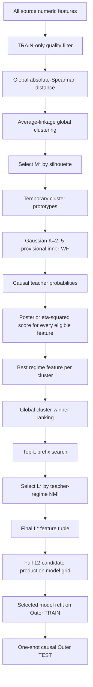
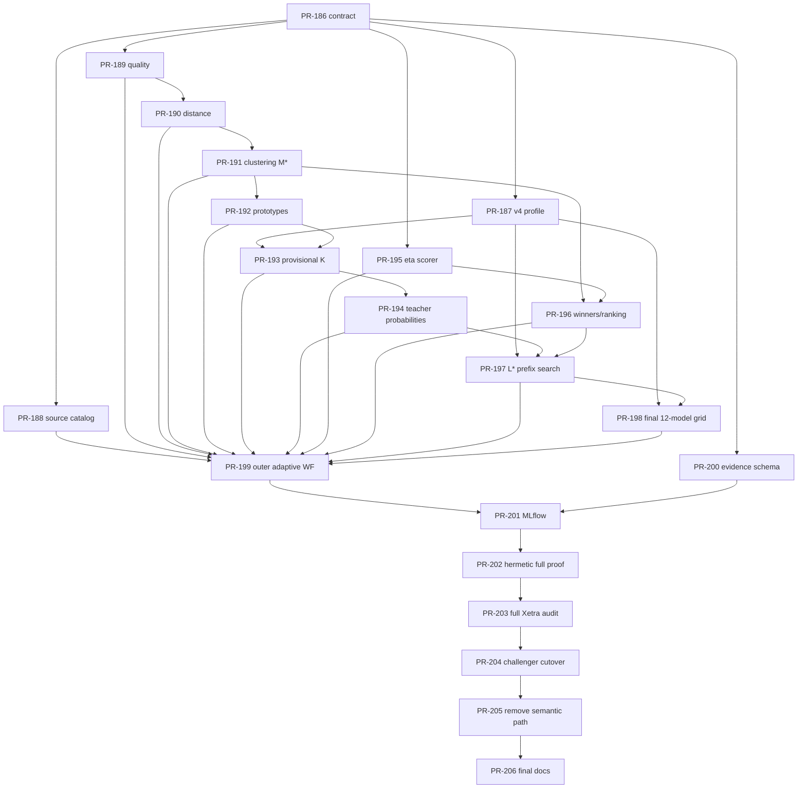

# Regime Engine — Global Regime Discovery Implementation Backlog

Status date: 2026-09-09

This file is the single implementation backlog for the global, non-semantic regime-feature discovery architecture defined by `EVALUATION.md`.

The active implementation target is **Xetra profile configuration version 4**. The existing v1-v3 semantic-medoid implementations are historical compatibility code until the explicit removal PR near the end of this backlog. They must not be extended with new statistical behavior.

---

# 1. Canonical v4 identity

```text
profile_id=xetra
profile_config_version=4
feature_discovery_policy=xetra_global_regime_v4
evaluation_id=global_regime_v4
registered_model=regime-xetra
production_alias=champion
challenger_alias=challenger
```

The v4 statistical selection path has **no semantic groups**. All eligible numeric Gold features are pooled globally. Semantic labels, if retained anywhere for display, are metadata only and may not influence quality filtering, redundancy clustering, cluster count, feature score, feature rank, final feature count, model family, state count, or champion selection.

The canonical pipeline is:



Canonical quantities:

```text
N  = eligible raw feature count
M* = selected global redundancy-cluster count
L* = selected final regime-feature count
K* = selected hidden-state count of the final model
```

`M*`, `L*`, and `K*` solve different problems and must never be conflated.

---

# 2. Statistical constants to be pinned by PR-186

PR-186 must make the following values authoritative in `EVALUATION.md` and the v4 profile contract. Later agents may not invent alternatives.

| Setting | Canonical v4 value |
|---|---|
| feature-universe mode | all numeric feature columns from the validated Gold source table, excluding `timestamp_m1` |
| minimum feature coverage on Outer TRAIN | `0.90` |
| minimum non-zero population variance | `1.0e-12` |
| minimum pairwise complete observations | `504` |
| redundancy measure | absolute Spearman rank correlation |
| distance | `1 - abs(spearman)` |
| clustering | deterministic agglomerative average linkage on the precomputed distance matrix |
| candidate cluster-count minimum | `2` |
| candidate cluster-count maximum | `min(25, N - 1)` |
| cluster-quality metric | mean silhouette from the same precomputed distance matrix |
| silhouette singleton convention | singleton sample silhouette = `0.0` |
| silhouette numeric tie tolerance | anchored absolute `1.0e-12` |
| cluster-count tie-break | smaller `M` |
| minimum accepted best silhouette | strictly greater than `0.0` |
| temporary prototype | within-cluster correlation medoid, initialization only |
| provisional model family | Gaussian HMM only |
| provisional candidate state counts | `2,3,4,5` |
| inner minimum TRAIN source observations | `756` |
| inner TEST source observations | `63` |
| inner step source observations | `63` |
| inner partial final TEST | forbidden |
| inner minimum model TRAIN observations | `504` |
| inner minimum model TEST observations | `42` |
| feature regime score | posterior-weighted `eta_squared` from `EVALUATION.md` |
| minimum feature-score coverage of teacher timestamps | `0.90` |
| minimum feature-score observation count | `126` |
| feature-score numeric tie tolerance | anchored absolute `1.0e-12` |
| minimum prefix length | `2` |
| prefix model family | Gaussian HMM only |
| prefix candidate state counts | `2,3,4,5` |
| prefix selection target | dominant-state NMI to the common causal teacher regime sequence |
| minimum shared teacher OOS support | `0.90` |
| prefix NMI numeric tie tolerance | anchored absolute `1.0e-12` |
| cross-`L` tie-breaks | higher shared timestamp count, then smaller `L` |
| raw HMM likelihood across different `L` | forbidden as a cross-`L` ranking metric |
| final candidate universe | Gaussian K2-K5, GMM-HMM M2 K2-K5, Student-t K2-K5 |
| outer WF | existing canonical expanding `1260/63/63`, no partial final TEST |
| outer-fold state identity | fold-local unless/until a separate invariant production-alignment contract is applied |

For a feature with missing values on some teacher timestamps, all quantities entering its `eta_squared` score — state weights, state means, overall mean, within-state variances, between variance and within variance — are computed on the **same feature-specific finite support**. This is required for internal mathematical consistency.

---

# 3. Weak-agent execution rules

Every implementation PR below is intentionally atomic. Agents must treat the following as hard rules:

1. Start from clean, current `main`; stop if any listed dependency is not merged.
2. Use exactly branch `pr/PR-<id>-<slug>`.
3. Edit only the files listed under **Allowed**. If another file is required, stop and report the dependency/scope defect instead of expanding scope.
4. Do not edit `BACKLOG.md`.
5. Do not reinterpret constants from section 2 or statistical semantics from `EVALUATION.md`.
6. Do not add semantic-group decisions, portfolio/economic targets, Optuna subset search, smoothed-state scoring, or outer-TEST feedback.
7. Do not duplicate HMM fitting/filtering logic that already exists; reuse existing adapters, multistart, causal filtering, diagnostics and selection where the contract says to reuse them.
8. New randomized behavior is forbidden unless explicitly specified. Output ordering must be canonical and completion-order independent.
9. Every numerical algorithm must ship an independent deterministic mathematical reference test, not only a test that calls the implementation twice.
10. Every PR must complete the universal final QA below before merge.

## Universal final QA for every PR

Each PR body must contain the exact commands executed, exit codes, and the relevant proof artifact/test names.

```text
QA-0  git status --short
      git branch --show-current

QA-1  uv sync --frozen --python 3.14.7

QA-2  uv run ruff check .
      uv run ruff format --check .
      uv run mypy

QA-3  targeted unit/integration tests named in the PR

QA-4  mathematical proof test:
      an independently calculated deterministic fixture must reproduce
      the implementation result within the tolerance pinned by the PR

QA-5  affected-path full computation:
      execute the complete algorithm introduced by the PR on a deterministic,
      non-trivial fixture; mocks may replace external I/O only, not the
      mathematical computation under test

QA-6  full hermetic repository gate:
      uv run pytest -m "not external" --cov=market_regime_engine
          --cov-report=term-missing --cov-fail-under=90

QA-7  deterministic rerun:
      repeat the PR's full-computation fixture twice and require identical
      canonical result bytes/hashes

QA-8  git status --short
      git branch --show-current
```

A PR is not accepted because unit tests pass if its required mathematical proof or full-computation QA is absent.

---

# 4. New atomic implementation PRs

## PR-186 — Pin the v4 global-discovery statistical contract

- **Branch:** `pr/PR-186-pin-global-regime-v4-contract`
- **Depends on:** none
- **Allowed:** `EVALUATION.md`, `src/market_regime_engine/feature_discovery/__init__.py`, `src/market_regime_engine/feature_discovery/contracts.py`, `tests/unit/feature_discovery/test_contracts.py`

### Purpose

Turn the architecture already documented in `EVALUATION.md` into a fail-closed v4 contract that later weak agents can implement without choosing statistical semantics.

### Acceptance

- [ ] Add immutable contracts for quality-filter result, distance-matrix result, cluster solution, prototype set, provisional teacher reference, feature regime score, cluster winner, ranked winner set, prefix-search result, final selected configuration and outer-fold result.
- [ ] Pin every constant in section 2 exactly.
- [ ] Pin global average-linkage clustering; no semantic block or semantic-group field participates in any v4 selection contract.
- [ ] Pin feature-specific finite-support semantics for `eta_squared`.
- [ ] Resolve the cross-dimension likelihood ambiguity: raw HMM PLL/BIC/AIC may rank models only when they see the same feature vector; they are forbidden for ranking different prefix lengths `L`.
- [ ] Pin cross-`L` selection to label-invariant dominant-state NMI against the common causal provisional teacher, then shared timestamp count, then smaller `L`.
- [ ] Pin outer-fold state labels as fold-local evaluation identities; no claim that state index `k` has the same meaning in another outer fold.
- [ ] All hashes use canonical JSON plus SHA-256 and reject NaN/Inf.
- [ ] Contract module imports no MLflow, PostgreSQL or HMM backend.

### PR-specific QA

- [ ] Serialization proof: two logically identical contract instances built from differently ordered input dictionaries produce byte-identical canonical JSON/hash.
- [ ] Fail-closed tests reject semantic-group decision fields, nonfinite metrics, duplicate features, invalid `M/L/K`, and a prefix result whose selected features are not an exact ranked prefix.
- [ ] Full-computation QA constructs one complete synthetic `OuterFoldResult` object covering `N`, `M*`, teacher, all scores, winners, `L*`, final candidate and OOS evidence and round-trips it without information loss.

---

## PR-187 — Add the Xetra v4 profile schema and exact config

- **Branch:** `pr/PR-187-xetra-v4-profile`
- **Depends on:** PR-186
- **Allowed:** `configs/profiles/xetra_v4.yaml`, `src/market_regime_engine/profiles/config.py`, `src/market_regime_engine/profiles/resolution.py`, `tests/unit/profiles/test_xetra_v4_profile.py`, `tests/unit/profiles/test_resolution.py`

### Purpose

Make all v4 statistical constants loadable from one exact profile without extending the v1-v3 semantic policy.

### Acceptance

- [ ] Add `profile_config_version: 4` and `feature_discovery_policy: xetra_global_regime_v4`.
- [ ] v4 profile contains no semantic-block policy reference and no static final feature tuple.
- [ ] Feature universe mode is exactly `all_numeric_source_features`.
- [ ] All section-2 constants are represented explicitly; no hidden defaults.
- [ ] Final model universe is exactly the existing 12 v3 family/K candidates.
- [ ] v1-v3 profiles remain loadable and behavior-identical until PR-205.
- [ ] Unknown v4 keys, omitted required keys, changed candidate order, changed clustering method, or semantic selection keys fail validation.
- [ ] Resolution can represent a fold-selected final feature tuple without requiring a semantic feature-selection hash.

### PR-specific QA

- [ ] Golden-config test asserts every v4 field and exact candidate order.
- [ ] Mutation test changes each pinned v4 constant one at a time and proves validation or profile hash changes deterministically.
- [ ] Full-computation QA loads v1, v2, v3 and v4 in one process and proves v4 is isolated from legacy semantic-policy state.

---

## PR-188 — Discover the complete numeric Gold feature catalog

- **Branch:** `pr/PR-188-source-feature-catalog`
- **Depends on:** PR-186
- **Allowed:** `DATA_SOURCE.md`, `src/market_regime_engine/features/ports.py`, `src/market_regime_engine/features/postgres_source.py`, `tests/unit/features/test_feature_catalog.py`, `tests/integration/features/test_postgres_feature_catalog.py`

### Purpose

Allow future Gold features to enter v4 automatically without adding them to semantic groups or a hand-maintained selection YAML.

### Acceptance

- [ ] Add a read-only feature-catalog operation inside the same `REPEATABLE READ READ ONLY` source snapshot as lineage/rows.
- [ ] Catalog includes every source-table `DOUBLE PRECISION` feature column in PostgreSQL ordinal order and excludes only `timestamp_m1`.
- [ ] Non-feature/system columns or unsupported numeric types fail closed unless explicitly added to the source contract in a future version.
- [ ] Persist exact ordered feature names, PostgreSQL types, source `schema_version`, `feature_version`, `source_build_id`, and catalog SHA-256.
- [ ] No feature-name allowlist, prefix rule, semantic group, or economic category is used.
- [ ] A newly added valid Gold feature column appears automatically on the next compatible source build.
- [ ] Existing exact-column resolved-model reads remain unchanged.
- [ ] No database mutation and no long-lived transaction during model work.

### PR-specific QA

- [ ] Hermetic PostgreSQL-shaped integration fixture adds one new `DOUBLE PRECISION` column and proves it appears exactly once at the correct ordinal position without code/config changes.
- [ ] Fixture with an unsupported source column type fails before evaluation.
- [ ] Full-computation QA reads catalog + bounded rows + lineage in one snapshot and proves catalog/build/hash consistency under a simulated concurrent post-snapshot schema change.

---

## PR-189 — Implement the pure TRAIN-only quality filter

- **Branch:** `pr/PR-189-global-feature-quality-filter`
- **Depends on:** PR-186
- **Allowed:** `src/market_regime_engine/feature_discovery/quality.py`, `tests/unit/feature_discovery/test_quality.py`

### Purpose

Determine `N`, the exact ordered usable feature universe, without using HMM output or economic targets.

### Acceptance

- [ ] Coverage denominator is the number of Outer-TRAIN source rows.
- [ ] Eligibility requires coverage `>=0.90`.
- [ ] Population variance uses `ddof=0` and must be strictly greater than `1e-12`.
- [ ] Non-null NaN/Inf fails the feature; no fill/interpolation/carry.
- [ ] Output order is exact source-catalog order.
- [ ] Persist per-feature row count, finite count, coverage, population variance, eligibility and rejection reason.
- [ ] Require at least three eligible features or invalidate the outer fold.
- [ ] Changing any row after Outer TRAIN cannot change the result.

### PR-specific QA

- [ ] Hand fixture proves `9/10 = 0.90` passes while `8/10 = 0.80` fails.
- [ ] Independent NumPy reference proves population variance and boundary handling.
- [ ] Full-computation QA evaluates a mixed 50-feature fixture containing valid, sparse, constant, NaN, Inf and near-zero-variance columns and checks every decision/reason.

---

## PR-190 — Implement the global absolute-Spearman distance matrix

- **Branch:** `pr/PR-190-global-spearman-distance`
- **Depends on:** PR-189
- **Allowed:** `src/market_regime_engine/feature_discovery/distance.py`, `tests/unit/feature_discovery/test_distance.py`

### Purpose

Create one global redundancy matrix over all eligible features.

### Acceptance

- [ ] For every feature pair use only finite pairwise-complete Outer-TRAIN observations.
- [ ] Require at least `504` pairwise-complete observations; otherwise invalidate the matrix explicitly.
- [ ] Spearman ranks use average ranks for ties.
- [ ] Distance is exactly `1 - abs(rho_spearman)`.
- [ ] Matrix is symmetric, diagonal exactly zero, finite, and bounded in `[0,1]` within `1e-12`.
- [ ] Persist pairwise support-count matrix and deterministic matrix hash.
- [ ] Perfect positive and perfect negative monotonic relations both have zero distance.
- [ ] Feature order is exact quality-filter order; semantic labels are absent from computation.

### PR-specific QA

- [ ] Independent proof ranks a tied small sample manually, computes Pearson correlation of the ranks, and matches the implementation to `1e-12`.
- [ ] Row permutation leaves the complete matrix unchanged.
- [ ] Full-computation QA computes the complete matrix for a deterministic 100-feature fixture and independently recomputes every pair through a slow reference implementation.

---

## PR-191 — Implement deterministic global clustering and select M*

- **Branch:** `pr/PR-191-global-clustering-mstar`
- **Depends on:** PR-190
- **Allowed:** `src/market_regime_engine/feature_discovery/clustering.py`, `tests/unit/feature_discovery/test_clustering.py`

### Purpose

Determine the number and membership of statistically distinct redundancy clusters without semantic constraints.

### Acceptance

- [ ] Build one deterministic agglomerative average-linkage hierarchy from the precomputed distance matrix.
- [ ] Evaluate every `M` from `2` through `min(25, N-1)`.
- [ ] Compute mean silhouette from the same precomputed distance matrix; singleton sample silhouette is exactly `0.0`.
- [ ] Select the globally best silhouette anchor; candidates within anchored `1e-12` are tied and the smaller `M` wins.
- [ ] Best silhouette must be strictly greater than zero or the fold is invalid.
- [ ] Canonicalize cluster IDs by the lexicographically smallest member feature in each cluster, then assign `cluster_000`, `cluster_001`, ...
- [ ] Persist full silhouette curve, cluster membership for every candidate `M`, selected `M*`, cluster sizes, singleton count and hashes.
- [ ] Input-order or thread-completion order cannot change canonical membership bytes.

### PR-specific QA

- [ ] Mathematical proof fixture uses a small explicit distance matrix whose silhouette values are independently calculated sample by sample.
- [ ] Tie fixture proves anchored tolerance and smaller-`M` rule.
- [ ] Full-computation QA clusters a deterministic 100-feature matrix across the entire candidate `M` range and repeats twice with byte-identical result/hash.

---

## PR-192 — Select temporary cluster prototypes only for teacher initialization

- **Branch:** `pr/PR-192-temporary-cluster-prototypes`
- **Depends on:** PR-191
- **Allowed:** `src/market_regime_engine/feature_discovery/prototypes.py`, `tests/unit/feature_discovery/test_prototypes.py`

### Purpose

Compress the selected `M*` clusters to one neutral actual feature each for the provisional HMM, without treating the prototype as a final feature winner.

### Acceptance

- [ ] Prototype is the cluster member with the smallest mean distance to all other members of the same cluster.
- [ ] Singleton cluster prototype is its only feature.
- [ ] Numeric ties within anchored `1e-12` use canonical feature order.
- [ ] Output order is canonical cluster order.
- [ ] Prototype evidence stores all candidate mean distances and tie chain.
- [ ] No HMM result, `eta_squared`, semantic group, or economic metric may influence prototype selection.
- [ ] Contract explicitly marks prototypes as temporary/non-production.

### PR-specific QA

- [ ] Independent arithmetic fixture computes all within-cluster mean distances by hand/reference code.
- [ ] A fixture where the medoid is intentionally not the later regime-score winner proves no final-selection semantics leak into this PR.
- [ ] Full-computation QA selects prototypes for the complete output of PR-191's 100-feature fixture.

---

## PR-193 — Implement the provisional Gaussian inner walk-forward selector

- **Branch:** `pr/PR-193-provisional-gaussian-k-selector`
- **Depends on:** PR-187, PR-192
- **Allowed:** `src/market_regime_engine/evaluations/provisional_teacher.py`, `tests/unit/evaluations/test_provisional_teacher.py`, `tests/integration/evaluations/test_provisional_teacher_compute.py`

### Purpose

Choose a provisional Gaussian state count on temporary prototypes using causal evidence entirely inside the current Outer TRAIN.

### Acceptance

- [ ] Build exact inner expanding plan `756/63/63`, no partial final test.
- [ ] Evaluate Gaussian HMM only with `K=2,3,4,5`.
- [ ] Reuse existing train-only scaler, deterministic multistart, causal filtering, TRAIN-likelihood parity, occupancy/covariance gates and common-support ranking.
- [ ] All K candidates see identical prototype order and identical inner folds.
- [ ] Select provisional K using the current same-feature candidate ranking discipline; OOS PLL is valid here because observed feature vector is identical across K.
- [ ] Persist all valid/invalid inner folds and the exact selection chain.
- [ ] No GMM, Student-t, final model registration, MLflow alias mutation or Outer TEST access.
- [ ] Provisional K is explicitly non-binding for the final model.

### PR-specific QA

- [ ] Injected deterministic candidate evidence proves every ranking/tie stage exactly.
- [ ] Forward-likelihood reference test independently recomputes a small Gaussian-HMM OOS continuation.
- [ ] Full-computation QA fits all four K values on one deterministic multi-regime synthetic prototype matrix without mocked HMM mathematics.

---

## PR-194 — Build the causal provisional teacher probability reference

- **Branch:** `pr/PR-194-causal-teacher-probabilities`
- **Depends on:** PR-193
- **Allowed:** `src/market_regime_engine/evaluations/teacher_probabilities.py`, `tests/unit/evaluations/test_teacher_probabilities.py`

### Purpose

Produce one common causal OOS regime target against which every eligible raw feature will be scored.

### Acceptance

- [ ] Collect only filtered probabilities from valid inner TEST observations of the selected provisional K.
- [ ] Never use smoothed probabilities, full-sample posteriors or Viterbi labels as the scoring weights.
- [ ] Preserve exact timestamp order; no duplicate timestamp and no interpolation across gaps.
- [ ] Each probability row is finite, non-negative and sums to one within `1e-10`.
- [ ] Persist timestamp count, valid inner fold IDs, K, candidate ID, source build, inner plan hash and teacher-reference SHA-256.
- [ ] Teacher dominant-state sequence is derived only as `argmax` metadata for later NMI; soft probabilities remain canonical for feature scoring.
- [ ] Future data beyond Outer TRAIN cannot change teacher bytes.

### PR-specific QA

- [ ] Independent two-state forward-recursion fixture computes every filtered probability step from explicit transition/emission values.
- [ ] Mutation test changes all rows after Outer TRAIN and requires byte-identical teacher evidence.
- [ ] Full-computation QA concatenates every valid inner fold from PR-193's synthetic run and verifies normalization, ordering and exact fold support.

---

## PR-195 — Implement posterior-weighted eta-squared scoring for every eligible feature

- **Branch:** `pr/PR-195-all-feature-regime-score`
- **Depends on:** PR-186
- **Allowed:** `src/market_regime_engine/feature_discovery/scoring.py`, `tests/unit/feature_discovery/test_scoring.py`

### Purpose

Provide the core regime-discrimination score for every raw eligible feature against a supplied common teacher probability matrix.

### Acceptance

- [ ] Score support for feature `j` is exactly teacher timestamps where feature `j` is finite.
- [ ] Recompute state weights, state means, overall mean and state variances on that same feature-specific support.
- [ ] Weighted state variance uses population normalization by the sum of state weights on support.
- [ ] `between_variance`, `within_variance`, and `eta_squared = between/(between+within)` are persisted.
- [ ] Require score coverage `>=0.90` and observation count `>=126`; otherwise score is ineligible with explicit reason.
- [ ] Eligible `eta_squared` is finite and in `[0,1]` within `1e-12`.
- [ ] Zero/near-zero score denominator fails closed rather than fabricating zero.
- [ ] Persist per-state effective weights, means, variances, support counts and formula inputs sufficient to independently recompute the score.
- [ ] No HMM is fitted in this module.

### PR-specific QA

- [ ] Independent small numeric fixture calculates every state weight/mean/variance and final score from primitive sums and matches to `1e-12`.
- [ ] State-label permutation leaves `eta_squared` unchanged.
- [ ] Duplicating every observation with identical teacher weights leaves the score unchanged.
- [ ] Full-computation QA scores an independent deterministic 100-feature fixture against a non-trivial synthetic 3-state teacher matrix.

---

## PR-196 — Select and globally rank the regime winner from each cluster

- **Branch:** `pr/PR-196-cluster-regime-winners`
- **Depends on:** PR-191, PR-195
- **Allowed:** `src/market_regime_engine/feature_discovery/winners.py`, `tests/unit/feature_discovery/test_winners.py`

### Purpose

Replace the temporary medoid with the feature that best discriminates the common provisional regimes, then produce one global non-redundant ranking.

### Acceptance

- [ ] Every selected cluster must have at least one eligible scored member or the outer fold is invalid.
- [ ] Cluster winner primary criterion is maximum `eta_squared` using anchored `1e-12` ties.
- [ ] Tie-break 1: higher score coverage.
- [ ] Tie-break 2: higher score observation count.
- [ ] Tie-break 3: canonical feature order.
- [ ] Global ranking of cluster winners uses the same ordered criteria.
- [ ] Exactly one winner per selected cluster; no duplicate feature and exactly `M*` ranked winners.
- [ ] Temporary prototype identity has no privileged tie-break or score bonus.
- [ ] Persist full candidate/tie evidence for every cluster.

### PR-specific QA

- [ ] Adversarial fixture makes the temporary prototype score lower than a non-prototype member and requires the non-prototype to win.
- [ ] Anchored three-value `0 / 0.75e-12 / 1.5e-12` chain proves transitive tie behavior.
- [ ] Full-computation QA selects and ranks winners for all clusters from PR-191 using PR-195's full synthetic score table.

---

## PR-197 — Select optimal final feature count L* with teacher-regime NMI

- **Branch:** `pr/PR-197-prefix-feature-count-search`
- **Depends on:** PR-187, PR-194, PR-196
- **Allowed:** `src/market_regime_engine/feature_discovery/prefix_search.py`, `tests/unit/feature_discovery/test_prefix_search.py`, `tests/integration/feature_discovery/test_prefix_search_compute.py`

### Purpose

Choose how many ranked non-redundant cluster winners are needed without comparing raw likelihoods of different-dimensional observations.

### Acceptance

- [ ] Evaluate exact nested prefixes `Top 2, Top 3, ..., Top M*`; no arbitrary subset search.
- [ ] For each prefix evaluate Gaussian HMM K2-K5 on the canonical inner plan using existing train-only scaler/multistart/filter/gates.
- [ ] Compare each prefix candidate's causal inner-OOS dominant-state sequence to the common teacher dominant-state sequence on exact shared timestamps.
- [ ] Within one prefix, select candidate K by maximum label-invariant NMI; tied NMI uses higher shared timestamp count, then same-feature OOS PLL ranking, then lower K/candidate ID.
- [ ] Prefix is ineligible if shared teacher OOS support is below `0.90`.
- [ ] Across different `L`, primary criterion is maximum NMI with anchored `1e-12` ties, then higher shared timestamp count, then smaller `L`.
- [ ] Raw PLL, BIC and AIC are forbidden as cross-`L` criteria because feature dimension changes.
- [ ] Selected final feature tuple is exactly the first `L*` ranked cluster winners in canonical rank order.
- [ ] Persist every prefix feature tuple, K candidates, support, NMI, within-prefix model evidence and cross-L selection chain.

### PR-specific QA

- [ ] Independent NMI reference computes mutual information and entropies from a hand contingency table and proves invariance under state relabeling.
- [ ] Adversarial fixture makes a larger-L prefix have better raw PLL but lower teacher NMI; smaller/higher-NMI prefix must win.
- [ ] Full-computation QA runs every prefix and every K on a deterministic multi-regime synthetic dataset; no mocked HMM/filter math.

---

## PR-198 — Integrate the full 12-candidate final model grid on L*

- **Branch:** `pr/PR-198-final-v4-model-grid`
- **Depends on:** PR-187, PR-197
- **Allowed:** `src/market_regime_engine/evaluations/final_v4_grid.py`, `src/market_regime_engine/training/candidate_grid.py`, `tests/unit/evaluations/test_final_v4_grid.py`, `tests/integration/evaluations/test_final_v4_grid_compute.py`

### Purpose

Select the final family/K inside Outer TRAIN after feature count and identity are fixed.

### Acceptance

- [ ] Build exactly 12 candidates: Gaussian K2-K5, GMM-HMM M2 K2-K5, Student-t K2-K5.
- [ ] Every candidate sees the exact same ordered `L*` feature tuple and same inner-fold plan.
- [ ] Reuse the existing adapter factory, deterministic multistart, causal filtering, likelihood parity, gates and candidate ranking.
- [ ] OOS PLL/BIC/AIC comparison is allowed because all 12 candidates model the same observed feature vector.
- [ ] Return one final statistical champion or explicit no-champion failure.
- [ ] Provisional K/model family has no preference or tie advantage.
- [ ] No Outer TEST access, final production registration, alias mutation or semantic feature-selection dependency.

### PR-specific QA

- [ ] Candidate identity/order fixture proves exact 12 IDs and fail-closed missing/reordered/extra candidates.
- [ ] Gaussian/GMM/Student-t mathematical likelihood-parity tests remain green.
- [ ] Full-computation QA runs all 12 candidates on one deterministic L* synthetic matrix and independently verifies common-support ranking inputs.

---

## PR-199 — Orchestrate one complete adaptive outer walk-forward evaluation

- **Branch:** `pr/PR-199-global-regime-v4-outer-walk-forward`
- **Depends on:** PR-188, PR-189, PR-190, PR-191, PR-192, PR-193, PR-194, PR-195, PR-196, PR-197, PR-198
- **Allowed:** `src/market_regime_engine/evaluations/global_regime_v4.py`, `tests/unit/evaluations/test_global_regime_v4.py`, `tests/integration/evaluations/test_global_regime_v4_compute.py`

### Purpose

Execute the complete selection policy independently inside every Outer TRAIN and evaluate exactly once on that fold's untouched Outer TEST.

### Acceptance

- [ ] Use canonical outer expanding `1260/63/63`, no partial final TEST.
- [ ] For each outer fold run the complete chain: catalog -> quality -> distance -> clustering/M* -> prototypes -> provisional K -> teacher -> all-feature scores -> cluster winners -> L* -> final 12-candidate grid.
- [ ] Freeze the fold-selected configuration before touching Outer TEST.
- [ ] Refit selected final candidate on all usable Outer-TRAIN rows for the selected L* tuple.
- [ ] Continue causally into Outer TEST exactly once and store OOS PLL/probabilities/diagnostics.
- [ ] Outer TEST cannot affect any selection hash, feature score, M*, L*, model family or K.
- [ ] Feature tuples may differ across outer folds.
- [ ] State indices are explicitly `outer_fold_local`; no cross-fold state-ID continuity is assumed.
- [ ] Aggregate adaptive-policy OOS evidence only with label-invariant or state-label-independent quantities unless a later production-alignment contract says otherwise.
- [ ] A failure in any fold is explicit and never silently replaced by the prior fold's configuration.

### PR-specific QA

- [ ] Future-mutation test changes all data after one outer TEST end and proves every earlier fold byte-identical.
- [ ] Dependency-spy test proves Outer TEST rows are never passed into discovery/selection functions.
- [ ] Full-computation QA executes at least three complete outer folds end-to-end with actual HMM fitting on a deterministic synthetic source.

---

## PR-200 — Extend local evaluation statistics for complete v4 evidence

- **Branch:** `pr/PR-200-global-v4-evidence-schema`
- **Depends on:** PR-186
- **Allowed:** `src/market_regime_engine/evaluation_statistics/contracts.py`, `src/market_regime_engine/evaluation_statistics/writer.py`, `src/market_regime_engine/evaluation_statistics/render.py`, `tests/unit/evaluation_statistics/test_global_v4_statistics.py`

### Purpose

Make every numerical decision independently auditable without relying on MLflow UI state.

### Acceptance

- [ ] Add versioned `global_regime_v4` evidence without weakening existing finite-only/canonical-JSON/hash rules.
- [ ] Represent source catalog, quality evidence, pairwise support, distance hash, full silhouette curve, M*, memberships, prototypes, provisional K evidence, teacher hash, every feature score/formula input, cluster winners, all prefix evaluations, L*, final 12-candidate grid and outer OOS result.
- [ ] Store no raw source rows, credentials, DSNs or model binary payloads.
- [ ] Failed folds/runs retain all evidence available before failure.
- [ ] Finalized JSON is immutable and exact-byte SHA-256 is persisted.
- [ ] Human Markdown rendering contains enough formula inputs to reproduce M*, selected feature scores and L* externally.

### PR-specific QA

- [ ] Golden evidence fixture round-trips all v4 field groups with no loss.
- [ ] NaN/Inf/unknown fields/raw-row-shaped payloads are rejected.
- [ ] Full-computation QA serializes PR-199's three-fold synthetic result and independently recomputes all stored hashes from finalized bytes.

---

## PR-201 — Add MLflow tracking and plots for global v4 discovery

- **Branch:** `pr/PR-201-global-v4-mlflow-tracking`
- **Depends on:** PR-199, PR-200
- **Allowed:** `src/market_regime_engine/mlflow_support/evaluation_tracking.py`, `src/market_regime_engine/evaluations/plots.py`, `PLOT_STYLE.md`, `tests/unit/mlflow_support/test_global_v4_tracking.py`, `tests/unit/evaluations/test_global_v4_plots.py`

### Purpose

Expose why features and models were selected without allowing plots/MLflow metrics to feed back into selection.

### Acceptance

- [ ] One parent v4 run contains outer-fold child runs; each fold exposes quality, clustering, provisional teacher, feature score, prefix search, final grid and outer OOS evidence.
- [ ] Log exact finalized local statistics JSON to the same MLflow run and verify byte/hash parity.
- [ ] Required plots: feature coverage/variance, global distance heatmap metadata view, silhouette-vs-M curve with selected M*, cluster-size plot, feature `eta_squared` ranking with cluster winner markers, prefix-NMI-vs-L curve with L*, final 12-candidate comparison, outer OOS evidence over TEST end timestamps.
- [ ] Temporary prototypes are visually distinct from final cluster winners.
- [ ] No chart ranks cross-L prefixes by raw PLL.
- [ ] All plots are deterministic, publication-quality and satisfy `PLOT_STYLE.md`.
- [ ] Tracking/plot failures fail the run; no best-effort success.
- [ ] Tracking code performs no statistical selection or model fitting.

### PR-specific QA

- [ ] File-backed MLflow integration verifies complete hierarchy, artifacts and hash parity.
- [ ] Plot source-data hashes reproduce identical files on rerun.
- [ ] Full-computation QA tracks PR-199's complete synthetic multi-fold evaluation and validates every expected artifact/run.

---

## PR-202 — Prove the complete v4 pipeline hermetically

- **Branch:** `pr/PR-202-global-v4-hermetic-e2e-proof`
- **Depends on:** PR-201
- **Allowed:** `tests/e2e/test_global_regime_v4_full_compute.py`, `tests/fixtures/global_regime_v4/*`

### Purpose

Provide one deterministic full-computation proof before touching production/source infrastructure.

### Acceptance

- [ ] Fixture contains enough rows for at least three complete outer folds and full inner folds.
- [ ] Fixture contains at least 40 features with known redundant groups, negatively correlated duplicates, tied ranks, sparse-but-eligible values, and at least one temporary prototype that is not its cluster regime winner.
- [ ] Run the complete v4 pipeline without mocking correlation, clustering, HMM fitting, filtering, feature scoring, NMI, final grid or outer OOS computation.
- [ ] Assert exact deterministic `N`, complete silhouette curve, `M*`, memberships, prototypes, teacher K per fold, every feature score, cluster winners, ranked winners, all prefix results, `L*`, final candidate, and OOS hashes against committed golden evidence.
- [ ] Rerun produces byte-identical golden evidence.
- [ ] Future-data mutation leaves earlier fold results unchanged.
- [ ] Semantic labels added/removed/randomized in fixture metadata do not change any selection result.
- [ ] No economic return/portfolio field can enter the pipeline.

### Mathematical proof QA

- [ ] Independent slow reference recomputes **all** pairwise Spearman distances for the first outer fold.
- [ ] Independent silhouette implementation recomputes every candidate-M score.
- [ ] Independent eta-squared implementation recomputes every eligible feature score from persisted teacher probabilities.
- [ ] Independent NMI implementation recomputes every prefix objective.
- [ ] Existing forward-likelihood parity independently verifies selected HMM TRAIN/OOS likelihoods.
- [ ] Every independent reference agrees within the pinned tolerance or the test fails.

---

## PR-203 — Run the complete current-Xetra computation and independent math audit

- **Branch:** `pr/PR-203-xetra-v4-full-compute-audit`
- **Depends on:** PR-202
- **Allowed:** `scripts/run_xetra_v4_full_evaluation.py`, `scripts/verify_xetra_v4_math.py`, `docs/qa/xetra_v4_full_compute.md`, external-test markers/fixtures required only by these scripts

### Purpose

Perform the final non-hermetic proof on the complete current Gold source before any production cutover.

### Acceptance

- [ ] Operator-invoked run uses the validated current PostgreSQL source snapshot, all numeric Gold feature columns, and every complete outer fold.
- [ ] No row downsampling, feature downsampling, reduced candidate-M range, reduced K range, reduced L-prefix range, reduced model-family grid or debug early-stop is permitted.
- [ ] Run executes the complete nested computation from source catalog through outer OOS for all folds.
- [ ] Persist source build/hash, repository SHA, profile hash, runtime versions, complete v4 evidence root and MLflow parent run ID.
- [ ] `verify_xetra_v4_math.py` is a separate implementation path and does not import the production distance, silhouette, scoring or NMI functions being audited.
- [ ] Audit independently recomputes the full first-fold Spearman distance matrix, full silhouette curve, every first-fold eta-squared feature score, every first-fold prefix NMI, and selected-model forward likelihood parity.
- [ ] Audit additionally samples at least three later outer folds and repeats all selected-pair/selected-feature computations for drift detection.
- [ ] All mathematical comparisons use the pinned tolerances and fail closed.
- [ ] Document selected `N`, `M*`, `L*`, final features, final model/K and OOS metrics per outer fold without making causal feature claims.
- [ ] External run remains opt-in and is not added to required hermetic CI.

### Final QA evidence required in the PR

- [ ] Full stdout/stderr command transcript or attached immutable artifact.
- [ ] SHA-256 of final evidence JSON.
- [ ] Independent audit report with every checked formula family and maximum absolute error.
- [ ] Wall-clock runtime and peak-memory observation.
- [ ] Confirmation that the run used the complete source and full search bounds.
- [ ] `merge-gate` remains green after the external proof.

---

## PR-204 — Cut production evaluation/refit to Xetra v4 as challenger-only

- **Branch:** `pr/PR-204-xetra-v4-production-cutover`
- **Depends on:** PR-203
- **Allowed:** `src/market_regime_engine/cli.py`, `src/market_regime_engine/commands/*`, `src/market_regime_engine/training/final_refit.py`, `src/market_regime_engine/models/production_artifact.py`, `scripts/model_cycle.sh`, `tests/unit/commands/*`, `tests/unit/training/test_final_refit.py`

### Purpose

Use the proven v4 fold-selection policy for the next model cycle while protecting the existing production champion.

### Acceptance

- [ ] `evaluate xetra` resolves profile configuration version 4.
- [ ] Final refit uses the final v4 selected feature tuple and final statistical champion from the completed evaluation; it does not rerun feature discovery after the evaluation cutoff.
- [ ] Production artifact stores exact v4 feature-discovery evidence hashes, final feature tuple, model/K, trained-through time and terminal filter state.
- [ ] New model is registered as `challenger` only.
- [ ] `champion` alias is never moved automatically.
- [ ] Explicit operator promotion still requires expected-current-version and non-empty reason.
- [ ] Serving fixed-model latest/replay uses the artifact's exact final features and does not require the historical semantic-selection implementation.
- [ ] Failure anywhere before challenger registration leaves the current champion untouched.

### PR-specific QA

- [ ] Hermetic lifecycle run starts with an existing champion, produces a distinct v4 challenger and proves champion unchanged.
- [ ] Artifact round-trip reproduces selected feature order/hash and terminal causal state.
- [ ] Full-computation QA runs evaluate -> final refit -> register challenger on the PR-202 fixture with real HMM math and file-backed MLflow.

---

## PR-205 — Remove semantic-group feature selection from active code and config

- **Branch:** `pr/PR-205-remove-semantic-selection`
- **Depends on:** PR-204
- **Allowed:** `configs/feature_selection/xetra_semantic_medoid_v1.yaml`, `configs/feature_selection/xetra_semantic_medoid_v2.yaml`, `configs/feature_selection/xetra_semantic_medoid_v3.yaml`, `configs/profiles/xetra_v1.yaml`, `configs/profiles/xetra_v2.yaml`, `configs/profiles/xetra_v3.yaml`, `src/market_regime_engine/feature_selection/__init__.py`, `src/market_regime_engine/feature_selection/contracts.py`, `src/market_regime_engine/feature_selection/freeze.py`, `src/market_regime_engine/feature_selection/selector.py`, `src/market_regime_engine/feature_selection/stability.py`, `src/market_regime_engine/evaluations/delta1_univariate.py`, `src/market_regime_engine/evaluations/medoid_multivariate.py`, `src/market_regime_engine/evaluations/medoid_univariate.py`, `src/market_regime_engine/evaluations/univariate_grid.py`, `src/market_regime_engine/evaluations/__init__.py`, `src/market_regime_engine/profiles/config.py`, `src/market_regime_engine/profiles/resolution.py`, `tests/unit/feature_selection/*`, `tests/unit/evaluations/test_delta1_univariate.py`, `tests/unit/evaluations/test_medoid_multivariate.py`, `tests/unit/evaluations/test_medoid_univariate.py`, `tests/unit/evaluations/test_univariate_grid.py`, directly corresponding legacy profile tests/docs`

### Purpose

Complete the requested removal of semantic groups after v4 has passed hermetic, full-source and challenger proofs.

### Acceptance

- [ ] No active profile references `xetra_semantic_medoid_v1`, `v2` or `v3`.
- [ ] Remove semantic-block YAML selection policies and code used only to execute semantic medoid Stage-1/Stage-2 selection.
- [ ] Remove `medoid_univariate` / `delta1_univariate` orchestration that exists only for the superseded semantic architecture.
- [ ] Keep only compatibility code demonstrably required to deserialize/serve already registered immutable model artifacts; such code must not be callable as a new evaluation path.
- [ ] `rg "semantic_medoid|semantic block|preliminary_medoid|medoid_univariate|delta1_univariate"` across active source/config returns no statistical-selection path; any remaining hit must be historical docs/test fixture or explicit artifact-compatibility code.
- [ ] Xetra v4 full evaluation remains behavior-identical before and after cleanup.
- [ ] Existing champion fixed-model serving/replay smoke remains green.

### PR-specific QA

- [ ] Dead-code/import test proves removed modules cannot be imported through active v4 evaluation.
- [ ] Golden PR-202 full-computation evidence is byte-identical before/after cleanup.
- [ ] Full repository gate plus fixed-model serving/replay integration suite passes.

---

## PR-206 — Final v4 documentation and release-quality QA closure

- **Branch:** `pr/PR-206-global-v4-final-documentation`
- **Depends on:** PR-205
- **Allowed:** `README.md`, `ARCHITECTURE.md`, `DATA_SOURCE.md`, `EVALUATION.md`, `PLOT_STYLE.md`, `OPERATIONS.md`, `API.md`, `docs/regime_evaluations.md`, `docs/qa/xetra_v4_full_compute.md`

### Purpose

Leave one coherent architecture after the semantic path is removed.

### Acceptance

- [ ] All active docs describe global feature catalog -> global redundancy clustering -> M* -> temporary prototype -> causal teacher -> all-feature eta-squared -> cluster winners -> L* by teacher NMI -> final 12-model grid -> outer OOS.
- [ ] No active documentation instructs agents/operators to create or maintain semantic groups.
- [ ] Clearly distinguish statistical regime discrimination from causal influence.
- [ ] Document why cross-L raw PLL is forbidden and why same-feature-vector model PLL comparison remains valid.
- [ ] Document fold-local state identity for adaptive outer evaluation and the exact production artifact behavior.
- [ ] Document full-source QA/audit commands and evidence locations.
- [ ] Mermaid diagrams render successfully and match current code paths.
- [ ] No superseded Wave/addendum text remains in active docs.

### PR-specific QA

- [ ] Documentation link/command smoke.
- [ ] Run PR-202 hermetic full computation unchanged.
- [ ] Re-run PR-203 independent math verifier against the accepted full-source evidence artifact; no new source computation is required if source build/hash is unchanged.
- [ ] Full repository gate passes.

---

# 5. Parallel execution graph



High-value parallel lanes after PR-186:

```text
Lane A: PR-187 -> PR-193 -> PR-194
Lane B: PR-188
Lane C: PR-189 -> PR-190 -> PR-191 -> PR-192
Lane D: PR-195
Lane E: PR-200
```

PR-196 can start as soon as PR-191 and PR-195 merge. PR-197 starts after the teacher and ranking lanes converge. No agent should wait for MLflow/evidence work to implement the pure mathematical kernels.

---

# 6. Program-level definition of done

The v4 redesign is complete only when all of the following are true:

- the source feature universe can grow without adding semantic-group configuration;
- all eligible features are clustered together globally;
- `M*` is data-selected from the full global redundancy structure;
- temporary medoids are used only for provisional teacher initialization;
- every raw eligible feature receives an independently auditable causal regime-separation score;
- one non-redundant regime winner is selected per cluster;
- `L*` is selected without comparing raw likelihoods across different feature dimensions;
- the final family/K grid compares only models with the same final feature vector;
- the complete policy is evaluated through strict outer expanding OOS folds;
- the hermetic full-computation proof and the complete current-Xetra full-source audit both pass;
- every mathematical kernel has an independent reference implementation/proof;
- the first v4 production result is challenger-only;
- the legacy semantic selection path is removed only after those proofs;
- required CI coverage remains at least 90%.

---

# 7. Condensed historical backlog — superseded by PR-186+

The detailed historical PR specifications that previously occupied this file are intentionally condensed here. Their implementation history remains available in Git history and merged PRs, but they are **not instructions for new agents**.

| Historical PR IDs | Condensed purpose | Status for new work |
|---|---|---|
| `PR-001`–`PR-013` | bootstrap, CI/governance, core contracts, PostgreSQL source, preprocessing, model/MLflow ports and app skeleton | historical foundation; reuse code/contracts where still active |
| `PR-014`–`PR-038` | Gaussian HMM, multistart, causal filter, forecasts, alignment, diagnostics, walk-forward, candidate ranking, MLflow/OOS, serving, CLI, containers, E2E/docs and optional challengers | historical foundation; v4 must reuse proven HMM/filter/runtime components rather than duplicate them |
| `PR-039`–`PR-044` | retired planning/documentation IDs | retired; never reuse |
| `PR-045`–`PR-066` | semantic-medoid feature contracts/policies, Stage-1/Stage-2 selection, Xetra v1 profile, feature-selection evidence/stability, production/refit/runtime lifecycle work | semantic selection superseded; production/runtime portions remain reusable |
| `PR-051`–`PR-055` | retired planning/documentation IDs | retired; never reuse |
| `PR-117`–`PR-131` | Xetra v1/v2 corrective work: version-aware candidate sets, anchored ties, invariant alignment coordinate, common-fold ranking, covariance/Student-t correctness, likelihood parity, plotting semantics and explicit promotion | mathematical/model correctness remains reusable; semantic selection is not extended |
| `PR-144`–`PR-155` | first-class v3 multivariate/univariate evaluation contracts, clocks, adapter reuse, agreement, orchestration, MLflow/E2E/docs | superseded as an active evaluation architecture by global v4 |
| `PR-156`–`PR-162` | Xetra v3 61-feature semantic policy/profile, namespaced champion contracts, statistics writer and medoid/delta orchestrators | superseded; removal handled by PR-205 |
| `PR-163`–`PR-168` | v3 model-metrics/EM-history/tracking/plot diagnostics and proof | diagnostic implementation may be reused where model-family-neutral; v3 semantic hierarchy is superseded |

No historical PR ID may be reused for new work. New implementation begins at `PR-186`.

