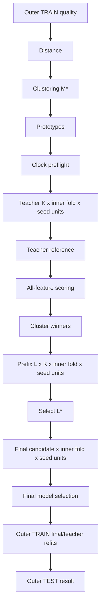

# Backlog Addendum — Dataset-Pinned, Idempotent and Resumable Evaluations

Status date: 2026-09-09

This addendum amends the active `BACKLOG.md` until its requirements are folded into the corresponding implementation PRs. `EVALUATION_EXECUTION.md` is the authoritative execution contract.

The following requirements are mandatory for **all evaluation entry points**. They are not optional operational polish and must land before the complete v4 outer evaluation is considered production-ready.

---

## A. Cross-cutting dependency changes

The following active PRs gain additional requirements:

- `PR-210`: add dataset snapshot/run/work-unit identities and canonical hashes from `EVALUATION_EXECUTION.md`.
- `PR-212`/`PR-213`: dynamic source capture must produce one durable immutable dataset snapshot before statistical work.
- `PR-219`: candidate/fold runner must be callable as deterministic checkpointable work.
- `PR-221`: provisional HMM work must checkpoint by K/inner-fold and, after PR-244, by seed.
- `PR-226`: prefix search must checkpoint every L/K/inner-fold child computation.
- `PR-227`: final grid must checkpoint every model/inner-fold child computation.
- `PR-228`: **add dependencies PR-242, PR-243 and PR-244**. Outer policy must execute through the resumable DAG and must never read live Gold after snapshot finalization.
- `PR-229`: evidence schema must include dataset snapshot key, evaluation run key, work-unit input/payload hashes and resume provenance.
- `PR-230`: MLflow is replayed from durable completed units; tracking outages must not erase statistical progress.
- `PR-231`: forced-crash/resume equivalence is mandatory.
- `PR-232`: full current-Xetra run must support stop/restart without source recapture or loss of completed HMM work.
- `PR-233`: deployment selection is a deterministic resumable work unit bound to the already pinned dataset snapshot.
- `PR-237`: evaluate -> deployment select -> refit -> register challenger is logically idempotent end to end; duplicate model registration is forbidden.
- `PR-241`: document operator resume commands, run keys, snapshot keys and corruption/failure recovery.

---

## B. New prerequisite implementation PRs

### PR-242 — Durable dataset snapshot and evaluation-run store

- **Branch:** `pr/PR-242-evaluation-run-store`
- **Depends on:** PR-210, PR-212, PR-213
- **Allowed:** `src/market_regime_engine/evaluation_runs/__init__.py`, `src/market_regime_engine/evaluation_runs/contracts.py`, `src/market_regime_engine/evaluation_runs/snapshot.py`, `src/market_regime_engine/evaluation_runs/store.py`, `tests/unit/evaluation_runs/test_contracts.py`, `tests/unit/evaluation_runs/test_snapshot.py`, `tests/integration/evaluation_runs/test_store.py`, persistent-volume configuration directly required by these files

### Purpose

Create the smallest durable execution substrate that guarantees immutable dataset pinning and crash-safe work-unit state.

### Acceptance

- [ ] Implement canonical `DatasetSnapshotIdentity`, `EvaluationRunIdentity`, `WorkUnitIdentity` using the fields pinned by `EVALUATION_EXECUTION.md`.
- [ ] `dataset_snapshot_key` includes source dataset/build/data hash, schema/feature versions, data-time semantics, row count, timestamp bounds and source catalog hash.
- [ ] `evaluation_run_key` includes dataset key, evaluation/profile/plan/cutoff identity, repository commit SHA, `uv.lock` SHA-256 and Python version.
- [ ] Capture exact ordered source rows once and persist them as an immutable **PyArrow IPC** snapshot under a durable state root before model computation.
- [ ] Snapshot manifest stores Arrow-file SHA-256, exact Arrow schema, row count, first/last timestamp and dataset snapshot key.
- [ ] Snapshot creation is temp-write -> flush/fsync -> atomic rename; an incomplete temp file is never a valid snapshot.
- [ ] Restart validates manifest and file hash before returning rows.
- [ ] Missing/corrupt snapshot fails closed and never rereads current live Gold under the old run key.
- [ ] Implement a transactional SQLite run ledger using Python stdlib `sqlite3`; no new external service is required.
- [ ] SQLite schema has immutable run identity plus `(run_key, work_unit_key)` uniqueness, input hash, status, payload bytes/hash, attempt count and lease metadata.
- [ ] Work-unit statuses are exactly `PENDING`, `RUNNING`, `COMPLETE`, `DOMAIN_INVALID`.
- [ ] `COMPLETE` and `DOMAIN_INVALID` are immutable terminal outcomes.
- [ ] Unit completion writes canonical payload bytes/hash and terminal state in one transaction.
- [ ] Claims use atomic compare-and-set; only one active owner can hold one unit.
- [ ] Expired `RUNNING` leases are reclaimable; completion itself never expires.
- [ ] A second completion with a different payload hash is a hard integrity failure.
- [ ] Operational timestamps/lease owner are excluded from statistical hashes.
- [ ] State root must be explicitly configured on a persistent mounted volume in deployment; ephemeral container paths fail startup for resumable production evaluation.

### QA

- [ ] Independent canonical-JSON/hash oracle for dataset/run/unit identities.
- [ ] Exact Arrow snapshot round trip for timestamps, NULLs and Float64 bit patterns.
- [ ] Source mutation after snapshot creation cannot affect rows returned by restart.
- [ ] Corrupt one snapshot byte and prove restart fails rather than rereads source.
- [ ] Kill process after payload write but before ledger commit; restart safely recomputes only that unit.
- [ ] Kill process after ledger commit; restart reuses unit and performs zero computation.
- [ ] Two concurrent claimers cannot own the same unit.
- [ ] Stale lease reclaim test.
- [ ] `DOMAIN_INVALID` remains terminal across repeated invocations.
- [ ] SQLite transaction/crash test leaves no false `COMPLETE` unit.

---

### PR-243 — Deterministic resumable evaluation DAG executor

- **Branch:** `pr/PR-243-resumable-evaluation-dag`
- **Depends on:** PR-242
- **Allowed:** `src/market_regime_engine/evaluation_runs/executor.py`, `src/market_regime_engine/evaluation_runs/graph.py`, `tests/unit/evaluation_runs/test_graph.py`, `tests/integration/evaluation_runs/test_executor.py`

### Purpose

Provide one generic executor that reconstructs the expected deterministic work graph and executes only missing/reclaimable units.

### Acceptance

- [ ] Work graph is deterministic from `EvaluationRunIdentity`; mapping order, filesystem order, thread completion and MLflow IDs cannot change keys.
- [ ] Every unit has a canonical structural key and `work_unit_input_hash` over run key, coordinates, exact parent payload hashes and unit parameters.
- [ ] `COMPLETE` + matching input/payload hash is reused without invoking compute function.
- [ ] `DOMAIN_INVALID` + matching input hash is reused as terminal invalid evidence.
- [ ] Completed unit with changed input hash fails closed; it is never overwritten.
- [ ] Stale `RUNNING` unit is reclaimed after lease expiry.
- [ ] Failed technical attempt records operational failure metadata but leaves statistical unit reclaimable.
- [ ] Executor supports deterministic child units for outer fold, inner fold, prefix L, candidate ID and seed coordinates.
- [ ] Final run is marked complete only after every required unit is terminal and root evidence hash is committed.
- [ ] Invoking a completed run performs zero compute callbacks and returns the same root evidence hash.
- [ ] Concurrent duplicate invocation cannot create two logical runs or contradictory unit outputs.
- [ ] No dependency on MLflow.

### QA

- [ ] Synthetic DAG with >=100 units, random executor interruption points and repeated restarts completes with each logical unit committed exactly once.
- [ ] Uninterrupted vs interrupted/resumed root payload is byte-identical.
- [ ] Parent payload mutation under same child key is detected.
- [ ] Executor restart with changed repository/profile/plan/dataset identity refuses old run and creates/requires a distinct run key.
- [ ] Concurrency stress test with two executors produces one consistent ledger.

---

### PR-244 — Seed-level resumable HMM multistart

- **Branch:** `pr/PR-244-resumable-multistart-seeds`
- **Depends on:** PR-219, PR-242, PR-243
- **Allowed:** `src/market_regime_engine/training/multistart.py`, `src/market_regime_engine/evaluation_runs/hmm_units.py`, `tests/unit/training/test_multistart.py`, `tests/integration/evaluation_runs/test_resumable_multistart.py`

### Purpose

Avoid losing completed expensive HMM fits when interruption occurs inside an eight-seed multistart candidate/fold evaluation.

### Acceptance

- [ ] Existing `run_multistart` numerical/statistical behavior remains byte/metric compatible when no checkpoint context is supplied.
- [ ] Resumable path creates deterministic child unit per `(candidate, fold, seed)`.
- [ ] Completed seed fit persists all downstream-required fitted artifact/likelihood/convergence evidence with canonical payload hash.
- [ ] Restart executes only missing/reclaimable seeds; completed seeds are never refit.
- [ ] Winner selection occurs only after all eight seed units are terminal and uses the existing deterministic multistart winner rule unchanged.
- [ ] Deterministic failed/invalid seed outcome is cached; infrastructure interruption is retryable.
- [ ] Seed scheduling/completion order cannot change winner/evidence.
- [ ] Different data/profile/candidate/fold/code identity yields different child input hashes and cannot reuse an old fit.

### QA

- [ ] Interrupt after seeds 1, 3 and 6; restart proves exactly the remaining seeds fit and final winner equals uninterrupted golden run.
- [ ] Run two workers on the same candidate/fold and prove no seed is committed twice with conflicting bytes.
- [ ] Existing Gaussian/GMM/Student-t multistart golden evidence remains unchanged.
- [ ] Independent fit/filter likelihood parity remains green for reused and newly computed seed artifacts.

---

## C. Required resume granularity in v4 orchestration

After PR-244, the minimum durable graph for one outer fold is:

A process restart may recompute a currently interrupted individual seed fit, but it must not recompute any already completed seed, candidate/fold result, prefix, outer-fold stage, or prior outer fold.

---

## D. Program-level acceptance added to BACKLOG definition of done

V4 is not complete until:

- every evaluation exposes exact `dataset_snapshot_key` and `evaluation_run_key`;
- exact source rows are durably persisted before statistical work and survive restart;
- no resume path rereads a newer live Gold table under an old run identity;
- same completed run key is a statistical no-op;
- all expensive HMM multistart work is resumable at seed granularity;
- interrupted and uninterrupted hermetic runs have identical final evidence bytes;
- current-Xetra full evaluation can be intentionally terminated and resumed multiple times without changing dataset/result or redoing completed expensive units;
- MLflow outage/restart cannot erase statistical progress;
- recurring challenger lifecycle is idempotent through registration and cannot create duplicate model versions for one already-registered artifact hash.