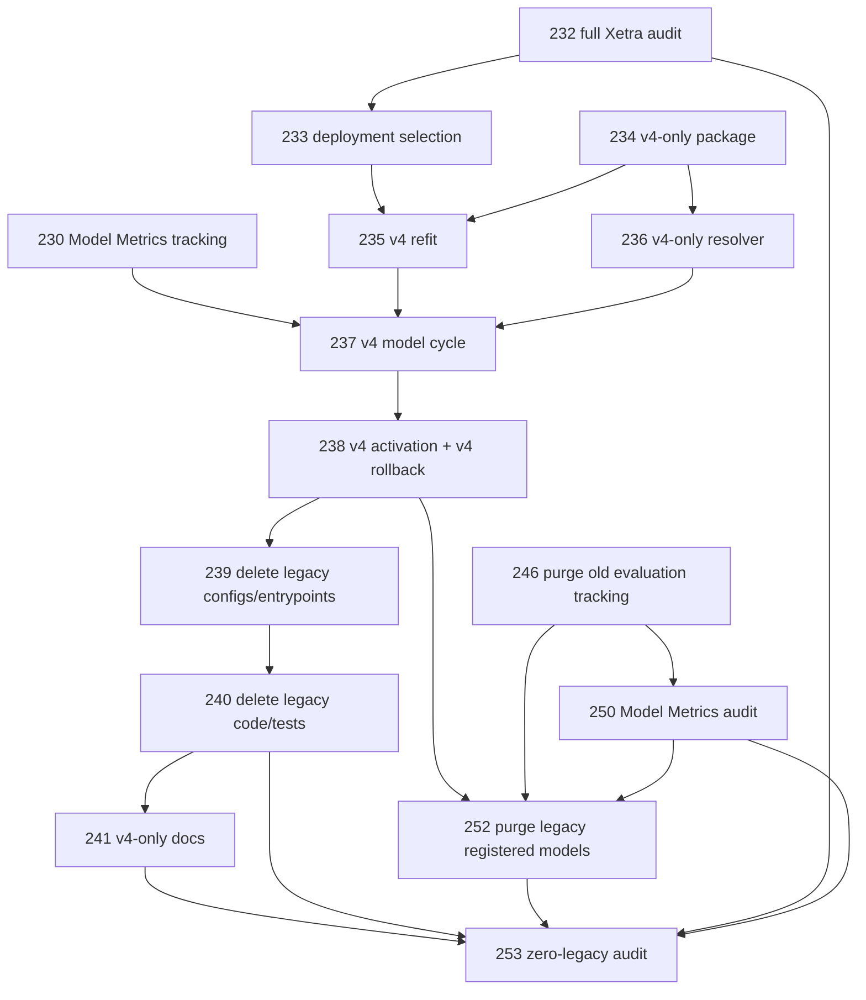

# Regime Engine — Zero-Legacy Backlog Addendum

Status date: 2026-09-09

This addendum is mandatory and overrides every earlier backlog acceptance item that requires backward compatibility with Xetra v1-v3, legacy semantic-medoid evaluations, old production-package bytes, old profile resolution, or rollback to legacy model versions.

Read with `BACKLOG.md`, `BACKLOG_EXECUTION_ADDENDUM.md`, `BACKLOG_MLFLOW_MODEL_METRICS_ADDENDUM.md`, `LEGACY_REMOVAL.md`, `EVALUATION.md`, `EVALUATION_EXECUTION.md`, and `MLFLOW_MODEL_METRICS.md`.

## A. Cross-cutting rule

No implementation PR may add or preserve code solely to support legacy behavior. If an existing acceptance item says “preserve v1-v3 behavior”, “legacy package remains loadable”, “rollback to legacy remains functional”, or equivalent, this addendum replaces it with the v4-only requirement below.

Generic HMM/filter/math code may be reused if v4 actively uses it. Compatibility branches, legacy schemas, old CLI surfaces, old fixtures and old serialization tests are not reusable requirements.

## B. Amendments to existing active PRs

### PR-211 — v4 profile only

Replace all backward-compatibility acceptance with:

- [ ] `xetra_v4.yaml` is the only active Xetra evaluation profile after cutover.
- [ ] New profile/config contracts do not include semantic-block fields or dual legacy/v4 modes.
- [ ] Do not add tests that require v1-v3 profile loading to remain behavior-identical.
- [ ] Any shared profile parser refactor must be driven only by the v4 contract.
- [ ] Legacy profile files are removed by PR-239; no new dependency may be introduced on them.

### PR-219 — v4 walk-forward protocol only

Replace “preserve v1-v3 behavior” requirements with:

- [ ] Reuse only generic numerical runner behavior required by v4.
- [ ] Remove version branches, medoid cardinality assumptions and compatibility adapters from touched code when they are not required by v4.
- [ ] Tests compare v4 numerical behavior to independent mathematical evidence, not to legacy golden objects.
- [ ] No legacy candidate protocol is a supported public contract after PR-240.

### PR-220 — same-feature ranking without legacy API preservation

- [ ] Extract one v4/generic same-feature ranking kernel.
- [ ] Legacy wrapper retention is not required; if a wrapper exists only for removed evaluations, delete it in PR-240.
- [ ] Golden QA must verify mathematical/ranking invariants rather than old serialized return shapes.

### PR-234 — replace “production package v2 with legacy loads” by one v4-only package

PR-234 is now **v4 production package only**.

Acceptance:

- [ ] Define exactly one supported production artifact/package schema used by v4.
- [ ] Remove/avoid any v1 package parser, version-dispatch compatibility reader, legacy serializer or old-byte fixture.
- [ ] Package contains the v4 validation cutoff, deployment cutoff, evidence hashes, catalog hash, discovery hash and model-version-local state scope.
- [ ] Unsupported schema versions fail before payload decoding beyond minimal version identification.
- [ ] No test requires old package bytes to load.
- [ ] Package round trip is proven for Gaussian, GMM-HMM and Student-t v4 models only.

QA:

- [ ] v4 exact-byte/canonical-hash round trip.
- [ ] malformed/unknown schema rejection.
- [ ] repository search proves no compatibility reader was introduced.

### PR-236 — v4-only public model resolver

Replace legacy alias-transition requirements with:

- [ ] Public `xetra` route resolves only v4-compatible artifacts.
- [ ] Resolver does not contain profile-version branches for v1-v3.
- [ ] Exact-version request to an unsupported legacy artifact fails closed.
- [ ] Cache contains no compatibility parsing/fallback behavior.
- [ ] Failed v4 alias target must fail; it may not silently serve an older legacy target.

QA:

- [ ] v4 version A -> v4 version B -> v4 version A alias sequence without restart.
- [ ] synthetic legacy package/version is rejected, not loaded.

### PR-237 — recurring model cycle becomes v4-only

- [ ] Evaluate/select/refit/package/register only v4.
- [ ] No legacy evaluator or serializer may be selected by configuration.
- [ ] Existing aliases may be observed only for safe initial cutover; once cutover completes, only v4 targets are valid.
- [ ] No automatic fallback to old champion if a new v4 cycle fails; current valid v4 champion remains unchanged.

### PR-238 — replace legacy promotion/rollback proof with v4 activation and v4-to-v4 rollback

PR-238 is renamed conceptually to **v4 activation and v4-only rollback proof**.

Acceptance:

- [ ] Initial activation changes the public champion to the audited v4 model.
- [ ] Immediately validate public latest/replay/model-resolution against v4.
- [ ] Create/retain at least two valid v4 model versions for rollback proof.
- [ ] Prove CAS rollback v4-A -> v4-B -> v4-A.
- [ ] No rollback target may be v1-v3 or use a legacy package schema.
- [ ] After v4 activation proof, emit the exact legacy MLflow object inventory consumed by PR-252.

### PR-239 — delete all legacy configs and entry points, with no serving exception

Strengthen acceptance:

- [ ] Delete Xetra v1-v3 profile/config YAMLs and semantic-medoid feature-selection YAMLs.
- [ ] Delete CLI/evaluation/profile-resolution entry points for old evaluation versions.
- [ ] Remove legacy enums/constants/config validators used only by old profiles.
- [ ] Remove environment/config examples for legacy paths.
- [ ] No exception is made for serving old packages.
- [ ] `rg` over `configs`, CLI/profile source and tests shows no active v1-v3 evaluation path.

### PR-240 — delete all legacy implementation code and compatibility tests

Strengthen acceptance:

- [ ] Delete semantic selector implementation and old medoid/delta orchestration.
- [ ] Delete legacy production package readers/writers and compatibility branches not already removed by PR-234.
- [ ] Delete legacy serving resolver branches and old-version cache behavior not required by v4.
- [ ] Delete old tracking/plot helpers used only by removed evaluations.
- [ ] Delete compatibility fixtures, golden package bytes, old snapshots and tests whose only purpose is backward compatibility.
- [ ] Move genuinely generic v4-used math to neutral modules before deleting legacy-named modules.
- [ ] No `legacy_*`, `compat_*`, `deprecated_*`, or `old_*` archive modules are allowed.
- [ ] Full v4 hermetic evidence remains unchanged after deletion.

### PR-241 — documentation becomes v4-only

Strengthen acceptance:

- [ ] Remove instructions for running, serving, replaying, migrating or rolling back to v1-v3.
- [ ] Remove legacy package/API/profile examples.
- [ ] Document v4-to-v4 rollback only.
- [ ] Git history is the only archive reference; active docs do not contain migration compatibility instructions.
- [ ] Historical PR-ID tables may remain only as planning history and must not describe an active capability.

### PR-246 — historical MLflow purge scope is expanded

PR-246 still performs the pre-cutover purge of historical evaluation/tracking objects, but the earlier permanent exemption for legacy registered production model versions is removed from the overall program.

- [ ] Pre-cutover PR-246 deletes all historical evaluation/tracking results without jeopardizing the currently serving model before v4 activation.
- [ ] It also inventories every legacy registered model version/alias that remains temporarily because production has not yet cut over.
- [ ] That inventory becomes the deterministic input to PR-252.
- [ ] No untracked “keep forever for rollback” exception exists.

### PR-250 — MLflow completeness audit must be legacy-aware

Add:

- [ ] Verify historical evaluation/tracking namespace is zero after PR-246.
- [ ] Verify every newly emitted regime-engine evaluation/model comparison follows v4 Model Metrics contract.
- [ ] Record any temporarily retained pre-v4 registered production model IDs as explicit pending-deletion items for PR-252.

## C. New atomic PRs

### PR-252 — Purge all remaining legacy registered MLflow model versions and aliases

- **Branch:** `pr/PR-252-purge-legacy-registered-models`
- **Depends on:** PR-238, PR-246, PR-250
- **Allowed:** `src/market_regime_engine/commands/*`, `src/market_regime_engine/mlflow_support/*cleanup*`, `scripts/*mlflow*cleanup*`, `tests/unit/mlflow_support/*cleanup*`, `tests/external/*mlflow*cleanup*`, `docs/qa/mlflow_legacy_model_purge.md`

Acceptance:

- [ ] Require proof that the public champion resolves successfully to an audited v4 production package before destructive action.
- [ ] Consume the deterministic legacy-model inventory from PR-238/246/250; do not rediscover scope by broad name pattern alone.
- [ ] Dry-run is default and lists every legacy registered model version, alias, source run/artifact and deletion order.
- [ ] Delete all regime-engine registered model versions using unsupported v1-v3/legacy package contracts.
- [ ] Delete legacy aliases or retarget surviving canonical aliases only to v4 as specified by the active lifecycle.
- [ ] Remove model artifacts/runs that become orphaned and are in the exact approved regime-engine legacy scope.
- [ ] Preserve unrelated projects and all accepted v4 objects.
- [ ] Handle MLflow soft-delete/permanent-cleanup semantics explicitly.
- [ ] Second invocation is an idempotent zero-change success.
- [ ] Post-delete query proves zero legacy regime-engine registered model versions and zero legacy aliases.
- [ ] Public v4 latest/replay/serve checks pass after deletion.

QA:

- [ ] File-backed MLflow fixture with legacy + two v4 versions + unrelated project proves exact deletion scope.
- [ ] Crash injection at each deletion boundary and resume from manifest.
- [ ] External production proof records object IDs, pre/post counts and zero legacy survivors.

### PR-253 — Repository and runtime zero-legacy audit

- **Branch:** `pr/PR-253-zero-legacy-final-audit`
- **Depends on:** PR-240, PR-241, PR-252, PR-232, PR-250
- **Allowed:** `scripts/verify_zero_legacy.py`, `tests/e2e/test_zero_legacy.py`, `docs/qa/zero_legacy_audit.md`, `.github/workflows/*` only if a permanent denylist gate is added

Acceptance:

- [ ] Traverse source, configs, tests, fixtures, scripts, docs and package metadata for legacy identifiers/contracts defined in `LEGACY_REMOVAL.md`.
- [ ] Build an import graph and prove no active module depends on removed semantic/legacy modules.
- [ ] Inspect CLI help/profile resolution and prove only active v4 evaluation path exists.
- [ ] Attempt to load representative legacy profile/package/evaluation IDs and prove fail-closed unsupported behavior without legacy payload decoding.
- [ ] Query production MLflow and prove zero legacy regime-engine evaluation runs, LoggedModels, registered model versions and aliases.
- [ ] Verify only v4 model package(s) are servable.
- [ ] Execute full hermetic v4 evaluation, current-Xetra audit verifier, resumability test, Model Metrics completeness test, v4 production package round-trip, and v4-to-v4 rollback proof.
- [ ] Add a permanent CI denylist/check preventing reintroduction of legacy source/config/test artifacts.
- [ ] No allowlist for active source/config/tests. Historical planning prose may be narrowly allowlisted by exact path + exact token.

Final evidence:

- [ ] zero legacy source/config/test/script matches;
- [ ] zero legacy imports;
- [ ] zero legacy MLflow objects;
- [ ] zero unsupported compatibility branches in serving/package code;
- [ ] all v4 end-to-end gates green;
- [ ] exact command transcript and repository commit SHA.

## D. Revised dependency tail

## E. Program-level definition of done amendment

Replace every compatibility-oriented final condition in earlier backlogs with:

- v4 is the only active statistical/evaluation architecture;
- v4 is the only supported production package/serving contract;
- rollback is v4-to-v4 only;
- all legacy evaluation/tracking results are deleted;
- all legacy registered regime-engine model versions/aliases are deleted after v4 activation;
- all legacy source/config/tests/fixtures/scripts are deleted;
- all compatibility-only code paths are deleted;
- active documentation is v4-only;
- the permanent zero-legacy CI audit prevents reintroduction;
- Git history, not runtime compatibility code, is the archive.