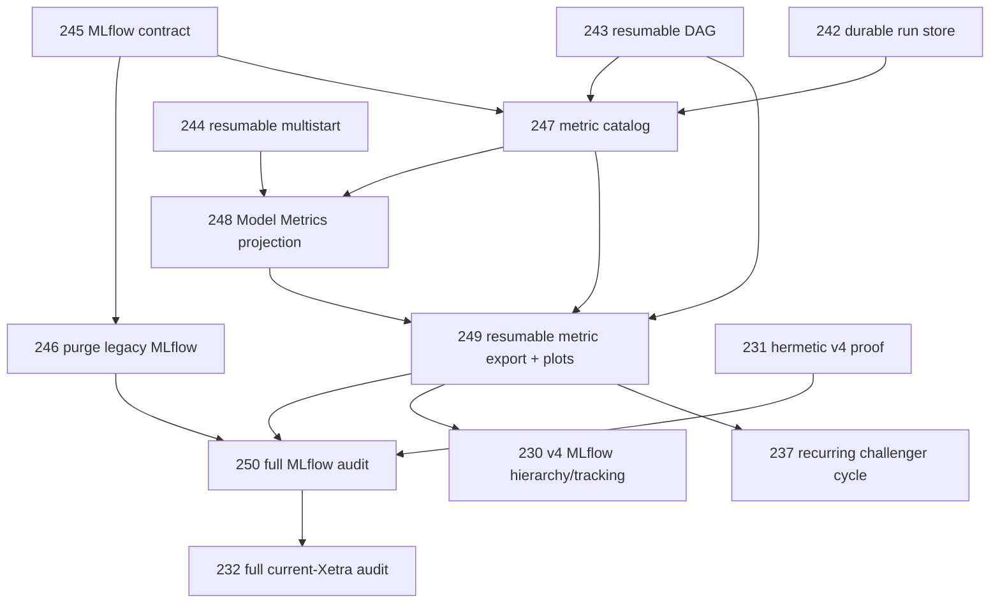

# Regime Engine — MLflow Model Metrics Backlog Addendum

Status date: 2026-09-09

This addendum is mandatory for the active v4 backlog and must be read together with `BACKLOG.md`, `BACKLOG_EXECUTION_ADDENDUM.md`, `MLFLOW_MODEL_METRICS.md`, `EVALUATION.md`, and `EVALUATION_EXECUTION.md`.

The user-facing objective is simple:

- start the new architecture with a clean MLflow evaluation namespace;
- put all legitimate model comparisons in MLflow **Model Metrics**;
- track every numerically meaningful model/evaluation diagnostic so new comparison plots can be added without rerunning models;
- preserve dataset pinning, idempotency and resume correctness.

---

## A. Cross-cutting amendments to the active backlog

The following requirements override narrower MLflow/tracking wording in earlier planning:

1. PR-230 may not implement a hand-selected metric subset. It must consume the central metric catalog introduced below.
2. Every candidate in provisional, prefix and final grids must have a LoggedModel projection with Model Metrics.
3. Cross-dimensional/cross-fold metrics must preserve the comparison-domain restrictions from `EVALUATION.md`; UI placement never makes an invalid comparison valid.
4. PR-231 and PR-232 must verify MLflow model-metric completeness in addition to mathematical evidence.
5. PR-237 model cycles must reuse the idempotent metric-export ledger from the execution addendum.
6. No accepted v4 evaluation may coexist with stale historical evaluation/model-comparison results after the one-time reset is declared complete.

---

# B. New atomic PRs

## PR-246 — One-time purge of historical MLflow evaluation results

- **Branch:** `pr/PR-246-purge-legacy-mlflow-evaluations`
- **Depends on:** PR-245
- **Allowed:** `src/market_regime_engine/commands/*`, `src/market_regime_engine/mlflow_support/*cleanup*`, `scripts/*mlflow*cleanup*`, `tests/unit/mlflow_support/*cleanup*`, `tests/external/*mlflow*cleanup*`, `docs/qa/mlflow_reset.md`

Acceptance:

- [ ] Implement one explicit destructive command for the production MLflow URI pinned by repository settings.
- [ ] Scope includes all historical regime-engine evaluation runs, nested runs, evaluation-only LoggedModels, feature-selection/model-comparison histories and their artifacts.
- [ ] Do **not** delete registered production model versions/aliases required for serving or rollback.
- [ ] Dry-run is mandatory by default and emits exact machine-readable deletion manifest.
- [ ] Destructive execution requires an explicit confirmation flag/token and exact expected tracking URI.
- [ ] Delete in deterministic dependency-safe order; handle already-deleted objects as no-op.
- [ ] Invoke/guide the backend-supported permanent cleanup/GC step required to remove soft-deleted run artifacts.
- [ ] Post-delete verification re-queries every targeted object class and requires zero survivors.
- [ ] Second destructive invocation against clean namespace succeeds with zero changes.
- [ ] Store deletion manifest + proof outside MLflow evaluation namespace under `docs/qa/`.
- [ ] Command cannot delete unrelated MLflow experiments/models.

QA:

- [ ] File-backed MLflow fixture containing unrelated experiment + legacy regime runs + LoggedModels proves only targeted objects disappear.
- [ ] Idempotent second run proof.
- [ ] Failure during deletion is resumable from deterministic manifest and does not broaden scope.
- [ ] External production execution records pre/post counts, object IDs, exit codes, and final zero-survivor proof before v4 tracking is accepted.

## PR-247 — Central versioned metric catalog and exhaustive metric extraction

- **Branch:** `pr/PR-247-model-metric-catalog`
- **Depends on:** PR-245, PR-242, PR-243
- **Allowed:** `src/market_regime_engine/mlflow_support/metric_catalog.py`, `src/market_regime_engine/mlflow_support/ports.py`, `src/market_regime_engine/evaluation_statistics/*`, corresponding tests

Acceptance:

- [ ] Define immutable versioned metric metadata: key, label, description, unit, direction, value kind, scope, step semantics, aggregation, comparison domain, source formula/field, Model-Metrics visibility.
- [ ] Catalog includes every numerical candidate/fold/seed/teacher/prefix/outer metric required by `MLFLOW_MODEL_METRICS.md` when the corresponding source value exists.
- [ ] Build one generic extractor from completed evaluation evidence/contracts to canonical metric points.
- [ ] Preserve exact primitive histories and aggregates; no rounding.
- [ ] A schema/reflection completeness test fails when a new numerical evaluation field is introduced without explicit catalog classification.
- [ ] Numeric evidence that is intentionally not a model metric must be explicitly catalogued as evidence-only with rationale.
- [ ] Stable metric keys cannot silently change meaning.
- [ ] No rendering, MLflow network, HMM fit or statistical recomputation.

QA:

- [ ] Exhaustive synthetic evidence dossier maps every numerical field exactly once.
- [ ] Independent primitive aggregate calculations verify mean/pstdev/min/max/median/count where emitted.
- [ ] Mutation test adding an unclassified numeric field fails.
- [ ] Comparison-domain matrix rejects illegal cross-dimension likelihood semantics.

## PR-248 — LoggedModel-first Model Metrics projection for every candidate

- **Branch:** `pr/PR-248-model-metrics-projection`
- **Depends on:** PR-244, PR-247
- **Allowed:** `src/market_regime_engine/mlflow_support/evaluation_tracking.py`, `src/market_regime_engine/mlflow_support/tracking.py`, `src/market_regime_engine/mlflow_support/ports.py`, corresponding tests

Acceptance:

- [ ] Every provisional K candidate, every prefix statistical winner/final comparable candidate, and every final 12-grid candidate receives exactly one logical LoggedModel projection in its valid comparison scope.
- [ ] LoggedModel tags bind exact dataset snapshot key, evaluation run key, profile version, plan hash, candidate identity, feature-order hash/dimension and fold/scope identity.
- [ ] Every catalogued comparison-ready metric is emitted via `log_model_metric_points(model_id, ...)`.
- [ ] Run-level metrics may mirror operational status but model comparison cannot depend on run metrics.
- [ ] Existing artifact plots remain evidence mirrors only.
- [ ] Model Metrics contains likelihood, information criteria, multistart, EM, occupancy/entropy, state/transition, numerical-conditioning, teacher-agreement and dimensionality metrics whenever defined.
- [ ] Metric histories use deterministic canonical steps.
- [ ] Cross-dimension likelihood keys are never emitted into a comparison scope that implies comparability.

QA:

- [ ] File-backed MLflow test enumerates LoggedModels and proves exact metric-key completeness against PR-247 catalog.
- [ ] Metric values/steps match immutable local evidence byte-for-byte/numerically exactly.
- [ ] Candidate order/thread completion order cannot alter model metric payload.

## PR-249 — Idempotent/resumable MLflow metric export and generic comparison plots

- **Branch:** `pr/PR-249-resumable-model-metric-plots`
- **Depends on:** PR-243, PR-247, PR-248
- **Allowed:** `src/market_regime_engine/mlflow_support/*`, `src/market_regime_engine/evaluations/plots.py`, `PLOT_STYLE.md`, corresponding tests

Acceptance:

- [ ] Persist deterministic model-metric batch identity in the durable evaluation ledger.
- [ ] Resume reconciles MLflow metric history by exact `(model logical key, metric key, step, value)` and appends only missing points.
- [ ] Existing same key/step with a different value fails closed.
- [ ] Forced partial-batch crash then resume produces no duplicate metric points and exactly the same final histories as uninterrupted run.
- [ ] Generic comparison plotting takes metric key + compatible LoggedModel selection and reads Model Metrics only.
- [ ] New plot over an existing metric requires no HMM/evaluation recomputation or bespoke evidence parser.
- [ ] Plotter rejects model sets that violate catalog comparison domain.
- [ ] Existing comparison plots are migrated to generic model-metric inputs where applicable.
- [ ] PNG/JSON plot artifacts are optional mirrors; Model Metrics remains authoritative.

QA:

- [ ] Crash injection after every metric-write boundary.
- [ ] Exact uninterrupted-vs-resumed metric-history equality.
- [ ] Add a new test plot using an already-catalogued metric without modifying evaluation code.
- [ ] Cross-dimension PLL plot attempt fails; soft-NMI plot succeeds.

## PR-250 — Full MLflow Model Metrics completeness audit

- **Branch:** `pr/PR-250-model-metrics-full-audit`
- **Depends on:** PR-246, PR-249, PR-231
- **Allowed:** `tests/e2e/*mlflow*`, `scripts/verify_mlflow_model_metrics.py`, `docs/qa/mlflow_model_metrics.md`

Acceptance:

- [ ] Begin from verified clean historical evaluation namespace.
- [ ] Run the complete hermetic v4 evaluation with real HMM computation and tracking enabled.
- [ ] Verify every expected LoggedModel exists exactly once.
- [ ] Verify every finite catalogued numerical metric/history point exists in Model Metrics exactly once with exact value/step.
- [ ] Verify no unknown/unclassified metric keys are emitted.
- [ ] Verify comparison-domain metadata for all models/metrics.
- [ ] Verify artifact comparison plots can be regenerated solely from Model Metrics + catalog.
- [ ] Kill/restart the tracked evaluation mid-run and prove exact final MLflow metric parity with uninterrupted run.
- [ ] Full current-Xetra audit in PR-232 must run the same completeness verifier before acceptance.

Final proof records:

- [ ] historical reset zero-survivor proof;
- [ ] model count by evaluation scope;
- [ ] metric key count and point count per LoggedModel;
- [ ] missing/duplicate/conflicting point counts all exactly zero;
- [ ] comparison-domain violations exactly zero;
- [ ] resumed-vs-uninterrupted differences exactly zero.

---

# C. Dependency amendments

The active dependency graph is amended as follows:

Operational rule: **do not run the destructive production MLflow reset until PR-246 itself is implemented, reviewed, dry-run manifest is verified, and production serving dependencies are proven outside the deletion scope.**

---

# D. Definition of done

The MLflow redesign is complete only when:

- historical regime-engine evaluation/tracking results are gone and the deletion proof shows zero survivors;
- operational registered production models needed for serving/rollback remain intact;
- every candidate model comparison is visible through LoggedModel Model Metrics;
- every numerically meaningful evaluation diagnostic is centrally classified and emitted when defined;
- raw histories and aggregates are both retained;
- future comparison plots can consume the metric catalog + Model Metrics without recomputing the evaluation;
- invalid cross-dimension/cross-fold comparisons remain impossible;
- metric emission is dataset-pinned, idempotent and resumable;
- forced crashes create neither duplicate nor conflicting metric histories;
- hermetic and current-Xetra audits prove completeness mathematically and operationally.
