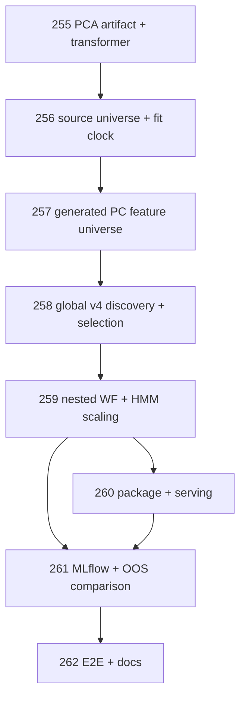

# Regime Engine — PCA Feature Generator Backlog Addendum

Status date: 2026-09-11

This addendum extends the canonical `BACKLOG.md` with a new PCA feature-generation wave for the active Xetra v4 architecture. It does **not** replace the raw-feature discovery path. PCA is introduced only as an additional, leakage-safe feature generator whose component time series are appended to the same feature universe as raw features and then undergo the same downstream feature-selection, scaling, HMM, OOS, packaging and serving procedures.

The planning IDs below continue the repository backlog namespace after PR-254.

---

# 1. Canonical PCA feature-generation contract

The design target is:

```text
validated raw feature universe
        |
        +--> raw features -----------------------------+
        |                                              |
        +--> TRAIN-only source standardization         |
              -> PCA                                   |
              -> smallest k with cumulative EVR >= .90|
              -> pca_pc_001 ... pca_pc_k --------------+
                                                       |
                                             combined feature universe
                                                       |
                                             existing v4 discovery /
                                             scoring / selection
                                                       |
                                             retained raw + PC tuple
                                                       |
                                             existing per-fold TRAIN-only
                                             StandardScaler
                                                       |
                                             HMM / OOS inference
```

Pinned rules:

- PCA is a **feature generator**, not a privileged HMM input path.
- PCA source features are standardized with TRAIN-only mean/std before PCA fitting.
- The PCA source standardization uses population variance (`ddof=0`) consistently with existing scaling conventions unless a later contract PR explicitly changes it.
- Retained PCA dimension is the smallest `k` satisfying cumulative explained-variance ratio `>= 0.90`.
- No default secondary Kaiser/eigenvalue cutoff such as `lambda > 1` is applied.
- Generated PCs are ordinary candidate features after generation. They receive no automatic retention bonus.
- Raw-vs-PC and PC-vs-PC redundancy is handled by the same downstream v4 discovery/selection logic where mathematically applicable.
- A selected PC is subsequently normalized by the existing per-fold TRAIN-only `StandardScaler` exactly like a selected raw feature before HMM fitting.
- No missing-value imputation, interpolation, carry-forward/backfill, or OOS-informed normalization is allowed.
- PCA source order, means, scales, loadings, eigenvalues, EVRs, cumulative EVRs, retained `k`, sign convention, fit cutoff and artifact hash are immutable/auditable.
- PCA sign ambiguity must be resolved deterministically so identical inputs produce identical component orientation and artifact bytes.
- Within one adaptive v4 selection run, PC identity must be stable. PCA may not be independently refit on every inner fold in a way that makes `pca_pc_003` represent a different direction from fold to fold.

## Leakage-safe fit scope

For an outer TRAIN selection run, derive and freeze the PCA artifact from the **earliest admissible inner TRAIN window** before any inner TEST observation is consulted. Use that frozen PCA artifact to transform all later rows within that outer-selection run. This keeps PC identities stable across the inner walk-forward and prevents inner-TEST covariance information from entering the PCA basis.

Across different outer folds, PCA artifacts may differ because the entire v4 selection procedure is rerun TRAIN-only inside every outer fold. This is consistent with current `outer_fold_local` evaluation semantics. Deployment selection likewise produces and freezes its own PCA artifact as part of the selected production configuration.

---

# 2. Wave E — PCA feature generation and feature-universe integration

## PR-255 — Define deterministic PCA artifact and TRAIN-only transformer

- **Branch:** `pr/PR-255-pca-train-only-transformer`
- **Depends on:** PR-241, PR-254
- **Allowed:** new `src/market_regime_engine/feature_generation/*` or `src/market_regime_engine/preprocessing/pca.py`, directly corresponding contracts/tests, minimal exports only.

Acceptance:

- [ ] Add immutable PCA artifact with ordered source features, source means/stds, loadings, eigenvalues, EVRs, cumulative EVRs, retained `k`, `variance_target=0.90`, sign convention, fit bounds/cutoff and canonical hash.
- [ ] Reuse or exactly match existing population-variance standardization semantics for PCA source normalization.
- [ ] Fit source scaler and PCA only on explicitly supplied TRAIN rows.
- [ ] Select `k = min{m : cumulative_EVR_m >= 0.90}` with deterministic numeric tolerance.
- [ ] No separate `lambda > 1` / Kaiser rule.
- [ ] Transform future rows using the frozen artifact only; no hidden refit.
- [ ] Deterministically orient component signs, e.g. by forcing the largest-absolute loading to be positive with canonical-ordinal tie-break.
- [ ] Reject NaN/Inf, duplicate source names, invalid dimensions, empty input and source variance `<=1e-12`.
- [ ] Canonical serialization is byte-stable for identical input.

QA:

- [ ] Exact numerical comparison with an independent PCA/SVD reference fixture.
- [ ] Future-row perturbation cannot change an already fitted PCA artifact.
- [ ] Repeated fit on identical bytes produces identical hash/loadings/signs.
- [ ] Component-score reconstruction from stored source scaler + loadings is exact within pinned tolerance.

## PR-256 — Define the PCA source-universe policy and frozen fit clock

- **Branch:** `pr/PR-256-pca-source-universe-clock`
- **Depends on:** PR-255
- **Allowed:** v4 feature catalog/quality contracts, PCA feature-generation contracts, profile config, directly corresponding tests/docs.

Acceptance:

- [ ] Define which structurally valid raw Gold features may be PCA sources; no hidden hand-maintained semantic allowlist.
- [ ] Reuse v4 quality evidence where possible: numeric source contract, TRAIN-only coverage, finite values and population variance.
- [ ] Preserve PostgreSQL/canonical feature ordinal as PCA source ordering.
- [ ] Pin the PCA fit sample for each outer-selection run to the earliest admissible inner TRAIN window.
- [ ] Freeze source feature tuple, scaler, PCA basis and retained `k` for the complete enclosing selection run.
- [ ] Persist excluded PCA source features and exclusion reasons.
- [ ] No imputation or future-data covariance information.
- [ ] Define deployment-selection PCA fit scope consistently with the same selection function rather than adding an ad-hoc production-only path.

QA:

- [ ] Inner-TEST and outer-TEST perturbation cannot change the earlier PCA artifact.
- [ ] Source-column reordering is either canonicalized to ordinal order or fails explicitly; it never silently changes PCA identity.
- [ ] Missingness/near-zero-variance/nonnumeric source cases are fail-closed and auditable.

## PR-257 — Materialize `pca_pc_001 ... pca_pc_k` as first-class generated features

- **Branch:** `pr/PR-257-pca-generated-feature-universe`
- **Depends on:** PR-256
- **Allowed:** feature-generation/catalog contracts, feature discovery input adapters, directly corresponding tests.

Acceptance:

- [ ] Generate deterministic feature names `pca_pc_001 ... pca_pc_k`.
- [ ] For `T` transformable timestamps, output exactly a `T x k` component-score matrix on the same timestamp clock.
- [ ] Attach provenance per PC: component index, eigenvalue, EVR, cumulative EVR, PCA artifact hash, PCA source hash and fit cutoff.
- [ ] Append PCs to the ordinary v4 candidate universe alongside raw features.
- [ ] Generated PCs do not bypass quality, distance, clustering, feature scoring, winner selection or final feature-count rules.
- [ ] Feature contracts distinguish `origin=raw` vs `origin=pca` without allowing origin to affect statistical ranking except where required for provenance/transform reconstruction.
- [ ] PCA-disabled configuration reproduces the prior raw-only candidate universe exactly.

QA:

- [ ] Feature-catalog/unit tests prove stable names/order/provenance.
- [ ] No downstream consumer needs a separate PCA-only read path to access PC observations.

## PR-258 — Integrate PCs into global v4 distance, clustering and regime-feature selection

- **Branch:** `pr/PR-258-pca-v4-discovery-selection`
- **Depends on:** PR-257, PR-223, PR-224, PR-226, PR-227
- **Allowed:** v4 distance/clustering/scoring/winner/selection modules and directly corresponding tests.

Acceptance:

- [ ] Raw and generated PC candidates enter one combined non-semantic universe.
- [ ] Absolute-Spearman distance is computed for raw-raw, raw-PC and PC-PC pairs using the existing TRAIN-only support contract.
- [ ] Average-linkage clustering, silhouette M selection, temporary prototype selection, state-information scoring, eta diagnostic, cluster-winner selection and L-prefix search apply without a special PCA bonus.
- [ ] Multiple PCs may survive when justified; zero PCs may survive when redundant/uninformative.
- [ ] PCA components are not placed in one artificial semantic `PCA` group/medoid because v4 is non-semantic.
- [ ] Existing `M* <= 12` and final `L* <= 8` safety bounds remain authoritative unless a separate parameter-count contract proves a change is safe.
- [ ] Ranking ties remain deterministic and use canonical combined-feature ordinal.
- [ ] PC origin metadata is preserved through final selected configuration.

QA:

- [ ] Synthetic cases: raw wins over redundant PC; PC wins over redundant raw; multiple orthogonal PCs survive; all PCs rejected.
- [ ] PCA-disabled v4 golden result remains unchanged.

## PR-259 — Carry frozen PCA artifacts through inner/outer walk-forward and existing HMM scaling

- **Branch:** `pr/PR-259-pca-walk-forward-scaling`
- **Depends on:** PR-258, PR-228
- **Allowed:** v4 evaluation/walk-forward composition, `preprocessing/scaling.py` only for integration if required, corresponding tests.

Acceptance:

- [ ] Every outer TRAIN selection run uses exactly one frozen PCA artifact derived before its inner TEST observations.
- [ ] All raw + PC selected feature tuples then use the existing per-fold TRAIN-only `StandardScaler` before HMM fitting.
- [ ] Clearly separate two transformations: PCA-source standardization used to construct PCs vs final HMM observation standardization applied to retained raw + PC features.
- [ ] No selected PC is exempt from the existing HMM scaler.
- [ ] Outer TEST uses the PCA artifact frozen before outer TEST plus the HMM scaler fitted on outer TRAIN only.
- [ ] Fold/evaluation evidence records the PCA artifact hash and final HMM scaler artifact.
- [ ] State-alignment/reference-scaler logic continues to operate on the final HMM observation coordinates without silently mixing PCA-source and HMM scalers.

QA:

- [ ] Explicit leakage tests for PCA fit stats/loadings/k and HMM scaler stats.
- [ ] Offline TRAIN/TEST transformation is reproducible from persisted artifacts only.
- [ ] Future TEST perturbation affects scores/inference but not prior PCA or TRAIN-scaler artifacts.

## PR-260 — Package PCA lineage for final refit, registry, latest and replay serving

- **Branch:** `pr/PR-260-pca-production-artifact-serving`
- **Depends on:** PR-259, PR-234, PR-235, PR-236
- **Allowed:** production artifact/package, final refit integration, latest/replay serving, directly corresponding tests.

Acceptance:

- [ ] Final selected configuration carries the frozen PCA artifact whenever any selected feature has `origin=pca`.
- [ ] Production refit does not silently refit PCA into a new basis after feature selection.
- [ ] Model package contains enough information to regenerate every selected PC from raw/source observations without external fitting state.
- [ ] Latest/replay validates exact PCA source feature order/hash and fails closed on missing/non-finite required sources.
- [ ] PCA source transformation -> PC generation -> final HMM scaler -> HMM inference is identical offline vs serving.
- [ ] Raw-only legacy/v4 models remain loadable and require no PCA artifact.
- [ ] State IDs remain model-version-local.

QA:

- [ ] Package round trip for raw-only and mixed raw+PC models.
- [ ] Serving/replay numerical parity with offline evaluation fixture.
- [ ] Missing/corrupt PCA artifact/hash mismatch fails closed.

## PR-261 — Add MLflow PCA diagnostics and raw-only vs raw+PCA OOS comparison

- **Branch:** `pr/PR-261-pca-mlflow-oos-evaluation`
- **Depends on:** PR-259, PR-260, PR-230
- **Allowed:** MLflow/evaluation tracking, plots/reports, PCA-specific evaluation orchestration, corresponding tests.

Acceptance:

- [ ] Log PCA source count, retained `k`, source/PCA artifact hash and fit cutoff.
- [ ] Log per-PC eigenvalue, EVR, cumulative EVR and whether the PC survives downstream selection.
- [ ] Log loading matrix and top absolute raw-feature contributors per PC as artifacts.
- [ ] Add scree/eigenvalue and cumulative-EVR plots.
- [ ] Compare two otherwise matched policies: raw-only v4 vs raw+PCA feature universe with 90% cumulative EVR generation.
- [ ] Hold source build, walk-forward plan, model grid, seeds, gates and evaluation clocks fixed where required for comparability.
- [ ] Compare outer valid-fold rate, soft regime NMI mean/std/worst, selection stability, occupancy/state-duration/switch diagnostics, entropy/confidence, state-signature drift and fold-local OOS PLL diagnostics.
- [ ] PCA is not automatically promoted because it exists; evidence determines whether it is useful.

QA:

- [ ] MLflow run can answer which raw features created each selected PC, why `k` was chosen and whether PCA improved OOS policy evidence.
- [ ] Tracking does not recompute or mutate PCA artifacts.

## PR-262 — End-to-end PCA rollout, configuration and documentation closure

- **Branch:** `pr/PR-262-pca-feature-generator-e2e-docs`
- **Depends on:** PR-261
- **Allowed:** profile/config examples, `README.md`, `ARCHITECTURE.md`, `EVALUATION.md`, relevant operations/evaluation docs, E2E tests.

Acceptance:

- [ ] Add explicit PCA feature-generator configuration with default/off policy chosen deliberately and documented.
- [ ] Document the 90% cumulative-EVR threshold and absence of a default eigenvalue/Kaiser cutoff.
- [ ] Document earliest-inner-TRAIN PCA fitting, frozen within-selection component identity and outer-fold-local PCA refits.
- [ ] Document the two standardization layers and why selected PCs still use the existing final HMM `StandardScaler`.
- [ ] Document that PCs enter the same non-semantic v4 candidate universe and may be selected or rejected like any raw feature.
- [ ] Add full E2E proof: source snapshot -> PCA artifact -> generated feature universe -> v4 discovery/selection -> raw+PC final tuple -> HMM scaler -> HMM -> outer OOS -> deployment selection -> package -> latest/replay.
- [ ] PCA-disabled regression proves raw-only behavior remains byte/statistically unchanged where the existing golden contract requires it.
- [ ] Full merge gate and coverage threshold pass.

QA:

- [ ] Hermetic E2E plus independent rerun evidence.
- [ ] Documentation formulas/flow match executable contracts.

---

# 3. PCA wave execution graph



Recommended execution order:

```text
PR-255 -> PR-256 -> PR-257 -> PR-258 -> PR-259
                                      -> PR-260
                                      -> PR-261
PR-260 + PR-261 -> PR-262
```

The key invariant across all PRs is: **PCA creates additional candidate features; it does not create a second selection/modeling pipeline. Once generated, PC features enter the same feature universe and are treated like the rest of the features.**
