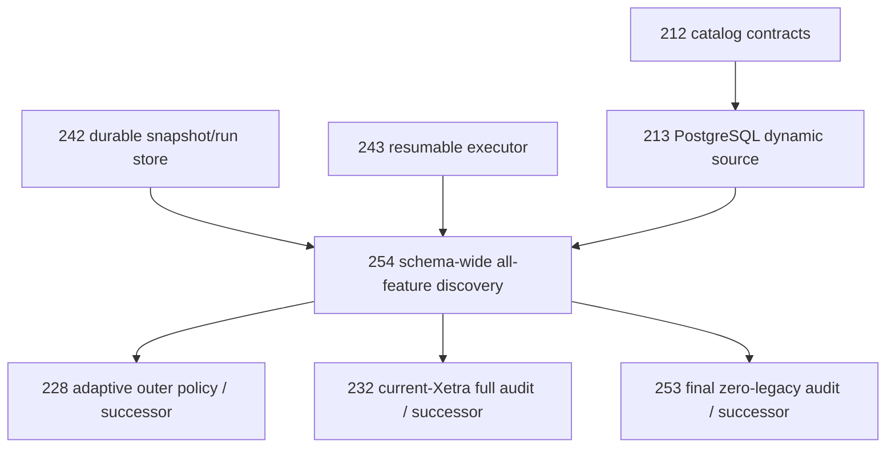

# Regime Engine — PostgreSQL Schema-Wide Feature Discovery Backlog Addendum

Status date: 2026-09-09

This addendum is mandatory for the active v4 backlog. It strengthens the existing dynamic PostgreSQL catalog work so that a new feature becomes part of the next evaluation automatically, without a source-code/configuration allowlist and without manually editing the evaluation profile.

The operational requirement is:

> **Every feature that exists in the configured PostgreSQL feature schema at the moment a new immutable dataset snapshot is captured must automatically enter the v4 evaluation candidate universe.**

The current production feature schema is `regime_loader`; `regime_loader_sync` is lineage/control metadata and is not a feature schema.

This requirement is stronger than merely being able to query a newly added column. The complete evaluation orchestration must consume the discovered catalog as its candidate universe.

---

# A. Canonical semantics

## A.1 Feature schema is authoritative

The configured feature schema is a dedicated feature namespace. Discovery must inspect PostgreSQL catalog metadata inside the same `REPEATABLE READ READ ONLY` transaction used to capture the dataset snapshot.

A relation in the configured feature schema is a valid feature relation only if it satisfies the feature-relation contract:

- ordinary table or supported read-only view/materialized view type explicitly permitted by the implementation contract;
- exactly one `timestamp_m1` column;
- `timestamp_m1` is PostgreSQL timestamp-with-time-zone;
- every other column is PostgreSQL `DOUBLE PRECISION`;
- every non-timestamp column name is a safe SQL identifier;
- timestamps are unique within the relation;
- at least one non-timestamp feature column exists.

The feature schema is treated fail-closed. The implementation may not silently ignore an unexpected ordinary relation in the configured feature schema. If a relation does not satisfy the declared feature-relation contract, snapshot acquisition fails with the offending relation/column identified. This prevents a new feature-bearing relation from being omitted because an agent forgot to update an allowlist.

`regime_loader_sync` remains outside this scope because it is a different schema.

## A.2 All discovered features enter the candidate universe

For one pinned snapshot:

```text
postgres feature schema
        |
        v
catalog every feature relation
        |
        v
catalog every non-timestamp DOUBLE PRECISION column
        |
        v
materialize exact schema-wide feature snapshot
        |
        v
catalog.feature_names
        |
        v
v4 quality filter
        |
        v
ALL surviving features -> global clustering/scoring/evaluation
```

No layer between catalog capture and the v4 quality filter may supply a narrower manually configured feature list.

A feature can leave the statistical candidate universe only through an explicit v4 statistical validity rule such as coverage, variance, finite-value, pair-support, model-clock or later selection logic. It may not disappear because it was absent from a Python tuple, YAML list, semantic group, constructor argument, cached feature list, SQL SELECT list, or previously trained model.

## A.3 Canonical ordering and identity

Relation order is deterministic and independent of PostgreSQL physical OIDs or discovery timing.

Canonical order:

```text
(schema_name, relation_name, ordinal_position, column_name)
```

Feature names must be globally unique across the configured feature schema if the public feature identity remains the bare column name. Duplicate bare feature names across two relations fail closed and report both fully-qualified origins. The implementation must not silently overwrite, suffix, or select one duplicate.

The schema catalog hash includes, in exact canonical order:

```text
schema_name
relation_name
relation_kind
column_name
ordinal_position
data_type
udt_name
```

Therefore adding, removing, renaming, moving or changing the type of a feature changes the catalog hash.

## A.4 Schema-wide row materialization

If the feature schema contains more than one valid feature relation, materialization forms one deterministic timestamp-indexed feature matrix.

Required semantics:

- read every relation inside the same PostgreSQL snapshot transaction;
- preserve each relation's exact `timestamp_m1` values;
- combine relations by timestamp using deterministic full timestamp union semantics;
- absence of a feature observation on a timestamp remains SQL-NULL/`None`; no fill/interpolation/carry is allowed;
- output timestamps are unique and strictly ascending;
- output columns follow the canonical catalog order;
- no HMM/model code runs while the database transaction is open.

The resulting materialized snapshot, not a live later query, is the sole data source for the evaluation and all restart/resume work.

## A.5 Dataset pinning must cover the whole schema-wide snapshot

Existing upstream lineage remains mandatory, but table-specific upstream `data_sha256` is insufficient to prove identity if future features can be spread across multiple feature relations.

The schema-wide snapshot therefore adds an engine-owned canonical materialization digest:

```text
materialized_feature_data_sha256 =
    SHA256(canonical serialization of ordered timestamps + ordered feature values/nulls)
```

The canonical `DatasetSnapshotKey` used by resumable evaluation must include at least:

```text
upstream source_build_id
upstream data_sha256
schema_version
feature_version
source_catalog_hash
materialized_feature_data_sha256
materialized_row_count
materialized_min_timestamp
materialized_max_timestamp
```

Thus any new relation, feature column, timestamp or feature value changes the next snapshot/run identity even if upstream lineage metadata has not yet learned how to describe multiple feature relations.

The exact binary/text canonicalization used for the materialization digest must be versioned and independently tested; Python `repr`, locale-dependent formatting and unordered mappings are forbidden.

## A.6 Snapshot isolation and restart behavior

A schema change after the snapshot transaction begins must not alter the running evaluation.

Example:

```text
Run A starts -> captures features {A,B,C,D}
DB adds feature E
Run A continues/restarts -> still uses pinned {A,B,C,D} snapshot
Run B starts later -> captures {A,B,C,D,E}
```

`Run B` receives a different `source_catalog_hash`, `materialized_feature_data_sha256` and `EvaluationRunKey`.

The resumable executor must never attach feature E to Run A during restart.

---

# B. New atomic implementation PR

## PR-254 — Make the v4 evaluation universe PostgreSQL-schema-driven

- **Branch:** `pr/PR-254-pg-schema-all-feature-discovery`
- **Depends on:** dynamic catalog/source foundation (PR-212/PR-213), durable snapshot/run identity foundation (PR-242/PR-243), and the canonical v4 contracts already merged before implementation starts.
- **Allowed:** `DATA_SOURCE.md`, `EVALUATION_EXECUTION.md`, `src/market_regime_engine/features/ports.py`, `src/market_regime_engine/features/postgres_source.py`, `src/market_regime_engine/evaluation_execution/*`, `src/market_regime_engine/evaluations/global_regime_v4.py`, narrowly corresponding source/orchestration tests and external audit tests.

### Acceptance

- [ ] Replace the final table-only discovery assumption with configured **feature-schema** discovery for v4.
- [ ] Discover the complete relation/column catalog from PostgreSQL metadata inside the same `REPEATABLE READ READ ONLY` source transaction.
- [ ] Do not use a feature-name allowlist, semantic group list, static Python tuple, YAML feature list or prior-model feature set to define the v4 raw candidate universe.
- [ ] Fail closed if any ordinary relation in the configured feature schema violates the feature-relation contract; never silently omit an unexpected relation.
- [ ] Canonical relation/feature order is exactly `(schema_name, relation_name, ordinal_position, column_name)`.
- [ ] Require globally unique bare feature names across the schema; duplicates fail with both qualified origins.
- [ ] Add one source API that captures **catalog + all discovered feature rows** without the caller first supplying feature names. The caller may bound timestamps but may not narrow the raw discovery universe.
- [ ] If multiple valid feature relations exist, combine them by deterministic full timestamp union; retain NULLs and forbid fill/interpolation/carry.
- [ ] Validate output timestamps unique/strictly ascending and output width/order exactly equal to the captured schema catalog.
- [ ] Calculate versioned `materialized_feature_data_sha256` from the complete canonical materialized matrix.
- [ ] Add schema-wide materialized row count/min/max plus materialization digest to dataset snapshot identity and therefore to `EvaluationRunKey`.
- [ ] `select_v4_configuration(...)` and outer/deployment evaluation consume the exact complete discovered catalog. They may reject features only via explicit statistical quality/selection rules.
- [ ] Adding a valid feature column requires **zero regime-engine code/config edits** before it appears in the next evaluation's quality-filter input.
- [ ] Adding a new valid feature relation in the configured schema requires **zero regime-engine code/config edits** before all of its features appear in the next evaluation.
- [ ] Removing/renaming/type-changing a feature changes catalog/snapshot/run identity and never reuses a stale cached request.
- [ ] Schema changes after Run A's source snapshot do not change Run A, including after process restart; they appear only in a newly keyed Run B.
- [ ] Resolved production-model inference remains allowed to request only its frozen final feature tuple; schema-wide discovery is mandatory specifically for evaluation/discovery snapshot acquisition.
- [ ] No long-lived PostgreSQL transaction during clustering/HMM fitting.
- [ ] No backward-compatibility/table-only v4 fallback remains after this PR.

### QA — catalog and SQL contract

- [ ] Hermetic PostgreSQL-shaped fixture starts with one feature relation and proves every non-timestamp `DOUBLE PRECISION` column is discovered in exact canonical order.
- [ ] Add one new feature column with no engine/config change; next snapshot contains it and its quality-filter invocation records it.
- [ ] Add a second valid feature relation with two features; next snapshot contains both automatically.
- [ ] Add an invalid relation/invalid non-feature column in the feature schema; acquisition fails closed instead of silently ignoring it.
- [ ] Duplicate bare feature name across two relations fails with both qualified origins.
- [ ] Wrong timestamp type, missing timestamp, unsafe identifier, zero-feature relation and unsupported numeric/non-numeric types all fail closed.
- [ ] SQL uses identifier-safe composition only; values/bounds remain parameterized.

### QA — schema-wide materialization mathematics

- [ ] Independent reference implementation performs the timestamp full union on at least three relations with partially non-overlapping calendars and proves every output timestamp/value/NULL exactly.
- [ ] Reference implementation independently serializes the complete ordered matrix and reproduces `materialized_feature_data_sha256` exactly.
- [ ] Row-count/min/max evidence is independently recomputed from the materialized timestamp union.
- [ ] Relation enumeration order, DB cursor return order and Python mapping insertion order cannot alter catalog hash or materialization digest.

### QA — evaluation integration

- [ ] Spy/contract test proves the v4 quality filter receives exactly the complete catalog feature tuple; no subset parameter exists on the discovery path.
- [ ] At least 50 synthetic discovered features flow through quality -> distance -> clustering -> teacher/scoring pipeline without a feature allowlist.
- [ ] Add feature 51 only in the database fixture; rerun and prove it appears automatically in raw-candidate evidence and, if statistically eligible, in global distance/scoring evidence.
- [ ] A feature failing coverage/variance remains visible in raw catalog/quality evidence and is rejected for the documented statistical reason rather than disappearing upstream.

### QA — dataset pinning, idempotency and resume

- [ ] Start Run A, capture snapshot, then mutate schema by adding a feature before killing the process. Resume Run A and prove byte-identical catalog/data/evaluation work units to the pre-mutation pinned snapshot.
- [ ] Start Run B after mutation; prove a different catalog hash, materialization digest, DatasetSnapshotKey and EvaluationRunKey and automatic inclusion of the new feature.
- [ ] Forced crash after catalog capture, after relation 1 materialization, after relation N materialization and after durable snapshot commit resumes without mixed-vintage rows or duplicate work.
- [ ] Re-invoking the same dataset/evaluation identity returns/reuses the same completed logical evaluation.

### QA — full computation proof

- [ ] Run a complete hermetic v4 evaluation from schema discovery through final outer evidence with real HMM computation; no source/catalog/model math mocks.
- [ ] Repeat from the same pinned snapshot and prove canonical statistical output hashes identical.
- [ ] Run the current PostgreSQL external audit and report discovered relation count, raw feature count, eligible feature count, exact catalog hash and exact materialization digest.
- [ ] Independent audit queries PostgreSQL catalog directly and proves the evaluation raw feature set equals the complete valid feature set in the configured feature schema at the pinned snapshot.
- [ ] Final zero-legacy/runtime audit (PR-253 or its successor) must include a denylist/assertion that no v4 evaluation path contains static feature-name inventories.

---

# C. Dependency amendments

PR-254 is a required dependency before the v4 orchestration/current-source audit can be considered complete.



If PR-228 or PR-232 has already merged when PR-254 is implemented, PR-254 must update/re-run their corresponding orchestration/audit paths rather than treating the old table-only behavior as accepted compatibility.

---

# D. Definition of done

This requirement is complete only when a developer can add a new valid PostgreSQL feature to the configured feature schema, publish the new database state, make **no regime-engine code or configuration change**, start the next evaluation, and observe that feature in the pinned raw catalog and quality-filter evidence automatically.

The only legitimate reasons for that feature not to reach the HMM candidate set are explicit statistical validity/selection decisions recorded by the evaluation itself.
