# Regime Engine Evaluation Architecture

## Purpose

This document defines the evaluation and feature-selection architecture for `regime-engine`.

The design goal is deliberately narrow:

> Given a potentially large and continuously growing universe of market features, identify a compact set of non-redundant features that best discriminate latent market regimes, determine an appropriate number of retained regime features, determine the hidden-state count/model family using causal out-of-sample evidence, and evaluate the complete procedure without look-ahead bias.

The previous semantic-group medoid architecture is removed from the statistical decision process. Semantic groups are not used to determine which features survive, how many representatives are retained, or which HMM wins. If semantic labels are stored, they are metadata only for interpretation and visualization.

The architecture is intentionally deterministic, auditable, computationally bounded, and compatible with an expanding walk-forward evaluation.

---

## 1. Core principles

The evaluation system separates four different questions that must not be conflated:

1. **Which raw features are redundant with each other?**
2. **How many statistically distinct feature clusters exist?**
3. **Which feature inside each cluster best discriminates the provisional latent regimes?**
4. **How many of those cluster winners are actually useful for the final regime model, and which model/state count generalizes best out of sample?**

This produces four explicit quantities:

- `N`: number of raw eligible features.
- `M*`: selected number of global feature clusters.
- `L*`: selected number of final regime features retained from the cluster winners.
- `K*`: selected number of latent HMM states in the final model.

These quantities solve different problems and must be estimated separately.

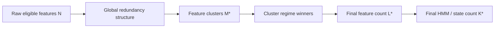

A typical result could therefore be:

```text
N = 180 raw eligible features
M* = 12 global correlation clusters (at most, under the pinned v4 bound)
L* = 7 final regime features
K* = 3 hidden market states
```

No assumption requires `M* = L*`, and no assumption requires the provisional state count to equal the final state count.

---

## 2. Canonical statistical and mathematical contract

For `profile_id=xetra`, `profile_config_version=4`, and
`feature_discovery_policy=xetra_global_regime_v4`, this section is normative.
The implementation must use these values and formulas; profile-local defaults
or semantic-group decisions may not replace them.

### 2.1 Source and quality

The feature universe is all non-`timestamp_m1` columns in the validated Gold
feature table. Every feature column must be PostgreSQL `DOUBLE PRECISION` and
features are ordered by PostgreSQL ordinal position. Coverage is measured on
Outer-TRAIN source rows, with `ddof=0` population variance:

```text
minimum coverage                 = 0.90
minimum population variance      = strictly > 1.0e-12
minimum eligible feature count   = 3
minimum pairwise support         = 504 complete observations
missing-value policy             = no fill, interpolation or carry
non-null NaN/Inf                 = source-contract failure
```

The source catalog carries `schema_version`, `feature_version`, and
`source_build_id` as lineage. It does not use a feature-name allowlist. A
same-name semantic redefinition upstream cannot be inferred from SQL type
metadata and remains an explicit current-vintage source limitation.

### 2.2 Redundancy, clustering, and prototypes

For pairwise-complete TRAIN observations, Spearman correlation is Pearson
correlation of average ranks:

```text
rho_ij = corr(rank_average(x_i), rank_average(x_j))
d_ij   = 1 - abs(rho_ij)
```

Undefined/non-finite correlations fail the distance result. Values outside
`[-1,1]` may only be clipped when the violation is at most `1.0e-12`.
Distances are finite, symmetric, bounded in `[0,1]`, and have an exact zero
diagonal.

One deterministic agglomerative average-linkage hierarchy is built from the
precomputed distance matrix using the repository-pinned scikit-learn 1.9.0
behavior. Candidate cuts are exactly:

```text
M = 2, 3, ..., min(12, N - 1)
```

The full merge tree and every candidate cut are retained. Silhouette uses the
same precomputed distance matrix, singleton sample silhouette is `0.0`, and
the arithmetic mean is used. The best silhouette anchor must be strictly
greater than zero; values within absolute `1.0e-12` tie and the smaller `M`
wins. Cluster IDs use the smallest canonical feature ordinal.

The temporary prototype is the actual cluster member with the smallest mean
distance to the *other* members. A singleton is its own prototype. Ties use
absolute `1.0e-12` and canonical ordinal. Prototypes are initialization-only
and have no final-feature-selection privilege.

The Gaussian full-covariance safety count is:

```text
p_G(K,d) = (K-1) + K(K-1) + Kd + K*d*(d+1)/2
p_G(5,12) = 474 <= 504
p_G(5,13) = 544 > 504
```

### 2.3 Model clocks and the provisional teacher

Inner expanding walk-forward is `756/63/63`, with no partial final TEST;
model minimums are TRAIN `504` and TEST `42`. Every feature tuple is checked
by a pure complete-case preflight before fitting. It records every fold,
requires first-TRAIN complete rows and per-feature population variance, and
requires structural valid-fold rate `>=0.80`.

The provisional teacher is a Gaussian full-covariance HMM with
`K ∈ {2,3,4,5}` and the existing eight-seed multistart/gates. All K values see
the same prototype vector and inner folds, so same-feature predictive ranking
is valid. Teacher evidence consists only of aligned causal filtered
probabilities from valid inner TEST timestamps; smoothed probabilities and
full-sample Viterbi labels are forbidden as weights.

### 2.4 Feature information score

For each eligible feature, use the finite support shared by that feature and
the teacher. Require coverage `>=0.90` of teacher timestamps and at least 126
observations. Average ranks are divided into exactly `B=10` bins:

```text
bin_t = min(9, floor(10 * (rank_average(x_t) - 1) / n))
p_bk = (1/n) * sum_t 1[bin_t=b] * gamma_tk
p_b  = sum_k p_bk
p_k  = sum_b p_bk
I    = sum_{b,k:p_bk>0} p_bk * ln(p_bk/(p_b*p_k))
H_S  = -sum_{k:p_k>0} p_k * ln(p_k)
state_information_ratio = I / H_S
```

`H_S <= 1.0e-12` is invalid. The primary score must be finite and in `[0,1]`.
On the same support, posterior eta-squared is a diagnostic only:

```text
pi_k      = mean_t gamma_tk
mu_jk     = sum_t gamma_tk*x_tj / sum_t gamma_tk
mu_j      = mean_t x_tj
B_j       = sum_k pi_k*(mu_jk-mu_j)^2
W_j       = sum_k pi_k*sigma_jk^2
eta_sq_j  = B_j/(B_j+W_j)
```

All score primitives use the same feature-specific support. There is no HMM
fit per raw feature. Cluster and global winner tiers are primary score,
eta-squared, coverage, observation count, then smaller canonical ordinal;
each numeric tier uses anchored absolute `1.0e-12` tolerance.

### 2.5 Prefix selection and final grid

The full-covariance GMM-HMM safety count is:

```text
p_GMM(K,M,d) = (K-1) + K(K-1) + K(M-1) + KMd + KM*d*(d+1)/2
p_GMM(5,2,8) = 469 <= 504
p_GMM(5,2,9) = 569 > 504
```

Therefore prefixes are exactly `L=2,...,min(M*,8)`. Each prefix first selects
Gaussian K2-K5 using same-feature predictive ranking. Only that prefix winner
is compared with the common teacher using soft regime NMI on exact shared
timestamps:

```text
p_kl = (1/T) * sum_t P_tk * Q_tl
p_k  = sum_l p_kl          q_l = sum_k p_kl
I    = sum_{k,l:p_kl>0} p_kl * ln(p_kl/(p_k*q_l))
H_P  = -sum_k p_k*ln(p_k)  H_Q = -sum_l q_l*ln(q_l)
soft_regime_nmi = 2*I/(H_P+H_Q)
```

Denominator `<=1.0e-12` is invalid; shared support must be `>=0.90`. Across
different `L`, selection is soft NMI, then shared timestamp count, then
smaller `L`. Raw PLL/BIC/AIC are forbidden across dimensions and are valid
only inside one identical feature vector.

The final grid is exactly these 12 candidates, in this order:

```text
gaussian_hmm_k2_full, gaussian_hmm_k3_full, gaussian_hmm_k4_full,
gaussian_hmm_k5_full, gmm_hmm_k2_m2_full, gmm_hmm_k3_m2_full,
gmm_hmm_k4_m2_full, gmm_hmm_k5_m2_full, student_t_hmm_k2_full,
student_t_hmm_k3_full, student_t_hmm_k4_full, student_t_hmm_k5_full
```

### 2.6 Outer, deployment, and state identity

Outer expanding walk-forward is `1260/63/63`, no partial final TEST. The full
selection procedure reruns on each Outer-TRAIN and is frozen before TEST. The
outer policy requires valid-fold rate `>=0.80`, at least three valid folds,
and a valid latest complete fold. Outer PLL/BIC/AIC are fold-local diagnostics
and are never pooled across adaptive folds; comparable policy evidence uses
soft NMI and validity/stability measures.

After validation, deployment selection reruns the exact same TRAIN-only
selection function through `source.max_timestamp`; it does not copy the last
outer-fold configuration. Persist separately:
`validation_evaluation_cutoff` and `deployment_selection_cutoff`.

Outer state IDs are `outer_fold_local`. Production state IDs are
`model_version_local`; `state_0` in two model versions has no implied common
economic meaning. All contract hashes use finite-only canonical JSON and
SHA-256. Raw rows, credentials, DSNs, semantic/economic/portfolio labels are
never statistical decision inputs.

## 2.14 Historical semantic compatibility

All eligible features are pooled into one global feature universe.

The system must not enforce rules such as:

```text
one VIX representative
one rates representative
one credit representative
one FX representative
...
```

Those rules impose economic taxonomy on the statistical representation and can create artificial dimensionality.

A global clustering procedure is preferred because:

- several features from one economic theme may contain genuinely different information and should be allowed to fall into different clusters;
- features from different economic themes may be statistically redundant and should be allowed to share the same cluster;
- the number of retained feature structures should be learned from the data rather than inherited from a hand-written taxonomy;
- adding many redundant transforms of an existing signal should not automatically increase model dimensionality;
- adding a genuinely new, weakly correlated signal should be able to create a new feature cluster.

Semantic labels may still be attached to features for dashboards, documentation, or economic interpretation, but:

```text
semantic_group ∉ statistical_selection_rule
```

---

## 3. High-level architecture

```mermaid
flowchart TD
    A[All raw features] --> B[TRAIN-only quality filter]
    B --> C[Global absolute-Spearman distance matrix]
    C --> D[Global clustering over candidate cluster counts]
    D --> E[Select M* using cluster quality/stability rule]
    E --> F[Temporary prototype from each cluster]
    F --> G[Initial Gaussian HMM search K=2..5]
    G --> H[Choose provisional K* using inner causal WF]
    H --> I[Produce causal OOS filtered state probabilities]
    I --> J[Score ALL eligible raw features against common provisional regimes]
    J --> K[Best regime-separating feature inside each cluster]
    K --> L[Rank cluster winners by regime relevance]
    L --> M[Evaluate top-L prefixes for L=2..min(M*,8)]
    M --> N[Select L* using inner causal WF]
    N --> O[Final feature set]
    O --> P[Final model-family and K grid]
    P --> Q[Choose final statistical champion]
    Q --> R[Outer expanding WF OOS evaluation]
```

The initial HMM is only a temporary teacher. It creates a common provisional latent-state reference so every raw feature can be evaluated against the same regime definition.

It is not the final production model.

---

## 4. Outer evaluation boundary

The primary protection against look-ahead bias is a strict outer expanding walk-forward.

For outer fold `f`:

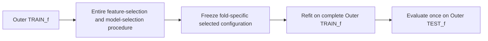

The outer test block must never influence:

- feature quality thresholds;
- feature clustering;
- `M*`;
- temporary prototypes;
- provisional `K*`;
- regime-separation scores;
- cluster winner selection;
- `L*`;
- final model family;
- final state count;
- HMM hyperparameters or initialization policy.

Any choice that uses the outer test sample converts that sample into validation data and invalidates it as OOS evidence.

The canonical outer evaluation remains expanding because the objective is to accumulate increasingly broad historical regime evidence while preserving a strict future test block.

---

## 5. Step 1 — TRAIN-only feature quality filter

Before clustering, raw features are screened using rules that do not depend on any fitted HMM or trading target.

At minimum, the quality filter should enforce:

- minimum observation coverage;
- finite numeric values;
- non-zero / non-negligible variance;
- sufficient common observations for pairwise dependence estimation;
- deterministic ordering and feature identity;
- no target leakage or future-derived data.

The filter answers only:

> Is the feature statistically usable?

It does not answer whether the feature is regime-informative.

The resulting eligible feature count is `N`.

---

## 6. Step 2 — Global redundancy matrix

All eligible features are compared with all other eligible features.

Use absolute Spearman rank correlation as the redundancy measure.

For features `i` and `j`:

\[
d_{ij}=1-|\rho^{Spearman}_{ij}|.
\]

Interpretation:

- `|rho| ≈ 1` -> very small distance -> strong redundancy;
- `|rho| ≈ 0` -> large distance -> little monotonic redundancy.

The absolute value is intentional. Two features with almost perfect negative correlation usually encode the same information direction up to sign and should not be treated as independent regime dimensions.

```mermaid
flowchart LR
    A[Eligible feature i] --> C[Absolute Spearman matrix]
    B[Eligible feature j] --> C
    C --> D[d_ij = 1 - abs(rho_ij)]
```

The global matrix must be estimated from TRAIN observations only.

---

## 7. Step 3 — Global clustering and optimal cluster count M*

The purpose of clustering is redundancy compression, not regime selection.

All eligible features are clustered together without semantic constraints.

A medoid-based clustering method is convenient because the pairwise distance is non-Euclidean and a medoid is an actual observed feature. However, the medoid has no final feature-selection status.

The system evaluates a bounded candidate range:

```text
M = M_min, ..., M_max
```

where the bounds are pinned to `M=2,...,min(12,N-1)` and are deterministic.

For each candidate `M`:

1. fit the global clustering using the TRAIN-only distance matrix;
2. compute a cluster-quality metric such as mean silhouette;
3. record cluster sizes, singleton clusters, and membership;
4. optionally record cluster stability under deterministic perturbation/bootstrap rules if introduced later.

The canonical selected count is:

\[
M^*=\arg\max_M \text{ClusterQuality}(M),
\]

subject to deterministic tie-breaking and minimum-quality constraints.

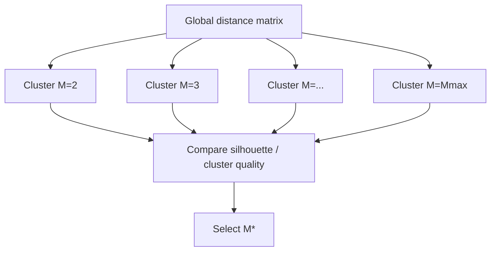

### Singleton clusters

Singleton clusters are valid and must not be automatically discarded.

A feature that is weakly correlated with the entire universe may represent genuinely new information. Its regime relevance is determined later by the regime-separation stage.

### Important distinction

`M*` means:

> number of statistically distinct feature-information clusters.

It does **not** mean:

> number of features the final HMM must use.

That second quantity is `L*` and is selected later.

---

## 8. Step 4 — Temporary cluster prototypes

The provisional HMM should not be fitted to all raw features if the universe is large.

Therefore one temporary prototype is chosen from each of the `M*` clusters.

A correlation medoid is a suitable deterministic prototype because it is the cluster member with the smallest average distance to the other members.

The prototype answers only:

> Which actual feature gives a neutral compact representation of this correlation cluster for initialization?

It does **not** answer:

> Which feature is most important for regime detection?

The prototype is temporary and is discarded after the regime-separation stage.

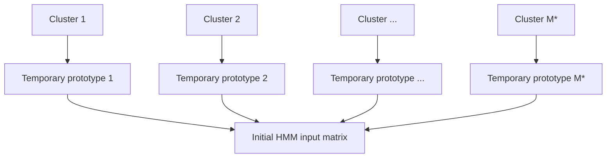

---

## 9. Step 5 — Initial HMM and provisional K*

### 9.1 Purpose

The initial HMM exists only to construct a common provisional regime reference.

It is a teacher model for feature scoring.

The initial model should remain deliberately simple to avoid coupling feature selection to unnecessary model-family complexity.

Canonical bootstrap family:

```text
Gaussian HMM
K ∈ {2, 3, 4, 5}
```

The existing deterministic multistart policy and HMM validity gates should be reused.

### 9.2 Inner expanding walk-forward

The provisional state count must be selected using causal evidence inside the current outer TRAIN sample.

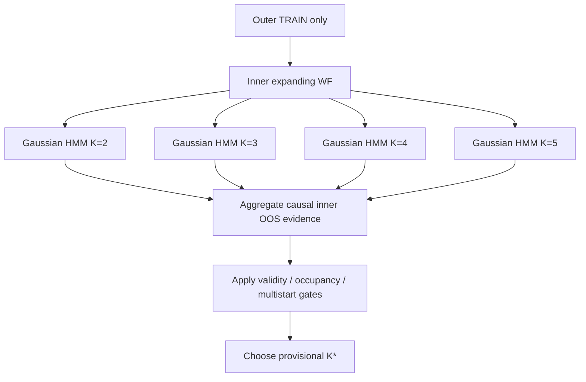

Each candidate is evaluated on the same temporary prototype feature matrix and same inner folds.

The primary evidence is causal OOS predictive likelihood. Secondary deterministic tie-breakers may reuse the current model-selection discipline, for example:

1. higher mean inner OOS predictive log-likelihood;
2. lower OOS dispersion;
3. better worst-fold predictive likelihood;
4. lower BIC;
5. lower AIC;
6. lower state count / deterministic candidate identity if all previous criteria tie.

The exact canonical ordering must be source-controlled.

The provisional selected count is:

\[
K^*_{provisional}.
\]

This value is not binding for the final model.

---

## 10. Step 6 — Causal provisional regime probabilities

After choosing `K*_provisional`, the initial HMM is used to generate a common causal state-probability reference over the inner OOS observations.

For each OOS timestamp `t`, retain filtered probabilities:

\[
\gamma_{tk}=P(S_t=k\mid X_1,\ldots,X_t).
\]

Filtered probabilities are preferred over full-sample smoothed probabilities because the latter condition on future observations.

Hard Viterbi labels are not sufficient for feature scoring because they discard uncertainty.

Example:

```text
Date        State0  State1  State2
2026-01-02   0.92    0.06    0.02
2026-01-03   0.49    0.46    0.05
2026-01-04   0.03    0.11    0.86
```

The second row is intrinsically uncertain and should not count as strongly toward any one state as the first or third row.

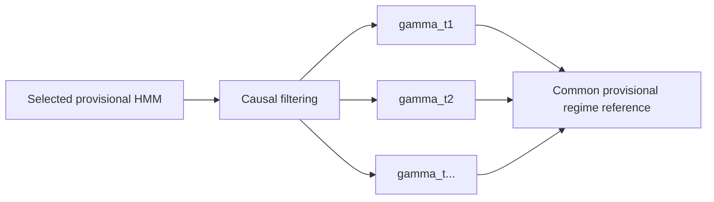

---

## 11. Step 7 — Regime-separation score for ALL original eligible features

This is the key feature-discovery stage.

The initial HMM saw only `M*` temporary prototypes, but the regime-separation calculation now returns to the full eligible universe of `N` features.

Every eligible feature is evaluated against the **same** provisional state probabilities.

No separate HMM needs to be fitted for each raw feature.

This has three advantages:

- feature scores are directly comparable because they share the same regime reference;
- computational cost remains low even as the feature universe grows;
- the procedure can identify a strong regime feature even when that feature was not the temporary cluster medoid.

### 11.1 Common causal support

Every raw feature is scored on the finite timestamps shared with the causal
teacher probabilities. Require at least `0.90` coverage of the teacher support
and at least `126` observations. No feature-specific HMM is fitted.

### 11.2 Primary state-information score

Average feature ranks are assigned to ten fixed bins and combined with the
teacher posterior masses. The primary score is the normalized mutual
information ratio:

\[
I_j=\sum_{b,k:p_{bj}>0}p_{bjk}\log\frac{p_{bjk}}{p_{bj}p_k},
\qquad
H_S=-\sum_{k:p_k>0}p_k\log p_k,
\qquad
R_j=I_j/H_S.
\]

`R_j` is persisted as `state_information_ratio`, must be finite and in
`[0,1]`, and is the only primary regime-separation score. A state entropy at
or below `1e-12` makes the score ineligible.

### 11.3 Secondary eta-squared diagnostic

On exactly the same feature-specific support, persist posterior-weighted state
occupancies, state means, between-state variance `B_j`, within-state variance
`W_j`, and:

\[
\eta_j^2=\frac{B_j}{B_j+W_j}.
\]

Eta-squared is diagnostic/secondary evidence only. It must never replace
`state_information_ratio` in cluster or global winner selection. It measures
regime discrimination, not causal influence.

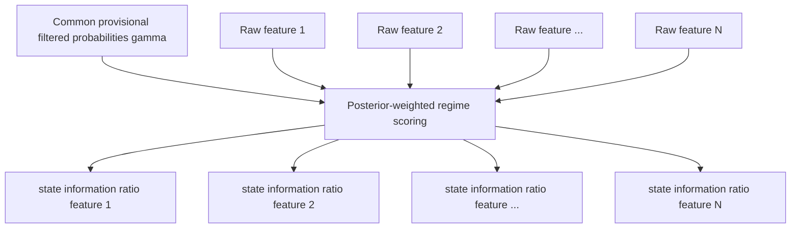

### 11.4 Missing observations

Feature `j` must be scored only on timestamps where:

- the causal provisional state probabilities exist;
- the feature value is observed and finite.

The score must store its effective observation count and coverage.

A minimum score-support threshold must be enforced to prevent a sparse feature from winning a cluster based on very little evidence.

---

## 12. Step 8 — Select the best regime feature inside every cluster

For cluster `c`, let `C_c` be its member features.

The cluster regime representative is:

\[
r_c=\arg\max_{j\in C_c}R_j.
\]

Deterministic ties must be resolved by source-controlled rules, for example:

1. higher `state_information_ratio`;
2. higher eta-squared diagnostic;
3. higher scoring-sample coverage;
4. higher observation count;
5. smaller canonical ordinal.

The temporary medoid/prototype is no longer relevant after this stage.

Example:

```text
Cluster 4
---------------------------------
vix_delta_1obs          ratio 0.48   <- final cluster winner
vstoxx_delta_1obs       ratio 0.43
vix_delta_5obs          ratio 0.41
ciss_delta_1obs         ratio 0.39
vix_level               ratio 0.18

Temporary prototype: vix_delta_5obs
Final cluster representative: vix_delta_1obs
```

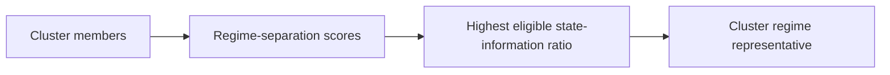

This is the central conceptual change from the old medoid architecture:

> correlation determines redundancy groups; regime separation determines which actual feature represents each group in the final candidate pool.

---

## 13. Step 9 — Rank cluster winners globally

After one winner is selected from each of the `M*` clusters, there are `M*` non-redundant regime candidate features.

Rank them globally by the same regime-separation evidence.

Example:

```text
Rank  Feature                  ratio
1     vix_delta_1obs           0.48
2     ciss_delta_1obs          0.43
3     vix_vix3m_ratio          0.39
4     move_level               0.34
5     euro_hy_oas_level        0.30
6     us_10y_minus_us_2y       0.27
...
12    usd_broad_delta_1obs     0.01
```

The clustering stage ensures that these candidates are representatives of different redundancy clusters.

The ranking stage does **not** automatically imply all `M*` should enter the final model.

---

## 14. Step 10 — Determine optimal final feature count L*

The number of statistical clusters `M*` is an upper bound on the final regime-feature count, not the final count itself.

A cluster can be statistically distinct while still being irrelevant to regime discrimination.

Therefore evaluate nested ranked prefixes:

```text
Top 2 cluster winners
Top 3 cluster winners
Top 4 cluster winners
...
Top min(M*, 8) cluster winners
```

This reduces the subset problem from a combinatorial search to a simple ordered sequence of at most `M*-1` candidate feature sets.

```mermaid
flowchart TD
    A[Ranked cluster winners] --> B2[Top 2]
    A --> B3[Top 3]
    A --> B4[Top 4]
    A --> BX[...]
    A --> BM[Top min(M*,8)]
    B2 --> C[Inner causal WF model evaluation]
    B3 --> C
    B4 --> C
    BX --> C
    BM --> C
    C --> D[Select optimal L*]
```

For each prefix length `L`, evaluate a source-controlled HMM comparison on the same inner folds.

The selected feature count is:

\[
L^*=\arg\max_L \text{InnerOOSModelEvidence}(L),
\]

with deterministic complexity-aware tie-breaking.

A practical tie policy should prefer the smaller `L` when predictive evidence is statistically indistinguishable, because unnecessary dimensions increase covariance-estimation risk and model instability.

This stage answers:

> How many of the statistically distinct cluster winners actually improve regime modelling?

---

## 15. Step 11 — Final feature set

The final selected feature tuple for the current outer fold is the first `L*` members of the globally ranked cluster-winner list.

Example:

```text
N = 180 eligible raw features
M* = 12 global redundancy clusters
L* = 7 selected regime features

Final features:
- vix_delta_1obs
- ciss_delta_1obs
- vix_vix3m_ratio
- move_level
- euro_hy_oas_level
- us_10y_minus_us_2y
- usd_broad_delta_20obs
```

The exact tuple, order, hashes, cluster memberships, scores, and selection evidence must be persisted for reproducibility.

---

## 16. Step 12 — Final HMM model-family and state-count search

The provisional Gaussian HMM must now be discarded as a selection aid.

The final feature tuple is evaluated using the production candidate model universe.

The existing candidate families may remain:

```text
Gaussian HMM       K = 2,3,4,5
GMM-HMM            K = 2,3,4,5
Student-t HMM      K = 2,3,4,5
```

All final candidates must:

- see the same final feature tuple;
- use the same inner/outer fold support where required;
- use deterministic multistart rules;
- pass the same validity and occupancy gates;
- be compared with causal OOS predictive evidence.

The final statistical champion can therefore have:

```text
K*_final != K*_provisional
```

and this is expected and valid.

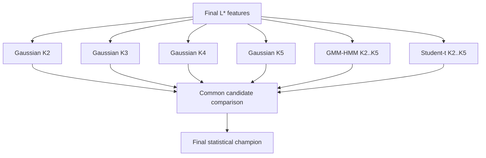

---

## 17. Step 13 — Outer OOS evaluation

Once the entire selection process has completed inside `Outer TRAIN_f`:

1. freeze `M*`, cluster membership, cluster winners, ranked winners, `L*`, final features, final model family, final `K*`, and all relevant configuration;
2. refit the selected final model on all usable observations in `Outer TRAIN_f`;
3. continue the fitted model causally into `Outer TEST_f`;
4. record OOS predictive likelihood, filtered probabilities, state diagnostics, occupancy, stability, and alignment evidence;
5. do not revise any selection decision using `Outer TEST_f`.


This outer test evidence is the basis for judging whether the complete adaptive selection policy generalizes.

---

## 18. Why the provisional regime reference must be common to all features

An alternative would be to fit an independent HMM for every raw feature.

That is rejected as the canonical feature-scoring method because every feature would then create its own regime definition.

Comparing feature A and feature B would no longer mean comparing their ability to explain the same latent partition.

The proposed architecture instead creates one provisional reference:

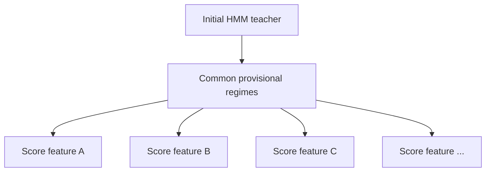

This makes regime-separation scores directly comparable across the complete feature universe.

---

## 19. Why raw HMM likelihood must not rank arbitrary feature subsets directly

Raw log-likelihoods for different observed random vectors are not directly comparable as a universal feature-importance score.

For example, a univariate model of:

```text
VIX change
```

and a multivariate model of:

```text
VIX change + MOVE + CISS + credit spread
```

are likelihoods for different-dimensional observations.

Therefore the architecture avoids statements such as:

> feature subset A is more important because its raw HMM likelihood is larger than feature subset B.

Instead:

- clustering handles redundancy;
- posterior-weighted separation handles per-feature regime discrimination;
- inner OOS model comparison handles the usefulness of nested final feature counts;
- the outer OOS loop evaluates the complete selected policy.

---

## 20. Feature-scoring reliability requirements

Every feature score should persist at least:

```text
feature_name
cluster_id
state_information_ratio
score_observation_count
score_coverage
state_weighted_means
state_weighted_variances
provisional_state_count
provisional_model_id
outer_fold_id
inner_plan_hash
source_build_id
feature_definition_hash
```

A feature must be ineligible to win its cluster when score support is below the source-controlled minimum.

No score may be based on:

- smoothed probabilities that use future observations;
- outer TEST observations;
- trading returns or portfolio performance unless the evaluation objective is explicitly changed in a future architecture version;
- manually privileged semantic categories.

---

## 21. Cluster-stability diagnostics

The canonical selection should remain causal and fold-local, but clustering stability should be measured because `M*` and memberships can change as the sample expands.

Recommended non-decision diagnostics include:

- selected `M*` by outer fold;
- silhouette curve by candidate `M`;
- adjusted Rand index / normalized mutual information between compatible clusterings on expanding samples;
- persistence of pairwise co-clustering relationships;
- cluster-size distribution;
- number of singleton clusters;
- identity changes of cluster winners;
- rank stability of regime-separation scores.

Example diagnostic history:

```text
Outer fold       M*
fold_01          11
fold_02          11
fold_03          12
fold_04          11
fold_05          11
fold_06          12
```

This does not invalidate adaptation. It quantifies how structurally stable the discovered feature representation is.

---

## 22. State-label alignment implications

The current regime engine requires persistent interpretation of latent states across folds.

Adaptive final feature tuples create a challenge because state signatures defined directly in model-feature coordinate space are not necessarily comparable when the selected input features change.

Therefore a future implementation of this architecture must explicitly choose one of the following:

1. **Fixed anchor-space state signatures** independent of selected model inputs; or
2. state alignment based on an invariant set of economic observables/statistics; or
3. declare state labels fold-local and only compare label-invariant quantities across folds.

This issue is independent of feature clustering and must not be hidden by assuming that state index `2` in one fold automatically means state index `2` in another fold.

Until invariant alignment is implemented, cross-fold analyses should rely on label-invariant quantities whenever possible.

---

## 23. Determinism and reproducibility

The entire procedure must be reproducible from explicit inputs and versioned policy.

Persist hashes/identities for:

- source build;
- quality-filter policy;
- eligible feature universe;
- pairwise distance matrix definition;
- clustering algorithm and version;
- candidate `M` range;
- selected `M*`;
- cluster memberships;
- temporary prototypes;
- inner walk-forward plan;
- provisional HMM configuration;
- filtered probability evidence;
- regime-separation score definition;
- cluster winners and ranking;
- candidate `L` range;
- selected `L*`;
- final feature tuple;
- final model grid;
- selected final champion;
- outer walk-forward plan.

Randomized algorithms must use fixed source-controlled seeds, and result ordering must be canonicalized before persistence.

---

## 24. MLflow evidence model

The evaluation should expose enough evidence to answer not merely which model won, but why each feature survived.

Recommended MLflow hierarchy:

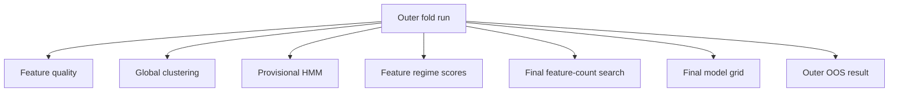

Recommended logged artifacts/metrics include:

### Global clustering

```text
N_eligible
M_star
silhouette_M_2
silhouette_M_3
...
cluster_membership.csv
cluster_sizes.csv
cluster_distance_matrix metadata/hash
```

### Provisional HMM

```text
provisional_model_family = gaussian_hmm
provisional_K_star
inner_oos_pll_mean
inner_oos_pll_std
inner_oos_pll_worst
valid_fold_rate
occupancies
```

### Feature regime scores

```text
feature_scores.csv
feature_name
cluster_id
eta_squared (diagnostic)
coverage
state_mean_0
state_mean_1
...
cluster_winner
```

### Final feature-count selection

```text
L_candidate
feature_tuple
best_inner_model_id
inner_oos_pll_mean
inner_oos_pll_std
inner_oos_pll_worst
validity evidence
L_star
```

### Final model grid

Reuse the existing candidate-level evidence and statistical champion outputs.

---

## 25. Complexity characteristics

The design is intentionally bounded.

For `N` raw features:

- pairwise redundancy calculation is approximately `O(N^2)` pairwise dependence estimates;
- clustering searches only a bounded `M` range;
- the provisional HMM uses only `M*` dimensions;
- raw-feature regime scoring is approximately linear in `N × T × K` once provisional probabilities exist;
- final feature-count search evaluates only nested prefixes rather than all subsets.

The architecture therefore avoids the combinatorial search:

\[
2^N
\]

that would arise from unrestricted subset optimization.

For a large universe such as 500 features, the pair count is:

\[
\frac{500\times499}{2}=124750,
\]

which is tractable and far cheaper than thousands or millions of HMM subset evaluations.

---

## 26. Full nested evaluation diagram

```mermaid
flowchart TD
    subgraph OUTER[Outer expanding walk-forward fold]
        OT[Outer TRAIN]
        OE[Outer TEST - untouched]

        subgraph SELECT[Selection inside Outer TRAIN only]
            Q[Quality filter]
            R[Global abs-Spearman matrix]
            CL[Global clustering M candidates]
            MS[Select M*]
            TP[Temporary cluster prototypes]

            subgraph PROV[Provisional regime teacher]
                IW[Inner expanding WF]
                GK[Gaussian HMM K=2..5]
                PK[Select provisional K*]
                GP[Causal filtered OOS probabilities gamma]
            end

            FS[Score ALL raw eligible features with state-information ratio]
            CW[Choose best feature in each cluster]
            RR[Rank cluster winners]

            subgraph LF[Final feature-count search]
                L2[Top 2]
                L3[Top 3]
                LX[...]
                LM[Top min(M*,8)]
                LC[Inner OOS comparison]
                LS[Select L*]
            end

            FF[Final L* feature tuple]
            MG[Full production HMM candidate grid]
            FC[Select final model and K*]
        end

        OT --> Q --> R --> CL --> MS --> TP
        TP --> IW --> GK --> PK --> GP
        GP --> FS
        OT --> FS
        FS --> CW --> RR
        RR --> L2
        RR --> L3
        RR --> LX
        RR --> LM
        L2 --> LC
        L3 --> LC
        LX --> LC
        LM --> LC
        LC --> LS --> FF --> MG --> FC
        FC --> REFIT[Refit selected model on all Outer TRAIN]
        REFIT --> OE
        OE --> OOS[Record one-shot causal outer OOS evidence]
    end
```

---

## 27. Decision semantics

The architecture uses precise terminology:

### `feature cluster`
A group of features with similar monotonic information according to global absolute Spearman distance.

### `temporary prototype`
A deterministic actual feature used only to construct the provisional HMM input representation.

### `provisional regime`
A latent state inferred by the temporary Gaussian HMM inside TRAIN and used solely as a common reference for feature scoring.

### `regime-separation score`
A posterior-weighted bounded effect size describing how strongly a feature differs across the provisional regimes.

### `cluster regime representative`
The eligible member of a feature cluster with the strongest regime-separation evidence.

### `L*`
The number of ranked cluster representatives supported by inner causal OOS model evidence.

### `final statistical champion`
The production-model candidate selected using the final `L*` feature tuple and the canonical model-selection rules.

The term **feature importance** may be used operationally, but it must be understood as statistical regime discrimination, not causal attribution.

---

## 28. Rejected alternatives

### Fixed semantic-group medoids
Rejected because they impose the number and composition of feature representatives before observing the global redundancy structure.

### Final selection by statistical medoid
Rejected because correlation centrality answers which feature is most representative of its neighbors, not which feature best discriminates latent regimes.

### Unrestricted Optuna feature-subset search
Rejected as the default architecture because it introduces combinatorial search, substantial multiple-testing risk, greater computational cost, and weaker interpretability.

### Independent HMM for every raw feature as the primary score
Rejected because every feature would generate a different regime target, reducing comparability of feature scores.

### Full-sample Viterbi/smoothed-state scoring
Rejected because future observations influence historical state assignment.

### Selecting features using outer OOS performance
Rejected because it leaks test information into the selection process.

---

## 29. Canonical implementation sequence

The implementation should be staged so each component can be tested independently.


The current production path should not be silently mutated during development. The redesigned architecture should be introduced under an explicit new evaluation/profile version, validated against existing deterministic fixtures, and promoted only after OOS evidence is available.

---

## 30. Summary

The new evaluation architecture replaces semantic-group medoid selection with a fully global, statistically driven process.

The central logic is:

```text
all features
    -> global redundancy clustering
    -> optimal cluster count M*
    -> temporary prototypes
    -> provisional causal HMM regimes
    -> regime-separation score for every raw feature
    -> best feature per cluster
    -> ranked non-redundant regime features
    -> optimal final feature count L*
    -> final production HMM/model-state search
    -> strict outer expanding-WF OOS evaluation
```

This design deliberately separates redundancy, regime discrimination, feature-count selection, and latent-state/model selection.

It remains simple enough to audit, scales to a much larger feature universe, does not require semantic groups or unrestricted feature-subset optimization, and provides a direct explanation for why each retained feature is present in the final regime model.
