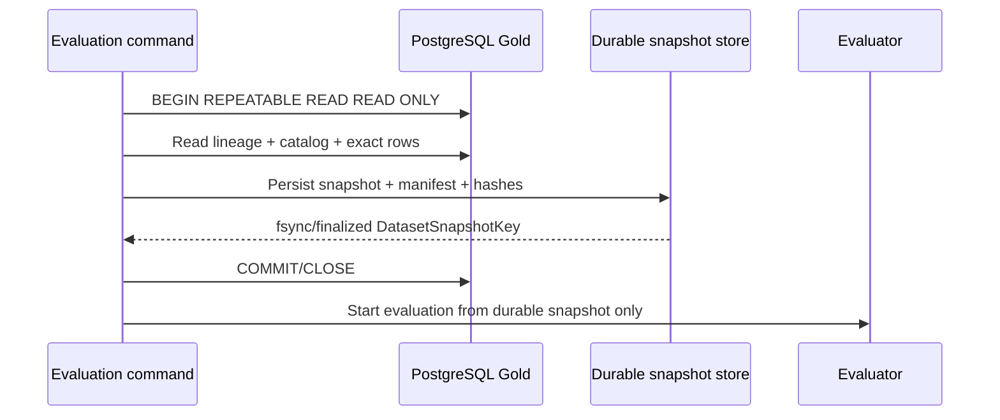
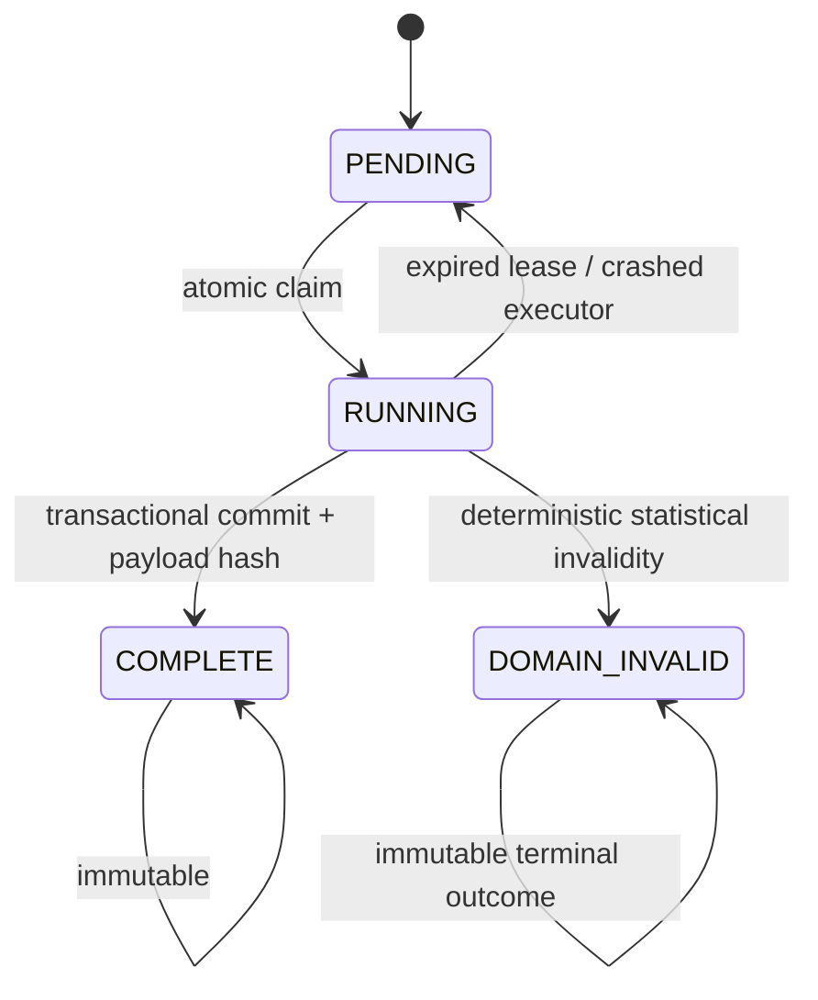
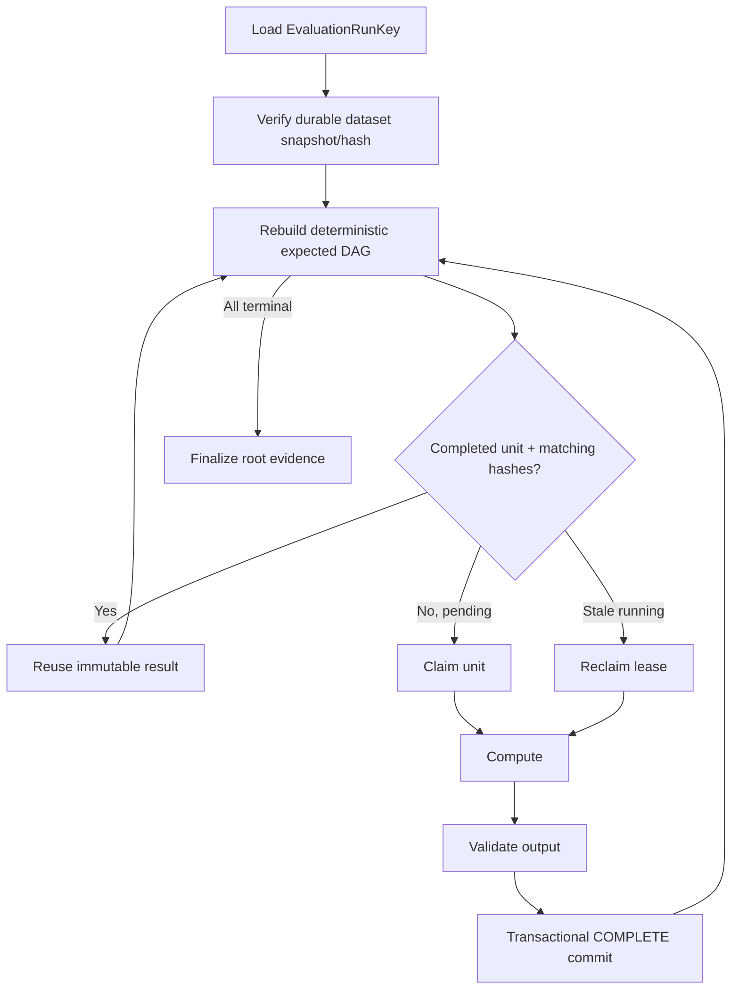

# Regime Engine — One-Shot, Dataset-Pinned Evaluation Execution

Status date: 2026-09-10

This document is the authoritative execution contract for the active Xetra v4
full evaluation, audit, deployment-selection, and lifecycle workflows.

The statistical contract remains defined by `EVALUATION.md`. This document
defines how one full evaluation is bound to data and code, how its evidence is
written durably, and what happens after interruption.

The full evaluator is intentionally one-shot. It does not track a computation
position, expose a run-key resume command, or resume completed HMM/discovery/
tracking work. After interruption, the next invocation captures a new source
snapshot and recomputes the complete evaluation from the beginning. Historical
resumable-executor requirements below are superseded where they conflict with
this explicit production contract; the reusable executor remains test
infrastructure only.

The requirements here are incorporated into the active implementation backlog
and PR-210's canonical v4 contract.

---

## 1. Non-negotiable invariants

Every public full evaluation execution must satisfy these two properties:

1. **Dataset pinned** — the evaluation is bound to one immutable dataset snapshot identity before statistical work starts.
2. **Evidence-pinned** — the resulting evidence records the complete source,
   profile, plan, code, dependency, runtime, and audit identities.

A run that cannot prove both properties is not production-eligible. A restart
after interruption is a new one-shot invocation, not a continuation.


---

## 2. Dataset snapshot identity

An evaluation must never be identified only by a profile name, wall-clock date, MLflow run ID, or current table contents.

The canonical dataset snapshot identity is derived from validated source lineage plus the exact dynamic feature catalog.

The required identity fields are:

```text
source_dataset
source_build_id
data_sha256
schema_version
feature_version
data_time_semantics
row_count
min_timestamp
max_timestamp
source_catalog_hash
materialized_feature_data_sha256
materialized_row_count
materialized_min_timestamp
materialized_max_timestamp
```

The canonical snapshot key is:

```text
dataset_snapshot_key = SHA256(canonical_json(required identity fields))
```

Rules:

- `source_build_id` and `data_sha256` are both mandatory; neither substitutes for the other.
- `schema_version` and `feature_version` are part of identity, not informational tags.
- `source_catalog_hash` binds exact feature names, ordinals and PostgreSQL types.
- `materialized_feature_data_sha256` binds the exact schema-wide materialized
  matrix, including deterministic timestamp order and explicit nulls.
- Materialized row count and timestamp bounds bind the complete timestamp
  union, not only the lineage of one legacy table.
- timestamp bounds and row count are part of identity to detect inconsistent lineage.
- all hashes use lowercase SHA-256 over canonical finite-only JSON.
- a changed source build, data hash, schema/feature version or catalog produces a different dataset snapshot key.

### 2.1 Durable materialization before model work

The source must be captured once from a validated `REPEATABLE READ READ ONLY` transaction and durably materialized before expensive statistical work begins.

The durable snapshot must contain the exact ordered timestamps and feature values used by the evaluation plus a manifest containing the dataset snapshot identity.

After the durable snapshot is finalized:

- the database transaction is closed;
- inner/outer evaluation reads only the durable snapshot;
- the current invocation reads only the durable snapshot;
- a later change to the live PostgreSQL table cannot alter an in-progress run;
- an interrupted later invocation captures a fresh snapshot instead of
  silently reusing a computation position or an old run identity.

If the durable snapshot bytes are missing or fail their persisted file/content hash, the run fails closed. It must not reconstruct the old run from a newer live dataset.

The canonical implementation is
`market_regime_engine.evaluation_runs.ArrowDatasetSnapshotStore`. It writes a
PyArrow IPC file plus a manifest containing the Arrow-file SHA-256, exact
serialized Arrow schema, row count, timestamp bounds and dataset identity. It
uses temp-write -> flush/fsync -> atomic rename and refuses partial, corrupted,
or changed bytes. `DatasetSnapshotIdentity.from_catalog(...)` binds the source
lineage, discovered catalog, materialized matrix hash, row count, and bounds.



---

## 3. Evaluation run identity

The logical evaluation identity must include the dataset and every source-controlled input capable of changing statistical output.

The minimum canonical fields are:

```text
evaluation_id
profile_id
profile_config_version
profile_hash
evaluation_contract_version
evaluation_plan_hash
dataset_snapshot_key
evaluation_cutoff / selection cutoff as applicable
repository_commit_sha
uv_lock_sha256
python_version
```

The canonical key is:

```text
evaluation_run_key = SHA256(canonical_json(all statistical identity fields))
```

Operational properties such as hostname, PID, start time, worker ID, MLflow run ID, temporary directory and lease timestamps are **not** part of the statistical key.

Consequences for one invocation:

- the evidence identity includes the dataset, profile, evaluation plan,
  repository, dependency lock, and Python identities;
- changed dataset, profile/config, plan/cutoff, code commit, or dependency lock
  produces a distinct evidence identity;
- an old interrupted invocation is never resumed by a new code build.

A deliberate evaluation with changed code is a new evaluation, not a
continuation of an old one.

---

## 4. Evidence and lifecycle idempotency

The public full-evaluation command is a one-shot computation, not
**resume-or-return**. It does not select an incomplete run or reuse completed
statistical work after interruption.

Within one successful invocation:

```text
capture snapshot -> compute every required stage -> audit -> track -> publish
```

Evidence files, summaries, and registered artifacts are immutable after
publication. A later invocation uses a fresh invocation/evidence identity and
must not overwrite or masquerade as the interrupted invocation. Registry
mutations remain protected by compare-and-set lifecycle rules so one successful
publication cannot create a duplicate challenger version.

The separate metric-export harness has a narrower idempotency contract: it may
reconcile missing metric points for one metric batch, but this does not resume
any statistical computation.

---

## 5. Historical reusable executor (not the public full evaluator)

The following run-ledger/work-unit sections describe reusable infrastructure
and its local QA only. They do not authorize or require wiring a computation-
position ledger into the public one-shot Xetra v4 evaluator. That evaluator
uses the immutable snapshot for the current invocation and recomputes from the
beginning after interruption.

Evaluation progress must live in a durable store outside process memory.

The implementation uses `SQLiteEvaluationRunStore`, a repository-owned
SQLite backend with transactional compare-and-set semantics for work-unit
state. It survives process/container restart when its explicitly configured
root is on a persistent mounted volume.

The run store records at least:

```text
evaluation_run_key
dataset_snapshot_key
run_status
root_identity_hash
work_unit_key
work_unit_input_hash
work_unit_status
payload_hash
payload_location / payload bytes
attempt metadata
lease owner / lease expiry
created/updated operational timestamps
```

Canonical statistical payloads remain separate from operational lease/timestamp metadata.

The finer-grained quality, distance, clustering, teacher-candidate, prefix,
and final-grid units listed below are represented by
`EvaluationWorkGraph`; integration into the outer evaluator remains required
before the full stage-level resume claim is closed.

### 5.1 Work-unit state machine



`DOMAIN_INVALID` is not an infrastructure error. It is a deterministic completed outcome such as an insufficient model clock, no valid HMM candidate, or failed statistical gate. It is cached and must not be retried forever.

A technical interruption leaves the unit reclaimable after its lease expires. The next executor retries only that incomplete unit.

---

## 6. Historical work-unit granularity

Resume granularity must be small enough that an expensive multi-hour run does not lose substantial completed work.

At minimum, the v4 evaluation graph checkpoints the following logical units independently:

```text
snapshot capture/finalization
outer fold TRAIN discovery stages
  quality
  distance
  clustering/M*
  prototypes
  model-clock preflight
provisional teacher
  each K candidate x inner fold
  teacher aggregation/reference
all-feature scoring
cluster winners
prefix search
  each L x K candidate x inner fold
  per-L winner/agreement
final model grid
  each final candidate x inner fold
outer TEST
  final-model refit/test
  frozen-teacher refit/test
  outer agreement/result
outer-policy aggregation
deployment selection
full-source audit verification stages
```

For multistart HMM work, `HMMSeedCheckpoint` checkpoints each deterministic
seed fit as a child unit so that a crash after six of eight completed seeds
does not force those six fits to run again. The remaining requirement is to
thread this context through every v4 candidate/fold runner.

A work-unit key must be structural and deterministic, for example:

```text
outer/fold_003/teacher/gaussian_k4/inner/fold_005
outer/fold_003/prefix/L06/gaussian_k3/inner/fold_004
outer/fold_003/final/student_t_k5/inner/fold_006
```

MLflow run IDs must never be used as work-unit keys.

---

## 7. Historical work-unit input hashes

Every unit is bound to the exact output hashes of its parents plus its own source-controlled parameters.

Example:

```text
work_unit_input_hash = SHA256(canonical_json({
    evaluation_run_key,
    unit_type,
    unit_coordinates,
    parent_payload_hashes,
    feature_tuple,
    fold_plan_hash,
    candidate_id,
    fixed numerical settings
}))
```

On resume:

- `COMPLETE` + matching input hash + valid payload hash => reuse;
- `COMPLETE` + mismatching input hash => fail closed as contract/corruption drift;
- missing payload/hash => fail closed;
- stale `RUNNING` => reclaim and recompute that unit only;
- `DOMAIN_INVALID` + matching input hash => reuse terminal invalid outcome.

No implicit cache invalidation or best-effort overwrite is allowed.

---

## 8. Historical resume algorithm (not used by the public full evaluator)

The runner reconstructs the expected deterministic DAG from the persisted run identity and code version, then compares it with the ledger.



The resume path must never use "last log line" or wall-clock heuristics. Progress is defined only by durable completed units and validated dependency hashes.

---

## 9. Historical crash-consistency requirements

A unit is complete only after all of the following succeed:

1. numerical/statistical validation;
2. canonical payload serialization;
3. payload SHA-256 computation;
4. durable payload write;
5. durable transaction/manifest commit marking the unit `COMPLETE`.

The implementation must use transaction boundaries or temp-write + `fsync` + atomic rename semantics so a crash cannot expose a half-written payload as complete.

If a crash occurs after computation but before completion commit, that unit is recomputed after lease recovery. This is acceptable because the unit is deterministic and idempotent.

There is no requirement to resume inside one floating-point matrix operation or one EM iteration.

---

## 10. Historical concurrency and duplicate-invocation requirements

Only one executor may own one work unit at a time.

Concurrent invocations of the same `evaluation_run_key` must either:

- attach to the same run and claim different available units where supported; or
- fail/return with an explicit "run already active" result.

They must never create two independent logical runs for the same run key.

Claims use atomic compare-and-set plus leases. A lease is operational metadata and can expire. Completion is immutable and cannot expire.

Two workers completing the same deterministic unit because of a lease race must be prevented by the store's completion CAS/unique constraint. A second conflicting payload hash is a hard error.

---

## 11. Source drift during an in-progress evaluation

Once a dataset snapshot is finalized, later live source drift is irrelevant to that run.

The runner must not repeatedly compare the active run with the current Gold table and abort merely because a new source build appeared. It finishes the pinned run from its durable snapshot.

A later scheduled model cycle sees the newer source build and receives a new `dataset_snapshot_key` and therefore a new `evaluation_run_key`.

This is different from the **initial snapshot capture transaction**, where lineage/catalog/rows must be internally consistent before finalization.

For the initial audited cutover where a particular validated dataset build is required by policy, the required dataset snapshot key is supplied explicitly and mismatch fails before evaluation.

---

## 12. MLflow relationship

MLflow is evidence/tracking, not the source of statistical identity.

Required behavior for one completed full-run projection:

- persist `evaluation_run_key` and `dataset_snapshot_key` as immutable run tags/params;
- use stable source/evidence identity tags and canonical candidate/fold keys;
- child tracking corresponds to canonical evidence units, not resume positions;
- tracking timestamps and MLflow run IDs do not enter canonical statistical hashes;
- an interrupted full evaluation is rerun from the beginning;
- the separate metric-export harness may replay missing metric points without
  recomputing statistics;
- contradictory MLflow evidence for the same work-unit key/payload hash is a hard integrity error.

The completed snapshot and audit evidence are authoritative for the current
invocation; the reusable historical ledger is not a public full-run progress
source.

---

## 13. Completed-run and lifecycle behavior

A completed evaluation publishes immutable evidence for that invocation. A
later model cycle captures a fresh source snapshot and starts a new one-shot
evaluation. Registry mutation remains separately protected by compare-and-set
lifecycle rules and must not create a duplicate challenger model version.

Registry mutation remains separately protected by compare-and-set lifecycle
rules so a successful publication cannot register the same artifact twice.

---

## 14. CLI semantics

The normal operator command starts one complete, non-resumable evaluation.

Required semantics:

```text
evaluate xetra
    capture the current validated dataset snapshot and run every stage

after interruption
    invoke evaluate xetra again; capture a new snapshot and restart from the beginning
```

There is no public `--run-key` resume command. A configured cycle lock prevents
two full evaluations from running concurrently.

---

## 15. QA contract

The active full-evaluation QA proves one-shot correctness, not
computation-position resume. It must cover:

- dataset pin: mutate live source after durable capture; the current
  invocation remains bound to its immutable snapshot;
- dataset mismatch/corruption: invalid snapshot bytes fail closed;
- complete dynamic catalog, source/search bounds, and mandatory PCA identity;
- deterministic one-shot hermetic execution with independent mathematical
  recomputation;
- all required candidate/prefix/fold evidence and exact final hashes;
- source identity unchanged between capture and independent audit;
- tracking/export conflicts fail closed and metric-batch retry creates no
  duplicate or conflicting points;
- registration crash safety and compare-and-set lifecycle behavior;
- interruption semantics: an interrupted full evaluation is not resumed and a
  subsequent invocation starts from a new complete source capture.

The dedicated metric-export harness may separately test interrupted-versus-
uninterrupted metric history parity. That test does not assert or imply
statistical full-run resume.

---

## 16. Required integration into the active backlog

The active backlog must treat source pinning, one-shot lifecycle semantics,
independent audit evidence, and metric-export retry safety as cross-cutting
requirements, not as late operational enhancements.

At minimum:

- **PR-210**: add `DatasetSnapshotIdentity`, `EvaluationRunIdentity`, `WorkUnitIdentity` and canonical hash contracts.
- **PR-212/213**: capture and durably materialize the exact dynamic dataset snapshot before model work; persist dataset snapshot key and file/content hash.
- **PR-219/220**: ensure candidate/fold evaluation is deterministic and
  process-parallel without requiring public resume state.
- **PR-221/226/227**: evaluate all provisional, prefix, and final candidates
  in one complete invocation; reusable checkpoint tests are not public full-run
  semantics.
- **PR-229**: include source/evidence identity and audit hashes while
  excluding operational timestamps from canonical statistics.
- **PR-230**: make MLflow metric export idempotent and retry-safe without
  tracking full-run computation position.
- **PR-231**: add deterministic one-shot hermetic proof and independent
  mathematical evidence.
- **PR-232**: full-Xetra audit must use one complete source snapshot and must
  rerun from the beginning after interruption.
- **PR-233**: deployment selection is a deterministic post-evaluation step
  bound to the completed source/evidence identity.
- **PR-237**: recurring evaluation/refit/register lifecycle is idempotent end-to-end, including duplicate-registration prevention.
- **PR-241**: final operations/documentation explains snapshot pinning,
  evidence identity, one-shot restart, corruption recovery and operator
  commands.

Two implementation concerns must be explicit in backlog planning:

1. the immutable source snapshot and independent audit evidence must be
   finalized before tracking/publication;
2. seed/candidate/fold checkpointing may remain reusable local infrastructure,
   but it must not be exposed as a resume mode for the full evaluator.

No public evaluation path may bypass the source/evidence identity and durable
snapshot contract. No public path may expose a computation-position resume
mode for the full evaluator.

---

## 17. Definition of done

The execution contract is complete only when all of the following are true:

- every evaluation has an explicit dataset snapshot key;
- the exact source rows used by a run survive process/container restart;
- every invocation has a deterministic source/evidence identity that includes
  dataset, profile, plan, code and dependency identity;
- a completed invocation publishes immutable evidence and a later invocation
  starts a fresh complete run;
- computation-position resume is not exposed by the full evaluator;
- snapshot and audit bytes are immutable and hash-verified;
- newer live data cannot contaminate the current invocation;
- metric-export retries do not duplicate or conflict with existing points;
- duplicate concurrent execution cannot publish contradictory artifacts;
- challenger lifecycle actions are logically exactly-once;
- deterministic one-shot hermetic runs match their independent golden evidence;
- an interrupted full current-Xetra invocation is rerun from the beginning.
