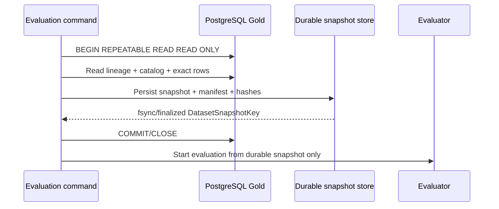
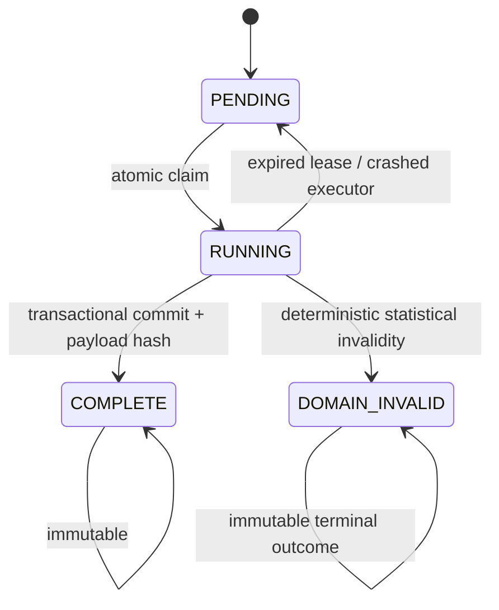
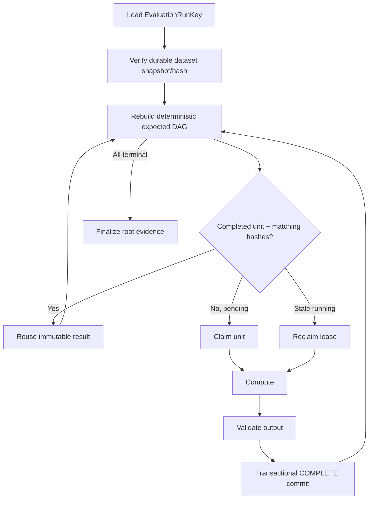

# Regime Engine — Dataset-Pinned, Idempotent and Resumable Evaluation Execution

Status date: 2026-09-09

This document is an authoritative cross-cutting execution contract for **all evaluation workflows** in `regime-engine`, including legacy compatibility evaluations while they remain callable, Xetra v4 inner/outer evaluations, full-source audit evaluations, deployment-selection evaluations, and future evaluation families.

The statistical contract remains defined by `EVALUATION.md`. This document defines how an evaluation is bound to data and code, how work is committed durably, and how an interrupted run resumes without silently changing its dataset or recomputing already completed work.

The requirements here must be incorporated into the active implementation backlog and into PR-210's canonical v4 contract before v4 orchestration is considered complete.

---

## 1. Non-negotiable invariants

Every public evaluation execution must satisfy all three properties:

1. **Dataset pinned** — the evaluation is bound to one immutable dataset snapshot identity before statistical work starts.
2. **Idempotent** — invoking the same evaluation again with the same complete identity returns/reuses the same logical run and cannot create a statistically different result.
3. **Resumable** — after process, container, host, network, or tracking failure, execution resumes from the last durably completed atomic work unit instead of restarting the whole evaluation.

A run that cannot prove all three properties is not production-eligible.


---

## 2. Dataset snapshot identity

An evaluation must never be identified only by a profile name, wall-clock date, MLflow run ID, or current table contents.

The canonical dataset snapshot identity is derived from validated source lineage plus the exact dynamic feature catalog.

The required identity fields are:

```text
source_dataset
source_build_id
data_sha256
schema_version
feature_version
data_time_semantics
row_count
min_timestamp
max_timestamp
source_catalog_hash
materialized_feature_data_sha256
materialized_row_count
materialized_min_timestamp
materialized_max_timestamp
```

The canonical snapshot key is:

```text
dataset_snapshot_key = SHA256(canonical_json(required identity fields))
```

Rules:

- `source_build_id` and `data_sha256` are both mandatory; neither substitutes for the other.
- `schema_version` and `feature_version` are part of identity, not informational tags.
- `source_catalog_hash` binds exact feature names, ordinals and PostgreSQL types.
- `materialized_feature_data_sha256` binds the exact schema-wide materialized
  matrix, including deterministic timestamp order and explicit nulls.
- Materialized row count and timestamp bounds bind the complete timestamp
  union, not only the lineage of one legacy table.
- timestamp bounds and row count are part of identity to detect inconsistent lineage.
- all hashes use lowercase SHA-256 over canonical finite-only JSON.
- a changed source build, data hash, schema/feature version or catalog produces a different dataset snapshot key.

### 2.1 Durable materialization before model work

The source must be captured once from a validated `REPEATABLE READ READ ONLY` transaction and durably materialized before expensive statistical work begins.

The durable snapshot must contain the exact ordered timestamps and feature values used by the evaluation plus a manifest containing the dataset snapshot identity.

After the durable snapshot is finalized:

- the database transaction is closed;
- inner/outer evaluation reads only the durable snapshot;
- restart/resume reads only the durable snapshot;
- a later change to the live PostgreSQL table cannot alter an in-progress run;
- a resume operation must not silently recapture the current live table under the old run identity.

If the durable snapshot bytes are missing or fail their persisted file/content hash, the run fails closed. It must not reconstruct the old run from a newer live dataset.



---

## 3. Evaluation run identity

The logical evaluation identity must include the dataset and every source-controlled input capable of changing statistical output.

The minimum canonical fields are:

```text
evaluation_id
profile_id
profile_config_version
profile_hash
evaluation_contract_version
evaluation_plan_hash
dataset_snapshot_key
evaluation_cutoff / selection cutoff as applicable
repository_commit_sha
uv_lock_sha256
python_version
```

The canonical key is:

```text
evaluation_run_key = SHA256(canonical_json(all statistical identity fields))
```

Operational properties such as hostname, PID, start time, worker ID, MLflow run ID, temporary directory and lease timestamps are **not** part of the statistical key.

Consequences:

- same dataset + same profile + same evaluation plan + same code/dependency identity => same run key;
- changed dataset => new run;
- changed profile/config => new run;
- changed evaluation plan/cutoff => new run;
- changed code commit or dependency lock => new run;
- an old interrupted run must not be resumed by a new incompatible code build.

A deliberate evaluation with changed code is a new logical evaluation, not a continuation of the old one.

---

## 4. Idempotency semantics

The default public command is **resume-or-return**, never blind restart.

For one `evaluation_run_key`:

```text
no run exists      -> create run, execute
run is incomplete  -> resume missing/reclaimable work units
run is complete    -> return existing result/evidence, perform no statistical recomputation
run is corrupted   -> fail closed
```

A completed logical work unit is immutable. The implementation may not overwrite a completed unit with new bytes under the same unit key.

A completed evaluation has exactly one canonical result root hash.

Repeating the same command must therefore satisfy:

```text
same evaluation_run_key
same dataset_snapshot_key
same completed work-unit payload hashes
same final statistical evidence SHA-256
same selected configuration
same numerical outputs within exact contract/tolerances
```

MLflow operational metadata may differ only where the tracking backend itself requires timestamps, but the same logical evaluation must attach to/reuse the already persisted evaluation identity and canonical evidence rather than create a second statistically distinct evaluation.

---

## 5. Durable run ledger

Evaluation progress must live in a durable store outside process memory.

The first implementation should use a simple repository-owned `EvaluationRunStore` protocol with one crash-safe persistent backend. The backend must provide transactional compare-and-set semantics for work-unit state and must survive process/container restart on a mounted persistent volume.

The run store records at least:

```text
evaluation_run_key
dataset_snapshot_key
run_status
root_identity_hash
work_unit_key
work_unit_input_hash
work_unit_status
payload_hash
payload_location / payload bytes
attempt metadata
lease owner / lease expiry
created/updated operational timestamps
```

Canonical statistical payloads remain separate from operational lease/timestamp metadata.

### 5.1 Work-unit state machine



`DOMAIN_INVALID` is not an infrastructure error. It is a deterministic completed outcome such as an insufficient model clock, no valid HMM candidate, or failed statistical gate. It is cached and must not be retried forever.

A technical interruption leaves the unit reclaimable after its lease expires. The next executor retries only that incomplete unit.

---

## 6. Atomic work-unit granularity

Resume granularity must be small enough that an expensive multi-hour run does not lose substantial completed work.

At minimum, the v4 evaluation graph checkpoints the following logical units independently:

```text
snapshot capture/finalization
outer fold TRAIN discovery stages
  quality
  distance
  clustering/M*
  prototypes
  model-clock preflight
provisional teacher
  each K candidate x inner fold
  teacher aggregation/reference
all-feature scoring
cluster winners
prefix search
  each L x K candidate x inner fold
  per-L winner/agreement
final model grid
  each final candidate x inner fold
outer TEST
  final-model refit/test
  frozen-teacher refit/test
  outer agreement/result
outer-policy aggregation
deployment selection
full-source audit verification stages
```

For multistart HMM work, the target design checkpoints each deterministic seed fit as an optional finer-grained child unit so that a crash after six of eight completed seeds does not force those six fits to run again. If seed-level checkpointing is not implemented in the first resumability PR, candidate/fold-level checkpointing is the minimum accepted granularity and seed-level checkpointing remains explicit technical debt with a dedicated backlog item.

A work-unit key must be structural and deterministic, for example:

```text
outer/fold_003/teacher/gaussian_k4/inner/fold_005
outer/fold_003/prefix/L06/gaussian_k3/inner/fold_004
outer/fold_003/final/student_t_k5/inner/fold_006
```

MLflow run IDs must never be used as work-unit keys.

---

## 7. Work-unit input hashes

Every unit is bound to the exact output hashes of its parents plus its own source-controlled parameters.

Example:

```text
work_unit_input_hash = SHA256(canonical_json({
    evaluation_run_key,
    unit_type,
    unit_coordinates,
    parent_payload_hashes,
    feature_tuple,
    fold_plan_hash,
    candidate_id,
    fixed numerical settings
}))
```

On resume:

- `COMPLETE` + matching input hash + valid payload hash => reuse;
- `COMPLETE` + mismatching input hash => fail closed as contract/corruption drift;
- missing payload/hash => fail closed;
- stale `RUNNING` => reclaim and recompute that unit only;
- `DOMAIN_INVALID` + matching input hash => reuse terminal invalid outcome.

No implicit cache invalidation or best-effort overwrite is allowed.

---

## 8. Resume algorithm

The runner reconstructs the expected deterministic DAG from the persisted run identity and code version, then compares it with the ledger.



The resume path must never use "last log line" or wall-clock heuristics. Progress is defined only by durable completed units and validated dependency hashes.

---

## 9. Crash-consistency requirements

A unit is complete only after all of the following succeed:

1. numerical/statistical validation;
2. canonical payload serialization;
3. payload SHA-256 computation;
4. durable payload write;
5. durable transaction/manifest commit marking the unit `COMPLETE`.

The implementation must use transaction boundaries or temp-write + `fsync` + atomic rename semantics so a crash cannot expose a half-written payload as complete.

If a crash occurs after computation but before completion commit, that unit is recomputed after lease recovery. This is acceptable because the unit is deterministic and idempotent.

There is no requirement to resume inside one floating-point matrix operation or one EM iteration.

---

## 10. Concurrency and duplicate invocation

Only one executor may own one work unit at a time.

Concurrent invocations of the same `evaluation_run_key` must either:

- attach to the same run and claim different available units where supported; or
- fail/return with an explicit "run already active" result.

They must never create two independent logical runs for the same run key.

Claims use atomic compare-and-set plus leases. A lease is operational metadata and can expire. Completion is immutable and cannot expire.

Two workers completing the same deterministic unit because of a lease race must be prevented by the store's completion CAS/unique constraint. A second conflicting payload hash is a hard error.

---

## 11. Source drift during an in-progress evaluation

Once a dataset snapshot is finalized, later live source drift is irrelevant to that run.

The runner must not repeatedly compare the active run with the current Gold table and abort merely because a new source build appeared. It finishes the pinned run from its durable snapshot.

A later scheduled model cycle sees the newer source build and receives a new `dataset_snapshot_key` and therefore a new `evaluation_run_key`.

This is different from the **initial snapshot capture transaction**, where lineage/catalog/rows must be internally consistent before finalization.

For the initial audited cutover where a particular validated dataset build is required by policy, the required dataset snapshot key is supplied explicitly and mismatch fails before evaluation.

---

## 12. MLflow relationship

MLflow is evidence/tracking, not the source of statistical identity.

Required behavior:

- persist `evaluation_run_key` and `dataset_snapshot_key` as immutable run tags/params;
- retain/reuse the logical parent MLflow run identity when resuming where the MLflow API permits;
- child tracking corresponds to deterministic work-unit keys;
- tracking timestamps and MLflow run IDs do not enter canonical statistical hashes;
- a tracking outage cannot cause the evaluator to forget completed statistical work;
- after tracking recovers, missing tracking artifacts may be replayed from durable canonical checkpoint payloads without recomputing the statistics;
- contradictory MLflow evidence for the same work-unit key/payload hash is a hard integrity error.

The durable evaluation ledger is therefore authoritative for execution progress; canonical finalized statistics remain authoritative for statistical evidence.

---

## 13. Completed-run and lifecycle behavior

A completed evaluation invoked again with the same identity is a no-op statistically.

For recurring model cycles:

```text
same dataset_snapshot_key + same evaluation identity
    -> reuse completed evaluation
    -> reuse deployment-selection result
    -> reuse final artifact hash if already produced
    -> do not register a duplicate challenger model version

new dataset_snapshot_key
    -> new evaluation run
```

Registry mutation remains separately protected by compare-and-set lifecycle rules. Resume/idempotency must extend through challenger registration so a crash after model registration but before CLI completion does not register the same artifact twice.

---

## 14. CLI semantics

The normal operator command must default to resumable behavior.

Required semantics:

```text
evaluate xetra
    if one compatible incomplete run is selected by invocation identity -> resume it
    else capture current validated dataset snapshot and start/reuse its deterministic run

evaluate xetra --run-key <sha256>
    resume/return exactly that run; never substitute a newer dataset
```

If multiple unfinished runs could match an underspecified invocation, fail with their run keys and require explicit selection. Never guess.

A destructive "start over" command must not overwrite an existing logical run. If ever supported, it must create a clearly separate execution attempt namespace while preserving the original immutable run/evidence.

---

## 15. QA contract

Resumability is not proven by restarting only between major phases. Tests must inject failures at deterministic boundaries.

Mandatory QA includes:

- dataset pin: mutate live source after durable capture; resumed result remains byte-identical;
- dataset mismatch: delete/corrupt durable snapshot; resume fails instead of reading current live source;
- idempotency: run identical evaluation twice; second execution performs zero statistical work and returns same evidence hash;
- code/config drift: change profile hash, plan hash, repository SHA or lock hash; old run is not resumed;
- checkpoint resume: terminate after each major stage and after several expensive HMM units; restart skips every completed unit;
- stale lease: simulate executor death; next executor reclaims only unfinished work;
- domain invalidity: deterministic invalid fold/candidate remains terminal and is not retried;
- payload corruption: completed unit with wrong payload hash fails closed;
- dependency mismatch: changed parent hash under same unit key fails closed;
- concurrency: two invocations cannot commit different payloads for one work-unit key;
- MLflow outage: completed statistics survive and tracking can be replayed without refitting;
- registration crash: challenger registration is exactly-once logically and duplicate artifact registration is prevented;
- full hermetic E2E: forced interruption at multiple predetermined work units followed by restart produces the exact same final canonical evidence as an uninterrupted run;
- full current-Xetra audit: evaluation transcript records dataset snapshot key, run key, reused/computed unit counts, resume events, and final evidence hash.

For the hermetic proof, at least one injected crash must occur:

1. during provisional HMM work;
2. during prefix search;
3. during final 12-model grid work;
4. between outer folds;
5. after statistical completion but before tracking/lifecycle completion.

Every interrupted+resumed result must equal the uninterrupted golden result.

---

## 16. Required integration into the active backlog

The active backlog must treat this as a cross-cutting requirement, not a late operational enhancement.

At minimum:

- **PR-210**: add `DatasetSnapshotIdentity`, `EvaluationRunIdentity`, `WorkUnitIdentity` and canonical hash contracts.
- **PR-212/213**: capture and durably materialize the exact dynamic dataset snapshot before model work; persist dataset snapshot key and file/content hash.
- **PR-219/220**: ensure candidate/fold evaluation can execute as deterministic resumable work units without semantic coupling.
- **PR-221**: checkpoint provisional K x inner-fold work.
- **PR-226**: checkpoint each L x K x inner-fold work and reuse completed prefix work.
- **PR-227**: checkpoint each of the 12 candidate x inner-fold units.
- **PR-228**: make the outer-policy orchestrator a deterministic DAG executor over a durable run store; resume by default.
- **PR-229**: include run/dataset/work-unit identity and checkpoint hashes in evidence schema while excluding operational lease timestamps from canonical statistics.
- **PR-230**: make MLflow tracking replayable from completed durable units and bind all runs to run/snapshot keys.
- **PR-231**: add forced-crash/resume hermetic equivalence tests.
- **PR-232**: full-Xetra audit must be resumable and must prove no source recapture after restart.
- **PR-233**: deployment selection gets its own deterministic work unit under the already pinned dataset snapshot.
- **PR-237**: recurring evaluation/refit/register lifecycle is idempotent end-to-end, including duplicate-registration prevention.
- **PR-241**: final operations/documentation explains snapshot pinning, run keys, resume, corruption recovery and operator commands.

Two implementation concerns must be explicit in backlog planning:

1. a durable `EvaluationRunStore`/checkpoint implementation must land **before PR-228 orchestration**;
2. seed-level multistart checkpointing is either implemented before full-source audit or recorded as explicit bounded technical debt; candidate/fold-level checkpointing is the minimum acceptable first milestone.

No public evaluation path may bypass the run identity and durable snapshot contract after the resumable execution layer is activated.

---

## 17. Definition of done

The execution layer is complete only when all of the following are true:

- every evaluation has an explicit dataset snapshot key;
- the exact source rows used by a run survive process/container restart;
- every evaluation has a deterministic run key that includes dataset, profile, plan, code and dependency identity;
- repeated invocation of a completed run performs no statistical recomputation;
- interruption resumes from the last durable work-unit boundary;
- completed work-unit bytes are immutable and hash-verified;
- domain-invalid outcomes are cached as terminal evidence;
- newer live data cannot contaminate an old in-progress run;
- a changed dataset automatically creates a new run;
- tracking outages do not destroy statistical progress;
- duplicate concurrent execution cannot produce contradictory results;
- challenger lifecycle actions are logically exactly-once;
- forced-crash hermetic runs equal uninterrupted golden results;
- the full current-Xetra evaluation can be stopped and restarted without losing completed expensive work or changing its pinned dataset.
