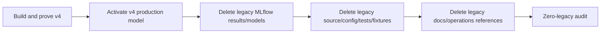

# Regime Engine — Zero-Legacy Architecture Contract

Status date: 2026-09-09

This document is authoritative for the v4 transition. It supersedes every earlier requirement to preserve backward compatibility with semantic-medoid v1-v3 evaluation paths, legacy production-package schemas, legacy serving behavior, legacy MLflow model versions, or legacy rollback paths.

## 1. Non-negotiable rule

After the accepted v4 cutover, `regime-engine` is **v4-only**. Git history is the archive. The active repository, runtime, configuration surface, tests, fixtures, MLflow namespace, serving path and operations documentation must not retain legacy compatibility code merely to read, replay, evaluate, serve, migrate, compare with, or roll back to v1-v3 artifacts.

No adapter, parser, resolver branch, compatibility switch, fallback, migration shim, deprecated alias, duplicate schema, old CLI entry point, old profile file, old evaluation orchestrator, old fixture, old package loader, or old tracking path may remain solely for legacy support.



## 2. Definition of legacy

Legacy includes, but is not limited to:

- Xetra profile/configuration versions 1, 2 and 3;
- semantic-medoid feature-selection YAMLs and semantic block selection contracts;
- `feature_selection` code that exists only for Stage-1/Stage-2 semantic medoids;
- `medoid_multivariate`, `medoid_univariate`, `delta1_univariate`, obsolete `univariate_grid` orchestration, and legacy agreement/evaluation wrappers not used by v4;
- legacy profile resolution branches, enums, validation modes and fixed-universe/eight-medoid assumptions;
- legacy production artifact/package schema readers and writers;
- package-version fallback logic and tests that prove old package bytes remain loadable;
- serving routes/resolver branches whose only purpose is to accept old profile/package versions;
- rollback logic whose target may be a legacy model version;
- legacy CLI commands or flags for semantic evaluations;
- legacy MLflow evaluation runs, child runs, artifacts, LoggedModels, registered model versions and aliases;
- legacy metric namespaces, plot generators and tracking helpers that are not used by the v4 Model Metrics architecture;
- test fixtures, golden files, snapshots and serialization samples that exist only to prove compatibility with removed behavior;
- documentation that instructs users to invoke, serve, reproduce or roll back to legacy behavior.

Generic mathematical/modeling code may remain only when it is actively used by v4 and has been renamed/refactored so its public contract is not legacy-specific.

## 3. No backward-compatibility contract

The following behaviors are explicitly forbidden after cutover:

- loading a v1-v3 production package;
- resolving a v1-v3 profile for evaluation or serving;
- running a semantic-medoid evaluation;
- replaying a legacy model package through the active serving stack;
- migrating old serialized artifacts into v4;
- automatically falling back to an old model/package/profile when v4 loading fails;
- rolling the production alias back from v4 to a legacy model version;
- retaining compatibility-only tests as release gates.

Unsupported old artifacts must fail closed with one concise unsupported-version error. The implementation must not contain code to decode their internal payloads.

## 4. Cutover and deletion order

Deletion must not create an interval with no valid production model. The canonical order is:

1. complete the v4 statistical, resumability and MLflow evidence gates;
2. produce and validate a v4-only production package;
3. activate a v4 production model through the public route;
4. prove live/latest/replay behavior using that v4 model;
5. delete all legacy regime-engine MLflow evaluation results and registered model versions/aliases;
6. delete all compatibility source/config/test/fixture code;
7. remove all legacy documentation and operational instructions;
8. run the repository + MLflow zero-legacy audit.

Rollback after step 5 is **v4-to-v4 only**. If operational rollback is required, the target must be a previous valid v4 model version with the same supported package contract.

## 5. MLflow zero-legacy requirement

The earlier exception that preserved registered legacy production model versions is revoked.

After v4 activation, the production MLflow service must contain no regime-engine legacy evaluation objects and no legacy regime-engine registered model versions required only by v1-v3 compatibility. The deletion process remains dry-run-first, explicit, idempotent, resumable and scope-verified.

Unrelated MLflow experiments/models belonging to other projects must never be deleted.

The retained regime-engine MLflow namespace after cleanup may contain only:

- v4 evaluation runs/results;
- v4 LoggedModels and Model Metrics;
- v4 registered production/challenger model versions;
- v4 aliases;
- current v4 artifacts required for audit/serving.

## 6. Production package and serving contract

There is one supported production package contract: the v4 contract active at cutover.

- No legacy package reader is retained.
- No polymorphic v1/v2 decoder is retained for compatibility.
- No profile-version-dependent serving branch is retained.
- Public `xetra` serving resolves only supported v4 model versions.
- Exact-version requests for legacy model versions fail as unsupported/not found after cleanup.
- Cache keys may include model version, but cache logic must not encode legacy-version behavior.

Schema versioning may still exist for future v4+ evolution, but it must not be used as justification to retain v1-v3 readers.

## 7. Repository deletion scope

The legacy-removal PRs must inspect and remove legacy artifacts from all of:

```text
src/
configs/
tests/
scripts/
docs/
README.md
ARCHITECTURE.md
API.md
OPERATIONS.md
DATA_SOURCE.md
EVALUATION.md
PLOT_STYLE.md
pyproject.toml
.gitignore
.github/
```

Deletion includes stale imports, exports, type aliases, enums, fixture data, golden snapshots, dead test helpers, CLI help text, environment variables, config examples and CI paths.

Do not leave commented-out legacy code or files renamed to `legacy_*`, `deprecated_*`, `old_*`, or `compat_*` as an archive. Git history is sufficient.

## 8. Zero-legacy QA

Final acceptance requires both positive and negative proofs.

Positive proof:

- complete hermetic v4 evaluation passes;
- complete current-Xetra v4 audit passes;
- v4 production refit/package/serve/replay passes;
- v4-to-v4 alias rollback passes;
- Model Metrics completeness passes;
- resumability/idempotency tests pass.

Negative proof:

- no active v1/v2/v3 profile/config can be resolved;
- no semantic-medoid evaluation can be imported or invoked;
- no old production package can be loaded;
- no legacy model version can be served;
- no compatibility-only fixture/test remains;
- no legacy regime-engine MLflow object survives cleanup.

Repository audit must combine code search, import-graph inspection and explicit allowlisting for historical prose only. At minimum search for:

```text
semantic_medoid
preliminary_medoid
medoid_multivariate
medoid_univariate
delta1_univariate
xetra_v1
xetra_v2
xetra_v3
profile_config_version == 1
profile_config_version == 2
profile_config_version == 3
production package v1
legacy package
backward compatibility
compatibility-only
```

A match in active source/config/tests/scripts fails acceptance unless it is a deliberate v4 mathematical term unrelated to legacy behavior. Historical PR IDs in backlog/history prose are allowed.

## 9. Definition of done

The zero-legacy transition is complete only when the active system has one coherent implementation path:

```text
current Gold snapshot
  -> v4 global feature discovery
  -> v4 nested/outer evaluation
  -> v4 Model Metrics tracking
  -> v4 deployment selection/refit
  -> v4 production package
  -> v4 serving
```

No alternate legacy execution, loading, serving, migration or rollback path remains.