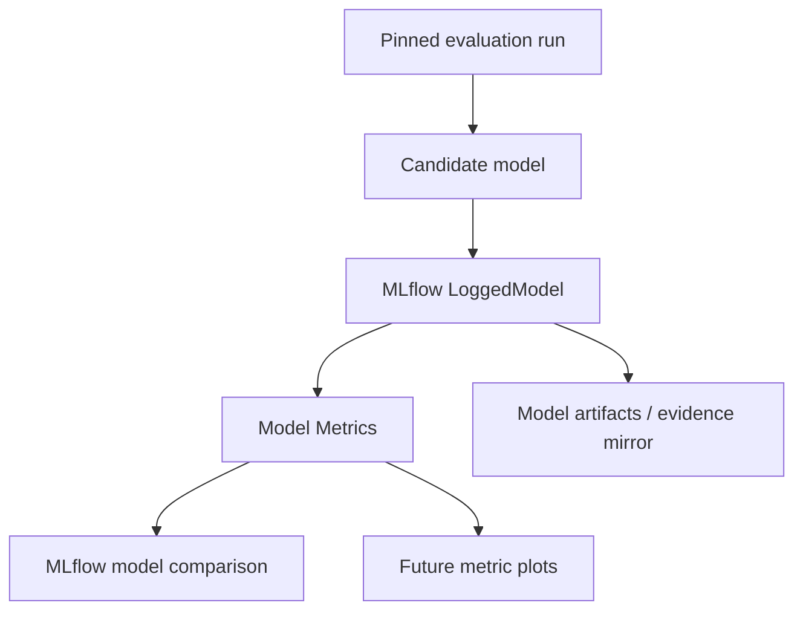

# Regime Engine — MLflow Model Metrics Contract

Status date: 2026-09-09

This document is the authoritative MLflow tracking contract for all `regime-engine` evaluation workflows.

The statistical contract remains in `EVALUATION.md`; dataset pinning, idempotency and resume semantics remain in `EVALUATION_EXECUTION.md`. This document defines what is written to MLflow, how candidate models are compared, how metrics remain plot-ready, and how the historical evaluation namespace is reset before the new v4 evidence stream starts.

---

## 1. Non-negotiable invariants

1. **All model comparisons live in MLflow Model Metrics.** Artifact plots may mirror metrics for auditability, but no comparison may exist only as an image or JSON artifact.
2. **Every candidate model is represented by one MLflow LoggedModel** and every comparison-ready numerical value is logged against that LoggedModel through model metrics.
3. **Track every numerically meaningful metric already produced by the evaluation pipeline.** New numerical diagnostics must be added to the central metric catalog before they can be emitted.
4. **Preserve raw/fold/seed histories as well as aggregates.** Aggregates never replace the primitive metric history from which they were calculated.
5. **Metric semantics are versioned and comparable only inside their declared comparison domain.** Incomparable likelihoods must never be presented as comparable simply because they share a UI tab.
6. **Metric emission is dataset-pinned, idempotent and resumable.** A restart must not duplicate or change existing metric history.
7. **Old evaluation results are removed before the new v4 tracking contract becomes active.** The new MLflow namespace starts clean.

---

## 2. One-time historical reset

Before the first accepted v4 evaluation is written, remove all historical `regime-engine` **evaluation/tracking results** from the production MLflow service:

- evaluation runs and nested child runs;
- evaluation artifacts and comparison artifacts;
- LoggedModels created only for evaluation/model-comparison tracking;
- historical feature-selection/model-comparison metric histories;
- failed/abandoned evaluation runs from the old architecture.

The reset is intentionally limited to evaluation/tracking results. Existing registered production model versions and aliases that are required for live serving/rollback are not deleted by the reset; they are operational model packages rather than evaluation results. Their eventual retirement remains governed by the production lifecycle backlog.

Deletion must be **idempotent and verified**:

1. enumerate the exact experiment/run/logged-model scope that will be removed;
2. emit a machine-readable pre-delete manifest;
3. delete the evaluation objects;
4. run the backend-supported permanent cleanup/garbage-collection step where MLflow soft deletion would otherwise retain data;
5. re-query MLflow and prove that the targeted historical evaluation namespace contains zero surviving results;
6. store only the reset manifest and deletion proof outside the deleted MLflow namespace, e.g. under `docs/qa/`.

A second invocation against an already-clean namespace must be a successful no-op.

---

## 3. LoggedModel-first comparison architecture

The comparison entity is a LoggedModel, not a child-run artifact directory.



For every evaluated candidate create exactly one LoggedModel identity containing at least:

```text
model_id
candidate_id
model_family
state_count
mixture_count
feature_order_hash
feature_dimension
dataset_snapshot_key
evaluation_run_key
evaluation_plan_hash
profile_config_version
selection/discovery execution hash
outer_fold_id or deployment scope when applicable
```

Candidate names and tags are metadata. Numerical comparisons belong in model metrics.

---

## 4. Central metric catalog

All metrics must be registered centrally. A metric definition contains:

```text
metric_key
human_label
description
unit
value_kind               # scalar | history
direction                # higher | lower | neutral
scope                    # seed | fold | candidate | prefix | outer_policy | feature_discovery
comparison_domain        # exact rules below
step_semantics           # seed index | EM iteration | inner fold | outer fold | M | L | state id
aggregation              # none | mean | population_std | min | max | median | quantile | count
source_field/formula
model_metrics_visible    # normally true for candidate-comparison metrics
```

Metric keys are stable API. Renaming or changing their mathematical meaning requires a versioned new key.

Booleans, hashes, identifiers, feature names, reasons and categorical statuses are tags/params/evidence, not numeric metrics.

---

## 5. Mandatory candidate-model metric families

The exact available set grows with the evaluation contracts, but the tracker must emit every finite numerical value produced by these families whenever defined.

### 5.1 Predictive and fit quality

```text
train_loglik_total
train_loglik_per_obs
oos_predictive_loglik_total
oos_predictive_loglik_per_obs
aic
aic_per_train_obs
bic
bic_per_train_obs
valid_fold_rate
valid_fold_count
invalid_fold_count
```

Aggregate forms must include, where meaningful:

```text
mean
population_std
worst_fold
best_fold
median
min
max
observation_count
```

Likelihood/AIC/BIC comparison domain is strictly **same observed feature vector + same source snapshot + same evaluation plan/support**. They are forbidden for cross-dimension prefix comparison and forbidden for pooling/ranking adaptive outer folds with different feature vectors.

### 5.2 Multistart / optimization

```text
multistart_attempt_count
multistart_success_count
multistart_failure_count
multistart_success_rate
seed_train_loglik
seed_train_loglik_per_obs
seed_rank
best_seed_loglik
median_seed_loglik
worst_seed_loglik
seed_loglik_spread
em_iteration_count
em_converged
em_final_loglik
em_final_delta
em_loglik_per_obs_history
em_monotonicity_violation_count
```

`em_converged` may be represented as numeric `0/1` only if explicitly catalogued as a diagnostic metric; the canonical categorical convergence status remains evidence metadata.

### 5.3 State usage and uncertainty

For every state when defined:

```text
state_occupancy
state_occupancy_min_fold
state_occupancy_max_fold
state_filtered_probability_mean
state_filtered_probability_std
state_expected_duration
transition_self_probability
transition_row_entropy
```

Model-level uncertainty summaries:

```text
filtered_entropy_mean
filtered_entropy_std
filtered_entropy_min
filtered_entropy_max
dominant_state_confidence_mean
dominant_state_confidence_std
```

State-indexed metrics are model-version/fold-local where state identity is local; they must never imply cross-model economic state identity.

### 5.4 Numerical conditioning and covariance diagnostics

Whenever the adapter already computes or can deterministically derive them from the fitted artifact:

```text
covariance_min_eigenvalue
covariance_max_eigenvalue
covariance_condition_number
covariance_min_diagonal_variance
transition_min_probability
transition_max_probability
```

For GMM-HMM also expose component-level covariance/weight diagnostics where finite and meaningful.

### 5.5 Teacher / regime agreement

Where a common teacher exists:

```text
soft_regime_nmi
shared_timestamp_count
shared_timestamp_rate
teacher_state_entropy
candidate_state_entropy
```

Soft NMI is explicitly the cross-dimension model-comparison metric for the v4 prefix search. Raw likelihoods must not be substituted.

### 5.6 Feature-discovery and dimensionality diagnostics attached to candidate context

The selected/final candidate LoggedModel must carry the numerical discovery context needed for comparison and plotting:

```text
eligible_feature_count_N
selected_cluster_count_M
selected_feature_count_L
selected_state_count_K
selected_M_silhouette
feature_score_winner_min
feature_score_winner_mean
feature_score_winner_max
prefix_soft_nmi
model_clock_valid_fold_rate
complete_case_train_count
complete_case_test_count
```

Full per-feature/per-M/per-L histories remain canonical evidence and may additionally be emitted as model-metric histories when they have a natural numeric step.

### 5.7 Outer-policy diagnostics

For adaptive outer evaluation:

```text
outer_soft_regime_nmi
outer_valid_fold_rate
outer_valid_fold_count
outer_nmi_mean
outer_nmi_population_std
outer_nmi_worst
outer_selected_M
outer_selected_L
outer_selected_K
```

Outer fold-local likelihood remains visible for diagnostics but is tagged/catalogued `comparison_domain=fold_local_only` and must not be used for cross-fold winner ranking.

---

## 6. Metric histories are first-class

Every quantity with a natural ordered index is logged as a metric history with deterministic `step` semantics.

Examples:

```text
EM convergence                 step = EM iteration
seed likelihood                step = canonical seed ordinal
inner-WF predictive score      step = inner fold ordinal
outer-policy NMI               step = outer fold ordinal
silhouette curve               step = M
prefix agreement curve         step = L
state-indexed diagnostic       step = canonical state ordinal
```

The aggregate at step `0` never replaces the history.

This makes future plots cheap: a new MLflow plot should normally query already-tracked metric history rather than rerun the model or parse bespoke PNG/JSON artifacts.

---

## 7. Model Metrics is the authoritative comparison surface

Every metric that can legitimately compare candidate models must be logged with `log_model_metric_points(model_id, ...)`.

Run-level metrics may mirror operational/evaluation status, but candidate comparison must not depend on run-level metric tables.

All current comparison plots must have a Model Metrics equivalent, including at least:

```text
OOS predictive likelihood by model
TRAIN likelihood by model
AIC/BIC by model
multistart success by model
EM convergence by model
state occupancy/entropy by model
soft regime NMI by model
numerical conditioning diagnostics by model
```

Artifact PNGs remain optional audit/rendering outputs; deleting a PNG must not remove the underlying comparable metric series.

---

## 8. Plot-ready metric schema

A new model-comparison plot must require only:

1. metric catalog lookup;
2. selection of LoggedModels that share a valid comparison domain;
3. MLflow model-metric history query;
4. rendering.

It must not require changes to HMM fitting, evaluation mathematics or evidence extraction unless the desired numerical quantity was never computed before.

A generic comparison plotter must therefore accept:

```text
metric_key
model_ids or model filter
optional step range
aggregation/display rule from catalog
```

and reject model sets whose declared comparison domains are incompatible.

---

## 9. Idempotent/resumable MLflow projection

MLflow is a projection of the durable evaluation ledger defined in `EVALUATION_EXECUTION.md`; it is not the source of truth for resume decisions.

For every LoggedModel metric batch persist an export identity:

```text
model_metric_batch_key = SHA256(
    evaluation_run_key
    + work_unit_key
    + logged_model_logical_key
    + metric_catalog_version
    + canonical_metric_points
)
```

On resume:

- if the batch is marked durably exported and MLflow contains exact matching points, skip it;
- if the durable ledger says committed but MLflow is missing points, replay exactly those points;
- if MLflow already contains the same key/step with a different value, fail closed;
- if a crash occurred during a partial batch, query/reconcile exact key/step/value triples and append only missing points;
- duplicate metric histories caused solely by restart are forbidden.

Operational timestamps must not change the mathematical metric identity. Metric history order is determined by canonical step, not arrival time.

---

## 10. Completeness rule

The tracking layer may not maintain a hand-picked subset such as five performance metrics while evaluation contracts expose additional numerical diagnostics.

For each completed evaluation object:

```text
all finite numerical fields
    -> classified by metric catalog
    -> either emitted as model metric / model metric history
       OR explicitly documented as non-comparable evidence-only numeric
```

CI must fail if a new numerical evaluation field appears without a metric-catalog decision.

This is the mechanism that ensures the repository remains ready for future MLflow model-metric plots without repeatedly rewriting tracking code.

---

## 11. QA requirements

The tracking implementation is accepted only if all of the following pass:

- exhaustive fixture proves every catalogued numerical candidate field is emitted;
- reflection/schema test fails for an unclassified newly-added numeric field;
- model-metric keys/steps/values exactly match independent evaluation evidence;
- comparison-domain test blocks cross-dimension likelihood comparison;
- restart after every metric-batch boundary produces the same final MLflow metric histories as uninterrupted execution;
- forced partial-batch crash followed by resume creates no duplicate or conflicting points;
- adding a new plot over an existing metric requires no evaluation recomputation;
- historical-reset command proves the targeted old evaluation namespace is empty after cleanup and is idempotent on second execution;
- full hermetic and current-Xetra audits include model-metric completeness/hash evidence.

---

## 12. Interaction with current code

The repository already has the correct low-level direction: `TrackingPort` exposes `create_logged_model(...)` and `log_model_metric_points(...)`, and `evaluation_tracking.py` already emits some candidate metrics into LoggedModels. The new contract generalizes this into the only supported comparison architecture and removes the current hand-selected metric subset.

Until the implementation backlog below is complete, existing MLflow output must be treated as transitional rather than canonical v4 evidence.
