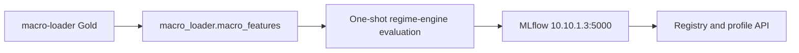
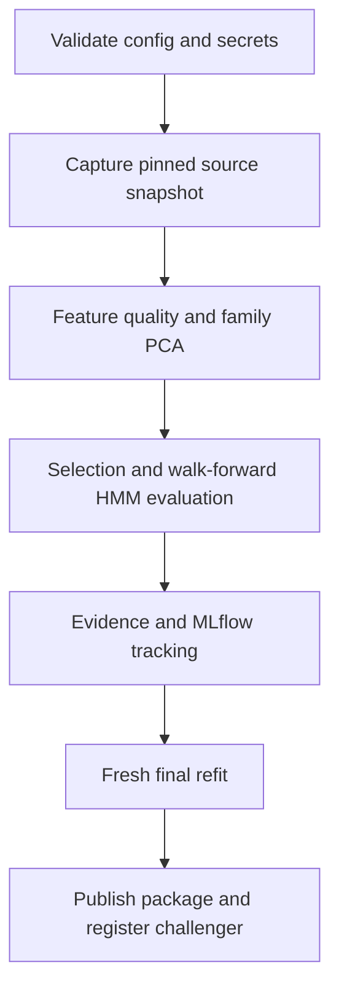

<!-- owner: source-operations -->
# Operations

This is the operational contract for running `regime-engine` against the external
services. Statistical meaning belongs in [EVALUATION.md](EVALUATION.md);
architecture belongs in [ARCHITECTURE.md](ARCHITECTURE.md).

## Ownership and topology



The engine reads the trusted-LAN PostgreSQL serving view
`macro_loader.macro_features` at `10.10.1.3:54321`. The read-only runtime role
is `macro-loader`; `macro-loader-owner` owns DDL/DML and
`macro-loader-sync` is reserved for synchronization jobs. Lineage control is
read from `macro_loader_sync.gold_sync_state`. The temporal key is
`timestamp_m1 TIMESTAMPTZ(6)`, feature values are `DOUBLE PRECISION`, and SQL
NULL remains missing evidence—there is no fill or interpolation.

The existing NAS MLflow service at `http://10.10.1.3:5000` owns tracking,
registry, artifacts, and the profile API. This repository owns no MLflow or
PostgreSQL container and no Docker Compose deployment.

## Configuration and secrets

Use the Git-ignored deployment file `config.yaml` described by
`config.example.yaml`. Keep passwords in local secret files referenced by the
configuration; never commit credentials, `.env` files, DSNs, or raw feature
vectors. The canonical feature identity is `macro-loader` and the canonical
MLflow URI is `http://10.10.1.3:5000`.

Persistent state must be configured through an absolute `evaluation.state_root`.
The local deployment uses the Git-ignored `evaluation-state/` directory in the
checkout. It stores only the immutable source snapshot, evaluation evidence,
and local metric artifacts.

## Bootstrap and local verification

```bash
./scripts/bootstrap.sh
.venv/bin/python -m pytest -n auto -q tests -m 'not integration and not external'
git commit  # runs the local Hermetic integration hook
```

GitHub push/merge gates run lint, strict typing, unit, and policy checks. They
do not run the full evaluation or external integration tests. The pre-commit
hook is the local integration-test entry point.

## One-shot evaluation

Run the full production workflow later as one cron-safe command:

```bash
./scripts/run_xetra_v4_cron.sh
```

The command captures one immutable `macro_loader.macro_features` snapshot,
materializes the canonical PCA features, evaluates the monthly walk-forward
plan, writes evidence, performs the fresh final refit, and publishes the final
package to NAS MLflow. It does not persist a computation-position ledger. If
interrupted, the next invocation starts at the beginning with a new snapshot.



## MLflow and deployment readback

Inspect experiment `macro-regime-evaluation` on the NAS MLflow UI. Every
evaluation records source lineage, profile/config identity, runtime metadata,
stage timings, canonical package hashes, and plot/evidence artifacts. Only the
fresh final-refit package may be registered as `regime-xetra`; promotion from
`challenger` to `champion` is an explicit operator action.

After refit, verify the package through the serving resolver and query the
profile API. OOS builds are immutable and require an explicit build ID; fixed
model replay is not a substitute for OOS evidence.

## Failure and recovery

- Missing or invalid credentials, source lineage, schema, feature identity, or
  MLflow URI fail closed before model work.
- A changed source build requires a new one-shot evaluation; do not reuse stale
  state files.
- An interrupted evaluation is restarted from the beginning.
- A failed publication leaves the prior `champion` unchanged; inspect MLflow
  evidence, repair the deployment configuration, and rerun the explicit
  lifecycle command.

For developer workflow and acceptance rules, continue to
[CONTRIBUTING.md](CONTRIBUTING.md) and [BACKLOG.md](BACKLOG.md).
